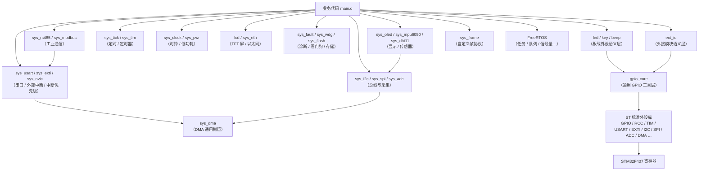
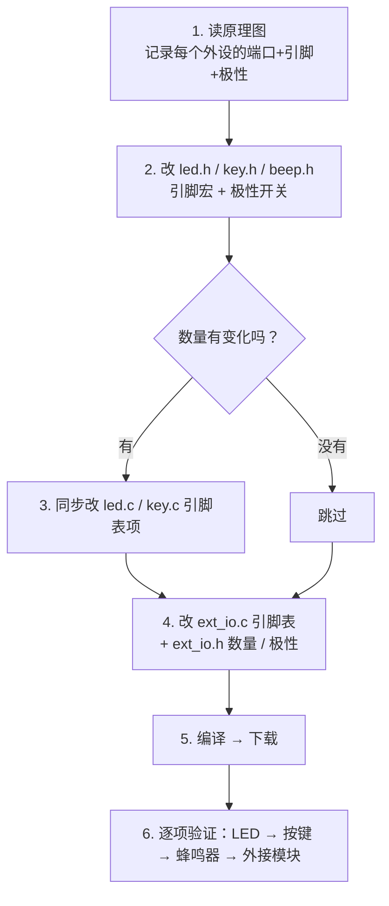

# STM32F407 标准库薄封装函数库 —— 使用手册与移植指南

> 平台：STM32F407ZET6 ｜ Keil MDK5（ARM Compiler 5）｜ ST 标准外设库（StdPeriph）｜ 薄封装设计

---

## 目录

1. [工程简介](#1-工程简介)
2. [文件结构](#2-文件结构)
3. [快速上手](#3-快速上手)
4. [分层架构与设计思想](#4-分层架构与设计思想)
5. [模块函数参考](#5-模块函数参考)
   - [5.1 gpio_core —— 通用 GPIO 底层工具](#51-gpio_core--通用-gpio-底层工具)
   - [5.2 led —— 板载 LED](#52-led--板载-led)
   - [5.3 key —— 板载按键](#53-key--板载按键)
   - [5.4 beep —— 板载蜂鸣器](#54-beep--板载蜂鸣器)
   - [5.5 ext_io —— 外接模块](#55-ext_io--外接模块)
   - [5.6 sys_clock —— 时钟源切换](#56-sys_clock--时钟源切换)
   - [5.7 sys_tick —— SysTick 精确定时](#57-sys_tick--systick-精确定时)
   - [5.8 sys_usart —— 串口（USART1 / USART2 / USART3）](#58-sys_usart--串口usart1--usart2--usart3)
   - [5.9 sys_tim —— 通用定时器](#59-sys_tim--通用定时器)
   - [5.10 sys_exti —— 外部中断（EXTI0 ~ EXTI15）](#510-sys_exti--外部中断exti0--exti15)
   - [5.11 sys_pwr —— 低功耗（Sleep / Stop / Standby）](#511-sys_pwr--低功耗sleep--stop--standby)
   - [5.12 sys_nvic —— 中断优先级辅助](#512-sys_nvic--中断优先级辅助)
   - [5.13 sys_dma —— DMA 通用搬运](#513-sys_dma--dma-通用搬运)
   - [5.14 sys_i2c —— I2C 总线（I2C1/2/3）](#514-sys_i2c--i2c-总线i2c123)
   - [5.15 sys_spi —— SPI 主机（SPI1/2/3）](#515-sys_spi--spi-主机spi123)
   - [5.16 sys_adc —— ADC（单次 / 连续 / 扫描 + DMA）](#516-sys_adc--adc单次--连续--扫描--dma)
   - [5.17 lcd —— TFT-LCD 屏（FSMC + ILI9341）](#517-lcd--tft-lcd-屏fsmc--ili9341)
   - [5.18 sys_eth —— 以太网（LAN8720 + RMII）](#518-sys_eth--以太网lan8720--rmii)
   - [5.19 sys_fault —— CPU 故障捕获诊断（黑匣子）](#519-sys_fault--cpu-故障捕获诊断黑匣子)
   - [5.20 sys_wdg —— 看门狗（IWDG 基础 / WWDG 扩展）](#520-sys_wdg--看门狗iwdg-基础--wwdg-扩展)
   - [5.21 sys_flash —— 内部 Flash 擦写与参数保存](#521-sys_flash--内部-flash-擦写与参数保存)
   - [5.22 中断向量表与模块对照（ISR 归属总表）](#522-中断向量表与模块对照isr-归属总表)
   - [5.23 sys_oled —— OLED 显示（SSD1306, I2C）](#523-sys_oled--oled-显示ssd1306-i2c)
   - [5.24 sys_mpu6050 —— 六轴姿态传感器（板载）](#524-sys_mpu6050--六轴姿态传感器板载)
   - [5.25 sys_dht11 —— 温湿度传感器（板载, 单总线）](#525-sys_dht11--温湿度传感器板载-单总线)
   - [5.26 sys_rs485 —— RS485 半双工收发切换](#526-sys_rs485--rs485-半双工收发切换)
   - [5.27 sys_modbus —— Modbus-RTU 从机](#527-sys_modbus--modbus-rtu-从机)
   - [5.28 sys_frame —— 串口自定义帧协议](#528-sys_frame--串口自定义帧协议)
   - [5.29 sys_str —— 字符串与命令解析工具](#529-sys_str--字符串与命令解析工具)
   - [5.30 sys_rtc —— RTC 实时时钟（日历 / 闹钟 / 秒中断）](#530-sys_rtc--rtc-实时时钟日历--闹钟--秒中断)
   - [5.31 sys_softimer —— 软定时器（模块联动引擎）](#531-sys_softimer--软定时器模块联动引擎)
6. [可移植性配置总表](#6-可移植性配置总表)
7. [教程 A：换引脚 / 换端口](#7-教程-a换引脚--换端口)
8. [教程 B：换板子](#8-教程-b换板子)
9. [教程 C：增删 LED / 按键 / 外接模块](#9-教程-c增删-led--按键--外接模块)
10. [常见问题排查](#10-常见问题排查)
11. [注意事项与已知限制](#11-注意事项与已知限制)
12. [FreeRTOS 基础](#12-freertos-基础)
    - [12.1 和裸机程序的区别](#121-和裸机程序的区别)
    - [12.2 最小工程 —— 任务创建 / 延时 / 删除](#122-最小工程--任务创建--延时--删除)
    - [12.3 调度与优先级](#123-调度与优先级)
    - [12.4 队列 —— 任务之间传数据](#124-队列--任务之间传数据)
    - [12.5 信号量（二值/计数）与互斥量](#125-信号量二值计数与互斥量)
    - [12.6 软件定时器与事件组](#126-软件定时器与事件组)
    - [12.7 常用 API 速查](#127-常用-api-速查)
    - [12.8 与库模块混用的注意事项（重要）](#128-与库模块混用的注意事项重要)
13. [复用本模板到新工程](#13-复用本模板到新工程)
14. [附录 A —— 自定义表与结构体索引](#附录-a--自定义表与结构体索引)

---

## 1. 工程简介

这是一套基于 **ST 标准外设库（StdPeriph）的"薄封装"函数库模板**。

**"薄封装"是什么意思？**

- 不重写、不替代标准库 —— 标准库仍然是唯一的底层实现；
- 只在它之上加一层"**语义 + 防护**"：
  - **语义**：`LED_On(0)`、`KEY_Scan()`、`EXT_IR_Detected(0)` —— 调用者只关心"做什么"，不关心"接在哪个引脚"；
  - **防护**：端口时钟自动使能、输入引脚自动上下拉、按键自动消抖、时钟切换自动处理安全流程。

**三条设计原则：**

| 原则 | 说明 |
|---|---|
| ① 调用简单 | 对外只暴露 `id`（0/1/2/3），无需对照原理图就能写业务代码 |
| ② 移植省事 | 引脚映射、电平极性、数量全部集中在头文件"配置区"（或模块引脚表），换板子只动配置、不动逻辑 |
| ③ 易错点封装 | "忘开时钟""极性反了""消抖漏了"这类高频问题在库内部一次性解决 |

`main()` 目前是空的 —— 这是模板，业务逻辑由你自己写。

---

## 2. 文件结构

```
0001_标准模板库\
├── 标准模板.uvprojx          Keil 工程文件（目标名：gpio标准库）
├── main.c                    用户主程序（模板状态为空；第 3 节给了一份最小可用骨架作起点）
│
├── FWLIB\                    函数库（本模板的核心）
│   ├── inc\                  头文件：对外接口 + 配置宏
│   │   ├── gpio_core.h       【通用】GPIO 底层工具
│   │   ├── led.h             【板载】LED
│   │   ├── key.h             【板载】按键
│   │   ├── lcd.h             【板载】TFT-LCD 屏（FSMC + ILI9341）
│   │   ├── beep.h            【板载】蜂鸣器
│   │   ├── ext_io.h          【外接】红外 / 循迹 / 触摸 / 声音
│   │   ├── sys_clock.h       【系统】时钟源切换
│   │   ├── sys_tick.h        【系统】SysTick 精确定时
│   │   ├── sys_usart.h       【系统】串口 USART1/2/3
│   │   ├── sys_tim.h         【系统】定时器 TIM1~14 全部（PWM / 定时中断）
│   │   ├── sys_exti.h        【系统】外部中断 EXTI0~15
│   │   ├── sys_nvic.h        【系统】中断优先级辅助
│   │   ├── sys_dma.h         【系统】DMA 通用搬运（16 数据流）
│   │   ├── sys_i2c.h         【系统】I2C 总线（I2C1/2/3）
│   │   ├── sys_spi.h         【系统】SPI 主机（SPI1/2/3）
│   │   ├── sys_adc.h         【系统】ADC（单次/连续/扫描/DMA）
│   │   ├── sys_eth.h         【系统】以太网（LAN8720 + RMII）
│   │   ├── sys_fault.h       【系统】CPU 故障捕获（黑匣子）
│   │   ├── sys_flash.h       【系统】Flash 擦写与参数保存
│   │   ├── sys_wdg.h         【系统】看门狗（IWDG / WWDG）
│   │   ├── sys_rtc.h         【系统】RTC 实时时钟
│   │   ├── sys_softimer.h    【系统】软定时器（联动引擎）
│   │   ├── sys_oled.h        【外接】OLED 显示（SSD1306 I2C）
│   │   ├── sys_mpu6050.h     【板载】六轴姿态传感器
│   │   ├── sys_dht11.h       【板载】温湿度（单总线）
│   │   ├── sys_rs485.h       【系统】RS485 半双工切换
│   │   ├── sys_modbus.h      【系统】Modbus-RTU 从机
│   │   ├── sys_frame.h       【系统】串口自定义帧协议
│   │   ├── sys_str.h         【工具】字符串解析（查找/分解/转整数/格式化）
│   │   └── sys_pwr.h         【系统】低功耗 Sleep/Stop/Standby
│   └── src\                  实现文件（与 inc 一一对应）
│       ├── gpio_core.c
│       ├── led.c
│       ├── lcd.c
│       ├── key.c
│       ├── beep.c
│       ├── ext_io.c
│       ├── sys_clock.c
│       ├── sys_tick.c
│       ├── sys_usart.c
│       ├── sys_tim.c
│       ├── sys_exti.c
│       ├── sys_nvic.c
│       ├── sys_dma.c
│       ├── sys_eth.c
│       ├── sys_fault.c
│       ├── sys_flash.c
│       ├── sys_i2c.c
│       ├── sys_spi.c
│       ├── sys_adc.c
│       ├── sys_wdg.c
│       ├── sys_rtc.c
│       ├── sys_softimer.c
│       ├── sys_oled.c
│       ├── sys_mpu6050.c
│       ├── sys_dht11.c
│       ├── sys_rs485.c
│       ├── sys_modbus.c
│       ├── sys_frame.c
│       ├── sys_str.c
│       └── sys_pwr.c
│
├── FreeRTOS\                 FreeRTOS 内核源码（推荐版本 V10.4.6，MIT 许可）
│   ├── src\                  内核 .c（tasks / queue / list / timers / event_groups）
│   ├── inc\                  内核头文件（FreeRTOS.h / task.h / queue.h / …）
│   ├── port\                 移植层 + 内存管理 + 工程配置（port.c / portmacro.h / heap_4.c / FreeRTOSConfig.h / 钩子）
│   └── README.md             来源、文件清单、升级步骤与阅读指引
│
├── ETH\                      ST 官方以太网驱动（STM32F4x7_ETH_Driver，随库集成）
│   ├── src\                  驱动实现（stm32f4x7_eth.c：MAC / DMA / PHY 管理）
│   ├── inc\                  驱动接口（stm32f4x7_eth.h）
│   ├── port\                 工程配置（stm32f4x7_eth_conf.h + ST 原版模板）
│   └── README.md             来源、结构、换板前提与已配项
│
├── build_keil.bat            命令行一键编译脚本（双击即用，日志 build_verify.log）
├── RTE\                      Keil 自动生成/管理（启动文件、system、库裁剪与配置基线；勿手工重排）
├── Objects\  Listings\       编译输出
├── .vscode\                  VS Code IntelliSense 配置
└── GEC-M4原理图2016-07-29.pdf        开发板原理图
```

> 注：芯片帮助文档（CHM）与原理图渲染资料已移出本目录另行存放，不影响编译。

### 模块职责与依赖



### 库文件的统一排布（所有模块一致）

每个 `.c/.h` 都按同一套结构组织，看到开头就知道去哪改：

1. **顶部文件头注释** —— 设计定位 / 依赖关系 / 使用方式 / 移植指引；
2. **区块 1：定义与宏定义区**（头文件）—— 引脚、数量、极性、缓冲等配置（**换板子只改这里**）；
3. **区块 2：基础功能** —— 通用初始化（时钟 / 引脚 / 参数）+ 最小操作集；
4. **区块 3：扩展功能** —— "专属初始化"（如串口中断接收 / DMA、ADC 连续与扫描、定时器中断）+ 组合功能。

`.h` 管"接口与配置"，`.c` 管"实现与映射表"（外接模块的引脚表在 `.c` 中，是区块 1 的延伸）；
引脚表与 `XXX_COUNT` 宏之间都配了**编译期护栏**：表项数不一致会直接编译不过。

> ⚠️ **重要**：ST 标准库文件**不在本工程目录内**，由 Keil 器件包 `Keil.STM32F4xx_DFP 1.0.8` 提供。
> 本工程实际编译了其中 15 个文件：`misc.c`、`stm32f4xx_gpio.c`、`stm32f4xx_rcc.c`、`stm32f4xx_flash.c`、`stm32f4xx_dma.c`、`stm32f4xx_exti.c`、`stm32f4xx_pwr.c`、`stm32f4xx_syscfg.c`、`stm32f4xx_tim.c`、`stm32f4xx_usart.c`、`stm32f4xx_i2c.c`、`stm32f4xx_spi.c`、`stm32f4xx_adc.c`、`stm32f4xx_iwdg.c`、`stm32f4xx_wwdg.c`。
> 另有独立组件：`ETH\` 目录里的 ST 官方以太网驱动（`STM32F4x7_ETH_Driver V1.1.0`，ST 许可），
> 与器件包无关、随工程分发；`FreeRTOS\` 与 `ETH\` 均不依赖器件包。
> `RTE\` 目录由 **Keil 自动生成与管理**（启动文件 / system / 库裁剪 / 配置基线 `.base@` / `RTE_Components.h`）——保持原样即可，不要手工移动或重排。
> 把本模板拷到别的电脑前，请确认那台电脑也装了同版本器件包。

### 工程关键配置（`标准模板.uvprojx`）

| 配置项 | 值 | 说明 |
|---|---|---|
| 器件 | STM32F407ZE | Cortex-M4 + FPU，1MB Flash，128KB RAM + 64KB CCM |
| 编译器 | ARM Compiler 5（AC5） | `uAC6 = 0`，**不是 AC6** |
| C 语言标准 | C99 开启 | 代码中有 `for` 内声明变量，不要关闭 |
| 全局宏 | `USE_STDPERIPH_DRIVER, STM32F40_41xxx, HSE_VALUE=8000000` | `HSE_VALUE` 供时钟频率计算使用 |
| 头文件路径 | `.\FWLIB\inc` + FreeRTOS 两条（`inc` / `port`） + ETH 两条（`inc` / `port`） | 新增库模块头文件时无需改动；FreeRTOS/ETH 路径已配好 |
| RTE 组件 | StdPeriph：GPIO/RCC/USART/TIM/EXTI/PWR/SYSCFG/Flash/DMA/I2C/SPI/ADC/IWDG/WWDG/Framework | 缺组件时对应库 .c 不会被编译（看门狗需 IWDG/WWDG） |
| 链接器 Misc 控制 | `--muldefweak --diag_suppress=L6439W` | 允许"多个弱定义"并存——库 ISR 与启动文件兜底桩都是弱定义；**你手写 IRQHandler 顶替库版就靠它**（见 5.22 / 11 节） |
| 调试器 | J-Link | 见 `JLinkSettings.ini` |

---

## 3. 快速上手

### 3.1 最小可用程序

```c
#include "stm32f4xx.h"      /* 芯片寄存器定义 */
#include "led.h"            /* 板载 LED */
#include "key.h"            /* 板载按键 */
#include "beep.h"           /* 板载蜂鸣器 */
#include "ext_io.h"         /* 外接模块 */
#include "sys_tick.h"       /* 精确定时（按需） */
#include "sys_usart.h"      /* 串口（按需） */
#include "sys_nvic.h"       /* 中断优先级（用中断前，按需） */

int main(void)
{
    /* ---- 初始化：各模块互相独立，按需调用 ---- */
    LED_Init();          /* LED：上电全灭 */
    KEY_Init();          /* 按键：输入 + 上下拉 */
    BEEP_Init();         /* 蜂鸣器：上电静音 */
    EXT_IO_Init();       /* 外接引脚打底（必须） */
    SYS_TICK_Init();     /* 精确延时/计时（按需启用） */
    SYS_NVIC_Init();     /* 中断优先级分组（用到任何中断前调用一次） */
    SYS_USART_Init(SYS_USART_1, 115200);                /* 串口1（按需）：接 CH340G */
    SYS_USART_SendLine(SYS_USART_1, "template ready");  /* 上电打印一行 */

    while (1) {
        /* --- LED：每 0.5 秒翻转一次 --- */
        LED_Toggle(0);
        SYS_TICK_Delay_ms(500);

        /* --- 按键：按下 KEY1 让蜂鸣器叫 2 声 --- */
        if (KEY_Scan() == 0) {
            BEEP_Beep(2);
        }

        /* --- 外接模块：检测到障碍物就点亮 LED1 --- */
        if (EXT_IR_Detected(0)) LED_On(1);
        else                    LED_Off(1);
    }
}
```

### 3.2 初始化顺序说明

| 顺序规则 | 说明 |
|---|---|
| 各模块 `Init` 互相独立 | `LED_Init` / `KEY_Init` / `BEEP_Init` 无先后要求 |
| `EXT_IO_Init()` 必须在 `EXT_XXX_Init()` 之前 | 打底会覆盖旧配置：先打底、后个性化覆盖 |
| 时钟切换之后 | 必须重新调用 `SYS_TICK_Init()` 校准 |
| 用到中断之前 | 建议先调用一次 `SYS_NVIC_Init()` 设定优先级分组（见 5.12） |
| 未用到的模块可以不调 | 例如不关心精确延时可跳过 `SYS_TICK_Init()` |

### 3.3 常用 API 速查

| 想做什么 | 用哪个函数 |
|---|---|
| 点亮 / 熄灭 / 翻转 LED | `LED_On(id)` / `LED_Off(id)` / `LED_Toggle(id)` |
| 全部点亮 / 熄灭 | `LED_AllOn()` / `LED_AllOff()` |
| 二进制显示一个数 | `LED_ShowHex(value)` |
| 位带单比特读写（像51） | `GPIO_BB_OUT(port, n) = 0/1` / `GPIO_BB_IN(port, n)` / `PFout(n)`（见 5.1） |
| 闪烁 / 流水灯 / 跑马灯 | `LED_Blink` / `LED_Flow` / `LED_Marquee`（更多见 5.2） |
| 读按键即时状态 | `KEY_Read(id)` |
| 扫按键单击事件 | `KEY_Scan()`（返回 id，无事件返回 `KEY_NONE`） |
| 等待按键 / 长按检测 | `KEY_WaitPress()` / `KEY_LongPress(id, ms)` |
| 蜂鸣器叫几声 | `BEEP_Beep(n)` / `BEEP_BeepEx(n, on_ms, off_ms)` |
| 按键提示音 / SOS | `BEEP_KeySound()` / `BEEP_SOS()` |
| 读外接模块 | `EXT_IR_Detected(id)` 等四组 `EXT_XXX_Detected` |
| 统计多路检测数量 | `EXT_IR_CountDetected()` 等四组（见 5.5） |
| 串口收发（3 路） | `SYS_USART_Init()` / `SYS_USART_SendLine()` / `SYS_USART_ReadByte()` |
| PWM / 舵机 / 发声 | `SYS_TIM_PwmInit` / `SYS_TIM_ServoSetAngle` / `SYS_TIM_TonePlay` |
| 引脚外部中断 | `SYS_EXTI_InitLine(line, port, pin, 触发方式, 回调)` |
| 低功耗 | `SYS_PWR_Sleep()` / `SYS_PWR_Stop()` / `SYS_PWR_Standby()` |
| 精确延时 | `SYS_TICK_Delay_ms(ms)` / `SYS_TICK_Delay_us(us)` |
| 纳秒 ~ 毫秒级精准延时（硬件计时，免初始化） | `Delay_ns(ns)` / `Delay_us(us)` / `Delay_ms_DWT(ms)` / `Delay_cycles(n)`（见 5.1） |
| 秒延时 / 微秒时间戳 / 超时 | `SYS_TICK_Delay_s` / `SYS_TICK_GetUs` / `SYS_TICK_Timeout` |
| 粗延时（无定时要求） | `Delay_ms(ms)` |
| 测一段代码耗时 | `t = SYS_TICK_GetTick(); ... ; SYS_TICK_Elapsed(t)` |
| 切换主频 / 自定义总线分频 | `SYS_CLK_Switch()` / `SYS_CLK_ToHighSpeed()` / `SYS_CLK_ToLowPower()` / `SYS_CLK_SetBusDiv()` |
| 中断优先级设置 | `SYS_NVIC_Init()` + `SYS_NVIC_SetPriority(irq, pre, sub)`（见 5.12） |
| I2C 读寄存器 / 找器件 | `SYS_I2C_ReadByte()` / `SYS_I2C_IsDeviceReady()`（无应答看 `SYS_I2C_ErrStr`） |
| SPI 收发 / 读 Flash | `SYS_SPI_TransferByte()` / `SYS_SPI_Read()`（见 5.15 例） |
| ADC 采样 | `SYS_ADC_Read()` / `SYS_ADC_ContInit()` / `SYS_ADC_DmaInit()` |
| 串口 DMA 收 / 发 | `SYS_USART_SendDMA()` / `SYS_USART_RecvDMA()` |
| 开漏输出（软 I2C 等） | `GPIO_OutInitOD(port, pin)` |
| 跑 FreeRTOS | 见第 12 章：`xTaskCreate` / `vTaskDelay` / `xQueueSend`… |

---

## 4. 分层架构与设计思想

```
应用层    main.c —— 业务逻辑
  ↑
语义层    led / key / beep / ext_io —— "点亮 / 按键 / 检测"等外设语义
  ↑
工具层    gpio_core —— 引脚配置、电平读写、粗延时（无外设语义）
  ↑
标准库    ST StdPeriph —— stm32f4xx_gpio.c / rcc.c / flash.c 等
  ↑
寄存器    STM32F407 硬件
```

系统服务模块（独立于以上链路，随时可用）：

| 模块 | 定位 |
|---|---|
| `sys_clock` | 运行时切换主频（性能 ↔ 功耗），内部处理 Flash latency / 分频 / 安全过渡 |
| `sys_tick` | 内核硬件定时器，提供毫秒时基与微秒延时（精确定时） |

**移植性设计（为什么换板子只用改配置）：**

| 设计手段 | 解决的问题 |
|---|---|
| 引脚映射 = 头文件宏（板载）或 `.c` 引脚表（外接） | 改引脚不碰业务代码 |
| 极性 = 一个开关宏（如 `LED_ACTIVE_LOW`） | 亮灭颠倒只需翻转一个开关 |
| 端口时钟自动使能（`GPIO_ClockEnable`） | 换端口不会漏改时钟 |
| 输入上下拉显式配置（`KEY_PULL` / `EXT_BASE_PULL`） | 引脚不悬空、不误触发 |
| 数量 = `XXX_COUNT` 宏（与表项同步） | 增删外设只动两处；范围自检 + 表项数编译期断言双重把关 |

---

## 5. 模块函数参考

### 5.1 gpio_core —— 通用 GPIO 底层工具

> 文件：`gpio_core.h / gpio_core.c` ｜ 被所有外设模块复用 ｜ 换板子：**不用改**

| 函数 | 说明 |
|---|---|
| `void GPIO_ClockEnable(port)` | 自动使能端口 AHB1 时钟（幂等；`GPIO_OutInit` / `GPIO_InInit` 内部已自动调用） |
| `void GPIO_OutInit(port, pin)` | 配置推挽输出（`GPIO_OType_PP` / `GPIO_Speed_100MHz` / `GPIO_PuPd_NOPULL`，自动开时钟） |
| `void GPIO_OutInitOD(port, pin)` | 配置**开漏**输出（`GPIO_OType_OD`；软 I2C / 电平转换 / 线与总线） |
| `void GPIO_OutSet / OutReset / OutToggle(port, pin)` | 输出高 / 低 / 翻转（前提：已 Init 过） |
| `void GPIO_OutWrite(port, pin, level)` | 按参数写电平：非 0 → 高，0 → 低（电平值来自变量时的统一出口） |
| `uint8_t GPIO_OutRead(port, pin)` | 读 ODR（"软件设置的值"，不是引脚真实电平） |
| `void GPIO_InInit(port, pin, pull)` | 配置输入：pull 填 `GPIO_PuPd_NOPULL` / `GPIO_PuPd_UP` / `GPIO_PuPd_DOWN`（自动开时钟） |
| `uint8_t GPIO_InRead(port, pin)` | 读 IDR（引脚真实电平，无消抖） |
| `uint8_t GPIO_PinSource(pin)` | 单引脚掩码 → 位号 0~15（AF 配置等场合；非法输入返回 0xFF） |
| 位带宏（左值直写） | `GPIO_BB_OUT(port, n) = 0/1`、`GPIO_BB_IN(port, n)`、`Pxout(n)` / `Pxin(n)` |
| 位带辅助宏 | `GPIO_BB_OUT_ADDR / IN_ADDR`（别名地址，供查表）、`GPIO_PIN_NUM(pin)`（掩码→位号，编译期常量） |
| `void Delay_ms(ms)` / `void Delay_loop(n)` | 软件空循环粗延时（未标定，见第 11 节） |
| `Delay_cycles(n)` / `Delay_us(us)` / `Delay_ns(ns)` / `Delay_ms_DWT(ms)` | **精准延时**：基于内核 DWT 周期计数器（硬件计时，非空循环）——无需初始化、**RTOS 下可用**；`Delay_ms_DWT` 单次 ≤ 约 25.5s（忙等稍占 CPU） |

使用示例（直接操作一个库尚未封装的引脚，如 PA5）：

```c
GPIO_OutInit(GPIOA, GPIO_Pin_5);   /* 内部自动使能 GPIOA 时钟 */
GPIO_OutSet (GPIOA, GPIO_Pin_5);
```

> 💡 **位带（Bit-Band）**：本头文件还提供单比特零开销读写宏，写法类似 51 的 sbit：`GPIO_BB_OUT(GPIOF, 9) = 0;` 或 `PFout(9) = 0;`——编译期算地址、一条指令完成，还能直接操作**任意外设寄存器位**（如 `BITBAND_PERIPH(&TIM2->CR1, 0) = 1;`）。详见 `gpio_core.h` "位带操作" 一节。
> **库内位带函数示范**：`led` 的 `LED_BB_On / LED_BB_Off / LED_BB_Toggle` 与 `key` 的 `KEY_BB_Read`——与各自的库函数版**结果相同、过程不同**（表里存别名地址，操作即一条直写/直读；对照说明见两个头文件的声明注释）。（注意 F7/H7 无位带，这组函数与宏都不可用——见第 11 节）
> ⏱ **精准延时（DWT）**：`Delay_us / Delay_ns / Delay_ms_DWT` 基于内核 DWT 周期计数器（硬件计时、每周期 +1）——无需初始化、不占中断，**FreeRTOS 下依然可用**（毫秒级替代 `SYS_TICK_*` 的搭档，见 5.7；超长延时任务里优先 `vTaskDelay`）；误差 ±几十 ns 级，适用单总线（WS2812 / DS18B20）、传感器时序、脉冲宽度等"纳秒 ~ 毫秒"场合。

> 🔌 **GPIO 复用功能（AF）**：引脚要接哪路外设信号，靠“复用号” `GPIO_AF_xxx` 指定——完整的 **AF0~AF15 速查表**、"外设→AF 反查表"、`GPIO_PinAFConfig` **源码逐句解析**（含"脚序号 ≠ 引脚掩码"这个最大坑）都在 `gpio_core.h` 文末附录“附:GPIO 复用功能(AF)速查表”。

### 5.2 led —— 板载 LED

> 文件：`led.h / led.c` ｜ 数量：`LED_COUNT`（默认 4） ｜ 极性开关：`LED_ACTIVE_LOW`（默认 1 = 低电平点亮）

| id | 0 | 1 | 2 | 3 |
|---|---|---|---|---|
| 默认引脚 | PF9 | PF10 | PE13 | PE14 |

| 函数 | 说明 |
|---|---|
| `LED_Init()` | 初始化并全部熄灭（自动开时钟） |
| `LED_On(id)` / `LED_Off(id)` / `LED_Toggle(id)` | 亮 / 灭 / 翻转（id 越界安全返回） |
| `LED_BB_On(id)` / `LED_BB_Off(id)` / `LED_BB_Toggle(id)` | **位带直写版**：结果与上一排相同、实现不同（单条指令直写别名地址，零调用开销；对照说明见 `led.h`） |
| `LED_AllOn()` / `LED_AllOff()` | 全部亮 / 全部灭 |
| `LED_ShowHex(value)` | 按位显示：bit0→LED0（位序可由 `LED_SHOW_REVERSE` 反转） |

**常用灯效（区块 3 扩展，基于上面的基础函数组合；阻塞式，结束后全部熄灭）**

| 函数 | 说明 |
|---|---|
| `LED_Blink(id, n, ms)` / `LED_AllBlink(n, ms)` | 闪烁：亮 ms → 灭 ms，重复 n 次 / 全部灯一起闪 |
| `LED_Alternate(n, ms)` | 交替闪烁：偶 id 组与奇 id 组轮流亮灭 |
| `LED_Flow(n, ms)` | 流水灯（单向）：单灯依次移动，回卷循环 n 圈 |
| `LED_Marquee(n, ms)` | 跑马灯（往返）：走到头折返，"去回"为一趟，共 n 趟 |
| `LED_FlowStep(dir)` | **非阻塞**单步流水：调用一次移动一格（dir>0 前进 / <0 后退），返回当前 id |

```c
LED_Flow(2, 100);       /* 单向流水 2 圈，100ms 一步 */
LED_Marquee(1, 80);     /* 往返跑马 1 趟 */
LED_Blink(0, 3, 200);   /* LED0 闪 3 次，亮/灭各 200ms */
```

`LED_ShowHex` 示例（4 灯、正序）：

| value | 二进制 | 结果 |
|---|---|---|
| `0x00` | 0000 | 全灭 |
| `0x05` | 0101 | LED0、LED2 亮 |
| `0x0F` | 1111 | 全亮 |

### 5.3 key —— 板载按键

> 文件：`key.h / key.c` ｜ 数量：`KEY_COUNT`（默认 4） ｜ 极性：`KEY_ACTIVE_LOW`（默认 1 = 低电平按下） ｜ 上下拉：`KEY_PULL`（默认 1 = 上拉）

| id | 0 | 1 | 2 | 3 |
|---|---|---|---|---|
| 默认引脚 | PA0 | PE2 | PE3 | PE4 |

| 函数 | 说明 |
|---|---|
| `KEY_Init()` | 初始化：输入 + 上下拉，并复位边沿记录 |
| `KEY_Read(id)` | 即时读取：`1`=按下 `0`=松开（无消抖） |
| `KEY_BB_Read(id)` | **位带直读版**：与 `KEY_Read` 结果相同、实现不同（一条 LDR 直读别名地址） |
| `KEY_Scan()` | 扫描单击事件：返回按键 id；无事件返回 `KEY_NONE` |
| `KEY_ReadAll()` | 位掩码读取全部按键：bit i = 按键 i 当前按下（最多 32 键） |
| `KEY_WaitPress()` | 阻塞等待任意键按下（"按任意键继续"），返回 id |
| `KEY_LongPress(id, ms)` | 长按检测：持续按住 ≥ ms 返回 1（阻塞，10ms 步进） |
| `KEY_EXTI_Enable()` | **中断组合**：把按键挂到 EXTI（触发沿随 `KEY_ACTIVE_LOW` 自动适配），返回成功绑定数 |
| `KEY_EXTI_GetEvent()` | 非阻塞取"被中断触发的按键"；无事件返回 `KEY_NONE` |
| `KEY_EXTI_HasEvent()` | 快速判断"有没有待处理事件"（非阻塞、不取走；配对写法见下方示例） |
| `KEY_EXTI_Disable()` | 关闭按键中断并清空标志 |

> **中断组合说明**：EXTI 向量仍归 `sys_exti` 所有（**不新增 ISR**，见 5.22）；
> 中断只置标志、主循环取事件——响应零延迟，且 **Sleep 模式下按键可唤醒系统**；
> 无消抖，要求严格时上层滤波或改用 `KEY_Scan`。
>
> **事件模式典型写法**（与教材 "key_event_flag + 按键标志" 同一思路）：
>
> ```c
> KEY_EXTI_Enable();                        // 初始化阶段：挂中断（触发沿自动适配）
> while (1) {
>     if (KEY_EXTI_HasEvent()) {            // ① 先查"有没有"（快，不取走）
>         uint8_t k = KEY_EXTI_GetEvent();  // ② 再取具体按键（取走即清）
>         if (k == 0) { ... }               // ③ 按键分发
>     }
> }
> ```
>
> 事件回调**预置 8 键自动适配**（`KEY_COUNT` ≤ 8 无需改动 key.c 事件段）。

`KEY_Scan()` 行为特征（重要）：

- 含 **10ms 软件消抖 + 边沿检测**：只在"按下瞬间"返回一次，可直接当单击事件用；
- **长按不连发**：按下保持期间不会重复返回，松手后才允许下一次触发；
- **阻塞式**：命中时占用约 10ms CPU；无按键时几乎不耗时；
- 多键同按时只上报最先扫描到的一个，状态不会错乱。

### 5.4 beep —— 板载蜂鸣器

> 文件：`beep.h / beep.c` ｜ 引脚：`BEEP_PORT / BEEP_PIN`（默认 PF8） ｜ 极性：`BEEP_ACTIVE_LOW`（默认 0 = 高电平鸣响）

| 函数 | 说明 |
|---|---|
| `BEEP_Init()` | 初始化，上电静音 |
| `BEEP_On()` / `BEEP_Off()` / `BEEP_Toggle()` | 开始响 / 停止 / 翻转 |
| `BEEP_Beep(n)` | 鸣叫 n 次，固定节拍（响 100ms + 停 100ms） |
| `BEEP_BeepEx(n, on_ms, off_ms)` | 自定义节拍（参数 0 会被修正为 1） |
| `BEEP_KeySound()` | 按键提示音：短促"嘀"一声（约 50ms） |
| `BEEP_SOS()` | SOS 求救信号：三短三长三短（约 2.8s，节拍由 `BEEP_SOS_UNIT_MS` 控制） |

> ⚠️ 只支持**有源蜂鸣器**（直接通断发声）；无源蜂鸣器需要方波驱动，本库不支持。

### 5.5 ext_io —— 外接模块

> 文件：`ext_io.h / ext_io.c` ｜ 触发极性：`EXT_XXX_ACTIVE_LOW`（默认 1 = 低电平有效） ｜ 引脚表在 `ext_io.c`

| 模块 | 数量宏 | 默认引脚 | id |
|---|---|---|---|
| 红外避障 | `EXT_IR_COUNT` = 3 | PC6 / PC7 / PC8 | 0 / 1 / 2 |
| 循迹传感器 | `EXT_TRACE_COUNT` = 2 | PC9 / PC10 | 0 / 1 |
| 触摸/碰撞 | `EXT_TOUCH_COUNT` = 1 | PC11 | 0 |
| 声音检测 | `EXT_SOUND_COUNT` = 1 | PC12 | 0 |

**两层初始化模型**

```
EXT_IO_Init()        ← 第一层：通用打底（输入 + EXT_BASE_PULL），必须调用
EXT_XXX_Init()       ← 第二层：专属覆盖（默认留空），在打底之后调用
```

| 函数 | 说明 |
|---|---|
| `EXT_IO_Init()` | 打底：所有外接引脚 → 输入 + 上下拉 |
| `EXT_IR_Init()` 等 | 第二层覆盖（当前留空，需要时在 .c 中追加） |
| `EXT_IR_Detected(id)` 等 | `1`=检测到 `0`=未检测到或 id 越界；即时读取、无消抖 |
| `EXT_IR_CountDetected()` 等四组 | 统计"检测到"的路数（多路避障强度 / 循迹压线数量） |

### 5.6 sys_clock —— 时钟源切换

> 文件：`sys_clock.h / sys_clock.c` ｜ 功能：运行时切换主频（性能 ↔ 功耗）

| 时钟源 | 枚举值 | 频率 | 说明 |
|---|---|---|---|
| PLL | `SYS_CLK_PLL` | 168MHz | 默认档（上电即此档） |
| HSI | `SYS_CLK_HSI` | 16MHz | 内部 RC，永远可用（安全过渡源） |
| HSE | `SYS_CLK_HSE` | 8MHz | 外部晶振直连 |

| 函数 | 说明 |
|---|---|
| `SYS_CLK_Switch(target)` | 切换时钟源；返回 `SYS_CLK_OK` 或错误码 |
| `SYS_CLK_ToHighSpeed()` | 便捷封装：切到高性能档（PLL 168MHz） |
| `SYS_CLK_ToLowPower()` | 便捷封装：切到低功耗档（HSI 16MHz） |
| `SYS_CLK_GetSource()` | 读硬件 SWS 状态位，获取当前时钟源 |
| `SYS_CLK_GetFreq()` | 当前 SYSCLK 频率（Hz） |
| `SYS_CLK_GetPllFreq()` | PLL 档频率（首次切换前捕获的 168MHz） |
| `SYS_CLK_GetBusFreq(&h,&p1,&p2)` | （区块 3）读回当前 HCLK / PCLK1 / PCLK2 频率（不关心的可传 NULL） |
| `SYS_CLK_SetBusDiv(hclk,pclk1,pclk2)` | （区块 3）自定义总线分频：先预演校验上限 → 降 HSI 改分频 → 切回原源；常量用 `RCC_SYSCLK_Divx`（AHB）/ `RCC_HCLK_Divx`（APB） |

**注意事项**

- 切换内部自动走"先降速（HSI）→ 改 latency/分频 → 再升速"的安全流程，无需手动干预；
- 切换后：`Delay_ms` 等软件延时不再准确；**`SYS_TICK_Init()` 必须重新调用**；
- PLL 档参数（Flash 5 等待周期、APB1÷4、APB2÷2）按 168MHz 预设，若你改过 `SystemInit` 里的 PLL 配置需同步修改配置表；
- 自定义分频（`SYS_CLK_SetBusDiv`）后再调 `SYS_CLK_Switch()` 会按档位重置分频；例：把 PCLK1 从 42MHz（168÷4）降到 21MHz（168÷8）——APB1 定时器（TIM2~7/12~14）时钟随之 84MHz → 42MHz（APB 分频≠1 时定时器时钟 = PCLK×2）：`SYS_CLK_SetBusDiv(RCC_SYSCLK_Div1, RCC_HCLK_Div8, RCC_HCLK_Div2);`
- **切换后必须重做清单**（完整版见 `sys_clock.h` 顶部警告框）：`sys_tick` 重 Init；串口 / 定时器 / I2C / SPI / ADC 重 Init；WWDG 重 Init；IWDG、EXTI、NVIC、DMA、Flash 不受影响；FreeRTOS 下跳过 `sys_tick` 一项。

### 5.7 sys_tick —— SysTick 精确定时

> 文件：`sys_tick.h / sys_tick.c` ｜ 功能：基于内核 SysTick 的 1ms 时基 + 精确延时

| 函数 | 说明 |
|---|---|
| `SYS_TICK_Init()` | 按 `SystemCoreClock` 配置 1ms 中断（时钟切换后需重调） |
| `SYS_TICK_Delay_ms(ms)` | 精确阻塞延时（与主频无关） |
| `SYS_TICK_Delay_us(us)` | 微秒延时（1~1000us，轮询实现，需先 Init） |
| `SYS_TICK_Delay_s(s)` | 秒级阻塞延时 |
| `SYS_TICK_GetTick()` | 取毫秒时间戳（约 49.7 天回绕） |
| `SYS_TICK_GetUs()` | 微秒时间戳（测脉冲宽度 / 短过程耗时） |
| `SYS_TICK_Elapsed(t)` | 距时间戳 t 已过的毫秒数（回绕安全） |
| `SYS_TICK_Timeout(t, ms)` | 非阻塞超时判断：已超时返回 1 |
| `SYS_TICK_Every(&t, ms)` | 周期节拍：到点返回 1 并更新 t（非阻塞，一份时基多路节拍） |

与 `Delay_ms` 的取舍：

| 场景 | 推荐 |
|---|---|
| LED 闪烁 / 蜂鸣器节拍 / 按键消抖 | `Delay_ms`（无需初始化） |
| 计时、超时判断、传感器时序 | `SYS_TICK_*`（精确、跨主频仍准） |
| 单总线 / 纳秒 ~ 微秒级极短时序 | gpio_core 的 `Delay_ns / Delay_us`（DWT 硬件计时，无需初始化，RTOS 下也可用） |

> ⚠️ SysTick 是内核独占资源：本模块以"中断方式"使用它，`SysTick_Handler` 已在 `sys_tick.c` 中定义（弱定义）。应用代码不要同时再配置 SysTick；想自己接管就直接写同名函数（自动顶替库版——但本模块计时/延时随之停用）。

---

### 5.8 sys_usart —— 串口（USART1 / USART2 / USART3）

> 文件：`sys_usart.h / sys_usart.c` ｜ 默认引脚：PA9/PA10、PA2/PA3、PB10/PB11（区块 1 可改）

| 函数 | 说明 |
|---|---|
| `SYS_USART_Init(id, baud)` | 初始化：时钟/引脚复用/8N1（`USART_WordLength_8b`+`USART_Parity_No`+`USART_StopBits_1`）全自动；波特率传 0 用默认 115200 |
| `SYS_USART_SendByte / SendString / SendLine` | 发字节 / 发字符串 / 发字符串+回车换行 |
| `SYS_USART_SendBuf(id, buf, len)` | 发一段数据（阻塞；二进制包 / 缓冲区内容） |
| `SYS_USART_FlushTx(id)` | 等发送彻底完成（TC）——RS485 切方向 / 发完收尾用 |
| `SYS_USART_DataReady(id)` / `SYS_USART_ReadByte(id)` | 轮询接收：先查后读（无数据返回 -1） |
| `SYS_USART_InitRxIT(id, baud)` | 中断接收：数据自动进 64B 环形缓冲 |
| `SYS_USART_Available(id)` / `SYS_USART_RxRead(id)` / `SYS_USART_RxFlush(id)` | 查缓冲数量 / 从缓冲取字节 / 清空缓冲 |
| `SYS_USART_ReadUntil(id, buf, max, end_ch, timeout)` | **按结束符收整串**（不定长，如以 `#` 结尾的命令）；含超时与越界保护 |
| `SYS_USART_ReadBuf(id, buf, max)` | 非阻塞：把缓冲里已有的字节一次取走（返回个数） |
| `SYS_USART_Printf(id, fmt, ...)` | 格式化发送（128B 缓冲，超长截断） |
| `SYS_USART_SendFormat(id, buf, size, fmt, ...)` | 格式化到你的缓冲并发送（= sprintf + 发送 一步到位） |
| `SYS_USART_SendDMA(id, buf, len)` | DMA 发送（非阻塞；先 `TxDmaBusy` 查空闲再复用缓冲） |
| `SYS_USART_TxDmaBusy(id)` | DMA 是否仍在发送（1 = 没发完） |
| `SYS_USART_RecvDMA(id, buf, max)` | DMA + 空闲中断收不定长帧；配 `DmaRxLen` / `DmaRxDone` 使用 |

- 开启 `SYS_USART_FPUTC_ENABLE` 后，`printf()` 直接输出到 `SYS_USART_1`；
- DMA 数据流占用（硬件固定）：USART1 → DMA2_Stream7(TX)/DMA2_Stream5(RX)；USART2 → DMA1_Stream6/5；USART3 → DMA1_Stream3/1（通道均为 4）；
- ⚠ 板上 PA2/PA3 同时复用去以太网 ETH_MDIO —— USART2 与以太网二者选其一。

- 教材对照（《09串口\10串口接收和解析字符串》）：`#` 结束收帧 + 命令解析 + 格式化组包，库版一条流水线：

```c
SYS_USART_InitRxIT(SYS_USART_1, 115200);
char line[64]; char msg[64];
while (1) {
    if (SYS_USART_ReadUntil(SYS_USART_1, line, sizeof(line), '#', 1000) >= 0) {  /* 按 # 收一帧 */
        if (SYS_STR_Find(line, "SET-DATE")) {                 /* 查找命令 */
            char *arg[4];
            if (SYS_STR_Split(line, ":", arg, 4) >= 2) {      /* 分解字符串 */
                int y = SYS_STR_ToInt(arg[1]);                /* 字符串转整数 */
                SYS_USART_SendFormat(SYS_USART_1, msg, sizeof(msg), "YEAR:%d\r\n", y);  /* 格式化发送 */
            }
        }
    }
}
```

### 5.9 sys_tim —— 通用定时器

> 文件：`sys_tim.h / sys_tim.c` ｜ 引脚由初始化参数指定（不写死，通用任意板）
> 定时器范围：`SYS_TIM_1` ~ `SYS_TIM_14` 全部 14 个任选；函数注释内的"标准库调用链"列出了对应标准库函数及调用顺序，可对照学习

| 函数 | 说明 |
|---|---|
| `SYS_TIM_PwmInit(id, ch, port, pin, af, freq)` | PWM 初始化（通道 1~4，频率 1Hz~1MHz） |
| `SYS_TIM_PwmSetDuty(id, ch, permille)` | 占空比 0~1000‰（500 = 50%） |
| `SYS_TIM_PwmStop(id, ch)` | 单通道停止（不影响同定时器其它通道） |
| `SYS_TIM_PwmGetDuty(id, ch)` | 读取当前占空比 ‰（PwmStop 归零前先存着，之后原样恢复） |
| `SYS_TIM_PwmSetFreq(id, freq_hz)` | **运行中改频率**：PSC/ARR 重算立即生效，各通道 CCR 等比缩放、**占空比保持不变**（按键换音调等） |
| `SYS_TIM_InitIT(id, freq, callback)` | 定时中断：每 1/freq 秒调用回调（freq=1 → 1s；中断上下文，保持短小） |
| `SYS_TIM_Stop(id)` | 停止定时器 |
| `SYS_TIM_TrgoInit(id, freq_hz)` | 输出 TRGO 触发脉冲（不占引脚不进中断）：给 ADC 当定时采样节拍（仅 TIM2/3/8，配 5.16） |
| `SYS_TIM_ServoInit / SYS_TIM_ServoSetAngle` | 舵机：50Hz，按角度 0~180° 直接控制 |
| `SYS_TIM_ToneInit / TonePlay / ToneStop` | 无源蜂鸣器：按频率方波发声（freq=0 停） |
| `SYS_TIM_EtrInit / EtrInitIT(id, port, pin, af, period_n, cb)` | 外部脉冲计数(ETR)：每 period_n 个脉冲回调一次（纯计数版无中断） |
| `SYS_TIM_EtrCount / EtrReset(id)` | 读本轮已收脉冲数（0~period_n-1） / 清零 |
| `SYS_TIM_CaptureInit / CaptureInitIT(id, ch, port, pin, af, polarity, tick_hz, cb)` | **输入捕获**（信道作输入）：边沿时刻存进 CCR——测脉宽 / 周期；IT 版每捕到一个边沿回调 `cb(捕获值)` |
| `SYS_TIM_CaptureFlag / CaptureGet / CaptureClear(id, ch)` | 查"捕获到了吗" / 读捕获值（读 = 顺带清标志） / 只清标志 |
| `SYS_TIM_CaptureSetPolarity(id, ch, polarity)` | 动态切换捕获边沿（Rising ↔ Falling，测"按下时长"必用） |
| `SYS_TIM_OcInit / OcInitIT(id, ch, port, pin, af, oc_mode, cycle_hz, ccr, cb)` | **输出比较**：六种模式任选（翻转 `TIM_OCMode_Toggle` / 冻结 `TIM_OCMode_Timing` / 强电平 / `TIM_OCMode_PWM1`·`_PWM2`）——翻转输出方波、冻结+IT 当软定时器；`port=0` 可不占引脚 |
| `SYS_TIM_OcSetCompare(id, ch, ccr)` / `OcStop(id, ch)` | 改比较值（相位/翻转点/占空比） / 停该信道（含比较中断） |
| `SYS_TIM_OcSetFreq(id, cycle_hz)` | 输出比较运行中改"一轮频率"（翻转方波频率 = cycle_hz ÷ 2；冻结+IT 用法下 = 改回调频率） |

示例：

```c
/* PWM：PA0 输出 1kHz、占空比 50%（PA0 仅演示复用号填法，本板 PA0 是 KEY1，请换空闲引脚）*/
SYS_TIM_PwmInit(SYS_TIM_5, 1, GPIOA, GPIO_Pin_0, GPIO_AF_TIM5, 1000);
SYS_TIM_PwmSetDuty(SYS_TIM_5, 1, 500);          // 500‰ = 50%
SYS_TIM_PwmSetFreq(SYS_TIM_5, 2000);            // 运行中改频率：占空比保持（立即生效）

/* 定时中断：TIM3 每秒执行一次 MyTimerIsr（LED0 心跳）*/
SYS_TIM_InitIT(SYS_TIM_3, 1, MyTimerIsr);       // 1Hz = 每 1s；2Hz = 每 0.5s
void MyTimerIsr(void) { LED_Toggle(0); }        // 中断里保持短小

/* 外部脉冲计数(ETR)：PA0 每来 5 个脉冲回调一次（本板 PA0=KEY1，正好数按键）*/
SYS_TIM_EtrInitIT(SYS_TIM_2, GPIOA, GPIO_Pin_0, GPIO_AF_TIM2, 5, OnKeyTick);
void OnKeyTick(void) { LED_Toggle(1); }         // 累计 5 次脉冲翻转一次

/* 输入捕获：TIM5_CH1(PA0) 下降沿捕获、10kHz 计数（1 个计数 = 0.1ms）*/
SYS_TIM_CaptureInit(SYS_TIM_5, 1, GPIOA, GPIO_Pin_0, GPIO_AF_TIM5, TIM_ICPolarity_Falling, 10000);
if (SYS_TIM_CaptureFlag(SYS_TIM_5, 1)) {            // 捕获到了？
    uint32_t t = SYS_TIM_CaptureGet(SYS_TIM_5, 1);  // 读值（读 = 顺带清标志）→ t/10 = 毫秒
}

/* 输出比较：TIM2_CH3(PB10) 翻转模式输出 1kHz 方波（cycle=2kHz，每次匹配翻转）*/
SYS_TIM_OcInit(SYS_TIM_2, 3, GPIOB, GPIO_Pin_10, GPIO_AF_TIM2, TIM_OCMode_Toggle, 2000, 1000);

/* ADC 采样节拍：TIM3 输出 10kHz TRGO（配 5.16 的定时触发采集）*/
SYS_TIM_TrgoInit(SYS_TIM_3, 10000);
```

> ⚠ 定时中断的回调相当于"库替你写好了 IRQHandler"——应用层**可以**自己手写 `TIMx_IRQHandler`（标准库练手）：库内 ISR 全是**弱定义**，你的强定义会自动顶替库版（工程链接器已配 `--muldefweak`，不再报"重复定义"）；但**二选一**——你顶替后，库回调（`SYS_TIM_InitIT` 注册的）就不再执行。

**✍ 标准库原版写法对照（想手写标准库时照这个抄）**——同样"TIM3 每 1 秒中断一次"，标准库原版是这样：

```c
/* ---------- 标准库原版:定时中断（TIM3 每 1 秒进一次中断） ---------- */

/* ① 开时钟:TIM3 挂 APB1 总线 */
RCC_APB1PeriphClockCmd(RCC_APB1Periph_TIM3, ENABLE);

/* ② 时基:84MHz ÷ 8400 = 10kHz 计数,再数 10000 次 = 1s */
TIM_TimeBaseInitTypeDef tb;               // 先定义结构体
tb.TIM_Prescaler         = 8400 - 1;      // 分频器（寄存器值 = 分频系数 - 1）
tb.TIM_Period            = 10000 - 1;     // 周期（寄存器值 = 计数次数 - 1）
tb.TIM_CounterMode       = TIM_CounterMode_Up;
tb.TIM_ClockDivision     = TIM_CKD_DIV1;  // 二次分频,一般填 DIV1
tb.TIM_RepetitionCounter = 0;             // 仅高级定时器用,普通填 0
TIM_TimeBaseInit(TIM3, &tb);

/* ③ 开"更新中断":计数满一圈触发一次 */
TIM_ITConfig(TIM3, TIM_IT_Update, ENABLE);

/* ④ NVIC:使能 TIM3 中断向量 + 优先级 */
NVIC_InitTypeDef ni;
ni.NVIC_IRQChannel                   = TIM3_IRQn;  // 中断号按定时器查 IRQn 表
ni.NVIC_IRQChannelPreemptionPriority = 2;          // 数值越小越急
ni.NVIC_IRQChannelSubPriority        = 0;
ni.NVIC_IRQChannelCmd                = ENABLE;
NVIC_Init(&ni);

/* ⑤ 启动计数 */
TIM_Cmd(TIM3, ENABLE);

/* ⑥ 中断服务函数:标准库版必须自己写,名字与启动文件严格一致 */
void TIM3_IRQHandler(void) {
    if (TIM_GetITStatus(TIM3, TIM_IT_Update) != RESET) {   // 查:是它触发的吗
        TIM_ClearITPendingBit(TIM3, TIM_IT_Update);        // 清:必须!否则反复进中断
        LED_Toggle(1);                                     // 做:你的动作
    }
}
```

库版等价写法：`SYS_TIM_InitIT(SYS_TIM_3, 1, MyIsr);` —— 回调 `MyIsr` 里只写"你的动作"。

**外部脉冲计数（ETR）**同理——标准库原版是"时钟+引脚复用+时基+`TIM_ETRClockMode2Config`+中断"五步；库版一行：`SYS_TIM_EtrInitIT(SYS_TIM_2, GPIOA, GPIO_Pin_0, GPIO_AF_TIM2, 5, OnKeyTick);`

**输入捕获**同理——标准库原版是"时钟+引脚复用+时基+`TIM_ICInit`（结构体 5 字段）+启动"五步；库版一行 `SYS_TIM_CaptureInit(SYS_TIM_5, 1, GPIOA, GPIO_Pin_0, GPIO_AF_TIM5, TIM_ICPolarity_Falling, 10000);`；`TIM_ICInitTypeDef` 五字段速查见 `sys_tim.h` 文末新附录。

**输出比较**同理——标准库原版是"时钟+引脚复用+时基+`TIM_OCInit`（结构体选六种模式之一）+启动"；库版 `SYS_TIM_OcInit(...)`（翻转/冻结/强电平/PWM1/2 任选），`TIM_OCInitTypeDef` 速查见 `sys_tim.h` 文末附录。注意：PWM 只是它的 `TIM_OCMode_PWM1`/`_PWM2` 两个预设模式，日常调占空比仍用 `PwmInit / SetDuty` 更顺手。

> 📋 上面 `tb.` 那 5 个字段各是什么、能填哪些值、对应哪个寄存器 → `sys_tim.h` 文末附录"附:标准库结构体速查 —— TIM_TimeBaseInitTypeDef"（逐字段讲解 + 填空对照表）。

> ⚠ 两者不要混用：同一路中断，"库回调"与"手写 ISR"**二选一**——你可以直接手写 `TIM3_IRQHandler`（库版弱定义自动让位，不再报"链接报错"）；但你顶替后，`SYS_TIM_InitIT` 的库回调就停用了。

> 💡 **ETR 还分两种时钟模式**：`TIM_ETRClockMode2Config`（默认，SMCR 的 ECE 位直通）/ `TIM_ETRClockMode1Config`（经触发控制器，SMS+TS）——计数效果等价、占用的配置位不同；由 `sys_tim.h` 宏 `SYS_TIM_ETR_CLKMODE` 选择（填 1/2 即分别对应 Mode1Config/Mode2Config，重编译即可对照体验）。

### 5.10 sys_exti —— 外部中断（EXTI0 ~ EXTI15）

> 文件：`sys_exti.h / sys_exti.c` ｜ 回调注册机制，无需自己写 IRQHandler

| 函数 | 说明 |
|---|---|
| `SYS_EXTI_InitLine(line, port, pin, trigger, cb)` | 绑定引脚+触发方式+回调（自动 SYSCFG / NVIC） |
| `SYS_EXTI_Disable(line)` / `ClearFlag(line)` / `GetFlag(line)` | 关闭 / 清标志 / 查标志 |
| `SYS_EXTI_Trigger(line)` | 软件触发一次（不接硬件即可测试回调） |
| `SYS_EXTI_SetTrigger(line, 方式)` | 运行中更换触发边沿（不动回调/NVIC，自动清挂起） |

- 触发方式：`SYS_EXTI_RISING` / `SYS_EXTI_FALLING` / `SYS_EXTI_BOTH`；
- "线号 = 引脚号"，每线只能绑一个引脚；引脚方向/上下拉需自行配置（按键模块已配好）；
- **回调里要延时怎么办**（教学实验常见）：用 `Delay_ms()`（gpio_core，纯忙等、不依赖中断，ISR 内安全）；⚠ 别用 `SYS_TICK_Delay_ms()`——它靠 SysTick 中断续时基，优先级不当会在 ISR 里死等；工程惯例是"回调只置标志、耗时处理留给主循环"；
- **EXTI 线占用表（本库现状）**：

| 线号 | 0 | 1 | 2 | 3 | 4 | 5 ~ 15 |
|---|---|---|---|---|---|---|
| 占用 | KEY1(PA0) | 空闲 | KEY2(PE2) | KEY3(PE3) | KEY4(PE4) | 空闲 |

  （占用来自 `KEY_EXTI_Enable`，默认随 `key.h` 引脚；其余模块不使用 EXTI。自己绑定前先确认该线未被占用——同线号的 PA0/PB0… 互斥，后绑会覆盖先绑。）

### 5.11 sys_pwr —— 低功耗（Sleep / Stop / Standby）

> 文件：`sys_pwr.h / sys_pwr.c`

| 函数 | 说明 |
|---|---|
| `SYS_PWR_Sleep()` | 睡眠：只停 CPU，任意中断唤醒，时钟不变 |
| `SYS_PWR_Stop()` | 停机：EXTI / RTC 唤醒；唤醒自动恢复 168MHz，**外设需重新 Init** |
| `SYS_PWR_Standby()` | 待机：最低功耗；唤醒 = 芯片复位重跑 |
| `SYS_PWR_SetWakeupPin(en)` | WKUP(PA0) 唤醒开关（板上 PA0 = KEY1） |
| `SYS_PWR_GetWakeupFlag()` | 查询并清除唤醒事件标志 |
| `SYS_PWR_SetWakeCallback(cb)` | （区块 3）Stop 唤醒后自动执行一次：重装 SysTick / 重配外设（传 0 取消） |

### 5.12 sys_nvic —— 中断优先级辅助

> 文件：`sys_nvic.h / sys_nvic.c` ｜ 用任何中断前先 `SYS_NVIC_Init()` 一次

| 函数 | 说明 |
|---|---|
| `SYS_NVIC_Init()` | 设定优先级分组（默认 `NVIC_PriorityGroup_2`：2 位抢占 + 2 位子优先级） |
| `SYS_NVIC_SetPriority(irq, pre, sub)` | 设置某中断的抢占/子优先级（**数值越小越优先**） |
| `SYS_NVIC_EnableIRQ / DisableIRQ(irq)` | 开 / 关某中断 |
| `SYS_NVIC_IsActive / IsPending(irq)` | 查询"正在执行 / 已挂起" |
| `SYS_NVIC_SetPending(irq)` | 软件触发一次（调试用，不接外设也能进 ISR） |
| `SYS_NVIC_GetGroup()` | 读当前生效的优先级分组编码（0~7） |

- 本库各模块的 `SYS_XXX_IRQ_PRE_PRIO` 宏要与分组配合理解；**库内中断默认优先级一览**（都在各自模块头"区块 1"里改）：

| 模块 | 优先级宏 | 默认（抢占/子） | 涉及中断 |
|---|---|---|---|
| `sys_exti` | `SYS_EXTI_IRQ_PRE_PRIO / SUB_PRIO` | 2 / 0 | EXTI0~15（7 个向量） |
| `sys_usart` | `SYS_USART_IRQ_PRE_PRIO / SUB_PRIO` | 2 / 0 | USART1/2/3（接收中断与 IDLE+DMA） |
| `sys_tim` | `SYS_TIM_IRQ_PRE_PRIO / SUB_PRIO` | 2 / 0 | 全部 14 个定时器（6 独立向量 + 6 共享向量 + 2 捕获/比较向量，见 5.22） |
| `sys_dma` | `SYS_DMA_IRQ_PRE_PRIO / SUB_PRIO` | 2 / 0 | DMA1/2 全部 16 个流 |

- 五种分组的"抢占 / 子优先级允许值"对照表（Group_0~4 全五组，口径同 ST 标准库）见 `sys_nvic.h` 顶部注释——`SYS_NVIC_SetPriority` 的传参范围照它查；
- 运行中单点调整用 `SYS_NVIC_SetPriority(irq, pre, sub)`——**内核异常（编号为负）同样可设**（如 `SYS_NVIC_SetPriority(SysTick_IRQn, 3, 0)`；NMI / HardFault 硬件固定不可设）；SysTick 的优先级本库不设置（复位默认，上 RTOS 后归 RTOS 管理）；
- 与 FreeRTOS 混用时把分组宏改为 `NVIC_PriorityGroup_4`（见 12.8）。

### 5.13 sys_dma —— DMA 通用搬运

> 文件：`sys_dma.h / sys_dma.c` ｜ 16 个数据流全托管（DMA1/DMA2 各 8 条）

| 函数 | 说明 |
|---|---|
| `SYS_DMA_PeriphToMem(stream, ch, periph, mem, len, item, circular)` | 外设→内存（串口收 / ADC 采样） |
| `SYS_DMA_MemToPeriph(...)` | 内存→外设（串口发 / DAC） |
| `SYS_DMA_SetCallback(stream, cb)` | 传输完成回调（中断上下文，保持短小） |
| `SYS_DMA_Stop / Remain / Busy` | 停止 / 剩余计数 / 是否工作中 |
| `SYS_DMA_WaitDone(stream, loops)` | 阻塞等待完成（loops 传 0 用默认上限） |

- `item`：1 = 字节（`DMA_PeripheralDataSize_Byte`/`DMA_MemoryDataSize_Byte`），2 = 半字；`circular`：0 = 单次（`DMA_Mode_Normal`）/ 1 = 循环（`DMA_Mode_Circular`）；
- 传输完成回调：数据流**启动时自动使能对应 NVIC 中断**（优先级 `SYS_DMA_IRQ_PRE_PRIO`，默认 2/0）——注册回调后即可在中断里收到"整笔搬完"通知；
- 已被库占用的流：USART1 → DMA2_Stream7/5；USART2 → DMA1_Stream6/5；USART3 → DMA1_Stream3/1；ADC1/3 → DMA2_Stream0（自配 DMA 时避开）。

### 5.14 sys_i2c —— I2C 总线（I2C1/2/3）

> 文件：`sys_i2c.h / sys_i2c.c` ｜ 本板 I2C1：SCL=PB8，SDA=PB9（24C02 / MPU6050 / 外接温湿度模块共用）

| 函数 | 说明 |
|---|---|
| `SYS_I2C_Init(id, speed)` | 初始化（0 = 100kHz；快速模式传 400000） |
| `SYS_I2C_IsDeviceReady(id, addr7)` | 探测器件在不在（排查第一步） |
| `SYS_I2C_WriteByte / ReadByte` | 读写单寄存器 |
| `SYS_I2C_WriteBytes / ReadBytes` | 连写 / 连读多寄存器（如 AHT10 的 6 字节） |
| `SYS_I2C_ErrStr(err)` | 错误码转文字（**ASCII**，含义见头文件注释） |
| `SYS_I2C_BusReset(id)` | 总线被拉死时：拨 9 时钟 + STOP + 重新初始化 |

- 返回 0 = 成功，负数 = 错误码；`SYS_I2C_ERR_ADDR` 即"器件无应答"；
- 常用地址宏：`SYS_I2C_ADDR_24C02 / MPU6050 / AHT10 / SHT30 / SSD1306`；
- ⚠ 数据手册若给 8 位地址（如 0xD0），**右移 1 位** 再传。

### 5.15 sys_spi —— SPI 主机（SPI1/2/3）

> 文件：`sys_spi.h / sys_spi.c` ｜ 本板 SPI1：SCK=PB3，MISO=PB4，MOSI=PB5（W25Q128 / NRF24L01）

| 函数 | 说明 |
|---|---|
| `SYS_SPI_Init(id, speed, mode)` | 初始化（速度为上限自动选挡；mode = `SYS_SPI_MODE_0..3`） |
| `SYS_SPI_TransferByte(id, tx)` | 全双工收发一字节 |
| `SYS_SPI_Transfer / Write / Read` | 连续收发 / 只写 / 只读（发 0xFF 空拍） |
| `SYS_SPI_SetSpeed(id, speed)` | 运行中改速率（先通再提速） |

- 片选(CS)用普通 GPIO：拉低选中 → 收发 → 拉高释放；
- PB3/PB4 上电是 JTAG 引脚——当引脚落在 PB3/PB4 上时 `SYS_SPI_Init` 自动关闭 JTAG（保留 SWD）；换用其它引脚则不碰调试口；
- W25Q128 读 JEDEC ID 例（命令 0x9F，F_CS = PB14）：

```c
GPIO_OutInit(GPIOB, GPIO_Pin_14);
GPIO_OutSet(GPIOB, GPIO_Pin_14);              /* 空闲高 */
SYS_SPI_Init(SYS_SPI_1, 1000000, SYS_SPI_MODE_0);

GPIO_OutReset(GPIOB, GPIO_Pin_14);            /* 选中 */
uint8_t cmd = 0x9F, id[3];
SYS_SPI_Transfer(SYS_SPI_1, &cmd, 0, 1);      /* 发命令 */
SYS_SPI_Read(SYS_SPI_1, id, 3);               /* 读 ID：EF 40 18 = W25Q128 */
GPIO_OutSet(GPIOB, GPIO_Pin_14);              /* 释放 */
```

### 5.16 sys_adc —— ADC（单次 / 连续 / 扫描 + DMA）

> 文件：`sys_adc.h / sys_adc.c` ｜ 本板光敏：PF7 = ADC3_IN5（`SYS_ADC_LIGHT_*` 宏）

| 函数 | 说明 |
|---|---|
| `SYS_ADC_Init(adc, ch, port, pin)` | 单次转换初始化（`ADC_ContinuousConvMode` = `DISABLE`；含稳压器 + 校准） |
| `SYS_ADC_Read(adc, ch)` | 读一次（0~4095） |
| `SYS_ADC_ReadAvg(adc, ch, n)` | 读 n 次求平均（0 = 默认 8 次） |
| `SYS_ADC_ToMilliVolt(raw)` | 换算毫伏（按 `SYS_ADC_VREF_MV`） |
| `SYS_ADC_ReadMilliVolt(adc, ch)` | 一站式读电压：转换 + 换算，直接返回毫伏 |
| `SYS_ADC_ContInit / ContValue / ContStop` | 连续转换（`ADC_ContinuousConvMode` = `ENABLE`）：后台一直转，随时取最新值 |
| `SYS_ADC_DmaInit(adc, ch, port, pin, buf, len)` | 单通道 DMA：buf 持续被刷新（循环模式 `DMA_Mode_Circular`） |
| `SYS_ADC_DmaScanInit(adc, chs, count, buf, len)` | 多通道扫描 + DMA：按通道数组顺序轮转填充 |
| `SYS_ADC_ExtTrigScanInit(adc, ext_trig, chs, count, buf, len)` | **定时器触发采集**：TRGO 节拍 + 多通道扫描 + DMA——固定采样率测波形（配 5.9 的 TrgoInit） |
| `SYS_ADC_DmaStop(adc)` | 停止 DMA 采集 |

- 光敏采集例：

```c
SYS_ADC_Init(SYS_ADC_LIGHT_ADC, SYS_ADC_LIGHT_CH, SYS_ADC_LIGHT_PORT, SYS_ADC_LIGHT_PIN);
uint16_t raw = SYS_ADC_ReadAvg(SYS_ADC_LIGHT_ADC, SYS_ADC_LIGHT_CH, 8);
uint32_t mv  = SYS_ADC_ToMilliVolt(raw);      /* 换算成毫伏 */
```

- 定时触发采集例（测波形/测频）：

```c
/* TIM3 提供 10kHz 采样节拍 + ADC3 双通道 + DMA 循环缓冲 */
SYS_TIM_TrgoInit(SYS_TIM_3, 10000);             /* 采样率 = 10kHz */
static const SysAdcCh_t chs[2] = {
    { ADC_Channel_5, GPIOF, GPIO_Pin_7 },       /* 光敏 */
    { ADC_Channel_4, GPIOF, GPIO_Pin_6 } };     /* 按实际接线填 */
uint16_t wbuf[200];
SYS_ADC_ExtTrigScanInit(ADC3, ADC_ExternalTrigConv_T3_TRGO, chs, 2, wbuf, 200);
/* wbuf 每 100 个采样点一轮循环刷新（两通道交替） */
```

### 5.17 lcd —— TFT-LCD 屏（FSMC + ILI9341）

> 文件：`lcd.h / lcd.c` ｜ 本板：FSMC Bank1·NE4：CS=PG12 / RS=PF12(A6) / WR=PD5 / RD=PD4 / BL=PB15
> 范围：基础版 = 初始化 + 清屏 / 画点 / 画线 / 填充（字符、图片、触摸为"区块 3 预留"）

| 函数 | 说明 |
|---|---|
| `LCD_Init()` | 初始化（含屏上电序列，末步清屏为黑） |
| `LCD_BackLight(on)` | 背光开关（极性宏自动适配） |
| `LCD_Clear(color)` | 全屏填充 |
| `LCD_SetWindow(x0,y0,x1,y1)` | 设置写窗口（自动截断/交换） |
| `LCD_DrawPoint(x,y,color)` | 画点 |
| `LCD_DrawLine(x0,y0,x1,y1,color)` | 画直线（Bresenham） |
| `LCD_FillRect(x0,y0,x1,y1,color)` | 填充矩形 |

- 不亮/花屏排查顺序：背光 → `LCD_FSMC_*` 时序宏调大 → RS 地址线核对（`LCD_CMD/DATA_ADDR`）→ 换屏型号（尺寸宏+初始化序列）；
- 颜色红蓝互换 → 改 `LCD_MADCTL` 的 BGR 位；方向/镜像不对 → 调 MX/MY/MV 位；
- **本板屏是插接件**（2 排母排针插座）：不插屏别调 `LCD_Init`，其余功能不受影响；基础版只写不读，插不插都不会卡死。

### 5.18 sys_eth —— 以太网（LAN8720 + RMII）

> 文件：`sys_eth.h / sys_eth.c`（封装 `ETH\` 官方驱动）｜ 本板 RMII：PA1/2/7、PC1/4/5、PG11/13/14，PHY 复位 = PD3
> 范围：基础版 = 初始化（PHY+MAC+DMA+自协商）+ SMI 读写 + 链路 + 原始帧收发（不含 TCP/IP 协议栈）

| 函数 | 说明 |
|---|---|
| `SYS_ETH_Init()` | 初始化：0 = 成功；1 = PHY 无响应（查供电/复位/接线）；2 = 初始化失败（多为**网线未插**，插好后重新调用） |
| `SYS_ETH_ReadPHY(reg)` / `SYS_ETH_WritePHY(reg,val)` | SMI 读写 PHY 寄存器 |
| `SYS_ETH_LinkUp()` | 链路状态（1 = 网线已通） |
| `SYS_ETH_SendFrame(buf,len)` | 发一帧裸以太网帧（len 14~1514） |
| `SYS_ETH_RecvFrame(buf,max)` | 轮询收帧：≥0 = 帧长；-1 = 无帧；-2 = 帧太长已丢弃 |

- 换板/换 PHY：改区块 1 引脚宏 + `ETH\port\stm32f4x7_eth_conf.h` 的 PHY_SR 三件套（速度/双工判定）；
- 自测路线：接交换机 → `SYS_ETH_LinkUp()==1` → 与电脑互发原始帧（如 ARP）验证收发；
- ⚠ PA2(MDIO) 与 USART2_TX 板级复用——网口与 USART2 二选一。

### 5.19 sys_fault —— CPU 故障捕获诊断（黑匣子）

> 文件：`sys_fault.h / sys_fault.c` ｜ 通用 Cortex-M 代码，无外设依赖
> 范围：自动接管 NMI / HardFault / MemManage / BusFault / UsageFault，出错瞬间的现场存入全局记录

| 函数 | 说明 |
|---|---|
| `SYS_FAULT_Init()` | 初始化：清零记录 + 开启故障细分（宏可开“除零捕获”） |
| `SYS_FAULT_SetCallback(cb)` | 注册报警回调（故障时、死循环前调用一次；回调保持短小） |
| `SYS_FAULT_Happened()` | 是否发生过故障：1 = 发生过 |
| `SYS_FAULT_Clear()` | 清空记录 |
| `SYS_FAULT_Report(buf,size)` | （区块 3）生成一行 ASCII 现场报告，供串口发送 |

- 出错后三种定位途径：① Keil Watch 窗口看 `SYS_FAULT_Record`（重点 `.pc` → 反查源码）；② 回调里串口打印 `SYS_FAULT_Report()`；③ 查 `.cfsr` 对照手册看原因位；
- 典型用法（串口报警，联动 sys_usart）：

```c
static void on_fault(void) {
    char line[80];
    SYS_FAULT_Report(line, sizeof(line));
    SYS_USART_SendLine(SYS_USART_1, line);   /* 轮询发送 */
}
SYS_FAULT_Init();
SYS_FAULT_SetCallback(on_fault);
```

- 与 FreeRTOS 共存：SVC/PendSV/SysTick 归 RTOS 管；`SYS_FAULT_AUTO_RESET=1` 时报警后自动软复位（无人值守设备）。

### 5.20 sys_wdg —— 看门狗（IWDG 基础 / WWDG 扩展）

> 文件：`sys_wdg.h / sys_wdg.c` ｜ 依赖 RTE 组件：**IWDG**（+ WWDG，已勾选）
> 范围：IWDG 按毫秒启动/喂狗；区块 3 = 复位原因诊断 + 多任务心跳汇总 + WWDG 窗口看门狗

| 函数 | 说明 |
|---|---|
| `SYS_WDG_Init(ms)` | 启动 IWDG（1~32768ms，自动换算 LSI 分频）；启动后无法关闭（官方特性） |
| `SYS_WDG_Feed()` | 喂狗（必须在超时前重复调用） |
| `SYS_WDG_Heartbeat(id)` / `HeartbeatPoll()` | （区块 3）**多任务心跳汇总**：各任务报到，全员到齐 `Poll` 才喂狗——治"一个任务卡死、其它任务照常喂狗" |
| `SYS_WDG_HeartbeatAll / Pending / Clear()` | （区块 3）全员到齐查询 / 缺位掩码（谁没报到）/ 清零开新一轮 |
| `SYS_WDG_ResetCause()` / `ClearResetFlags()` | （区块 3）读 / 清“上次复位原因” |
| `SYS_WDG_ResetCauseDecode(cause,buf,size)` | （区块 3）原因解码成短文字，如 `IWDG` / `SOFT,PIN` |
| `SYS_WDG_WwdgInit(ms)` / `SYS_WDG_WwdgFeed()` | （区块 3）WWDG 窗口看门狗（按当前 PCLK1 自动换算） |

- 喂狗位置是灵魂：只放在“所有关键任务都成功跑到”的位置；不要每个任务各喂各的；
- 调试：初始化自动开启“调试暂停冻结”，Keil 断点/单步不会触发复位；
- ⚠ 与 `sys_pwr`：Stop 模式下 LSI 继续运行、看门狗继续计数——休眠时间超过超时会直接复位。
- ⚠ IWDG 超时按 LSI≈32kHz 换算；LSI 实际频率 17~47kHz（芯片特性），**最大误差可达 ±50%**——精度要求高时先实测 LSI 再修改 `SYS_WDG_LSI_HZ`。
- 💡 **推荐用法（心跳汇总,练习同款思路的强化版）**：区块 1 把 `SYS_WDG_HEARTBEAT_COUNT` 改成任务数（1~32），每个任务循环里 `SYS_WDG_Heartbeat(id)` 报到，主循环只留 `SYS_WDG_HeartbeatPoll()`——全员到齐才喂狗；某任务卡死 → 它的位缺 → 等狗咬复位。开机自报复位原因：`if (SYS_WDG_ResetCause() & SYS_WDG_RST_IWDG) SYS_USART_SendLine(SYS_USART_1, "IWDG!");`（再 `ClearResetFlags()`）。
- 📋 哪些库函数可能"阻塞超时":喂狗周期对照表见 `sys_wdg.h` 文件头（KEY_WaitPress / 扇区擦除 / ETH 自协商等）。

### 5.21 sys_flash —— 内部 Flash 擦写与参数保存

> 文件：`sys_flash.h / sys_flash.c` ｜ 依赖 RTE 组件：**Flash**（已勾选）
> 范围：扇区擦除 / 任意长度写入（逐字回读校验）/ 直接读取；区块 3 = 参数区一键保存与读回

| 函数 | 说明 |
|---|---|
| `SYS_FLASH_EraseSector(addr)` | 擦除 addr 所在扇区（自动定位扇区号） |
| `SYS_FLASH_Write(addr,data,len)` | 从 addr 写 len 字节（地址 4 字节对齐；写后自动回读校验；尾字未用字节补 0xFF） |
| `SYS_FLASH_Read(addr,buf,len)` | 直接读取（Flash 可当内存读） |
| `SYS_FLASH_SaveParams(data,len)` | （区块 3）擦参数扇区 + 写「魔术字 / 长度 / 数据 / 校验和」 |
| `SYS_FLASH_LoadParams(buf,max,&len)` | （区块 3）读回并校验；首次未保存返回 `SYS_FLASH_ERR_EMPTY`（属正常） |

- 默认参数区 = **Sector 11**（`0x080E0000 ~ 0x080FFFFF`，宏可改）：程序代码不要越过 `0x080E0000`（约 896KB 处）——否则被编译进该扇区的代码会被"保存参数"整扇区擦掉；
- ⚠ 擦写期间 CPU 取指会被硬件暂挂（大扇区擦除可达秒级）：避免在喂狗临界时刻 / 高频中断密集处做擦写，与看门狗同用先评估超时；
- 典型用法：

```c
typedef struct { uint16_t mode; float kp; } Cfg_t;

Cfg_t cfg;
if (SYS_FLASH_LoadParams(&cfg, sizeof(cfg), 0) != SYS_FLASH_OK) {
    /* 首次上电：填默认值 */
}
cfg.mode = 2;
SYS_FLASH_SaveParams(&cfg, sizeof(cfg));      /* 掉电不丢 */
```

### 5.22 中断向量表与模块对照（ISR 归属总表）

> **为什么附这张表**：不少同学以为"每个外设都要自己写中断函数"——其实不用。
> 启动文件（`RTE/Device/STM32F407ZE/startup_stm32f40_41xxx.s`）已给**全部 91 个向量**
> （9 个内核异常 + 82 个外设中断）配了 `[WEAK]` 弱定义兜底；**谁真正用到中断，谁才提供强定义顶替它**。
> 本库的约定：**应用层永远不写 ISR**——外设初始化 → 库内 ISR 统一接力 → 分发到你注册的回调。
> （`sys_fault` 故意顶替故障死循环、`sys_tick` 保持弱定义让 FreeRTOS 顶替，都是这套机制的正确用法）

**① 内核系统异常（9 个，编号为负）**

| 向量 | 编号 | 触发来源 | 库里的实现 | 说明 |
|---|---|---|---|---|
| NMI | -14 | 硬件异常（时钟失效等） | `sys_fault` | 记录现场后停住 |
| HardFault | -13 | 程序跑飞兜底 | `sys_fault` | ★ 调试最常看它（`.pc` 反查） |
| MemManage | -12 | MPU 内存保护 | `sys_fault`（细分后） | 默认合并进 HardFault |
| BusFault | -11 | 总线访问错误 | `sys_fault`（细分后） | 同上 |
| UsageFault | -10 | 用法错误（可抓除零） | `sys_fault`（细分后） | 同上 |
| SVC | -5 | 系统服务调用 | FreeRTOS | 裸机时由启动文件兜底 |
| DebugMon | -4 | 调试监视 | 未用 | 调试器场景 |
| PendSV | -2 | RTOS 上下文切换 | FreeRTOS | 裸机不用 |
| SysTick | -1 | 系统节拍 | `sys_tick`（弱）→ FreeRTOS 顶替 | 二者只生效一个 |

**② 外设中断（IRQ 0~81）——已实现的（库已使能的中断，100% 有 ISR）**

| IRQ | 向量 | 隶属 | 库里的实现 | 接力方式 |
|---|---|---|---|---|
| 6~10 | EXTI0~EXTI4 | 外部中断 | ✅ `sys_exti` | 5 条独立线，统一分发到回调 |
| 23 | EXTI9_5 | 外部中断 | ✅ `sys_exti` | 线 5~9 共享一个向量 |
| 40 | EXTI15_10 | 外部中断 | ✅ `sys_exti` | 线 10~15 共享一个向量 |
| 11~17、**47** | DMA1_Stream0~7 | DMA1 | ✅ `sys_dma` | X-Macro 一行生成一个，TC 完成→回调 |
| 56~60、68~70 | DMA2_Stream0~7 | DMA2 | ✅ `sys_dma` | 同上 |
| 27、46 | TIM1_CC / TIM8_CC | 定时器（捕获/比较） | ✅ `sys_tim` | TIM1/TIM8 的**捕获/比较**中断（`CaptureInitIT` / `OcInitIT`）；其余定时器的捕获/比较走各自主向量 |
| 24、25、26、43、44、45 | TIM1/8~14 的六条共享向量 | 定时器（共享向量） | ✅ `sys_tim` | 覆盖 TIM1/8/9/10/11/12/13/14；每向量分发本库定时器的更新/捕获/比较中断 |
| 28、29、30、50、54、55 | TIM2~5 / TIM6 / TIM7 | 通用/基本定时器 | ✅ `sys_tim` | 更新中断→回调（`SYS_TIM_InitIT`）；54 向量上 DAC 部分不动 |
| 37、38、39 | USART1 / USART2 / USART3 | 串口 | ✅ `sys_usart` | RXNE 环形缓冲；IDLE+DMA 收帧 |
| **3、41** | RTC_WKUP / RTC_Alarm | RTC | ✅ `sys_rtc` | 秒中断 / 闹钟中断 → 回调（`SYS_RTC_SetWakeUpCallback / SetAlarmCallback`） |

> 💡 冷知识：`DMA1_Stream7` 的向量号是 **47**（ST 把它排在了 TIM8 后面），不跟 11~17 在一起——对着 IRQn 表找它时别找错了。

**③ 外设中断——未实现的（轮询/阻塞设计够用；用到再按库风格补）**

| IRQ | 向量 | 现状与说明 |
|---|---|---|
| 18 | ADC | 轮询 + DMA 完成即可，无需中断 |
| 31~34、72~73 | I2C1/2/3 事件+错误 | 库为阻塞版；要做 I2C 中断/从机时再补 |
| 35、36、51 | SPI1 / SPI2 / SPI3 | 阻塞收发；要用 DMA/中断模式时补 |
| 61、62 | ETH / ETH_WKUP | 轮询收包版；区块 3 预留"中断收包" |
| 48、49 | FSMC / SDIO | FSMC 屏为轮询写；SDIO 未引入 |
| 4、5 | FLASH / RCC | 未用（Flash 操作为阻塞等待） |
| 0、1、2 | WWDG / PVD / TAMP_STAMP | WWDG 未用早期唤醒中断（按复位用）；PVD/TAMP 未引入（RTC 两条已由 `sys_rtc` 实现，见 5.30） |
| 19~22、63~66 | CAN1 / CAN2（各 4 个） | 未引入（需要时按库风格封 `sys_can`） |
| 42、67、74~77 | USB OTG FS / HS | 未引入 |
| 52、53、71 | UART4 / UART5 / USART6 | 本板未引出，未封 |
| 78~80 | DCMI / CRYP / HASH_RNG | 未引入 |
| 81 | FPU | 一般保持默认（浮点异常捕获） |

**三句话总结**

1. 没写 ISR 的中断 = 启动文件弱定义兜底，**绝不会因为"没写"而出错**；
2. 库里**已使能的每一个中断都有对应 ISR**（逐一核过 `ITConfig/NVIC` 使能点；ISR 名称与启动文件向量名**逐一核对一致**——均为标准名、未做任何改名；库 ISR 为弱定义，靠工程链接器选项 `--muldefweak` 压过启动文件的 `[WEAK]` 兜底桩）；
3. 加新中断的两种姿势（二选一）：① 库风格——在**对应模块的 .c** 里加 ISR（清标志 → 调回调），应用不写 ISR；② 手写风格——你自己在任意文件写同名 `XXX_IRQHandler` 即可（库版弱定义自动让位、不再报 multiply defined；2026-09 起），但该中断的库回调随之停用。加前先对照本表。

---

### 5.23 sys_oled —— OLED 显示（SSD1306, I2C）

> 文件：`sys_oled.h / sys_oled.c` ｜ 外接 0.96 寸 OLED（I2C 四线：SCL=PB8 / SDA=PB9，与板载 24C02/MPU6050 并联）｜ 地址宏 `SYS_OLED_I2C_ADDR`（0x3C；模块 0x3D 时改宏）
> 组织方式：显存缓冲 + 整帧刷新；内置 8x8 ASCII 字库（公有领域点阵，0x20~0x7E）

| 函数 | 说明 |
|---|---|
| `SYS_OLED_Init(bus, addr)` | 初始化：自检 + 上电序列 + 清屏；0 = 成功、1 = 无应答 |
| `SYS_OLED_Clear / Refresh` | 清显存 / 整帧刷屏（绘制改缓冲，Refresh 才上屏） |
| `SYS_OLED_ShowChar(page, x, ch)` / `ShowString(page, x, str)` | 显示字符 / 字符串（page = 行 0~7；x = 像素列；每行 16 字符） |
| `SYS_OLED_ShowNum(page, x, num)` | 显示有符号整数 |
| `SYS_OLED_ShowFloat(page, x, value, dec)` | 显示浮点数（固定小数位；传感器数值用） |
| `SYS_OLED_SetPixel(x, y, on)` / `ShowBitmap(page, x, bmp, w, h)` | 画点 / 显示位图（页-列排格式） |
| `SYS_OLED_DisplayOn / DisplayOff` | 显示开关（睡眠用） |

```c
SYS_OLED_Init(SYS_I2C_1, SYS_OLED_I2C_ADDR);     /* 与 24C02/MPU6050 共用 I2C1 */
SYS_OLED_Clear();
SYS_OLED_ShowString(0, 0, "STM32 + OLED");
SYS_OLED_ShowFloat(2, 0, 25.4f, 1);              /* 第 2 行显示 25.4 */
SYS_OLED_Refresh();                              /* 改完统一刷屏 */
```

- 屏不亮的排查顺序：① `Init` 返回值（无应答 → 查四根线 / 地址 0x3C 与 0x3D）→ ② 电荷泵命令（0x8D 0x14，库已带）→ ③ 对比度（0x81 的值）；
- 与传感器配合：温度/倾角数值直接 `ShowFloat` 上屏——项目三的“本地显示”链路。

### 5.24 sys_mpu6050 —— 六轴姿态传感器（板载）

> 文件：`sys_mpu6050.h / sys_mpu6050.c` ｜ 板载 I2C1（PB8/PB9）、地址 0x68 ｜ 量程宏：`SYS_MPU6050_GYRO_FS` / `ACCEL_FS`

| 函数 | 说明 |
|---|---|
| `SYS_MPU6050_Init(bus)` | 自检（WHO_AM_I = 0x68）+ 唤醒 + 配置；0 = 成功 |
| `SYS_MPU6050_ReadRaw(bus, &raw)` | 一次突发读 14 字节原始值（保证同采样时刻） |
| `SYS_MPU6050_Read(bus, &data)` | 物理量：加速度 g / 陀螺 °/s / 温度 ℃ |
| `SYS_MPU6050_ReadPitchRoll(bus, &pitch, &roll)` | 静态倾角（加速度反算，单位度） |
| `SYS_MPU6050_GetID(bus)` | 读 WHO_AM_I（排查用） |

```c
SYS_MPU6050_Data_t d;
if (SYS_MPU6050_Init(SYS_I2C_1) == 0) {
    SYS_MPU6050_Read(SYS_I2C_1, &d);
    SYS_OLED_ShowFloat(4, 0, d.ax, 2);                    /* OLED 显示 */
    SYS_USART_Printf(SYS_USART_1, "ax=%.2f\r\n", d.ax);  /* 或串口上传 */
}
```

- `ReadPitchRoll` 是“静态倾角”；动态平稳角度需互补滤波（公式在头文件注释里）；
- 做角度积分前先静止测零偏（读几百次求均值扣掉），否则积分会漂移。

### 5.25 sys_dht11 —— 温湿度（板载, 单总线）

> 文件：`sys_dht11.h / sys_dht11.c` ｜ 板载数据脚 PG9（`SYS_DHT11_PORT/PIN` 宏）｜ 读一次约 5ms

| 函数 | 说明 |
|---|---|
| `SYS_DHT11_Init(port, pin)` | 初始化（宏 `SYS_DHT11_PORT/PIN` 为板载默认值） |
| `SYS_DHT11_Read(&t, &h)` | 读温湿度：0 成功 / -1 无响应 / -2 校验失败 |

```c
SYS_DHT11_Init(SYS_DHT11_PORT, SYS_DHT11_PIN);
float t, h;
if (SYS_DHT11_Read(&t, &h) == 0) {
    SYS_OLED_ShowFloat(6, 0, t, 1);
    SYS_USART_Printf(SYS_USART_1, "T=%.1f H=%.1f\r\n", t, h);
}
```

- 使用节奏：**每 2s 读一次**（器件上限 1Hz）；上电后先等约 1s 再读；
- RTOS 提示：读的 5ms 默认关中断保时序（`SYS_DHT11_LOCK_IRQ` 控制）——放独立任务里读，别在中断里读。

### 5.26 sys_rs485 —— RS485 半双工收发切换

> 文件：`sys_rs485.h / sys_rs485.c` ｜ 配合板载 SP3485（USART2 = PA2/PA3）；方向脚以 Init 参数指定（换板无宏要改）

| 函数 | 说明 |
|---|---|
| `SYS_RS485_Init(uart, de_port, de_pin, tx_level)` | 绑定方向脚（`tx_level`：发送态电平，SP3485 常见为 1） |
| `SYS_RS485_Send(uart, buf, len)` | 发送：自动切发送态 → 发完（等 TC）→ 切回接收态 |
| `SYS_RS485_SendString(uart, str)` | 发字符串（同上） |
| `SYS_RS485_SetTx(uart, on)` | 手动切方向（调试用） |

```c
SYS_RS485_Init(SYS_USART_2, GPIOD, GPIO_Pin_4, SYS_RS485_TX_LEVEL);  /* 方向脚按实际改 */
SYS_USART_InitRxIT(SYS_USART_2, 9600);
SYS_RS485_Send(SYS_USART_2, frame, len);
/* 接收：直接 SYS_USART_Available / RxRead */
```

- 为什么必须“等 TC 再切回”：TXE 只表示写入寄存器空，最后一字节可能还在移位——过早切向会丢尾字节（库已处理）；
- 与 Modbus 联动：注册发送钩子即可（见 5.27）。

### 5.27 sys_modbus —— Modbus-RTU 从机

> 文件：`sys_modbus.h / sys_modbus.c` ｜ 支持 0x03/0x04/0x06/0x10 ｜ 前提：串口先 `SYS_USART_InitRxIT`

| 函数 | 说明 |
|---|---|
| `SYS_MODBUS_Init(uart, addr, baud, hold, hold_n, input, input_n)` | 绑定串口/地址/波特率/两个寄存器数组 |
| `SYS_MODBUS_Poll()` | 主循环常刷：搬字节 + 判帧 + 应答；返回处理帧数 |
| `SYS_MODBUS_Crc16(buf, len)` | CRC16 计算（校验 / 主机侧组帧两用） |
| `SYS_MODBUS_SetTxHook(fn)` | 应答发送钩子（接 `SYS_RS485_Send`） |
| `SYS_MODBUS_Counters(&ok, &err)` | 成功/出错帧计数（联调神器） |

```c
static uint16_t hold[16];        /* 主机可读可写：40001 起 */
static uint16_t input[8];        /* 主机只读   ：30001 起 */
SYS_USART_InitRxIT(SYS_USART_2, 9600);
SYS_MODBUS_Init(SYS_USART_2, 1, 9600, hold, 16, input, 8);   /* 从机地址 1 */
while (1) {
    SYS_MODBUS_Poll();                       /* 非阻塞，常刷 */
    input[0] = SYS_ADC_Read(ADC3, ADC_Channel_5);   /* 采集数据写进寄存器 */
}
```

- 寄存器映射：**数组下标 = 寄存器地址**（40001 ↔ hold[0]、30001 ↔ input[0]，Qt 侧做偏移换算）；
- 联调三步：① 串口助手发 8 字节读帧（含 CRC）看应答 → ② Modbus Poll / QModMaster 工具连 → ③ Qt 对接；
- 异常应答：01 功能非法 / 02 地址非法 / 03 数值非法；
- 不新增任何 ISR（帧字节走 sys_usart 已有的中断接收）；暂不支持广播（地址 0）与线圈类功能码。

### 5.28 sys_frame —— 串口自定义帧协议

> 文件：`sys_frame.h / sys_frame.c` ｜ 帧格式：`AA | CMD | 长度 | 数据 | 异或校验 | 55`，或教材式简化帧 `AA 数据 校验 55`（宏 `SYS_FRAME_WITH_LEN` 切换）｜ 与 USART1/2/3 任一路配合
> 覆盖：组帧、逐字节收帧状态机、帧同步（错帧自动重新找头）、校验、出错计数、整帧检查（Build / Verify）——全部在库内

| 函数 | 说明 |
|---|---|
| `SYS_FRAME_Send(uart, cmd, payload, len)` | 组帧并发送（通用帧；简化模式下 cmd 即数据字节） |
| `SYS_FRAME_SendShort(uart, data)` | 发“单字节数据”帧（简化模式 = 教材式 4 字节帧） |
| `SYS_FRAME_Poll(uart)` | 主循环常刷：吃串口字节喂状态机，返回新完整帧数 |
| `SYS_FRAME_Available()` | 有没有还没取走的帧 |
| `SYS_FRAME_Get(&cmd, &payload, &len)` | 取走一帧（拷贝；简化模式数据在 cmd 里） |
| `SYS_FRAME_Feed(byte)` | 单字节喂状态机（你自己的 ISR 用） |
| `SYS_FRAME_Reset()` / `SYS_FRAME_ErrCount()` | 复位状态机 / 收帧出错计数（联调排查） |
| `SYS_FRAME_Build(cmd, payload, len, out, cap)` | （区块 3）**定义数据帧**：组帧到你的缓冲区（不发送），返回帧长——先组后发/入队/统一节奏 |
| `SYS_FRAME_Verify(buf, len)` | （区块 3）**检查数据帧**：0=合法；1 头/2 尾/3 长度不符（抓住“两帧粘接”）/4 校验错/5 参数 |

```c
SYS_USART_InitRxIT(SYS_USART_1, 115200);          /* 中断收字节 */
SYS_FRAME_SendShort(SYS_USART_1, 0x0F);           /* 教材对照:线上 AA 0F A5 55 */

while (1) {
    if (SYS_FRAME_Poll(SYS_USART_1) > 0) {        /* 非阻塞;收到完整帧时 >0 */
        uint8_t cmd, data[16]; uint16_t n;
        if (SYS_FRAME_Get(&cmd, data, &n) == 0) {
            if (cmd & 0x01) LED_On(0); else LED_Off(0);   /* 教材 LED 位掩码例子 */
        }
    }
}
```

- **与《20_串口协议设置》对照**：`AA 0F A5 55` ↔ `SYS_FRAME_SendShort(SYS_USART_1, 0x0F)`；帧同步/校验/收帧状态机全在库内（教材 ISR 里的 frame_idx/frame_buf 逻辑不再需要手写）；
- ⚠ 用库方式时**不要自己再写 `USART1_IRQHandler`**（库已定义）——想用自己的 ISR，把收到的字节喂 `SYS_FRAME_Feed()` 即可；
- 数据字节避开 `0xAA`/`0x55`（简化帧无转义）；要更强校验（求和/CRC）——换帧尾格式并按注释里的“扩展提示”改两处代码即可。
- 💡 **防粘包 / 半包**：多帧粘连（`AA…55 AA…55`）由状态机逐帧拆开；半包跨调用累积；丢字节由“长度+异或”拦下自动重找头。想双保险就在收整段后先 `SYS_FRAME_Verify()` 再解析——“两帧粘接”会被报 `ERR_LEN`。
- 💡 **指定数据帧的传输设定**：用 `SYS_FRAME_Build(cmd, payload, len, buf, cap)` 先组帧到缓冲区（返回帧长），再按你的节奏统一发出（`SendBuf`/DMA/RS485 均可）——上下位机联调最稳。

---

### 5.29 sys_str —— 字符串与命令解析工具

> 文件：`sys_str.h / sys_str.c` ｜ 纯软件模块，无硬件配置 ｜ 配套 5.8 的“命令协议”流水线
> C 标准库对照：`SYS_STR_Find` ≡ `strstr` / `SYS_STR_Split` ≡ `strtok` / `SYS_STR_ToInt` ≡ `atoi` / `SYS_STR_Format` ≡ `snprintf`

| 函数 | 说明 |
|---|---|
| `SYS_STR_Find(str, sub)` | 查找子串：找到返回位置指针，否则 0（命令识别） |
| `SYS_STR_Split(str, delims, argv, max)` | 就地分解：按分隔符集合切分，返回段数（argv 受 max 保护） |
| `SYS_STR_ToInt(str)` | 字符串转整数：跳过空白 / 支持 +/- / 溢出饱和（≡ atoi） |
| `SYS_STR_ParseInt(str, &ok)` | 同上 + 成功标志（排查参数解析失败） |
| `SYS_STR_Format(buf, size, fmt, ...)` | 安全格式化到字符串（有上限、恒有 '\0'；≡ snprintf） |

```c
/* “SET-DATE:2026/9/22” → 年/月/日（两级分解：先冒号，再 / - . 任一） */
char line[64] = "SET-DATE:2026/9/22";
char *a[4];
if (SYS_STR_Find(line, "SET-DATE") && SYS_STR_Split(line, ":", a, 4) >= 2) {
    SYS_STR_Split(a[1], "/-.", a + 1, 3);      /* 第二段就地再拆成 3 段 */
    int y = SYS_STR_ToInt(a[1]);
    int m = SYS_STR_ToInt(a[2]);
    int d = SYS_STR_ToInt(a[3]);
}
```

- 注意：`SYS_STR_Split` 会**就地改写**传入字符串（分隔符变 `\0`）——必须传可写缓冲，别传常量串；
- 串口命令最省心的组合：`ReadUntil('#'收帧) → Find(判命令) → Split(拆参数) → ToInt(取数) → SendFormat(回包)`。

---

### 5.30 sys_rtc —— RTC 实时时钟（日历 / 闹钟 / 秒中断）

> 文件：`sys_rtc.h / sys_rtc.c` ｜ 时钟源：LSE（默认,32.768k 晶振）/ LSI（无晶振兜底,宏切换）
> 范围：走时/日历（星期自动算）/ 闹钟 A（每日・毎星期・每月某日）/ 秒中断 / 备份寄存器；ISR 已内置（`__weak`+回调）
> 依赖：RTE 组件 **RTC**（工程已登记,`stm32f4xx_rtc.c` 随组件编译）；时钟准备联动 `sys_clock`

| 函数 | 说明 |
|---|---|
| `SYS_RTC_Init()` | 起时钟（LSE/LSI,带超时）→1Hz 预分频→24 小时制；返回 `SYS_RTC_OK` / `SYS_RTC_ERR_CLK` |
| `SYS_RTC_SetTime(h,m,s)` / `GetTime(&h,&m,&s)` | 十进制入/出（内部 BCD 自动转换） |
| `SYS_RTC_SetDate(y,m,d)` / `GetDate(&y,&m,&d,&wd)` | 星期蔡勒公式自动推算；year 2000~2099 |
| `SYS_RTC_SetAlarmDaily / Weekday / Date(...)` / `AlarmOff()` | 闹钟 A 三种生效方式；触发时执行注册的回调 |
| `SYS_RTC_WakeUp1sOn()` / `WakeUpOff()` | 秒中断（唤醒定时器,1 秒一次） |
| `SYS_RTC_SetAlarmCallback(cb)` / `SetWakeUpCallback(cb)` | 回调注册（开启中断前注册） |
| `SYS_RTC_BackupWrite(n,v)` / `BackupRead(n)` | 备份寄存器 0~19（复位不丢,存首次标记/校准值） |
| `SYS_RTC_WeekdayFromDate(y,m,d)` | 蔡勒公式（1=周一 … 7=周日） |

- 💡 典型（练习同款）：`Init` → 判 `BackupRead(0)!=0x8888` 说明首次上电，再 `SetDate/SetTime/BackupWrite(0,0x8888)`；
- 💡 联动：`SetWakeUpCallback(On1s)` 里刷 OLED/打印时间；`SetAlarmCallback(OnAlarm)` 里 `BEEP_BeepEx + LED_AllBlink`（练习的“闹钟叫铃”）。

### 5.31 sys_softimer —— 软定时器（模块联动引擎）

> 文件：`sys_softimer.h / sys_softimer.c` ｜ 时基：`sys_tick` 的 1ms 计数（先 `SYS_TICK_Init()`）
> 定位：**一个节拍驱动 N 条周期任务**——“定时器中断 × 各模块”的公共底座

| 函数 | 说明 |
|---|---|
| `SYS_SOFTIMER_Add(cb, period_ms)` | 注册周期任务（返回编号；表满/参数错返回 0xFF） |
| `SYS_SOFTIMER_Poll()` | 到点执行回调（主循环或 TIM 中断里调；返回执行个数） |
| `SYS_SOFTIMER_Remove(id)` / `Count()` / `Init()` | 注销 / 已注册数 / 清零 |

典型联动编排（把“主循环轮询一切”升级成“节拍驱动”）：
```c
SYS_TICK_Init();
SYS_SOFTIMER_Add(On1ms,    1);   // 里调 LED_BlinkUpdate / BEEP_Update
SYS_SOFTIMER_Add(On10ms,  10);   // 里调 KEY_Scan 消抖
SYS_SOFTIMER_Add(On100ms,100);   // 里调 ADC/传感器采样
SYS_SOFTIMER_Add(On1s,  1000);   // 里刷 OLED / 打印时间（联动 sys_rtc 秒中断又可反过来）
while (1) { SYS_SOFTIMER_Poll(); /* 主循环只干重活 */ }
```
- 放 TIM 中断里轮询也成（回调必须短小）；硬实时请用 `SYS_TIM_InitIT` 硬件定时器。

## 6. 可移植性配置总表

**换引脚 / 换板子时先看这张表。**

| 文件 | 改什么 | 何时必须改 |
|---|---|---|
| `led.h` | 引脚宏 `LEDx_PORT / LEDx_PIN`、`LED_COUNT`、`LED_ACTIVE_LOW` | 换 LED 接线 / 数量 / 极性 |
| `led.c` | 引脚表（**仅数量变化时**，须与 `LED_COUNT` 同步） | 增删 LED |
| `key.h` | 引脚宏 `KEYx_PORT / KEYx_PIN`、`KEY_COUNT`、`KEY_ACTIVE_LOW`、`KEY_PULL` | 换按键接线 / 数量 / 极性 |
| `key.c` | 引脚表（**仅数量变化时**） | 增删按键 |
| `beep.h` | `BEEP_PORT / BEEP_PIN`、`BEEP_ACTIVE_LOW` | 换蜂鸣器接线 / 极性 |
| `ext_io.h` | 数量宏 `EXT_XXX_COUNT`、极性 `EXT_XXX_ACTIVE_LOW`、打底 `EXT_BASE_PULL` | 外接接口变化 |
| `ext_io.c` | 引脚表（端口 / 引脚 / 时钟，改一行即可） | 换外接引脚 |
| `sys_clock.h` | 时钟策略宏（一般不动） | 需要自定义切换行为 |
| `sys_tick.h` | 周期宏（一般不动） | —— |
| `sys_usart.h` | 串口引脚宏 / 缓冲大小 / 默认波特率 | 换串口引脚或缓冲 |
| `sys_tim.h` | 优先级、舵机脉宽参数、ETR/IC 滤波宏、ETR 时钟模式宏（一般不动） | 换舵机行程 / 调 ETR·IC 滤波强度 |
| `sys_exti.h / sys_pwr.h` | 优先级、唤醒策略（一般不动） | —— |
| `sys_nvic.h` | 优先级分组宏 `SYS_NVIC_PRIORITY_GROUP`（与 FreeRTOS 混用改 Group_4） | 中断策略变化 / 上 RTOS |
| `sys_i2c.h` | SCL/SDA 引脚宏、超时、常用器件地址宏 | 换 I2C 引脚 / 器件 |
| `sys_spi.h` | SCK/MISO/MOSI 引脚宏、默认速率、`SYS_SPI_FREE_JTAG` | 换 SPI 引脚 |
| `sys_adc.h` | `SYS_ADC_VREF_MV`、采样时间、平均次数、光敏通道宏 | 参考电压 / 换 ADC 引脚 |
| `sys_dma.h` | 等待上限宏（一般不动） | —— |
| `lcd.h` | 尺寸/背光/FSMC 时序/`LCD_MADCTL`/命令数据地址宏 | 换屏 / 换控制引脚 |
| `lcd.c` | 数据线表（F4 固定映射，一般不动）、初始化序列表 | 换屏型号 |
| `sys_eth.h` | RMII 引脚宏、PHY 地址、MAC 地址宏 | 换板 / 换 PHY 地址 |
| `ETH\port\stm32f4x7_eth_conf.h` | PHY_SR / 速度 / 双工三件套（换 PHY 必改） | 换 PHY 型号 |
| `sys_fault.h` | 故障细分 / 除零捕获 / 自动复位开关（一般不动） | 换异常处理策略 |
| `sys_wdg.h` | `SYS_WDG_LSI_HZ`（LSI 实测偏差大时改）、调试冻结、`SYS_WDG_HEARTBEAT_COUNT`（心跳任务数,0=关） | 看门狗时间不准 / 调试 / 多任务心跳 |
| `sys_rtc.h` | `SYS_RTC_CLK_SRC`（LSE/LSI 二选一）、中断优先级宏 | 换时钟源 / 无 32.768k 晶振 |
| `sys_softimer.h` | `SYS_SOFTIMER_MAX`（软定时器条数,1~16） | 联动作业条数不够 |
| `sys_flash.h` | `SYS_FLASH_PARAM_ADDR`（参数区地址）、`SYS_FLASH_PARAM_MAX` | 换型号 / 改 Flash 分区 |
| `sys_oled.h` | `SYS_OLED_I2C_ADDR`（0x3C/0x3D）、尺寸宏 | 换屏地址 / 128x32 屏 |
| `sys_mpu6050.h` | 量程宏 `GYRO_FS` / `ACCEL_FS`、采样分频 | 换量程 / 采样率 |
| `sys_dht11.h` | 引脚宏 `SYS_DHT11_PORT/PIN`、`SYS_DHT11_LOCK_IRQ` | 换引脚 / 时序策略 |
| `sys_rs485.h` | 方向脚极性参考宏（实际以 Init 参数为准） | 换收发器 |
| `sys_modbus.h` | 帧缓冲大小 `SYS_MODBUS_BUF_SIZE` | 超长帧场景 |
| `sys_frame.h` | 帧头/帧尾宏、`SYS_FRAME_WITH_LEN`（是否带长度字段）、负载上限 | 换帧格式 |
| `sys_str.h` | 无（纯软件工具，不用改） | —— |
| `gpio_core.h / .c` | **不用改** | —— |
| `main.c` | 业务逻辑（与移植无关） | —— |

**⚠️ 数量同步规则（最高频的坑）**

`LED_COUNT` / `KEY_COUNT` / `EXT_XXX_COUNT` 与对应"引脚表"的项数**必须一致**：

- 板载（`led.c` / `key.c`）：表项逐个引用宏 —— 数量变化必须同步增删表项；
- 外接（`ext_io.c`）：表项直接写端口 / 引脚 —— 数量变化同样是增删表项；
- 只改数量不改表：**改大** → 表尾出现空项，操作该 id 会触发硬件异常；**改小** → 编译告警。

**极性速查（现象 → 处理）**

| 现象 | 处理 |
|---|---|
| LED 该亮时灭、该灭时亮 | 翻转 `LED_ACTIVE_LOW` |
| 按键不按也触发 / 按下无反应 | 翻转 `KEY_ACTIVE_LOW`；并检查 `KEY_PULL` 是否配套 |
| 蜂鸣器上电一直响 / 该响时不响 | 翻转 `BEEP_ACTIVE_LOW` |
| 传感器结果与实际相反 | 翻转对应 `EXT_XXX_ACTIVE_LOW` |
| 传感器没接就乱触发 | 低电平有效 → `EXT_BASE_PULL = 1`；高电平有效 → `2` |

**变更连锁影响速查（改一项时先看这里）**

| 你改了什么 | 直接后果 | 必须同步 / 注意 |
|---|---|---|
| 换 LED 引脚 | 无连锁（时钟自动开、极性宏自动适配） | 增删数量要同步 `led.c` 表（有编译期断言拦截） |
| 翻转 `LED_ACTIVE_LOW` | 亮/灭语义互换 | 无 |
| 换 KEY 引脚 | 无连锁 | 数量同步；`KEY_PULL` 必须与 `KEY_ACTIVE_LOW` 配套（低按=上拉 `GPIO_PuPd_UP`，高按=下拉 `GPIO_PuPd_DOWN`） |
| 翻转 `KEY_ACTIVE_LOW` | 按下判定互换 | **必须**同步改 `KEY_PULL` |
| 换 BEEP 引脚/极性 | 无连锁 | 有源蜂鸣器才能通断发声；无源需用 `sys_tim` PWM |
| 换 ext_io 引脚/数量 | 无时钟连锁 | 表项数与 `EXT_XXX_COUNT`（有断言）；`EXT_BASE_PULL` 与极性配套 |
| 换串口引脚 | 波特率按新 PCLK 自动重算 | 重新 `Init` 一次；PA2/PA3 与以太网(MDIO)板级复用 |
| 换 I2C 引脚 | 速率自动重算 | 必须开漏（`GPIO_OType_OD`）+上拉（`GPIO_PuPd_UP`）；器件地址宏别写错（7 位） |
| 换 SPI 引脚 | 分频自动重选 | 离开 PB3/PB4 后自动不再关 JTAG；片选要自己管 |
| 换 ADC 引脚 | **通道号必须与引脚同时改** | 采样时间按源阻抗；参考电压宏 `SYS_ADC_VREF_MV` |
| 换主频 / 切时钟 | 软件延时全变、PWM/串口频率按新时钟重算、SysTick 需重 Init、LCD 时序实际时间变 | 见 `sys_clock` 说明；已上 FreeRTOS 则节拍也会变（见 12.8）；屏异常先按新主频重评估 `LCD_FSMC_*`（见 5.17） |
| 新增 DMA 用途 | 流/通道是芯片固定映射 | 避开已占用表（见 5.8 / 5.13）；选错通道数据搬不动 |
| 增删任何外设数量 | 表项数不匹配 | `led/key/ext_io` 等有编译期断言，直接编译不过 |
| 换 TFT 屏型号 | 需替换初始化序列 + 尺寸宏 | `LCD_MADCTL` 配色/方向、FSMC 时序；触摸未实现 |
| 换网口 PHY 型号 | MAC 层不变，PHY 判定宏必改 | `ETH\port\stm32f4x7_eth_conf.h` 的 PHY_SR 三件套；PHY 地址宏 |
| 加看门狗 + 进 Stop 休眠 | Stop 下 LSI 不停 → 看门狗继续计数 | 休眠超过超时会被复位；唤醒后立即喂狗或加大超时（见 5.20） |
| 切换主频（sys_clock） | WWDG 超时随 PCLK1 变化 | 切档后重新 `SYS_WDG_WwdgInit()`；IWDG 不受影响 |
| 换 F4 系芯片 | 外设数量/引脚有差异 | 位带仍可用；核对目标型号的 ADC3/GPIOG 等资源；Flash 扇区大小不同 → 核对参数区地址（见 5.21） |
| 改 Flash 分区 / 加 Bootloader | 参数区可能被程序或 Bootloader 占用 | 同步改 `SYS_FLASH_PARAM_ADDR`，避免互相覆盖 |

---

## 7. 教程 A：换引脚 / 换端口

> **场景**：把 LED0 从 PF9 改到 PB0。

**① 打开 `led.h`，修改引脚宏：**

```c
/* 改前 */
#define LED0_PORT   GPIOF
#define LED0_PIN    GPIO_Pin_9

/* 改后 */
#define LED0_PORT   GPIOB
#define LED0_PIN    GPIO_Pin_0
```

**② 完成。**

不需要改时钟语句（`GPIO_OutInit` 内部自动使能 `GPIOB` 时钟）、不需要改 `led.c`、不需要改 `main.c`。

**换端口检查清单**

- [ ] 新引脚没有被其它外设占用（对照原理图）
- [ ] 新端口在这颗芯片上真实存在（F407ZE 只有 GPIOA ~ GPIOG）
- [ ] 若引脚有复用功能（如 PA0 兼 WK_UP、PB3/PB4 兼 JTAG），确认已正确配置

> 外接模块（ext_io）换引脚：改 `ext_io.c` 引脚表中对应行的 **端口 / 引脚 / 时钟** 三个字段。

---

## 8. 教程 B：换板子



**第 1 步：从原理图整理出这张表**

| 外设 | 端口 | 引脚 | 极性 |
|---|---|---|---|
| LED0~3 | ? | ? | 高电平亮 / 低电平亮 |
| KEY1~4 | ? | ? | 按下为高 / 按下为低 |
| BEEP | ? | ? | 高电平响 / 低电平响 |
| 外接模块 | ? | ? | 检测到为低 / 为高 |

**第 2~4 步：按"配置总表"修改对应文件**（见 [第 6 节](#6-可移植性配置总表)）

**第 5 步：编译验证清单**

1. `LED_AllOn()` → 全部灯亮？
2. `LED_AllOff()` → 全部灯灭？
3. 按住时 `KEY_Read(0)` 返回 1、松开返回 0？
4. `BEEP_Beep(1)` → 叫一声？（有源蜂鸣器）
5. `EXT_IR_Detected(0)` → 遮挡红外时返回 1？
6. `SYS_TICK_Delay_ms(1000)` → 秒表测接近 1 秒？（验证时钟）

---

## 9. 教程 C：增删 LED / 按键 / 外接模块

### 9.1 新增一个 LED（id = 4，接 PE5）

> ⚠ 示例选 PE5（板上空闲脚）；不要选 PB5——那是 SPI1 的 MOSI（见 5.15）。

**① `led.h` —— 加宏 + 改数量：**

```c
#define LED4_PORT   GPIOE
#define LED4_PIN    GPIO_Pin_5
#define LED_COUNT   5
```

**② `led.c` —— 引脚表补一项：**

```c
static GPIO_TypeDef* const led_port[LED_COUNT] = {LED0_PORT, LED1_PORT, LED2_PORT, LED3_PORT, LED4_PORT};
static const uint16_t      led_pin [LED_COUNT] = {LED0_PIN,  LED1_PIN,  LED2_PIN,  LED3_PIN,  LED4_PIN};
```

**③ 完成。** `LED_On(4)` 即可使用；`LED_AllOn` / `LED_AllOff` 自动包含它。

> `LED_ShowHex` 最多支持 8 个灯（`LED_COUNT` 有编译期检查）。

### 9.2 新增一个按键（id = 4，接 PB6）

与 LED 完全同理：`key.h` 加宏（`KEY5_PORT` / `KEY5_PIN`）+ 改 `KEY_COUNT`，`key.c` 引脚表补一项。

> `KEY_NONE = 0xFF`，`KEY_COUNT` 最大 254（编译期有检查）。

### 9.3 新增一类外接模块（例：激光接收 2 路，接 PE6 / PE7）

> ⚠ 示例改用空闲的 PE6/PE7；PD0/PD1 在板上是 CAN 用途，别照抄旧例。

**① `ext_io.h` —— 声明数量与极性：**

```c
#define EXT_LASER_COUNT 2
#define EXT_LASER_ACTIVE_LOW  1

void    EXT_LASER_Init   (void);
uint8_t EXT_LASER_Detected(uint8_t id);
```

**② `ext_io.c` —— 加引脚表：**

```c
static const ExtPin_t ext_laser_list[EXT_LASER_COUNT] = {
    { GPIOE, GPIO_Pin_6, RCC_AHB1Periph_GPIOE },
    { GPIOE, GPIO_Pin_7, RCC_AHB1Periph_GPIOE },
};
```

**③ `ext_io.c` —— 加入打底流程：**

```c
void EXT_IO_Init(void)
{
    /* ...原有四类... */
    ext_base_init(ext_laser_list, EXT_LASER_COUNT);   /* ← 新增 */
}
```

**④ `ext_io.c` —— 加初始化与检测函数（复用现成辅助）：**

```c
void EXT_LASER_Init(void) { }

uint8_t EXT_LASER_Detected(uint8_t id)
{
    if (id >= EXT_LASER_COUNT) return 0;
    return ext_to_detected(GPIO_InRead(ext_laser_list[id].port, ext_laser_list[id].pin),
                           EXT_LASER_ACTIVE_LOW);
}
```

**⑤ 完成。** 底层复用 `ext_base_init()` / `ext_to_detected()`，不需要写任何新底层代码。

---

## 10. 常见问题排查

| 现象 | 可能原因 | 处理 |
|---|---|---|
| LED 完全不亮 / 引脚无反应 | ① 没调用 `LED_Init()`<br/>② 引脚被其它外设占用<br/>③ 端口不存在 | ① 主循环前初始化<br/>② 查原理图<br/>③ F407ZE 只有 A~G |
| LED 亮灭颠倒 | 极性反了 | 翻转 `LED_ACTIVE_LOW` |
| 按键不按也触发 | 极性 / 上下拉不配套 | 低电平按下：`KEY_ACTIVE_LOW=1` + `KEY_PULL=1`；高电平按下：`0` + `2` |
| 按键按一次触发多次 | 抖动较大 | `KEY_Scan` 已含 10ms 消抖；仍不稳可加大 `key.c` 中的复测延时 |
| 长按只触发一次 | —— | 设计行为（边沿触发）；长按功能请自行实现 |
| 蜂鸣器不响 | ① 极性反了<br/>② 无源蜂鸣器 | ① 翻转 `BEEP_ACTIVE_LOW`<br/>② 换有源蜂鸣器或改用 PWM 驱动 |
| 蜂鸣器上电就响 | 极性反了 | 翻转 `BEEP_ACTIVE_LOW` |
| 传感器没接就乱触发 | 引脚悬空 | 低电平有效：`EXT_BASE_PULL=1`；高电平有效：`2` |
| 传感器结果与实际相反 | 触发极性反了 | 翻转对应 `EXT_XXX_ACTIVE_LOW` |
| 延时不准（比预期长 / 短） | ① `Delay_ms` 未标定<br/>② 切换过主频 | ① 精确场景用 `SYS_TICK_Delay_ms`<br/>② 切时钟后重调 `SYS_TICK_Init()` |
| `SYS_TICK_Delay_ms` 完全不走 | 没调 `SYS_TICK_Init()` | 初始化后再使用 |
| 编译报 `A9555E: Failed to check out a license` | Keil 许可证未激活 | Keil → File → License Management 激活 |
| 编译找不到 `stm32f4xx.h` | 器件包缺失 | 安装 `Keil.STM32F4xx_DFP 1.0.8` |
| I2C 一直"无应答" | 地址 7/8 位混淆 / 无上拉 / 器件没接 / 总线被拉死 | `SYS_I2C_IsDeviceReady` + `SYS_I2C_ErrStr` 定位；拉死时 `SYS_I2C_BusReset` |
| SPI 读回全 0 / 全 FF | PB3/PB4 仍被 JTAG 占用 / CS 没拉低 | 确认走了 `SYS_SPI_Init`（自动关 JTAG）；检查片选电平 |
| ADC 读数跳动大 | 采样时间太短 / 源阻抗高 | 加大 `SYS_ADC_SAMPLE_TIME`；用 `SYS_ADC_ReadAvg` 平均 |
| 串口 DMA 发不出 | 上一笔还没发完 / 缓冲被改 | 先等 `SYS_USART_TxDmaBusy(id) == 0` 再调 `SendDMA`，发送期间不要改 buf |
| FreeRTOS 下 `SYS_TICK` 延时不走 | SysTick 归 RTOS | 改用 `vTaskDelay`（见 12.8） |
| LCD 白屏 / 花屏 / 不亮 | 时序太紧 / 背光 / RS 地址线不同 | 调大 `LCD_FSMC_*`；核对 `LCD_CMD_ADDR / LCD_DATA_ADDR`；检查背光极性 |
| 网口 `SYS_ETH_Init` 返回 1 | PHY 无响应 | 查 PHY 供电、PD3 复位、MDC/MDIO 连线、PHY 地址宏 |
| 网口返回 2 / 链路不通 | 网线未插或对端未通 | 插好网线后重新 `SYS_ETH_Init`；观察网口指示灯 |
| 突然卡死 / 调试器看不到停在哪 | 多半进了 HardFault 默认死循环 | 调 `SYS_FAULT_Init()` 后看 `SYS_FAULT_Record.pc` 反查源码（见 5.19） |
| 看门狗频繁复位 | 喂狗位置 / 超时 / Stop 休眠 | 喂狗只放“所有关键任务都到”处；休眠前评估超时（见 5.20） |
| 调试断点一停就被复位 | 看门狗在计数 | 默认已开调试冻结（`SYS_WDG_DEBUG_FREEZE=1`），确认调试器连接后再下断点 |
| 参数存不进 / 读回一直 EMPTY | 地址不在有效扇区 / 从未保存过 | 首次读回 `SYS_FLASH_ERR_EMPTY` 属正常；核对 `SYS_FLASH_PARAM_ADDR`（见 5.21） |
| 中断服务函数要不要自己写？ | 库约定：应用不写 ISR | 外设初始化 → 库内 ISR → 你的回调；全库向量归属见 5.22 |
| 手写 `TIMx_IRQHandler` 报重复定义？ | 工程未开"弱定义共存"选项 | 库 ISR 全是弱定义——链接器 Misc 需含 `--muldefweak --diag_suppress=L6439W`（模板工程已内置；手工建工程按 13 节方式 B 补上）；开好后手写同名函数自动顶替库版 |
| 上了其它 RTOS / 调度器后 `SYS_TICK_*` 失灵 | SysTick 是全芯片独占资源 | 本模块为弱定义，节拍被抢占即静默失效；查 `SYS_TICK_GetTick()` 是否推进，延时改用该 RTOS 自身接口 |

---

## 11. 注意事项与已知限制

### 硬性约束

- 本工程使用 **ARM Compiler 5（`uAC6 = 0`）**，代码使用了 C99 语法（`for` 内声明变量），工程已开启 `--c99`，**不要关闭**。
- **阻塞式函数**（占用 CPU 时间）：`KEY_Scan()`（命中时约 10ms）、`KEY_WaitPress()`、`KEY_LongPress()`、`LED_Blink/AllBlink/Alternate/Flow/Marquee` 等灯效、`BEEP_Beep*()` 与 `BEEP_SOS()`、`Delay_ms()`、`SYS_TICK_Delay_ms/us/s()`；引入中断 / RTOS 时请留意。
- **SysTick 独占**：`sys_tick.c` 已定义 `SysTick_Handler` 并接管 SysTick（弱定义）—— 应用代码不要同时再配置 SysTick；想自己接管就直接写同名函数（弱定义自动让位）；引入 RTOS 时需要二选一或改用其它定时器。
- **时钟切换的连锁影响**：切换后软件延时不再准确；`SYS_TICK_Init()` 必须重新调用；`SYS_CLK_PLL` 档参数按 168MHz 预设（若改过 `SystemInit` 的 PLL 配置需同步改表）。
- **数量与表必须同步**：`LED_COUNT` / `KEY_COUNT` / `EXT_XXX_COUNT` 与引脚表项数不一致会引发异常或编译告警（详见第 6 节）。
- `LED_ShowHex()` 最多支持 8 个 LED；`KEY_COUNT` 最多 254。
- **位带宏**：仅适用于外设区（0x40000000~0x400FFFFF，GPIO 在内）与 SRAM 区（0x20000000~0x200FFFFF）；**Cortex-M7（F7/H7）取消了位带**，跨芯片移植时不要依赖。
- **DWT 精准延时**：`Delay_ns / Delay_us / Delay_ms_DWT / Delay_cycles` 依赖内核的 DWT 部件（Cortex-M3/M4/M7 均有，CM0/CM0+ 没有）——换到无 DWT 的内核时不可用。
- `SYS_TICK_PERIOD_MS` 已参数化：毫秒时基按该周期工作（推荐保持 1）。
- **中断资源占用（全为弱定义，可被你的强定义顶替）**：本库已实现的中断服务函数：`SysTick_Handler`（sys_tick）、`USART1/2/3_IRQHandler`（sys_usart）、`TIM2/3/4/5_IRQHandler`、`TIM6_DAC_IRQHandler`、`TIM7_IRQHandler` 及 6 个定时器共享向量（sys_tim）、`EXTI0~15` 统一分发（sys_exti）、`DMA1/2_Stream0~7` 全 16 个（sys_dma）、5 个故障异常（sys_fault）。**你手写同名函数 = 自动顶替库版**（靠工程链接器 `--muldefweak`；不再报 multiply defined）——顶替后该中断的库回调停用，**二选一**；全库向量归属见 5.22。
- **源码编码限制（重要）**：AC5 编译器对源码里的 **UTF-8 中文字符串字面量**解析会报错（`#870-D / missing closing quote`）——**字符串一律用 ASCII**，中文说明放注释里（本库 `SYS_I2C_ErrStr` 等即按此约定）。
- **FreeRTOS 混用约束**：SysTick 归 RTOS（`sys_tick` 弱定义让位），`SYS_TICK_Delay_*` 失效改用 `vTaskDelay`；ISR 里只能调用 `FromISR` 接口且该中断优先级数值 ≥ 5；NVIC 分组建议 `NVIC_PriorityGroup_4`（详见 12.8）。
- **低功耗唤醒后**：外设时钟被改动——Stop 唤醒已自动恢复 168MHz，但 SysTick / 串口 / 定时器必须重新 Init（详见 5.11）。

### 设计说明与取舍

- `Delay_ms()` 是**未标定**的软件空循环（经验值：50000 次内层 ≈ 1ms @168MHz + AC5 默认优化）；换主频 / 优化等级后需要重新标定；需要精确定时请使用 `sys_tick` 模块。
- `ext_io.c` 中 `ExtPin_t.clk` 字段当前冗余（`GPIO_InInit` 会自动开时钟），保留作为双保险，也便于按表集中查改。
- `led.c` / `key.c` 的引脚表逐个引用宏（而非遍历宏），牺牲一点书写量，换取"数量不一致时容易被发现"的约束力 —— 请严格遵守数量同步规则。
- **位带版函数只提供 `LED_BB_On / LED_BB_Off / LED_BB_Toggle` 与 `KEY_BB_Read`（led / key 各一组）**：位带的收益（免函数调用、单指令直写）只在"高频单比特"场景才明显 —— 全库中就是"LED 翻转"与"按键快读"这两类；蜂鸣器、外接检测、LCD 背光等操作频率在毫秒级，位带版省下的纳秒量级开销无实际意义，其余模块则不是单比特 GPIO 语义，故均不提供。给任意引脚 / 寄存器位用位带，`gpio_core` 的 `GPIO_BB_*` / `BITBAND_PERIPH` 宏随时可用。

### 关于标准库文件位置

ST 标准外设库**不在本工程目录内**，由 Keil 器件包提供（`Keil.STM32F4xx_DFP 1.0.8`，具体路径取决于你机器上 Keil 的 `RTEPATH` 设置）。

本工程实际编译了其中 15 个文件：`misc.c`、`stm32f4xx_gpio.c`、`stm32f4xx_rcc.c`、`stm32f4xx_flash.c`、`stm32f4xx_dma.c`、`stm32f4xx_exti.c`、`stm32f4xx_pwr.c`、`stm32f4xx_syscfg.c`、`stm32f4xx_tim.c`、`stm32f4xx_usart.c`、`stm32f4xx_i2c.c`、`stm32f4xx_spi.c`、`stm32f4xx_adc.c`、`stm32f4xx_iwdg.c`、`stm32f4xx_wwdg.c`（另有器件包提供的启动文件与 `system_stm32f4xx.c`）。
若要让模板真正**自包含**（换电脑不依赖器件包），可以把完整库拷进工程、改用相对路径引用。

---

## 12. FreeRTOS 基础

> 内核：**FreeRTOS-Kernel V10.4.6**（`FreeRTOS\` 目录内置，src/inc/port 三文件夹，MIT 许可）｜ 配置：`FreeRTOS\port\FreeRTOSConfig.h`
> 节拍：SysTick 1kHz（1ms）｜ 内存：heap_4（带空闲块合并），堆 30KB

### 12.1 和裸机程序的区别

| 维度 | 裸机（while(1) 超级循环） | FreeRTOS |
|---|---|---|
| 执行模型 | 单线程：所有功能轮流跑在一个大循环里 | 多任务：每个功能一个"任务"，内核调度"谁就绪谁跑" |
| 并发性 | 靠状态机/标志位手工切分 | `vTaskDelay()` 一让出，其它任务自动接管，各自"看起来同时在跑" |
| 延时 | 忙等（占着 CPU 空转） | `vTaskDelay()` **让出 CPU**，延时期间 CPU 给别的任务用 |
| 优先级 | 不存在 | 高优先级任务就绪即抢占低优先级（实时性的来源） |
| 共享资源 | 全局变量随便用 | 多任务竞争同一资源要用**队列/信号量/互斥量**保护 |
| 栈 | 全局一套 | **每个任务一套**（创建时指定深度，注意别爆） |
| 崩溃典型 | 逻辑写错 | 栈溢出 / 堆不够 / 中断里调了非 FromISR 接口 |

一句话：**FreeRTOS 把"轮询标志位"的苦活，变成了"写任务 + 等事件"**。

### 12.2 最小工程 —— 任务创建 / 延时 / 删除

```c
#include "stm32f4xx.h"
#include "sys_usart.h"
#include "FreeRTOS.h"
#include "task.h"

static TaskHandle_t s_task2 = NULL;                 /* 任务句柄（删除/查询时用） */

/* 任务 1：每 500ms 打印一次 */
static void Task1(void *param)
{
    (void)param;
    for (;;) {
        SYS_USART_SendLine(SYS_USART_1, "task1: tick");
        vTaskDelay(pdMS_TO_TICKS(500));             /* 让出 CPU 500ms */
    }
}

/* 任务 2：打印 3 次后删除自己 */
static void Task2(void *param)
{
    uint8_t i;
    (void)param;
    for (i = 0; i < 3; i++) {
        SYS_USART_SendLine(SYS_USART_1, "task2: alive");
        vTaskDelay(pdMS_TO_TICKS(800));
    }
    SYS_USART_SendLine(SYS_USART_1, "task2: delete self");
    vTaskDelete(NULL);                              /* NULL = 删除自己 */
}

int main(void)
{
    SYS_USART_Init(SYS_USART_1, 115200);            /* 串口用裸机库初始化即可 */

    xTaskCreate(Task1, "T1", 128, NULL, 2, NULL);   /* 函数/名字/栈深度(字)/参数/优先级 */
    xTaskCreate(Task2, "T2", 128, NULL, 2, &s_task2);

    vTaskStartScheduler();                          /* 启动调度器：从这里开始"交给内核" */
    for (;;);                                       /* 堆不够时调度器会返回，兜底死循环 */
}
```

要点：
- `xTaskCreate` 的**栈深度单位是"字"**（1 字 = 4 字节）：128 字 = 512 字节，入门够用；任务里有大数组/大结构体要加大；
- 任务函数**永不返回**（死循环 + `vTaskDelay`）；要退出用 `vTaskDelete`；
- `pdMS_TO_TICKS(500)` 把毫秒换算成节拍数（节拍 1kHz 时即 500）。

### 12.3 调度与优先级

- 优先级范围 `0 ~ configMAX_PRIORITIES-1`（本配置 **0~7，数值大 = 优先级高**）；
- **抢占**：高优先级任务一旦就绪，立刻打断低优先级任务；
- **同优先级轮转**：按时间片（1 个节拍）轮流跑（`configUSE_TIME_SLICING=1`）；
- 空闲任务（Idle，优先级 0）由内核自动创建——自己建任务不要占满 0~7 还指望别的能跑。

```c
UBaseType_t p = uxTaskPriorityGet(NULL);   /* 读优先级（NULL = 自己） */
vTaskPrioritySet(NULL, 4);                 /* 运行中改优先级 */
vTaskSuspend(NULL);                        /* 挂起自己（vTaskResume 恢复） */
```

### 12.4 队列 —— 任务之间传数据

```c
static QueueHandle_t s_q;                                 /* 队列句柄 */

/* 生产者：每 1s 往队列塞一个数 */
static void Producer(void *param)
{
    uint16_t n = 0;
    (void)param;
    for (;;) {
        xQueueSend(s_q, &n, portMAX_DELAY);               /* 队列满则一直等 */
        n++;
        vTaskDelay(pdMS_TO_TICKS(1000));
    }
}

/* 消费者：阻塞等数据，来一个取一个（没数据时任务挂起，不烧 CPU） */
static void Consumer(void *param)
{
    uint16_t v;
    (void)param;
    for (;;) {
        if (xQueueReceive(s_q, &v, portMAX_DELAY) == pdTRUE) {
            SYS_USART_Printf(SYS_USART_1, "got %d\r\n", v);
        }
    }
}

int main(void)
{
    SYS_USART_Init(SYS_USART_1, 115200);
    s_q = xQueueCreate(4, sizeof(uint16_t));              /* 4 个槽，每槽 2 字节 */
    xTaskCreate(Producer, "P", 128, NULL, 2, NULL);
    xTaskCreate(Consumer, "C", 128, NULL, 2, NULL);
    vTaskStartScheduler();
    for (;;);
}
```

- 队列 = **先进先出的"数据信箱"**，传的是**拷贝**（数据多大拷多大），天然线程安全；
- 中断里用 `xQueueSendFromISR()` + `portYIELD_FROM_ISR(xHigherPriorityTaskWoken)`。

### 12.5 信号量（二值/计数）与互斥量

**二值信号量 —— 任务间/中断与任务间的"事件通知"**：

```c
static SemaphoreHandle_t s_btn;                        /* 二值信号量 */

/* 中断回调（如 EXTI 按键）里"给信号" */
static void OnKeyInt(void)
{
    BaseType_t woken = pdFALSE;
    xSemaphoreGiveFromISR(s_btn, &woken);              /* 通知任务 */
    portYIELD_FROM_ISR(woken);                         /* 需要则立刻切任务 */
}

/* 任务里"等信号"（没信号就挂起） */
static void KeyTask(void *param)
{
    (void)param;
    for (;;) {
        if (xSemaphoreTake(s_btn, portMAX_DELAY) == pdTRUE) {
            SYS_USART_SendLine(SYS_USART_1, "key event!");
        }
    }
}
/* 创建：s_btn = xSemaphoreCreateBinary(); */
```

**计数信号量**：`xSemaphoreCreateCounting(最大数, 初值)` —— 数"还剩几个资源 / 攒了几个事件"。

**互斥量 —— 保护共享资源（带优先级继承）**：

```c
static SemaphoreHandle_t s_lock;                       /* 互斥量 */

static void TaskA(void *param)
{
    (void)param;
    for (;;) {
        xSemaphoreTake(s_lock, portMAX_DELAY);         /* 上锁 */
        /* ... 访问共享资源（如 I2C 读传感器、串口打印）... */
        xSemaphoreGive(s_lock);                        /* 解锁 */
        vTaskDelay(pdMS_TO_TICKS(100));
    }
}
/* 创建：s_lock = xSemaphoreCreateMutex(); */
```

- 区别记牢：**信号量管"通知"、互斥量管"排队"**；
- 同一任务要嵌套上锁 → `xSemaphoreCreateRecursiveMutex()` + `Take/GiveRecursive`。

### 12.6 软件定时器与事件组

**软件定时器**（基于节拍；回调运行在"定时器服务任务"里，不是中断）：

```c
static TimerHandle_t s_tmr;

static void OnTimer(TimerHandle_t t)                   /* 到期回调 */
{
    (void)t;
    LED_Toggle(0);                                     /* 别在里面死等 */
}

/* main 里：
 * s_tmr = xTimerCreate("Tmr", pdMS_TO_TICKS(1000), pdTRUE, NULL, OnTimer);
 *        （名字, 周期, 自动重装, 参数, 回调）
 * xTimerStart(s_tmr, 0);        启动：此后每 1s 回调一次
 * xTimerStop / xTimerReset / xTimerChangePeriod  运行中修改 */
```

**事件组** —— "多事件任意/全部满足才放行"：

```c
static EventGroupHandle_t s_eg;
#define BIT_WIFI_OK   (1 << 0)
#define BIT_SENSOR_OK (1 << 1)

/* 等"两个都就绪"才继续 */
EventBits_t bits = xEventGroupWaitBits(
        s_eg,                                       /* 事件组 */
        BIT_WIFI_OK | BIT_SENSOR_OK,                /* 等待的位 */
        pdTRUE,                                     /* 等到后清除这些位 */
        pdTRUE,                                     /* pdTRUE = 全部满足才返回 */
        portMAX_DELAY);                             /* 超时时间 */
/* 别处出现事件：xEventGroupSetBits(s_eg, BIT_WIFI_OK);
 * 中断里：xEventGroupSetBitsFromISR(...) */
```

### 12.7 常用 API 速查

| 想做什么 | 用什么 |
|---|---|
| 建任务 / 删任务 | `xTaskCreate()` / `vTaskDelete(NULL)` |
| 任务延时 / 绝对周期延时 | `vTaskDelay(pdMS_TO_TICKS(ms))` / `vTaskDelayUntil()` |
| 优先级 | `uxTaskPriorityGet` / `vTaskPrioritySet`（数值大 = 高） |
| 挂起 / 恢复任务 | `vTaskSuspend()` / `vTaskResume()` |
| 队列 | `xQueueCreate` / `xQueueSend` / `xQueueReceive`（ISR 用 `...FromISR`） |
| 二值 / 计数信号量 | `xSemaphoreCreateBinary` / `xSemaphoreCreateCounting` |
| 互斥量 | `xSemaphoreCreateMutex` / `xSemaphoreTake` / `xSemaphoreGive` |
| 软件定时器 | `xTimerCreate` / `xTimerStart` / `xTimerStop` |
| 事件组 | `xEventGroupCreate` / `xEventGroupSetBits` / `xEventGroupWaitBits` |
| 查栈余量 | `uxTaskGetStackHighWaterMark(NULL)`（剩得少就加大栈） |
| 短临界区 | `taskENTER_CRITICAL()` / `taskEXIT_CRITICAL()` |
| 启动调度器 | `vTaskStartScheduler()`（main 最后一步） |

### 12.8 与库模块混用的注意事项（重要）

1. **SysTick 归 RTOS**：`sys_tick.c` 的 `SysTick_Handler` 是弱定义，会被 FreeRTOS 端口层自动顶替 → `SYS_TICK_Delay_ms / GetTick / GetUs` 等**全部失效**，延时请改用 `vTaskDelay(pdMS_TO_TICKS(ms))`；
2. **中断优先级**：ISR 里要调用 `xxxFromISR` 接口时，该中断的**优先级数值必须 ≥ 5**（`configLIBRARY_MAX_SYSCALL_INTERRUPT_PRIORITY`）。库模块默认 `SYS_XXX_IRQ_PRE_PRIO = 2`（数值小=优先级高，**不能**调 RTOS 接口）——需要时把对应模块头文件里的优先宏改为 `5`，并把 `sys_nvic.h` 的分组宏改成 `NVIC_PriorityGroup_4`（4 位全抢占）后调用 `SYS_NVIC_Init()`；
3. **不要在中断/回调里用非 FromISR 接口**（`vTaskDelay`、`xQueueSend`……），否则 `configASSERT` 会把你停在死循环里；
4. **库的阻塞函数在任务里慎用**：`BEEP_SOS()`、`LED_Marquee()`、`KEY_WaitPress()`、`Delay_ms()` 这类"死等"函数会霸占 CPU——任务里请改用"状态机 + `vTaskDelay`"风格；
5. **栈溢出 / 堆不足**会自动跳到 `FreeRTOS\port\freertos_hooks.c` 并打印到串口 1（`[FreeRTOS] !! ...`）——看到提示先加大任务栈深度或调大 `configTOTAL_HEAP_SIZE`；
6. **调试提示**：`configASSERT` 失败会停在断言处，看调用栈即知原因（最常见：中断优先级违规、临界区里调阻塞接口）。

---

## 13. 复用本模板到新工程

**方式 A：直接复制整个模板目录（推荐，最省事）**

1. 把 `0001_标准模板库\` 整个文件夹复制一份，改成新工程名；
2. 清空 `Objects\`、`Listings\` 里的旧编译产物；
3. 用 Keil 打开 `.uvprojx`，改工程名 / 输出名（Options → Output → Name of Executable）；
4. 按新板子修改"区块 1"（清单见第 6 节与下方速查）后即可开工。

**方式 B：在已有工程上"附上"这套库（步骤多，别漏项）**

| 步骤 | 操作 |
|---|---|
| ① 拷库 | 把 `FWLIB\` 复制到新工程目录（用网口就一并拷 `ETH\`；用 RTOS 就一并拷 `FreeRTOS\`） |
| ② 加源文件 | Keil 新建 "Src" 组，把 `FWLIB\src` 下所有 `.c` 加进去（FreeRTOS：`FreeRTOS\src` 的 5 个内核 .c + `FreeRTOS\port` 的 port.c / heap_4.c / freertos_hooks.c，共 8 个；用网口再加 `ETH\src\stm32f4x7_eth.c`） |
| ③ 加头文件路径 | Options → C/C++ → Include Paths：`\FWLIB\inc`（+ FreeRTOS 两条：`\FreeRTOS\inc`、`\FreeRTOS\port`；+ ETH 两条：`\ETH\inc`、`\ETH\port`，若用网口） |
| ④ 加全局宏 | `USE_STDPERIPH_DRIVER, STM32F40_41xxx, HSE_VALUE=8000000`（晶振不同就改数字） |
| ⑤ RTE 勾选 | Manage Run-Time Environment：CMSIS `CORE` + `Startup` + StdPeriph 的 `GPIO/RCC/USART/TIM/EXTI/PWR/SYSCFG/Flash/DMA/I2C/SPI/ADC/IWDG/WWDG/Framework`（看门狗模块需 IWDG/WWDG） |
| ⑥ 链接器选项 | Options → Linker → Misc controls 填 `--muldefweak --diag_suppress=L6439W`（库 ISR 全是弱定义，必须有它；漏填会报 multiply defined） |
| ⑦ 验证 | 全量编译应为 0 Error；`build_keil.bat` 可顺便拷过去（双击即用） |

**换板必改 / 不必改（速查）**

- **必改**：`led.h` / `key.h` / `beep.h` 引脚与极性；`ext_io.c` 引脚表；`sys_usart.h` / `sys_i2c.h` / `sys_spi.h` / `sys_adc.h` 区块 1；换晶振时改 `HSE_VALUE`；
- **不必改**：`gpio_core`、`sys_tick`、`sys_nvic`、`sys_dma`、`sys_pwr`；`sys_tim` / `sys_exti`（引脚由调用参数传入）。

**环境依赖提醒（换电脑时看）**

- 需安装器件包 `Keil.STM32F4xx_DFP 1.0.8`（或兼容版本），否则 RTE 相关文件找不到；
- 编译器保持 **ARM Compiler 5**（`uAC6 = 0`）；若改用 AC6，FreeRTOS 端口需换成 GCC/ARM_CM4F 版；
- `.vscode\c_cpp_properties.json` 由 VS Code 插件自动生成、含本机绝对路径（不影响 Keil 编译）——换电脑后按实际安装位置重新生成/修改即可；
- 到 F7/H7（无位带）或非 F4 系列芯片上使用，需按第 11 节"已知限制"做适配。

---

## 附录 A —— 自定义表与结构体索引

> **约定**：库内每一张表、每一个自定义结构体，在**定义处**都必须写明【用途 / 字段含义 / 何时改】；本附录帮你“找到它在哪”。
> 找不到某个名字时：先来这里查文件 → 再到对应文件的定义处看逐字段说明。

| 位置 | 名称 | 用途（一句话） |
|---|---|---|
| `gpio_core.c` | `PortClock_t / port_clock_map` | 端口指针 → AHB1 时钟位换算表（自动开时钟用） |
| `led.c` | `led_port / led_pin`、`led_bb` | LED 编号→引脚表 / 位带别名地址表 |
| `key.c` | `key_port / key_pin`、`key_bb` | 按键编号→引脚表 / 位带地址表 |
| `key.c` | `key_exti_flag / key_exti_cb` | 按键中断事件标志与回调表（KEY_EXTI 组） |
| `ext_io.c` | `ExtPin_t / ext_xxx_list` | 外接模块引脚表（红外/循迹/触摸/声音） |
| `lcd.c` | `LcdDataPin_t / lcd_data_pins` | FSMC 数据线表（F4 固定映射） |
| `lcd.c` | `LcdSeq_t / lcd_init_seq` | ILI9341 初始化命令序列表 |
| `sys_tim.c` | `TimCfg_t / tim_cfg` | 14 个定时器资源表（编号→外设/时钟/中断/总线） |
| `sys_usart.c` | `UsartCfg_t / usart_cfg` | 3 路串口资源表（含固定 DMA 映射） |
| `sys_i2c.c` | `I2cCfg_t / i2c_cfg` | 3 路 I2C 引脚表 |
| `sys_spi.c` | `SpiCfg_t / spi_cfg`、`spi_br_table` | 3 路 SPI 引脚表 / 分频挡位表 |
| `sys_dma.c` | `dma_irqn()` 内的 `tab[16]` | 数据流→NVIC 中断号表（DMA1_Stream7 = 47） |
| `sys_clock.c` | `SysClkProfile_t / clock_profiles` | 三档时钟源参数表（频率/等待周期/分频） |
| `sys_clock.c` | `SysClkDiv_t / sys_clk_xxx_div_tbl` | 分频常量→分频数换算表 |
| `sys_flash.c` | `SysFlashSector_t / flash_sectors` | Flash 扇区表（12 项，1MB 型号） |
| `sys_wdg.c` | `iwdg_presc_tbl / wwdg_presc_tbl` | IWDG/WWDG 分频挡位表 |
| `sys_fault.c` | `FaultCause_t / fault_cause_tbl` | 故障原因位表（20 项，位号→名字） |
| `sys_oled.c` | `OledSeq_t / oled_init_seq` | SSD1306 初始化命令表 |
| `sys_oled.c` | `oled_font8x8[95][8]` | 8x8 ASCII 字库（公有领域，列排格式） |
| `sys_mpu6050.c` | `mpu_gyro_lsb / mpu_accel_lsb` | 灵敏度换算表（量程→LSB 系数） |
| `sys_modbus.c` | `ModbusCtx_t`（变量 `mb`） | 协议运行上下文（串口/地址/数组/钩子/统计） |
| `sys_frame.c` | `fx_*` 收帧状态机 | 帧同步状态机（头/命令/长度/数据/校验/尾） |
| `sys_rtc.c` | `bkp_reg[20]` | 备份寄存器 0~19 → `RTC_BKP_DRx` 编号表 |
| `sys_softimer.c` | `Softimer_t / softimer_tbl` | 软定时器表（回调/周期/下次到点） |
| 各 `.h` | `SysTimId_t / SysUsartId_t / SysI2cId_t / SysSpiId_t` 等 | 编号枚举：值与数组下标一一对应 |
| 各 `.h` | `SysI2cErr_t`、`SYS_FAULT_Record_t`、`SysAdcCh_t`、`SYS_MPU6050_Raw_t/Data_t` | 公开类型：定义处均有逐字段/逐值说明 |

**查找顺序**：本节 → 模块 `.h`（接口与公开类型）→ `.c` 顶部“内部配置表”区（私有表）。
