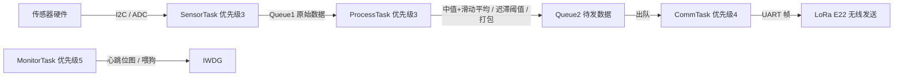

# 检测数据端（采集节点）设计文档

> 板卡 : GEC-M4 开发板 · STM32F407ZET6（512 KB Flash / 192 KB RAM）
> 工程 : S_N_sys/Project_1_检测端/Project（Keil MDK5 · ST 标准外设库 + FreeRTOS V10.4.6）
> 状态 : **设计定稿**（协议、任务、传感器接口已定；驱动与任务待实现）
> 更新 : 2026-10-09（设计评审与升级版）
> 依据 : 《项目架构思路设计参考/方案13.md》《项目架构思路设计参考/核心软件和FreeRTOS架构.md》

---

## 0. 本次评审的修正与升级（2026-10-09）

对照参考架构文档与工程实际配置逐项核对，改动如下，每条的"原因"列说明取舍依据。

| # | 项 | 原 → 新 | 原因 |
|---|---|---|---|
| 1 | 气压传感器接口 | SPI → I2C | 参考架构文档写"SPI 读取 BMP280"，与定稿设计冲突。走 I2C 可少接一组 SPI 线、少占一个 CS 脚，且能和其它传感器共用一条总线 |
| 2 | 光照传感器接口 | ADC → BH1750（I2C） | 参考架构文档写"ADC 读取光照强度"。数字光照传感器免标定、免分段线性拟合，精度和一致性都更好 |
| 3 | RTOS API 名字 | `osDelayUntil()` / `osSemaphoreRelease()` → `vTaskDelayUntil()` / `xSemaphoreGiveFromISR()` | 工程里没有 `cmsis_os.h` / `cmsis_os.c`（实测命中 0 个文件），用的是原生 FreeRTOS API。参考文档里的 `osXxx` 名字在工程里编译不过 |
| 4 | 任务周期 | 原文只写"osDelayUntil 严格周期"，没写周期值 → 补第 4.2 节时间预算表 | 四种 I2C 传感器串行读一轮 ≈ 235 ms（见第 4.2 节时间预算表），不先算清楚周期，实现时必然返工 |
| 5 | 编码精度 | 温度/湿度/气压 ÷10（0.1 分辨率）→ ×100（0.01 分辨率） | 原文档按"高精度"描述，而 SHT30 本身有 0.01 ℃ 分辨率，÷10 把这个能力浪费掉了。×100 不变帧长（仍 20 字节），精度与传感器对齐 |
| 6 | 硬件注意 | 无 → 补第 2.2 节硬件注意事项 | CCS811 的 WAKE 脚、E22 的天线、ESP8266 的电源去耦，漏写会直接影响首次上电 |
| 7 | 阈值判断 | 只说"阈值判断" → 补双阈值迟滞 + 回差时间 | 单阈值会在临界点反复告警抖动 |
| 8 | 心跳机制 | "检查任务标志位"（没说怎么实现） → 心跳位图 | `sys_wdg` 心跳版需要明确的位定义，否则"防任务卡死"没有落地方式 |
| 9 | I2C 地址分配 | 分散在两份文档 → 补第 3.2 节地址表（含冲突检查） | 一条总线挂 5 个从机，地址要一次性核对完 |
| 10 | 升级项 | 无 → 第 8 节可选升级（16 位 ADC 过采样 / 滤波算法对比 / 多总线） | 成本低，可按需选做 |

> 采购清单已集中到 `S_N_sys/项目架构思路设计参考/外设采购清单.md`，本文第 2 节只保留"接口与用途"。

---

## 1. 设计定位

采集精密仪器实验室的环境参数（温湿度 / 气压 / 光照 / 空气质量），
经滤波与阈值判断后打包，通过 LoRa 无线发送至边缘网关（板2）。

- 职责一 : 多传感器采集、数据校验与滤波
- 职责二 : 环境异常本地告警（蜂鸣器 / OLED 提示）
- 职责三 : 按固定周期组帧发送（LoRa 上行）
- 职责四 : 采集失败可感知、可上报（不静默丢数据）

## 2. 硬件构成

### 2.1 接口与用途

| 类别 | 模块 | 型号 | 接口 | 用途 | 状态 |
|---|---|---|---|---|---|
| 主控 | 开发板 | GEC-M4 / STM32F407ZET6 | - | 主控 | 已有 |
| 温湿度 | 传感器 | SHT30 | I2C（0x44） | 温度 / 湿度 | 待采购 |
| 气压 | 传感器 | BMP280 | I2C（0x76/0x77） | 大气压 | 待采购 |
| 光照 | 传感器 | BH1750FVI（GY-302） | I2C（0x23） | 光照度 | 待采购 |
| 空气质量 | 传感器 | CCS811 | I2C（0x5A） | TVOC / eCO2 | 待采购 |
| 空气质量 | 传感器 | MQ-135 | ADC | 有害气体（模拟量） | 待采购 |
| 无线 | LoRa 模块 | 亿佰特 E22-400T22S | UART | 上行数据发送 | 待采购 |
| 显示 | OLED | 0.96 寸 SSD1306 | I2C（0x3C） | 本地显示 | 待采购 |
| 告警 | 蜂鸣器 | 有源（高电平触发） | GPIO | 超标告警 | 板载 |
| 调试 | 板载 DHT11 / MPU6050 | 板上集成 | 单总线 / I2C | 链路先行验证 | 板载 |

> 接线简化 : 全部传感器 + OLED 共用 I2C1 一条总线（BMP280 用 I2C 模式），
>            只有 MQ-135 走 ADC——少接一组 SPI 线、少一个 CS 引脚。

### 2.2 硬件注意

| 模块 | 问题 | 正确做法 |
|---|---|---|
| CCS811 | 不把 WAKE 脚拉低就不响应 I2C（I2C 扫描也扫不到） | WAKE 接 GND（或由 GPIO 拉低）；上电后需预热，读值稳定要跑较长时间 |
| E22-400T22S | 不接天线就发射会损伤功放；M0/M1 悬空会导致模式不定、收发随机失败 | 先接好天线再上电；M0/M1 用 GPIO 明确驱动；发射瞬时电流约 100~120 mA，独立供电更稳 |
| ESP8266（网关侧，此处备查） | 发射瞬时电流 300~500 mA 尖峰，会拉垮板载 3.3 V 导致反复重启 | 模块电源脚就近加 470 µF 电解 + 100 nF 瓷片 |
| I2C 总线 | 多个模块自带上拉，重复堆叠会让等效上拉阻值过小 | 整条总线只保留一组上拉（约 4.7 kΩ）；上电先 `SYS_I2C_Scan()` 确认全部从机在线 |
| MQ-135 | 需要预热；模拟输出受供电波动影响 | 预热后再采；ADC 参考电压稳定；软件做多点平均 |

### 2.3 先用手上模块跑通链路

传感器全部到货前，用板载 DHT11 先把整条链路跑通：
`DHT11 读取 → Queue1 → ProcessTask 滤波/阈值 → Queue2 → CommTask 组帧 → LoRa 发送`。
等 SHT30 到货，只替换读取函数，任务与队列不用改。

> 传感器采购延误时，链路部分仍可完整演示。

## 3. 引脚分配

### 3.1 引脚表

> 原则 : 以模块库头文件"区块 1"配置为准；下表已按当前代码逐个核对过（括号里是出处）。
> 接线前先按"来源"那列翻一眼对应头文件，改过引脚就一起改这里。

| 功能 | 外设 | 引脚 | 来源 / 备注 |
|---|---|---|---|
| 调试串口 | USART1 | PA9 (TX) / PA10 (RX) | `sys_usart.h` 三路串口表；115200，板载 CH340G 到 PC |
| LoRa 收发 | USART3 | PB10 (TX) / PB11 (RX) | `lora_e22.h:67,71`；接 E22 的 RXD / TXD（交叉），9600 |
| LoRa 模式脚 | GPIO | M0 = PB0，M1 = PB1，AUX = PB2 | `lora_e22.h:78-80`；M0/M1 推挽输出且不得悬空，AUX 缺省也能跑（退化为固定 2 ms） |
| 板载 DHT11 | 单总线 | PG9 | `sys_dht11.h:16-17`；**当前唯一在用的温湿度数据源** |
| 温湿度 SHT30 | I2C1 | SCL = PB8，SDA = PB9 | 地址 0x44（`sys_i2c.h:48`）；I2C1 与板载 24C02、MPU6050 同一条总线 |
| 气压 BMP280 | I2C1 | 同总线 | I2C 模式；地址按 SDO 接法（0x76 / 0x77），库中暂无地址宏 |
| 光照 BH1750 | I2C1 | 同总线 | 地址 0x23（库中暂无宏，需自己加） |
| 空气 CCS811 | I2C1 | 同总线 | 地址 0x5A（库中暂无宏）；WAKE 脚要单独引出并拉低 |
| OLED SSD1306 | I2C1 | 同总线 | 地址 0x3C（`sys_i2c.h:49`） |
| MQ-135 | ADC | PF7（ADC3_IN5） | `sys_adc.h:40-43` 原本给光照预留的那一路；光照改走 BH1750 后空出来，接 MQ-135 的 AO |
| 告警蜂鸣器 | GPIO | PF8 | `beep.h:16-17,20`；`BEEP_ACTIVE_LOW = 0`，高电平触发 |

> 板上其余已占用的脚（LED0 = PF9、LED1 = PF10、RS485 的 DE = PG8、以太网 PG11/PG13/PG14 等）
> 见 `本地工具\仓库巡检\_pin_audit.txt`，那份是脚本扫全部头文件得来的，比手抄准。

> USART2 与以太网复用：板1 的 `USART2 PA2/PA3` 与以太网 `ETH_MDIO` 复用，二选一。
> 本项目板1 不用以太网，可安全使用；如果以后要加，必须改规划。

### 3.2 I2C 地址分配与冲突检查

| 从机 | 地址 | 说明 |
|---|---|---|
| SHT30 | 0x44 | 固定（ADDR 脚接法不同可能为 0x45） |
| CCS811 | 0x5A | 固定 |
| BH1750 | 0x23 | ADDR 接高则 0x5C，注意别和 CCS811 撞 |
| BMP280 | 0x76 / 0x77 | 由 SDO 脚决定 |
| SSD1306 OLED | 0x3C | 常见为 0x3C |
| 板载 MPU6050 | 0x68 | 板上已有，不冲突 |
| 板载 24C02 EEPROM | 0x50 | 板上已有，不冲突 |

> 上电自检建议：`SYS_I2C_Scan()` 打印全部在线地址，与上表比对，缺谁一目了然。

### 3.3 板1 串口资源（来自 `FWLIB/inc/sys_usart.h` 区块 1）

| 串口 | 引脚 | 板上接到哪 | 本项目用途 |
|---|---|---|---|
| USART1 | PA9 / PA10 | 板载 CH340G 到 PC | 调试日志 |
| USART2 | PA2 / PA3 | RS485（与 ETH_MDIO 复用） | 不用 |
| USART3 | PB10 / PB11 | ESP8266 接口 | 改接 LoRa E22 |

## 4. 软件架构（FreeRTOS V10.4.6 · heap_4）

### 4.1 任务表

| 任务 | 优先级 | 周期 / 触发 | 职责 |
|---|---|---|---|
| SensorTask（采集） | 中（3） | `vTaskDelayUntil` 1 s 严格周期 | 按 4.2 节预算读 SHT30 / BMP280 / BH1750 / CCS811 / MQ-135，发 Queue1 |
| ProcessTask（处理） | 中（3） | Queue1 触发 | 滤波（中值 + 滑动平均）、双阈值迟滞判断、告警、打包，发 Queue2 |
| CommTask（通信） | 高（4） | Queue2 触发 | 组帧（帧头 / 长度 / CRC16）→ 串口发 LoRa |
| MonitorTask（监控） | 最高（5） | 1 s | 喂狗（IWDG）/ 心跳位图检查 / 采集失败告警 |

> MonitorTask 优先级取最高的原因：它要在其它任务卡死时仍能运行，并在必要时不喂狗，
> 让看门狗复位系统。如果它优先级低，一旦有任务死循环，监控任务自己都得不到调度。

> MQ-135 读取方式 : ADC + DMA 循环模式（`DMA_Mode_Circular`，后台自动刷新数组），
> SensorTask 只读数组、不做阻塞式轮询，周期任务不会被 ADC 等待拖慢。
> （库模块 : `sys_adc` 的 `SYS_ADC_DmaScanInit` / `SYS_ADC_DmaStop`）

> 实现现状（2026-10-10）: 优先级与任务个数已照上表落地（`main.c` 里 Sensor 3 / Process 3 /
> Comm 4 / Monitor 5，另加一个采集队列和一个发送队列）。两处与设计不同：采集周期先用
> **2 s**（DHT11 之外还有四个传感器没到货），处理任务目前只做组帧转发、不做滤波与告警判定
> （迟滞告警放在上位机 `alarmmanager.cpp`，板1 保持最小职责）。

### 4.2 时间预算表

单轮采集各传感器耗时（按数据手册典型值，400 kHz I2C）：

| 步骤 | 耗时 | 依据 |
|---|---|---|
| SHT30 单次测量（高重复性） | ~15 ms | 数据手册 max 15 ms |
| BMP280 强制模式转换 | ~10 ms | 数据手册典型 8~10 ms |
| BH1750 高分辨率模式（H-Res） | ~180 ms | 数据手册 max 180 ms |
| CCS811 常量功耗模式（1 s 周期） | 实际耗时约 10 ms（读 4 字节 ALG_RESULT_DATA） | 芯片内部以 1 s 周期自主测量 |
| MQ-135 | 非阻塞（DMA 后台刷新） | - |
| 加锁 / 解锁 / 少量容错余量 | ~20 ms | 估算 |
| 合计 | ≈ 235 ms | - |

> 结论 : 六项全接上后，采集周期取 1 s 余量约 4 倍。当前只接 DHT11（单总线，读一次关中断
> 约 8.4 ms），实现里先用 2 s 周期；四个 I2C 传感器到货、`SensorMsg_t` 填上实测值之后再压回 1 s。
> 若把 CCS811 改成"每次都要等测量完成"的同步读法，周期必须放宽到 ≥ 2 s。
>
> 此表是设计估算，实现后必须用 GPIO 翻转 + 示波器（或时间戳打印）实测并回填真实值。

### 4.3 队列与同步

| 对象 | 类型 | 生产者 → 消费者 | 说明 |
|---|---|---|---|
| Queue1 | 消息队列 | SensorTask → ProcessTask | 单次原始数据（定长结构体） |
| Queue2 | 消息队列 | ProcessTask → CommTask | 处理后的待发数据 |
| Mutex | 互斥量 | 多个任务共用 I2C1 | 保护 I2C 总线（`configUSE_MUTEXES = 1`） |
| 心跳位图 | 标志位 | 各任务 → MonitorTask | 见 4.4 节 |

### 4.4 心跳位图定义

```c
/* 每个任务在自己的循环里置位；MonitorTask 每秒检查一次并清位 */
#define HB_SENSOR   (1U << 0)
#define HB_PROCESS  (1U << 1)
#define HB_COMM     (1U << 2)
#define HB_ALL      (HB_SENSOR | HB_PROCESS | HB_COMM)

/* 任务内 */            SYS_WDG_Heartbeat(HB_SENSOR);
/* MonitorTask 内 */    if (SYS_WDG_CheckAll(HB_ALL)) SYS_WDG_Feed();   /* 全部刷新过才喂狗 */
                        else                        /* 缺位 → 不喂，等看门狗复位 */
```

> "全部刷新过才喂狗"的用途：任务卡死能被发现。
> 如果无条件喂狗，某个任务死循环时系统照样活着，但数据已经不更新了，故障被掩盖。

### 4.5 数据流



### 4.6 内存与优先级注意事项

- `FreeRTOSConfig.h`：`configTOTAL_HEAP_SIZE = 30 KB`、`configTICK_RATE_HZ = 1000`、
  `configCHECK_FOR_STACK_OVERFLOW = 2`、`configUSE_MALLOC_FAILED_HOOK = 1`。
- 只有 30 KB 堆：4 个任务 + 2 个队列 + 1 个互斥量的栈/控制块都要从这里分配。
  实现后必须记录 `xPortGetFreeHeapSize()` 实测余量，余量太小就调 `configTOTAL_HEAP_SIZE`。
- 中断优先级红线：`configLIBRARY_MAX_SYSCALL_INTERRUPT_PRIORITY = 5`，
  即抢占优先级 ≥ 5 的 ISR 里不能调用 `xQueueSendFromISR` / `xSemaphoreGiveFromISR` 等 API。
  库里头 `SYS_USART_IRQ_PRE_PRIO = 2`（比 5 更"高"），默认不能在串口 ISR 里直接调用 FreeRTOS API，
  要么把串口中断优先级调到 5 及以后，要么 ISR 里只置标志、由任务处理。
- 上 RTOS 后不要调用 `SYS_CLK_Switch` 切低频档：`configCPU_CLOCK_HZ` 与运行时切频无联动，
  切了之后 `vTaskDelay` 的节拍会失准。

## 5. 通信协议（LoRa 上行帧 · 已定案，2026-10-09 精度升级）

> 定案说明 : 板1 → 板2 → Qt 全程使用同一种二进制帧（Qt 端直接解析原帧，不做格式转换）；
> 校验用 CRC16-MODBUS（工程内已有现成实现，见 `modbus.c`）；
> 板1 / 板2 / Qt 三端实现必须与本表完全一致，改任何一个字段，三端同时改。

### 5.1 帧结构

| 字段 | 字节数 | 值 / 说明 |
|---|---|---|
| 帧头 | 2 | 0xAA 0x55（固定） |
| 命令 | 1 | 0x01 = 环境数据上报 |
| 长度 | 1 | 数据段字节数（本帧 = 0x0C，12 字节） |
| 数据段 | 12 | 见 5.2 |
| CRC16 | 2 | CRC16-MODBUS；范围 = 命令 + 长度 + 数据段（不含帧头 / 帧尾）；低字节在前 |
| 帧尾 | 2 | 0x55 0xAA（固定） |

> 整帧长度 = 2 + 1 + 1 + 12 + 2 + 2 = 20 字节。
> 组帧方式 : 手动移位拼接（不用结构体强转，避免字节对齐与填充差异）。

### 5.2 数据段定义（12 字节 · 大端：高字节在前）

| 帧内偏移 | 参数 | 字节数 | 编码 | 示例 |
|---|---|---|---|---|
| 4 | 温度 | 2 | 有符号 short，×100（℃ ×100） | 25.30 ℃ → 2530 = 0x09E2 |
| 6 | 湿度 | 2 | 无符号 short，×100（%RH ×100） | 48.55 % → 4855 = 0x12F7 |
| 8 | 气压 | 2 | 无符号 short，×100（hPa ×100） | 1013.25 → 101325 超出 short，见下 |
| 10 | 光照 | 2 | 无符号 short，原值（lx） | 500 = 0x01F4 |
| 12 | TVOC（CCS811） | 2 | 无符号 short，原值（ppb） | 50 = 0x0032 |
| 14 | MQ-135 原始值 | 2 | 无符号 short，ADC 12 位原始值 | 1234 = 0x04D2 |

> 气压的编码取舍：
> 标准大气压 1013.25 hPa × 100 = 101325，超过无符号 short 上限 65535。
> 因此气压不能用 ×100。三个可选做法，本项目选方案 A：
>
> - A（采用）：气压用 ×10（1013.2 → 10132 = 0x2794）。分辨率 0.1 hPa，
>   而 BMP280 相对精度约 ±0.12 hPa，0.1 hPa 分辨率够用。
> - B：气压用"相对基准的偏差 ×100"（如相对 1000 hPa 的差值），可省字节但增加理解成本。
> - C：气压改 float（4 字节），需重排帧长度。不划算。
>
> 结论 : 温度/湿度 ×100，气压 ×10，光照/TVOC/MQ-135 原值。

> 解析示例 :
> ```c
> short t  = (short)((data[4] << 8) | data[5]);   double temp = t / 100.0;   /* ℃ */
> unsigned short h = (data[6] << 8) | data[7];    double humi = h / 100.0;   /* %RH */
> unsigned short p = (data[8] << 8) | data[9];    double pres = p / 10.0;    /* hPa */
> ```
> 有符号值说明 : -5.00 ℃ → -500 → 0xFE0C（按 short 解释）。

### 5.3 组帧与解帧约束

| 约束 | 说明 |
|---|---|
| 字节序不统一是有意的 | 数据段用大端，CRC16 用低字节在前（沿用 MODBUS 习惯）。文档必须写明，否则三端必有一端写反 |
| 帧尾也是帧头的一部分 | 帧尾 `0x55AA` 的后两字节可与下一帧的 `0xAA55` 拼接。解析器必须以帧头为最高优先、配合长度与 CRC 双重确认，不允许"看到 0xAA55 就当帧头"就直接取数据 |
| 长度字段校验 | 长度必须先与协议表比对（本帧 = 0x0C），不符直接丢帧重新找帧头 |
| 保留：节点编号 | 做"多节点组网"时，需要 1 字节节点 ID（可从命令字段拆分或加在数据段） |

## 6. 三端一致性验收清单

协议一致性的验收不能靠"看着像"，用同一批数据逐字节比对：

| # | 验收项 | 通过标准 |
|---|---|---|
| 1 | 板1 发出的帧 | 用逻辑分析仪 / 串口抓包，20 字节，字段与 5.1 完全一致 |
| 2 | 板2 收到的帧 | 与板1 发出的逐字节相同（透传不修改） |
| 3 | Qt 解析结果 | 与板1 的原始物理量一致（温度 25.30 ℃ 显示 25.30） |
| 4 | CRC 边界 | 故意改 1 字节 → 三端都应判校验失败并丢帧，不显示错误数据 |
| 5 | 负温度 | 送 -5.00 ℃ → 三端都显示 -5.00（验证有符号解析） |
| 6 | 帧尾歧义 | 构造 `...55 AA AA 55...` 的连续帧，解析器不应错位 |

> 建议做成一个脚本：把同一批 16 进制帧喂给 Qt 的解析函数，与 C 端解析结果对比，输出差异表。

## 7. 待办清单

- [ ] 采购传感器 / LoRa / OLED（对照 `S_N_sys/项目架构思路设计参考/外设采购清单.md`，下单前看该文档 §0.5 的驱动就绪状态表）
- [x] 引脚表按代码核对完毕（第 3 节，2026-10-10）
- [x] 用板载 DHT11 跑通"采集 → 队列 → 组帧 → LoRa"（固件已写好，等上板；滤波不做在板1，见第 8 节升级 1）
- [ ] 补两个驱动 : `sht30`、`mq135`；`bmp280`（I2C 模式）/ `bh1750` / `ccs811` / `lora_e22` 库里已有，接上后要把读数填进 `SensorMsg_t` 与 `main.c` 里那次 `frame_build()`
- [x] `lora_e22.c/.h` 已完成（两板共用，E22 的 AT 配置 + 收发封装）
- [x] 协议已定案并实现（第 5 节 · 精度升级版 2026-10-09）；组帧与 CRC16-MODBUS 三端一致
- [x] 实现 FreeRTOS 各任务（第 4 节；板1 = vTaskSensor / vTaskProcess / vTaskComm ＋ vTaskMonitor）
- [ ] 回填第 4.2 节时间预算的实测值
- [ ] 联调 : LoRa 点对点收发自测 → 接入网关（板2 侧的收帧校验与断网补传已实现）
- [ ] 记录实测指标（见第 9 节）

## 8. 可选升级（成本低优先做）

| # | 升级 | 成本 | 收益 | 建议 |
|---|---|---|---|---|
| 1 | 滤波算法对比实验：同一段真实数据分别跑 无滤波 / 滑动平均 / 中值 / 卡尔曼，给出噪声抑制对比表 | 纯软件（工程内 `sys_filter.c`、`kalman.c` 现成） | 高：能给出"为什么选这个滤波器"的依据 | 建议 |
| 2 | 16 位 ADC 过采样（ADC 12 位 + 4 次累加求平均 → 等效 13~14 位） | 纯软件 | 中高：提高有效分辨率 | 建议 |
| 3 | 多总线模式：板1 已有 RS485 / CAN / 以太网 底层驱动，加"LoRa 远距离 / RS485 总线 / CAN 工业总线"模式开关 | 需要收发器模块（见采购清单） | 高：覆盖工业总线选型 | 可选，非必需 |
| 4 | 本地 SD 卡数据记录（掉网时全量留存） | 需 Micro SD 卡座（板1 板载，实测确认） | 中：数据可追溯的硬证据 | 可选 |
| 5 | OLED 多页显示 + 按键翻页 | 需 OLED + 按键（板载 KEY0~3） | 中 | 演示效果好 |
| 6 | 裸机时间片轮转调度器 | - | - | 不做。与 FreeRTOS 方案重复，原方案已改为 FreeRTOS |

## 9. 实测指标（联调时回填）

| 指标 | 目标 | 实测值 | 测量方法 |
|---|---|---|---|
| 任务周期抖动 | ±1 ms 内 | 待填 | 任务里翻转 GPIO，示波器测周期 |
| 单轮采集耗时 | < 300 ms | 待填 | 同上（进出采集函数各翻转一次） |
| 连续运行时长 | ≥ 72 h 无复位 | 待填 | 上电跑，记录 IWDG 复位次数 |
| LoRa 丢包率 | < 1% | 待填 | 板1 发 N 帧，板2 计数 |
| CRC 错误率 | < 0.1% | 待填 | 板2 统计校验失败次数 |
| FreeRTOS 堆余量 | > 8 KB | 待填 | `xPortGetFreeHeapSize()` 周期打印 |
| 各任务栈余量 | > 30% | 待填 | `uxTaskGetStackHighWaterMark()` |
| 端到端延迟 | < 2 s | 待填 | 板1 采样时刻 → Qt 界面刷新时刻 |
| 故障恢复 | 能自愈 | 待填 | 拔天线 / 拔网关电源各一次，观察恢复 |
