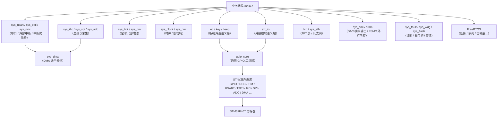
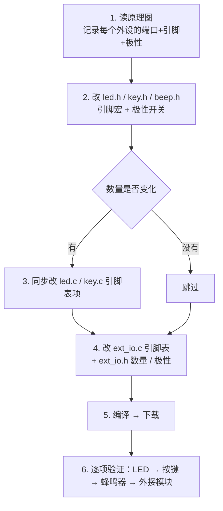

# STM32F407 标准库薄封装函数库 —— 使用手册与移植指南

> 平台：**普中-天马 F407 开发板 · STM32F407ZGT6** ｜ Keil MDK5（ARM Compiler 5）｜ ST 标准外设库（StdPeriph）｜ 薄封装设计
> 本工程是把参考工程 `0001_标准模板库`（GEC-M4 / STM32F407ZE）按天马板原理图
> **逐引脚核对并改造**后的标准模板库：板载器件、引脚、极性以天马板为准，
> 架构、分层、命名风格与参考工程保持一致。移植差异清单见第 0 节。

---

## 0. 移植差异清单（相对参考工程 0001_标准模板库）

> 下表是“照着天马板原理图改了什么”的账本。换板子时把本表当成模板逐项对照即可。

| 项 | 参考工程（GEC-M4 / F407ZE） | 本模板（天马 F407 / F407ZG） | 原因 |
|---|---|---|---|
| 器件 / Flash | STM32F407ZE ｜ 512KB | **STM32F407ZG ｜ 1MB** | 板上实际焊的芯片 |
| LED | 4 只：PF9 / PF10 / PE13 / PE14 | **2 只：PF9(DS0) / PF10(DS1)** | 天马板 PE13/PE14 是 FSMC_D10/D11（SRAM/LCD 数据线），不能当 LED |
| 按键编号 | KEY1~KEY4（1 起） | **KEY0~KEY3（0 起，对齐板上丝印）** | id 与丝印一致，写代码不用再对照 |
| 按键极性 | 一对全局宏 `KEY_ACTIVE_LOW` / `KEY_PULL` | **每键独立**：`KEYx_ACTIVE_LOW` / `KEYx_PULL` | 天马板 **KEY_UP(PA0) 接 3.3V（高有效）**，KEY0/1/2 接地（低有效），一键极性不同 |
| ext_io 模块 | 红外避障 / 循迹 / 碰撞 / 声音（PC6~PC12） | **红外接收头 PA8 / WiFi按键 PF6 / 光敏 PF7 / 电容触摸 PA5** | 天马板没有那四类模块；PC6~PC12 在本板是 DCMI/SDIO 信号 |
| 以太网 | 板载 LAN8720 + RMII（`sys_eth` 可用） | **本板根本没有以太网 PHY → `sys_eth` 默认关闭（`SYS_ETH_ENABLE = 0`）** | 原理图上叫“以太网模块接口”的那个块的 8 脚座是 **NRF24L01（CN1）**，全图搜不到 LAN8720/RMII/RJ45 |
| 光敏 / 触摸的读法 | 数字输入 | **光敏 PF7 实为模拟量（用 sys_adc）；触摸 PA5 必须用“充电时间法”（ext_io 已内置）** | 光敏数字输出 LSENS 未接到 MCU；触摸当数字读永远读不到变化 |
| LED / KEY / BEEP / 串口 / I2C / SPI / ADC / LCD 引脚 | —— | **完全一致，未改** | 两块板同源，这些信号接法相同 |

> 未移植项：参考工程 ext_io 里的**循迹传感器、碰撞/触摸模块、声音检测**在天马板上
> 没有对应器件（对应引脚已被 DCMI/SDIO 占用），按要求不予移植，
> 腾出的名额改为本板真实存在的四路单引脚输入。
>
> **以太网模块保留但不适用**：`sys_eth.*` / `ETH\` 目录只是从参考工程留下，
> 本板无 PHY 也无对应接插件（连 PA2 都被 RS485 的 USART2 占着）。

---

## 目录

1. [工程简介](#1-工程简介)
   - [按项目选模块](#按项目选模块)
2. [文件结构](#2-文件结构)
3. [快速上手](#3-快速上手)
4. [分层架构与设计思想](#4-分层架构与设计思想)
5. [模块函数参考](#5-模块函数参考)
   - [5.1 gpio_core —— 通用 GPIO 底层工具](#51-gpio_core--通用-gpio-底层工具)
   - [5.2 led —— 板载 LED](#52-led--板载-led)
   - [5.3 key —— 板载按键](#53-key--板载按键)
   - [5.4 beep —— 板载蜂鸣器](#54-beep--板载蜂鸣器)
   - [5.5 ext_io —— 外接模块](#55-ext_io--外接模块)
   - [5.6 sys_clock —— 时钟源切换](#56-sys_clock--时钟源切换)
   - [5.7 sys_tick —— SysTick 精确定时](#57-sys_tick--systick-精确定时)
   - [5.8 sys_usart —— 串口（USART1 / USART2 / USART3）](#58-sys_usart--串口usart1--usart2--usart3)
   - [5.9 sys_tim —— 通用定时器](#59-sys_tim--通用定时器)
   - [5.10 sys_exti —— 外部中断（EXTI0 ~ EXTI15）](#510-sys_exti--外部中断exti0--exti15)
   - [5.11 sys_pwr —— 低功耗（Sleep / Stop / Standby）](#511-sys_pwr--低功耗sleep--stop--standby)
   - [5.12 sys_nvic —— 中断优先级辅助](#512-sys_nvic--中断优先级辅助)
   - [5.13 sys_dma —— DMA 通用搬运](#513-sys_dma--dma-通用搬运)
   - [5.14 sys_i2c —— I2C 总线（I2C1/2/3）](#514-sys_i2c--i2c-总线i2c123)
   - [5.15 sys_spi —— SPI 主机（SPI1/2/3）](#515-sys_spi--spi-主机spi123)
   - [5.16 sys_adc —— ADC（单次 / 连续 / 扫描 + DMA）](#516-sys_adc--adc单次--连续--扫描--dma)
   - [5.17 lcd —— TFT-LCD 屏（FSMC + ILI9481）](#517-lcd--tft-lcd-屏fsmc--ili9481)
   - [5.18 sys_eth —— 以太网（LAN8720 + RMII）](#518-sys_eth--以太网lan8720--rmii)
   - [5.19 sys_fault —— CPU 故障捕获诊断（黑匣子）](#519-sys_fault--cpu-故障捕获诊断黑匣子)
   - [5.20 sys_wdg —— 看门狗（IWDG 基础 / WWDG 扩展）](#520-sys_wdg--看门狗iwdg-基础--wwdg-扩展)
   - [5.21 sys_flash —— 内部 Flash 擦写与参数保存](#521-sys_flash--内部-flash-擦写与参数保存)
   - [5.22 mpu6050 —— 六轴姿态（I2C1, 0x68）](#522-mpu6050--六轴姿态i2c1-0x68)
   - [5.23 ds18b20 —— 单总线温度（PG9）](#523-ds18b20--单总线温度pg9)
   - [5.24 dht11 —— 单总线温湿度（PG9）](#524-dht11--单总线温湿度pg9)
   - [5.25 oled —— OLED 显示（I2C1, 0x3C）](#525-oled--oled-显示i2c1-0x3c)
   - [5.26 at24c02 —— 板载 EEPROM 参数存储](#526-at24c02--板载-eeprom-参数存储)
   - [5.27 w25qxx —— 板载 SPI Flash 大数据存储](#527-w25qxx--板载-spi-flash-大数据存储)
   - [5.28 sys_rs485 —— RS485 半双工总线](#528-sys_rs485--rs485-半双工总线)
   - [5.29 modbus —— Modbus-RTU 协议](#529-modbus--modbus-rtu-协议)
   - [5.30 esp8266 —— WiFi 模块（AT 指令）](#530-esp8266--wifi-模块at-指令)
   - [5.31 pid —— PID 闭环控制](#531-pid--pid-闭环控制)
   - [5.32 sys_filter —— 数字滤波工具](#532-sys_filter--数字滤波工具)
   - [5.33 sys_encoder —— 正交编码器接口](#533-sys_encoder--正交编码器接口)
   - [5.34 xpt2046 —— 彩屏电阻触摸（软件 SPI）](#534-xpt2046--彩屏电阻触摸软件-spi)
   - [5.35 sys_rtc —— RTC 实时时钟（含备份域）](#535-sys_rtc--rtc-实时时钟含备份域)
   - [5.36 sys_dac —— DAC 模拟输出（PA4）](#536-sys_dac--dac-模拟输出pa4)
   - [5.37 sram —— FSMC 外扩 SRAM（1MB）](#537-sram--fsmc-外扩-sram1mb)
   - [5.38 sys_can —— CAN 总线（CAN1 + TJA1050）](#538-sys_can--can-总线can1--tja1050)
   - [5.39 uln2003 —— 四相步进电机驱动](#539-uln2003--四相步进电机驱动)
   - [5.40 ntc_pt100 —— NTC / PT100 温度检测](#540-ntc_pt100--ntc--pt100-温度检测)
   - [5.41 rgb5x5 —— 5x5 WS2812B 全彩阵列](#541-rgb5x5--5x5-ws2812b-全彩阵列)
   - [5.42 mqtt —— MQTT 客户端（跑在 ESP8266 上）](#542-mqtt--mqtt-客户端跑在-esp8266-上)
   - [5.43 hcsr04 —— HC-SR04 超声波测距](#543-hcsr04--hc-sr04-超声波测距)
   - [5.44 kalman —— 一维卡尔曼滤波](#544-kalman--一维卡尔曼滤波)
   - [5.45 w25qxx_log —— Flash 滚动记录（数据黑匣子）](#545-w25qxx_log--flash-滚动记录数据黑匣子)
   - [5.46 vl53l0x —— VL53L0X 激光测距（ToF）](#546-vl53l0x--vl53l0x-激光测距tof)
   - [5.47 tb6612 —— TB6612FNG 双路直流电机驱动（4WD 小车）](#547-tb6612--tb6612fng-双路直流电机驱动4wd-小车)
   - [5.48 中断向量表与模块对照（ISR 归属总表）](#548-中断向量表与模块对照isr-归属总表)
   - [5.49 sys_softimer —— 软定时器（模块联动引擎）](#549-sys_softimer--软定时器模块联动引擎)
   - [5.50 sys_frame —— 串口自定义帧协议](#550-sys_frame--串口自定义帧协议)
   - [5.51 sys_bitband —— 位带操作（独立宏文件）](#551-sys_bitband--位带操作独立宏文件)
   - [5.52 delay —— 延时函数（粗延时 + DWT 精准延时）](#552-delay--延时函数粗延时--dwt-精准延时)
6. [可移植性配置总表](#6-可移植性配置总表)
7. [教程 A：换引脚 / 换端口](#7-教程-a换引脚--换端口)
8. [教程 B：换板子](#8-教程-b换板子)
9. [教程 C：增删 LED / 按键 / 外接模块](#9-教程-c增删-led--按键--外接模块)
10. [常见问题排查](#10-常见问题排查)
11. [注意事项与已知限制](#11-注意事项与已知限制)
12. [FreeRTOS 基础](#12-freertos-基础)
    - [12.1 和裸机程序的区别](#121-和裸机程序的区别)
    - [12.2 最小工程 —— 任务创建 / 延时 / 删除](#122-最小工程--任务创建--延时--删除)
    - [12.3 调度与优先级](#123-调度与优先级)
    - [12.4 队列 —— 任务之间传数据](#124-队列--任务之间传数据)
    - [12.5 信号量（二值/计数）与互斥量](#125-信号量二值计数与互斥量)
    - [12.6 软件定时器与事件组](#126-软件定时器与事件组)
    - [12.7 常用 API 速查](#127-常用-api-速查)
    - [12.8 与库模块混用的注意事项](#128-与库模块混用的注意事项)
13. [复用本模板到新工程](#13-复用本模板到新工程)

---

## 1. 工程简介

这是一套基于 **ST 标准外设库（StdPeriph）的"薄封装"函数库模板**。

**"薄封装"的含义**

- 不重写、不替代标准库 —— 标准库仍然是唯一的底层实现；
- 只在它之上加一层"**语义 + 防护**"：
  - **语义**：`LED_On(0)`、`KEY_Scan()`、`EXT_IR_Detected(0)` —— 调用者只关心"做什么"，不关心"接在哪个引脚"；
  - **防护**：端口时钟自动使能、输入引脚自动上下拉、按键自动消抖、时钟切换自动处理安全流程。

**三条设计原则：**

| 原则 | 说明 |
|---|---|
| 1) 调用简单 | 对外只暴露 `id`（0/1/2/3），无需对照原理图就能写业务代码 |
| 2) 移植省事 | 引脚映射、电平极性、数量全部集中在头文件"配置区"（或模块引脚表），换板子只动配置、不动逻辑 |
| 3) 易错点封装 | "忘开时钟""极性反了""消抖漏了"这类高频问题在库内部一次性解决 |

`main()` 目前是空的 —— 这是模板，业务逻辑需自行实现。

### 按项目选模块

> 面向"嵌入式校招 / 春招"那几个典型项目，直接照这张表抓模块，不用在库里翻。

| 项目 | 用到什么 | 本库给你的模块 |
|---|---|---|
| 传感器采集 + 本地显示 + 上位机画曲线 | 采集 / OLED 显示 / 串口上传 / Qt 解析 | `mpu6050` `dht11`(或 `ds18b20`) `oled`(或 `lcd`) `sys_usart` `sys_tick` |
| RS485 + Modbus-RTU + 看门狗 + 参数存储 | 半双工总线 / 协议栈 / 掉电保存 | `sys_rs485` `modbus` `sys_wdg` `at24c02`(或 `w25qxx` / `sys_flash`) |
| 定时器触发 ADC + DMA + 串口 DMA 上传波形 | 定时器 / ADC / DMA / 串口 | `sys_adc`（`SYS_ADC_DmaTimerTrigInit`）`sys_tim` `sys_dma` `sys_usart` |
| 联网上云（MQTT / 云平台） | WiFi AT 指令 / TCP / 协议栈 | `esp8266` `mqtt` `sys_usart` |
| 光电信号采集 + ADC 采样 + 滤波 | ADC / 数字滤波 / 卡尔曼 | `sys_adc` `sys_filter` `kalman` `sys_tick` |
| 超声波避障小车 / 液位检测 | 非接触测距 + 电机闭环 | `hcsr04`(超声) 或 `vl53l0x`(激光，更准) + `tb6612`(电机驱动，含差速) `sys_encoder` `pid` `sys_filter` |
| 无线遥控小车（Qt / 手机上位机） | WiFi 服务器 + 自定义协议 + 避障 | `esp8266`（TCP **服务器**模式 `StartServer`）`tb6612` `hcsr04` `ext_io`(4路避障) `oled` `FreeRTOS` |
| 智能家居终端（本地控制 + 远程下发） | 传感器 + 云端双向通信 | `mqtt`(订阅 `cmd/#` 收指令) `esp8266` `dht11` `rgb5x5` `key` |
| 工业数据采集网关 / 历史记录仪 | RS485 采集 + 断网先存 + 联网补传 | `sys_rs485` `modbus` `w25qxx_log`(环形黑匣子) `esp8266` `mqtt` `sys_rtc` |
| 激光测距 / ToF 光电检测仪 | ToF 测距 + 信号滤波 | `vl53l0x` `kalman` `sys_adc` `oled`/`lcd` |
| Linux + STM32 异构通信 | 串口 / 协议帧 | `sys_usart` `modbus`（自定义帧可直接拼） |
| 直流/步进电机 PWM + 编码器 + PID 闭环 | PWM / 编码器 / 控制算法 / 在线调参 | `sys_tim`（PWM）`sys_encoder` `pid` `sys_filter` `sys_usart`(调参) `oled`(显示转速) |
| 彩屏触摸交互界面（菜单 / 画板） | 显示 + 触摸 | `lcd` `xpt2046` `at24c02`(存校准) |
| 带时间戳的数据记录仪 / 定时上报 | RTC + 存储 + 看门狗 | `sys_rtc` `at24c02`(或 `w25qxx`) `sys_wdg` `sys_pwr`(Stop+唤醒) |
| 信号发生器 / 波形输出 / 音频点灯 | DAC + 定时器 + DMA | `sys_dac`（三角/噪声/**DMA 正弦**）`sys_tim` `sys_dma` `sys_tick` |
| 大缓存需求（图片 / 音频采样 / 大数组） | 外扩内存 | `sram`（FSMC 外扩 **1MB**，指针直接读写）`lcd`(图片缓冲) `sys_dma` |
| 车载/工控多节点总线（CANopen / 汽车电子） | CAN 控制器 + 收发器 | `sys_can`（PA11/PA12 + TJA1050，需 P9 跳线）`sys_tim` `sys_filter` |
| 步进电机 / 云台 / 机械臂（开环定位） | 四相步进 + 减速电机 | `uln2003`（八拍驱动）`sys_tick`(非阻塞) `key` |
| 温度采集 / 工业测温（传感器实物项目） | NTC/PT100 + 运放前端 + ADC | `ntc_pt100`（含两点校准）`sys_usart`(上传) `oled`/`lcd`(显示) |
| 光效 / 心情灯 / 流水灯 / 显示板 | 单总线全彩 LED | `rgb5x5`（25 颗 WS2812B）`sys_tick`(动画节拍) `key` |

**一条最省事的路线**：`gpio_core` → `led/key/beep` → `sys_tick` + `sys_usart`（打通调试串口）
→ 之后按项目表加模块即可，模块之间基本互不依赖。

### 板载接口与易混点（USB 口 / 跳线）

> 板上**三个 USB 座子**长得像、丝印又小，先把位置对清楚再插线（这是实物核对后的结论）：

| 丝印 | 是什么 | 接到哪 |
|---|---|---|
| **USB2** | **USB 转串口**（旁边就是 **CH340C**），插电脑当调试串口 | MCU 的 **USART1：PA9(TX) / PA10(RX)**，配 `sys_usart` 用 |
| **USB1** | 在 **"USB Slave & Host" 模块区** | OTG_FS：**PA11 = DM、PA12 = DP**，供电控制网络名 `USB_PWR` 接 **PA15** |
| **USB3** | 在 **"USB Slave & Host" 模块区** | 同上（同一组 OTG 信号，两个座子分别做 Device / Host 用） |

- **本库没有实现 USB 协议栈**：标准库只到寄存器层，USB Device/Host 需要第三方中间件（ST 的 USB 库 / TinyUSB）。
  想做"U 盘读写 / 键鼠 / 虚拟串口"，先把中间件加进来（向量 42/67/74~77，见 5.38 的表）；
  只是想让电脑认个串口调试，**直接插 USB2 就行**，不需要任何 USB 代码。
- **跳线点提醒**：`J8` 是 PA5/PA4 的共用模拟跳线（`R_ADC / STM_ADC / P_TOUCH / STM_DAC / TAD1`）；
  `P6` 决定 PA2/PA3 是走 **SP3485(RS485)** 还是 **SP3232(RS232)**；
  网名 `RGB_DATA` 并未接到 MCU，用 WS2812 需在 CN5 处飞线。

---

## 2. 文件结构

```
000模板\
├── 000标准模板库.uvprojx    Keil 工程文件（目标名：Target 1；输出 000标准模板库）
├── main.c                    用户主程序（模板状态为空；第 3 节给了一份最小可用骨架作起点）
├── main参考示例.md           骨架写法 / 初始化顺序 / 各模块调用样例 / 返回值极性速查
│
├── FWLIB\                    函数库（本模板的核心）
│   ├── inc\                  头文件：对外接口 + 配置宏
│   │   ├── gpio_core.h       【通用】GPIO 底层工具
│   │   ├── led.h             【板载】LED
│   │   ├── key.h             【板载】按键
│   │   ├── lcd.h             【板载】TFT-LCD 屏（FSMC + ILI9481，320x480）
│   │   ├── xpt2046.h         【彩屏附件】电阻触摸屏（软件 SPI）
│   │   ├── lcd_font.h        8x16 ASCII 点阵字库（lcd 字符显示用）
│   │   ├── beep.h            【板载】蜂鸣器
│   │   ├── ext_io.h          【板载/外接】红外 / WiFi按键 / 光敏(模拟) / 电容触摸(充电时间法)
│   │   ├── sys_clock.h       【系统】时钟源切换
│   │   ├── sys_tick.h        【系统】SysTick 精确定时
│   │   ├── sys_usart.h       【系统】串口 USART1/2/3
│   │   ├── sys_tim.h         【系统】定时器 TIM1~14 全部（PWM / 定时中断）
│   │   ├── sys_exti.h        【系统】外部中断 EXTI0~15
│   │   ├── sys_nvic.h        【系统】中断优先级辅助
│   │   ├── sys_dma.h         【系统】DMA 通用搬运（16 数据流）
│   │   ├── sys_i2c.h         【系统】I2C 总线（I2C1/2/3）
│   │   ├── sys_spi.h         【系统】SPI 主机（SPI1/2/3）
│   │   ├── sys_adc.h         【系统】ADC（单次/连续/扫描/DMA）
│   │   ├── sys_dac.h         【系统】DAC 模拟输出（PA4，固定电压/三角/噪声/正弦）
│   │   ├── sys_can.h         【系统】CAN 总线（PA11/PA12 + TJA1050）
│   │   ├── sram.h            【系统】FSMC 外扩 SRAM 1MB（当普通数组用）
│   │   ├── sys_eth.h         【系统】以太网（LAN8720 + RMII）
│   │   ├── sys_fault.h       【系统】CPU 故障捕获（黑匣子）
│   │   ├── sys_flash.h       【系统】Flash 擦写与参数保存
│   │   ├── sys_wdg.h         【系统】看门狗（IWDG / WWDG）
│   │   ├── sys_pwr.h         【系统】低功耗 Sleep/Stop/Standby
│   │   ├── sys_rtc.h         【系统】RTC 实时时钟 + 备份域
│   │   ├── sys_softimer.h    【系统】软定时器（联动引擎）
│   │   ├── sys_bitband.h     【通用】位带操作（BITBAND / Pxout 宏）
│   │   ├── delay.h           【通用】延时（粗延时 + DWT 精准延时）
│   │   ├── mpu6050.h         【器件】六轴姿态（I2C1, 0x68）
│   │   ├── vl53l0x.h         【器件】VL53L0X 激光测距 ToF（I2C1, 0x29）
│   │   ├── ds18b20.h         【器件】单总线温度（PG9）
│   │   ├── dht11.h           【器件】单总线温湿度（PG9）
│   │   ├── hcsr04.h          【器件】HC-SR04 超声波测距（引脚运行时指定）
│   │   ├── oled.h            【器件】0.96" OLED（I2C1, 0x3C）
│   │   ├── at24c02.h         【器件】板载 EEPROM 参数存储（I2C1, 0x50）
│   │   ├── w25qxx.h          【器件】板载 SPI Flash 存储（SPI1, CS=PB14）
│   │   ├── w25qxx_log.h      【器件】Flash 环形滚动记录（数据黑匣子）
│   │   ├── sys_rs485.h       【通信】RS485 半双工（USART2 + PG8 方向脚）
│   │   ├── modbus.h          【通信】Modbus-RTU 从机协议
│   │   ├── esp8266.h         【通信】WiFi 模块 AT 指令（USART3）
│   │   ├── mqtt.h            【通信】MQTT 3.1.1 客户端（跑在 ESP8266 的 TCP 上）
│   │   ├── pid.h             【算法】PID 闭环控制
│   │   ├── kalman.h          【算法】一维卡尔曼滤波
│   │   ├── uln2003.h         【电机】四相步进电机（板载 ULN2003D）
│   │   ├── tb6612.h          【电机】TB6612FNG 双路直流电机（4WD 差速小车）
│   │   ├── ntc_pt100.h       【检测】NTC / PT100 测温（LM358 前端）
│   │   ├── rgb5x5.h          【显示】5x5 WS2812B 全彩阵列
│   │   ├── sys_filter.h      【算法】限幅 / 中值 / 平均 / 一阶低通滤波
│   │   └── sys_encoder.h     【算法】正交编码器接口（TIM 编码器模式）
│   └── src\                  实现文件（与 inc 一一对应）
│       ├── gpio_core.c
│       ├── led.c
│       ├── lcd.c
│       ├── key.c
│       ├── beep.c
│       ├── ext_io.c
│       ├── sys_clock.c
│       ├── sys_tick.c
│       ├── sys_usart.c
│       ├── sys_tim.c
│       ├── sys_exti.c
│       ├── sys_nvic.c
│       ├── sys_dma.c
│       ├── sys_eth.c
│       ├── sys_fault.c
│       ├── sys_flash.c
│       ├── sys_i2c.c
│       ├── sys_spi.c
│       ├── sys_adc.c
│       ├── sys_dac.c
│       ├── sys_can.c
│       ├── sram.c
│       ├── uln2003.c
│       ├── tb6612.c
│       ├── ntc_pt100.c
│       ├── rgb5x5.c
│       ├── sys_wdg.c
│       ├── sys_pwr.c
│       ├── sys_rtc.c
│       ├── mpu6050.c
│       ├── vl53l0x.c
│       ├── ds18b20.c
│       ├── dht11.c
│       ├── hcsr04.c
│       ├── oled.c
│       ├── xpt2046.c
│       ├── at24c02.c
│       ├── w25qxx.c
│       ├── w25qxx_log.c
│       ├── sys_rs485.c
│       ├── modbus.c
│       ├── esp8266.c
│       ├── mqtt.c
│       ├── pid.c
│       ├── kalman.c
│       ├── sys_filter.c
│       └── sys_encoder.c
│
├── FreeRTOS\                 FreeRTOS 内核源码（推荐版本 V10.4.6，MIT 许可）
│   ├── src\                  内核 .c（tasks / queue / list / timers / event_groups）
│   ├── inc\                  内核头文件（FreeRTOS.h / task.h / queue.h / …）
│   ├── port\                 移植层 + 内存管理 + 工程配置（port.c / portmacro.h / heap_4.c / FreeRTOSConfig.h / 钩子）
│   └── README.md             来源、文件清单、升级步骤与阅读指引
│
├── ETH\                      ST 官方以太网驱动（STM32F4x7_ETH_Driver，随库集成）
│   ├── src\                  驱动实现（stm32f4x7_eth.c：MAC / DMA / PHY 管理）
│   ├── inc\                  驱动接口（stm32f4x7_eth.h）
│   ├── port\                 工程配置（stm32f4x7_eth_conf.h + ST 原版模板）
│   └── README.md             来源、结构、换板前提与已配项
│
├── build_keil.bat            命令行一键编译脚本（双击即用，日志 build_verify.log）
├── RTE\                      Keil 自动生成/管理（启动文件、system、库裁剪与配置基线；勿手工重排）
├── Objects\  Listings\       编译输出
├── .vscode\                  VS Code IntelliSense 配置
├── 普中-天马 F407开发板原理图.pdf   本板原理图（引脚的依据）
└── GEC-M4原理图2016-07-29.pdf      参考工程所对应的旧板原理图（仅作对比参考）
```

> 注：芯片帮助文档（CHM）与原理图渲染资料已移出本目录另行存放，不影响编译。

### Keil 工程树 = 磁盘目录结构（一一对应）

打开工程后，左侧项目窗口的分组名就是**磁盘上的目录路径**，
工程树和文件夹结构完全一致，看到组名就知道文件在哪、看到目录就知道在哪个组：

```
Keil 分组名            磁盘位置                        内容
──────────────────────────────────────────────────────────────────────────
user                   .\main.c                        你的业务代码
FWLIB/src              .\FWLIB\src\                    库的 47 个 .c（模块实现）
FWLIB/inc              .\FWLIB\inc\                    库的 48 个 .h（接口 + 配置宏）
ETH/src                .\ETH\src\                      stm32f4x7_eth.c
ETH/inc                .\ETH\inc\                      stm32f4x7_eth.h
ETH/port               .\ETH\port\                     以太网驱动工程配置
FreeRTOS/src           .\FreeRTOS\src\                 内核 .c（tasks/queue/list/timers/event_groups）
FreeRTOS/inc           .\FreeRTOS\inc\                 内核头文件
FreeRTOS/port          .\FreeRTOS\port\                移植层 + 内存管理 + FreeRTOSConfig.h
::CMSIS  ::Device      （RTE 自动）                     Keil 器件包加入，不用管
```

> 为什么要这种"组名 = 目录路径"的样式：**加文件、找文件、换电脑都不会搞混**——
> 你在磁盘上把 `xxx.c` 丢进 `FWLIB\src`，在 Keil 里它就该出现在 `FWLIB/src` 组里；
> 换新电脑时 include 路径（`.\FWLIB\inc` 等）也无需修改。
> ST 标准外设库（`stm32f4xx_*.c`）与启动文件由器件包 + RTE 自动引入，
> 不在上面任何组里，也不要在磁盘上复制它们进工程。
> 想增删/改名：Keil 里右键组 → Manage Project Items。

### 模块职责与依赖



### 库文件的统一排布（所有模块一致）

每个 `.c/.h` 都按同一套结构组织，看到开头就知道去哪改：

1. **顶部文件头注释** —— 设计定位 / 依赖关系 / 使用方式 / 移植指引；
2. **区块 1：定义与宏定义区**（头文件）—— 引脚、数量、极性、缓冲等配置（**换板子只改这里**）；
3. **区块 2：基础功能** —— 通用初始化（时钟 / 引脚 / 参数）+ 最小操作集；
4. **区块 3：扩展功能** —— "专属初始化"（如串口中断接收 / DMA、ADC 连续与扫描、定时器中断）+ 组合功能。

`.h` 管"接口与配置"，`.c` 管"实现与映射表"（外接模块的引脚表在 `.c` 中，是区块 1 的延伸）；
引脚表与 `XXX_COUNT` 宏之间都配了**编译期护栏**：表项数不一致会直接编译不过。

> **重要**：ST 标准库文件**不在本工程目录内**，由 Keil 器件包 `Keil.STM32F4xx_DFP 1.0.8` 提供。
> 本工程实际编译了其中 19 个文件：`misc.c`、`stm32f4xx_gpio.c`、`stm32f4xx_rcc.c`、`stm32f4xx_flash.c`、`stm32f4xx_dma.c`、`stm32f4xx_exti.c`、`stm32f4xx_pwr.c`、`stm32f4xx_syscfg.c`、`stm32f4xx_tim.c`、`stm32f4xx_usart.c`、`stm32f4xx_i2c.c`、`stm32f4xx_spi.c`、`stm32f4xx_adc.c`、`stm32f4xx_dac.c`、`stm32f4xx_can.c`、`stm32f4xx_rtc.c`、`stm32f4xx_fsmc.c`、`stm32f4xx_iwdg.c`、`stm32f4xx_wwdg.c`。
> 另有独立组件：`ETH\` 目录里的 ST 官方以太网驱动（`STM32F4x7_ETH_Driver V1.1.0`，ST 许可），
> 与器件包无关、随工程分发；`FreeRTOS\` 与 `ETH\` 均不依赖器件包。
> `RTE\` 目录由 **Keil 自动生成与管理**（启动文件 / system / 库裁剪 / 配置基线 `.base@` / `RTE_Components.h`）——保持原样即可，不要手工移动或重排。
> 把本模板拷到别的电脑前，请确认那台电脑也装了同版本器件包。

### 工程关键配置（`000标准模板库.uvprojx`）

| 配置项 | 值 | 说明 |
|---|---|---|
| 器件 | STM32F407ZG | Cortex-M4 + FPU，1MB Flash，128KB RAM + 64KB CCM |
| 编译器 | ARM Compiler 5（AC5） | `uAC6 = 0`，**不是 AC6** |
| C 语言标准 | C99 开启 | 代码中有 `for` 内声明变量，不要关闭 |
| 全局宏 | `USE_STDPERIPH_DRIVER, STM32F40_41xxx, HSE_VALUE=8000000` | `HSE_VALUE` 供时钟频率计算使用；**实物核对确认板上 HSE 晶振 Y1 = 8.000MHz**（丝印 `8.000`），所以这个 8000000 是对的 |
| 头文件路径 | `.\FWLIB\inc` + FreeRTOS 两条（`inc` / `port`） + ETH 两条（`inc` / `port`） | 新增库模块头文件时无需改动；FreeRTOS/ETH 路径已配好 |
| RTE 组件 | StdPeriph：GPIO/RCC/USART/TIM/EXTI/PWR/SYSCFG/Flash/DMA/I2C/SPI/ADC/**DAC**/**CAN**/**FSMC**/IWDG/WWDG/**RTC**/Framework | 缺组件时对应库 .c **不会被编译**（看门狗需 IWDG/WWDG；RTC 需 RTC；DAC 需 DAC；CAN 需 CAN；外扩 SRAM / 除 LCD 外接 FSMC 器件需 FSMC——手动勾或改 `.uvprojx` 的 `<RTE>` 段 + `RTE\_Target_1\RTE_Components.h`，**两处都要改**） |
| 链接器 Misc 控制 | `--muldefweak --diag_suppress=L6439W` | 允许"多个弱定义"并存——库 ISR 与启动文件兜底桩都是弱定义；**你手写 IRQHandler 顶替库版就靠它**（见 5.38 / 11 节） |
| 调试器 | J-Link | 见 `JLinkSettings.ini` |

---

## 3. 快速上手

### 3.1 最小可用程序

```c
#include "stm32f4xx.h"      /* 芯片寄存器定义 */
#include "led.h"            /* 板载 LED */
#include "key.h"            /* 板载按键 */
#include "beep.h"           /* 板载蜂鸣器 */
#include "ext_io.h"         /* 外接模块 */
#include "sys_tick.h"       /* 精确定时（按需） */
#include "sys_usart.h"      /* 串口（按需） */
#include "sys_nvic.h"       /* 中断优先级（用中断前，按需） */

int main(void)
{
    /* ---- 初始化：各模块互相独立，按需调用 ---- */
    LED_Init();          /* LED：上电全灭 */
    KEY_Init();          /* 按键：输入 + 上下拉 */
    BEEP_Init();         /* 蜂鸣器：上电静音 */
    EXT_IO_Init();       /* 外接引脚打底（必须） */
    SYS_TICK_Init();     /* 精确延时/计时（按需启用） */
    SYS_NVIC_Init();     /* 中断优先级分组（用到任何中断前调用一次） */
    SYS_USART_Init(SYS_USART_1, 115200);                /* 串口1（按需）：接 CH340G */
    SYS_USART_SendLine(SYS_USART_1, "template ready");  /* 上电打印一行 */

    while (1) {
        /* --- LED：每 0.5 秒翻转一次 --- */
        LED_Toggle(0);
        SYS_TICK_Delay_ms(500);

        /* --- 按键：按下 KEY1 让蜂鸣器叫 2 声 --- */
        if (KEY_Scan() == 0) {
            BEEP_Beep(2);
        }

        /* --- 外接模块：检测到障碍物就点亮 LED1 --- */
        if (EXT_IR_Detected(0)) LED_On(1);
        else                    LED_Off(1);
    }
}
```

### 3.2 初始化顺序说明

| 顺序规则 | 说明 |
|---|---|
| 各模块 `Init` 互相独立 | `LED_Init` / `KEY_Init` / `BEEP_Init` 无先后要求 |
| `EXT_IO_Init()` 必须在 `EXT_XXX_Init()` 之前 | 打底会覆盖旧配置：先打底、后个性化覆盖 |
| 时钟切换之后 | 必须重新调用 `SYS_TICK_Init()` 校准 |
| 用到中断之前 | 建议先调用一次 `SYS_NVIC_Init()` 设定优先级分组（见 5.12） |
| 未用到的模块可以不调 | 例如不关心精确延时可跳过 `SYS_TICK_Init()` |

### 3.3 常用 API 速查

| 想做什么 | 用哪个函数 |
|---|---|
| 点亮 / 熄灭 / 翻转 LED | `LED_On(id)` / `LED_Off(id)` / `LED_Toggle(id)` |
| 全部点亮 / 熄灭 | `LED_AllOn()` / `LED_AllOff()` |
| 二进制显示一个数 | `LED_ShowHex(value)` |
| 位带单比特读写（像51） | `GPIO_BB_OUT(port, n) = 0/1` / `GPIO_BB_IN(port, n)` / `PFout(n)`（独立文件 `sys_bitband.h`，见 5.51） |
| 闪烁 / 流水灯 / 跑马灯 | `LED_Blink` / `LED_Flow` / `LED_Marquee`（更多见 5.2） |
| 读按键即时状态 | `KEY_Read(id)` |
| 扫按键单击事件 | `KEY_Scan()`（返回 id，无事件返回 `KEY_NONE`） |
| 等待按键 / 长按检测 | `KEY_WaitPress()` / `KEY_LongPress(id, ms)` |
| 蜂鸣器叫几声 | `BEEP_Beep(n)` / `BEEP_BeepEx(n, on_ms, off_ms)` |
| 按键提示音 / SOS | `BEEP_KeySound()` / `BEEP_SOS()` |
| 读外接模块 | `EXT_IR_Detected(id)` 等四组 `EXT_XXX_Detected`（见 5.5） |
| 统计多路检测数量 | `EXT_IR_CountDetected()` 等四组（见 5.5） |
| 查询某键按下极性 | `KEY_ActiveLow(id)` |
| 串口收发（3 路） | `SYS_USART_Init()` / `SYS_USART_SendLine()` / `SYS_USART_ReadByte()` |
| PWM / 舵机 / 发声 | `SYS_TIM_PwmInit` / `SYS_TIM_ServoSetAngle` / `SYS_TIM_TonePlay` |
| 引脚外部中断 | `SYS_EXTI_InitLine(line, port, pin, 触发方式, 回调)` |
| 低功耗 | `SYS_PWR_Sleep()` / `SYS_PWR_Stop()` / `SYS_PWR_Standby()` |
| 精确延时 | `SYS_TICK_Delay_ms(ms)` / `SYS_TICK_Delay_us(us)` |
| 纳秒 ~ 毫秒级精准延时（硬件计时，免初始化） | `delay_ns(ns)` / `delay_us(us)` / `delay_ms_dwt(ms)` / `delay_cycles(n)`（独立文件 delay.h，见 5.52） |
| 秒延时 / 微秒时间戳 / 超时 | `SYS_TICK_Delay_s` / `SYS_TICK_GetUs` / `SYS_TICK_Timeout` |
| 粗延时（无定时要求） | `delay_ms(ms)`（delay.h） |
| 测一段代码耗时 | `t = SYS_TICK_GetTick(); ... ; SYS_TICK_Elapsed(t)` |
| 切换主频 / 自定义总线分频 | `SYS_CLK_Switch()` / `SYS_CLK_ToHighSpeed()` / `SYS_CLK_ToLowPower()` / `SYS_CLK_SetBusDiv()` |
| 中断优先级设置 | `SYS_NVIC_Init()` + `SYS_NVIC_SetPriority(irq, pre, sub)`（见 5.12） |
| I2C 读寄存器 / 找器件 | `SYS_I2C_ReadByte()` / `SYS_I2C_IsDeviceReady()`（无应答看 `SYS_I2C_ErrStr`） |
| SPI 收发 / 读 Flash | `SYS_SPI_TransferByte()` / `SYS_SPI_Read()`（见 5.15 例） |
| ADC 采样 | `SYS_ADC_Read()` / `SYS_ADC_ContInit()` / `SYS_ADC_DmaInit()` |
| 串口 DMA 收 / 发 | `SYS_USART_SendDMA()` / `SYS_USART_RecvDMA()` |
| 开漏输出 GPIO_OType_OD（软 I2C 等） | `GPIO_OutInitOD(port, pin)` |
| 跑 FreeRTOS | 见第 12 章：`xTaskCreate` / `vTaskDelay` / `xQueueSend`… |

---

## 4. 分层架构与设计思想

```
应用层    main.c —— 业务逻辑
  ↑
语义层    led / key / beep / ext_io —— "点亮 / 按键 / 检测"等外设语义
  ↑
工具层    gpio_core —— 引脚配置、电平读写（延时在 delay.h;无外设语义）
  ↑
标准库    ST StdPeriph —— stm32f4xx_gpio.c / rcc.c / flash.c 等
  ↑
寄存器    STM32F407 硬件
```

系统服务模块（独立于以上链路，随时可用）：

| 模块 | 定位 |
|---|---|
| `sys_clock` | 运行时切换主频（性能 ↔ 功耗），内部处理 Flash latency / 分频 / 安全过渡 |
| `sys_tick` | 内核硬件定时器，提供毫秒时基与微秒延时（精确定时） |

**移植性设计（为什么换板子只用改配置）：**

| 设计手段 | 解决的问题 |
|---|---|
| 引脚映射 = 头文件宏（板载）或 `.c` 引脚表（外接） | 改引脚不碰业务代码 |
| 极性 = 一个开关宏（如 `LED_ACTIVE_LOW`） | 亮灭颠倒只需翻转一个开关 |
| 端口时钟自动使能（`GPIO_ClockEnable`） | 换端口不会漏改时钟 |
| 输入上下拉显式配置（`KEY_PULL` / `EXT_BASE_PULL`） | 引脚不悬空、不误触发 |
| 数量 = `XXX_COUNT` 宏（与表项同步） | 增删外设只动两处；范围自检 + 表项数编译期断言双重把关 |

---

## 5. 模块函数参考

### 5.1 gpio_core —— 通用 GPIO 底层工具

> 文件：`gpio_core.h / gpio_core.c` ｜ 被所有外设模块复用 ｜ 换板子：**不用改**

| 函数 | 说明 |
|---|---|
| `void GPIO_ClockEnable(port)` | 自动使能端口 AHB1 时钟（幂等；`GPIO_OutInit` / `GPIO_InInit` 内部已自动调用） |
| `void GPIO_OutInit(port, pin)` | 配置推挽输出（GPIO_OType_PP；100MHz / 无上下拉，自动开时钟） |
| `void GPIO_OutInitOD(port, pin)` | 配置**开漏**输出（GPIO_OType_OD；软 I2C / 电平转换 / 线与总线） |
| `void GPIO_OutSet / OutReset / OutToggle(port, pin)` | 输出高 / 低 / 翻转（前提：已 Init 过） |
| `void GPIO_OutWrite(port, pin, level)` | 按参数写电平：非 0 → 高，0 → 低（电平值来自变量时的统一出口） |
| `uint8_t GPIO_OutRead(port, pin)` | 读 ODR（"软件设置的值"，不是引脚真实电平） |
| `void GPIO_InInit(port, pin, pull)` | 配置输入：`0`=浮空(GPIO_PuPd_NOPULL) / `1`=上拉(GPIO_PuPd_UP) / `2`=下拉(GPIO_PuPd_DOWN)（自动开时钟） |
| `uint8_t GPIO_InRead(port, pin)` | 读 IDR（引脚真实电平，无消抖） |
| `uint8_t GPIO_PinSource(pin)` | 单引脚掩码 → 位号 0~15（AF 配置等场合；非法输入返回 0xFF） |
| 位带宏（已拆分为独立文件） | 见 `sys_bitband.h`：`GPIO_BB_OUT(port, n) = 0/1`、`GPIO_BB_IN(port, n)`、`Pxout(n)` / `Pxin(n)`、`GPIO_BB_*_ADDR`、`GPIO_PIN_NUM(pin)` |
| 延时（已拆分为独立文件） | 见 `delay.h / delay.c`（见 5.52）：粗延时 `delay_ms / delay_loop`;DWT 精准延时 `delay_cycles / delay_us / delay_ns / delay_ms_dwt`;测时读数 `DWT_GetCycles / DWT_GetUs / DWT_ElapsedUs` |

使用示例（直接操作一个库尚未封装的引脚，如 PA5）：

```c
GPIO_OutInit(GPIOA, GPIO_Pin_5);   /* 内部自动使能 GPIOA 时钟 */
GPIO_OutSet (GPIOA, GPIO_Pin_5);
```

> **位带（Bit-Band）已独立成文件**：见 **5.51 `sys_bitband.h`**——写法像 51 的 sbit：`GPIO_BB_OUT(GPIOF, 9) = 0;` 或 `PFout(9) = 0;`；编译期算地址、一条指令完成，还能直接操作**任意外设寄存器位**（`BITBAND_PERIPH(&TIM2->CR1, 0) = 1;`）。
> **2026-10-08 调整**：led/key 里的 `LED_BB_*` / `KEY_BB_Read` 已撤除——位带统一直取 `sys_bitband.h` 的宏（`PFout(9) = 0;`、`PAin(0)`）。（F7/H7 无位带，宏不可用——见第 11 节）
> **精准延时（DWT，独立文件 `delay.h`）**：`delay_us / delay_ns / delay_ms_dwt` 基于内核 DWT 周期计数器（硬件计时、每周期 +1）——无需初始化、不占中断，**FreeRTOS 下依然可用**（毫秒级替代 `SYS_TICK_*` 的搭档，见 5.7；超长延时任务里优先 `vTaskDelay`）；误差 ±几十 ns 级，适用单总线（WS2812 / DS18B20）、传感器时序、脉冲宽度等"纳秒 ~ 毫秒"场合。

> **GPIO 复用功能（AF）**：引脚要接哪路外设信号，靠“复用号” `GPIO_AF_xxx` 指定——完整的 **AF0~AF15 速查表**、"外设→AF 反查表"、`GPIO_PinAFConfig` **源码逐句解析**（含"脚序号 ≠ 引脚掩码"这一常见错误）都在 `gpio_core.h` 文末附录“附:GPIO 复用功能(AF)速查表”。

### 5.2 led —— 板载 LED

> 文件：`led.h / led.c` ｜ 数量：`LED_COUNT`（本板 = 2） ｜ 极性开关：`LED_ACTIVE_LOW`（默认 1 = 低电平点亮）

| id | 0 | 1 |
|---|---|---|
| 本板引脚 | PF9（丝印 DS0） | PF10（丝印 DS1） |

> 参考工程是 4 只（PF9/PF10/PE13/PE14）；天马板 PE13/PE14 是 FSMC_D10/D11，
> 所以本板 `LED_COUNT = 2`。板上的"LED 跑马灯"模块 J10 走 ULN2003/排针外接，
> 不归本模块管（需要时用 `gpio_core` 自行驱动）。

| 函数 | 说明 |
|---|---|
| `LED_Init()` | 初始化并全部熄灭（自动开时钟） |
| `LED_On(id)` / `LED_Off(id)` / `LED_Toggle(id)` | 亮 / 灭 / 翻转（id 越界安全返回） |
| 位带直写（可选） | 已统一到 `sys_bitband.h`：`PFout(9) = 0/1`（旧 `LED_BB_*` 已撤除） |
| `LED_AllOn()` / `LED_AllOff()` | 全部亮 / 全部灭 |
| `LED_ShowHex(value)` | 按位显示：bit0→LED0（位序可由 `LED_SHOW_REVERSE` 反转） |

**常用灯效（区块 3 扩展，基于上面的基础函数组合；阻塞式，结束后全部熄灭）**

| 函数 | 说明 |
|---|---|
| `LED_Blink(id, n, ms)` / `LED_AllBlink(n, ms)` | 闪烁：亮 ms → 灭 ms，重复 n 次 / 全部灯一起闪 |
| `LED_Alternate(n, ms)` | 交替闪烁：偶 id 组与奇 id 组轮流亮灭 |
| `LED_Flow(n, ms)` | 流水灯（单向）：单灯依次移动，回卷循环 n 圈 |
| `LED_Marquee(n, ms)` | 跑马灯（往返）：走到头折返，"去回"为一趟，共 n 趟 |
| `LED_FlowStep(dir)` | **非阻塞**单步流水：调用一次移动一格（dir>0 前进 / <0 后退），返回当前 id |

```c
LED_Flow(2, 100);       /* 单向流水 2 圈，100ms 一步 */
LED_Marquee(1, 80);     /* 往返跑马 1 趟 */
LED_Blink(0, 3, 200);   /* LED0 闪 3 次，亮/灭各 200ms */
```

`LED_ShowHex` 示例（4 灯、正序）：

| value | 二进制 | 结果 |
|---|---|---|
| `0x00` | 0000 | 全灭 |
| `0x05` | 0101 | LED0、LED2 亮 |
| `0x0F` | 1111 | 全亮 |

### 5.3 key —— 板载按键

> 文件：`key.h / key.c` ｜ 数量：`KEY_COUNT`（本板 = 4）
> **极性 / 上下拉是“每键独立”的**：`KEYx_ACTIVE_LOW` + `KEYx_PULL`

| id | 0 | 1 | 2 | 3 |
|---|---|---|---|---|
| 本板引脚 | PE4（丝印 KEY0） | PE3（KEY1） | PE2（KEY2） | PA0（KEY_UP） |
| 按下电平 | 低（接 GND） | 低（接 GND） | 低（接 GND） | **高（接 3.3V）** |
| `KEYx_ACTIVE_LOW` | 1 | 1 | 1 | **0** |
| `KEYx_PULL` | 1（上拉） | 1（上拉） | 1（上拉） | **2（下拉）** |

> **本板 KEY_UP 与其余三键极性相反**（KEY_UP 是为待机唤醒预留的，高电平有效）：
> 所以本库把极性从参考工程的"一对全局宏"升级为**每键独立**——
> 否则全局 `KEY_ACTIVE_LOW` 无论填 0 还是 1，都有一类按键读反。
> 不确定某个键的极性时可用 `KEY_ActiveLow(id)` 运行时查询。

| 函数 | 说明 |
|---|---|
| `KEY_Init()` | 初始化：输入 + 每键各自的上下拉，并复位边沿记录 |
| `KEY_Read(id)` | 即时读取：`1`=按下 `0`=松开（无消抖） |
| 位带直读（可选） | 已统一到 `sys_bitband.h`：`PAin(0)`（旧 `KEY_BB_Read` 已撤除） |
| `KEY_ActiveLow(id)` | 查询该键的按下极性（`1`=低电平按下）；id 越界返回 0 |
| `KEY_Scan()` | 扫描单击事件：返回按键 id；无事件返回 `KEY_NONE` |
| `KEY_ReadAll()` | 位掩码读取全部按键：bit i = 按键 i 当前按下（最多 32 键） |
| `KEY_WaitPress()` | 阻塞等待任意键按下（"按任意键继续"），返回 id |
| `KEY_LongPress(id, ms)` | 长按检测：持续按住 ≥ ms 返回 1（阻塞，10ms 步进） |
| `KEY_EXTI_Enable()` | **中断组合**：把按键挂到 EXTI（触发沿随每键 `KEYx_ACTIVE_LOW` 自动适配），返回成功绑定数；事件回调预置 **8 键**（`KEY_COUNT ≤ 8` 无需改 `key.c`） |
| `KEY_EXTI_HasEvent()` | 非阻塞判断"有没有待处理事件"（不取走）—— 主循环先查有无再取 |
| `KEY_EXTI_GetEvent()` | 非阻塞取"被中断触发的按键"；无事件返回 `KEY_NONE` |
| `KEY_EXTI_Disable()` | 关闭按键中断并清空标志 |

> **中断组合说明**：EXTI 向量仍归 `sys_exti` 所有（**不新增 ISR**，见 5.22）；
> 中断只置标志、主循环取事件——响应零延迟，且 **Sleep 模式下按键可唤醒系统**；
> 无消抖，要求严格时上层滤波或改用 `KEY_Scan`。

`KEY_Scan()` 行为特征：

- 含 **10ms 软件消抖 + 边沿检测**：只在"按下瞬间"返回一次，可直接当单击事件用；
- **长按不连发**：按下保持期间不会重复返回，松手后才允许下一次触发；
- **阻塞式**：命中时占用约 10ms CPU；无按键时几乎不耗时；
- 多键同按时只上报最先扫描到的一个，状态不会错乱。

### 5.4 beep —— 板载蜂鸣器

> 文件：`beep.h / beep.c` ｜ 引脚：`BEEP_PORT / BEEP_PIN`（默认 PF8） ｜ 极性：`BEEP_ACTIVE_LOW`（默认 0 = 高电平鸣响）

| 函数 | 说明 |
|---|---|
| `BEEP_Init()` | 初始化，上电静音 |
| `BEEP_On()` / `BEEP_Off()` / `BEEP_Toggle()` | 开始响 / 停止 / 翻转 |
| `BEEP_Beep(n)` | 鸣叫 n 次，固定节拍（响 100ms + 停 100ms） |
| `BEEP_BeepEx(n, on_ms, off_ms)` | 自定义节拍（参数 0 会被修正为 1） |
| `BEEP_KeySound()` | 按键提示音：短促"嘀"一声（约 50ms） |
| `BEEP_SOS()` | SOS 求救信号：三短三长三短（约 2.8s，节拍由 `BEEP_SOS_UNIT_MS` 控制） |

> 只支持**有源蜂鸣器**（直接通断发声）；无源蜂鸣器需要方波驱动，本库不支持。

### 5.5 ext_io —— 单引脚数字输入模块（板载/外接）

> 文件：`ext_io.h / ext_io.c` ｜ 触发极性：`EXT_XXX_ACTIVE_LOW`（默认 1 = 低电平有效） ｜ 引脚表在 `ext_io.c`

| 模块 | 数量宏 | 本板引脚（网络名） | 极性 | id |
|---|---|---|---|---|
| 红外接收头 | `EXT_IR_COUNT` = 1 | PA8（IRED） | 低有效 | 0 |
| WiFi 模块按键 | `EXT_KEY_COUNT` = 1 | PF6（W_KEY） | 低有效 | 0 |
| 板载光敏 | `EXT_LIGHT_COUNT` = 1 | PF7（LIGHT） | —— | 0 |
| 电容触摸板 | `EXT_TOUCH_COUNT` = 1 | PA5（STM_ADC） | —— | 0 |
| **外接红外避障** | `EXT_OBS_COUNT` = 4 | PC10 / PC11 / PC12 / PC8（**需自己接**） | 低有效 | 0~3 |

> 已按《普中-天马 F407开发板原理图》网络名逐条核对过。
> **`EXT_IR` 和 `EXT_OBS` 不是一回事**（很容易搞混）：
>   · `EXT_IR` = 板载**红外接收头**（IRED），解红外遥控器的，看"有没有载波"；
>   · `EXT_OBS` = **外接的红外避障模块**，有障碍物时输出一个电平（一般为低）。
> 小车接 4 个避障模块用 `EXT_OBS_Detected(0~3)` / `EXT_OBS_CountDetected()`，
> 引脚在 `ext_io.c` 的 `ext_obs_list` 表里改。
> 避障模块上的电位器要**在实际路面上调**：黑色地面吸红外，在桌面上调好的阀值放到地上可能就永远不触发。
> **光敏 PF7 不是数字信号**：原理图上 PF7 = `LIGHT`，是“47K 上拉 + 光敏电阻
> 到地”的**模拟分压点**（数字比较输出 `LSENS` 根本没接到 MCU）。
> `EXT_LIGHT_Detected()` 只是把它当数字输入读了个“亮/暗粗阀值”；
> 要精确光照值请用 `sys_adc`（`SYS_ADC_LIGHT_*`，PF7 = ADC3_IN5）。
> **电容触摸 PA5 不能用数字读**：手摸上去不会把引脚拉低，当数字输入
> 永远读不到变化。正确做法是“放电 → 经 1M 上拉充电 → 量充电时间”。
> 本库已内置（`EXT_TOUCH_MODE_CHARGE`，默认开）：
> 1) 先用跳线帽把 **J8 的 `P_TOUCH` 与 `STM_ADC` 短接**
> （J8 是 PA5 的共享模拟输入排：`R_ADC / STM_ADC / P_TOUCH / STM_DAC / TAD1`）；
> 2) `EXT_TOUCH_Detected(0)` 直接返回是否摸到（首帧自动校准基准）；
> 3) 不灵敏/误触发时用 `EXT_TOUCH_ChargeTimeUs(0)` 把实测 µs 打出来，
> 再调 `EXT_TOUCH_DELTA_US`（默认 15µs）。
> 新增 API：`EXT_TOUCH_ChargeTimeUs()` / `EXT_TOUCH_Calibrate()` / `EXT_TOUCH_GetBaseline()`。

> 参考工程的"红外避障 / 循迹 / 碰撞 / 声音"四类模块在天马板上**没有对应器件**
> （其 PC6~PC12 在本板是 DCMI / SDIO 信号），按要求未移植；
> 腾出的名额改为本板真实存在的四路单引脚输入（见上表）。

**两层初始化模型**

```
EXT_IO_Init()        ← 第一层：通用打底（输入 + EXT_BASE_PULL），必须调用
EXT_XXX_Init()       ← 第二层：专属覆盖（默认留空），在打底之后调用
```

| 函数 | 说明 |
|---|---|
| `EXT_IO_Init()` | 打底：所有模块引脚 → 输入 + 上下拉 |
| `EXT_IR_Init()` 等 | 第二层覆盖（当前留空，需要时在 .c 中追加） |
| `EXT_IR_Detected(id)` 等 | `1`=检测到 `0`=未检测到或 id 越界；即时读取、无消抖 |
| `EXT_IR_CountDetected()` 等四组 | 统计"检测到"的路数（多路输入时判断有几路同时有效） |

### 5.6 sys_clock —— 时钟源切换

> 文件：`sys_clock.h / sys_clock.c` ｜ 功能：运行时切换主频（性能 ↔ 功耗）

| 时钟源 | 枚举值 | 频率 | 说明 |
|---|---|---|---|
| PLL | `SYS_CLK_PLL` | 168MHz | 默认档（上电即此档） |
| HSI | `SYS_CLK_HSI` | 16MHz | 内部 RC，永远可用（安全过渡源） |
| HSE | `SYS_CLK_HSE` | 8MHz | 外部晶振直连 |

| 函数 | 说明 |
|---|---|
| `SYS_CLK_Switch(target)` | 切换时钟源；返回 `SYS_CLK_OK` 或错误码 |
| `SYS_CLK_ToHighSpeed()` | 便捷封装：切到高性能档（PLL 168MHz） |
| `SYS_CLK_ToLowPower()` | 便捷封装：切到低功耗档（HSI 16MHz） |
| `SYS_CLK_GetSource()` | 读硬件 SWS 状态位，获取当前时钟源 |
| `SYS_CLK_GetFreq()` | 当前 SYSCLK 频率（Hz） |
| `SYS_CLK_GetPllFreq()` | PLL 档频率（首次切换前捕获的 168MHz） |
| `SYS_CLK_GetBusFreq(&h,&p1,&p2)` | （区块 3）读回当前 HCLK / PCLK1 / PCLK2 频率（不关心的可传 NULL） |
| `SYS_CLK_SetBusDiv(hclk,pclk1,pclk2)` | （区块 3）自定义总线分频：先预演校验上限 → 降 HSI 改分频 → 切回原源；常量用 `RCC_SYSCLK_Divx`（AHB）/ `RCC_HCLK_Divx`（APB） |

**注意事项**

- 切换内部自动走"先降速（HSI）→ 改 latency/分频 → 再升速"的安全流程，无需手动干预；
- 切换后：delay_loop 空转延时数值随主频变化（DWT 系 delay_* 自动按新主频换算）；**`SYS_TICK_Init()` 必须重新调用**；
- PLL 档参数（Flash 5 等待周期、APB1÷4、APB2÷2）按 168MHz 预设，若你改过 `SystemInit` 里的 PLL 配置需同步修改配置表；
- 自定义分频（`SYS_CLK_SetBusDiv`）后再调 `SYS_CLK_Switch()` 会按档位重置分频；例：把 PCLK1 从 42MHz（168÷4）降到 21MHz（168÷8）——APB1 定时器（TIM2~7/12~14）时钟随之 84MHz → 42MHz（APB 分频≠1 时定时器时钟 = PCLK×2）：`SYS_CLK_SetBusDiv(RCC_SYSCLK_Div1, RCC_HCLK_Div8, RCC_HCLK_Div2);`
- **切换后必须重做清单**（完整版见 `sys_clock.h` 顶部警告框）：`sys_tick` 重 Init；串口 / 定时器 / I2C / SPI / ADC 重 Init；WWDG 重 Init；IWDG、EXTI、NVIC、DMA、Flash 不受影响；FreeRTOS 下跳过 `sys_tick` 一项。

### 5.7 sys_tick —— SysTick 精确定时

> 文件：`sys_tick.h / sys_tick.c` ｜ 功能：基于内核 SysTick 的 1ms 时基 + 精确延时

| 函数 | 说明 |
|---|---|
| `SYS_TICK_Init()` | 按 `SystemCoreClock` 配置 1ms 中断（时钟切换后需重调） |
| `SYS_TICK_Delay_ms(ms)` | 精确阻塞延时（与主频无关） |
| `SYS_TICK_Delay_us(us)` | 微秒延时（1~1000us，轮询实现，需先 Init） |
| `SYS_TICK_Delay_s(s)` | 秒级阻塞延时 |
| `SYS_TICK_GetTick()` | 取毫秒时间戳（约 49.7 天回绕） |
| `SYS_TICK_GetUs()` | 微秒时间戳（测脉冲宽度 / 短过程耗时） |
| `SYS_TICK_Elapsed(t)` | 距时间戳 t 已过的毫秒数（回绕安全） |
| `SYS_TICK_Timeout(t, ms)` | 非阻塞超时判断：已超时返回 1 |
| `SYS_TICK_Every(&t, ms)` | 周期节拍：到点返回 1 并更新 t（非阻塞，一份时基多路节拍） |

与 `delay_ms` 的取舍：

| 场景 | 推荐 |
|---|---|
| LED 闪烁 / 蜂鸣器节拍 / 按键消抖 | `delay_ms`（无需初始化） |
| 计时、超时判断、传感器时序 | `SYS_TICK_*`（精确、跨主频仍准） |
| 单总线 / 纳秒 ~ 微秒级极短时序 | delay.h 的 `delay_ns / delay_us`（DWT 硬件计时，无需初始化，RTOS 下也可用） |

> SysTick 是内核独占资源：本模块以"中断方式"使用它，`SysTick_Handler` 已在 `sys_tick.c` 中定义（弱定义）。应用代码不要同时再配置 SysTick；想自己接管就直接写同名函数（自动顶替库版——但本模块计时/延时随之停用）。

---

### 5.8 sys_usart —— 串口（USART1 / USART2 / USART3）

> 文件：`sys_usart.h / sys_usart.c` ｜ 默认引脚：PA9/PA10、PA2/PA3、PB10/PB11（区块 1 可改）

| 函数 | 说明 |
|---|---|
| `SYS_USART_Init(id, baud)` | 初始化：时钟/引脚复用/8N1 全自动（USART_WordLength_8b / USART_Parity_No / USART_StopBits_1）；波特率传 0 用默认 115200 |
| `SYS_USART_SendByte / SendString / SendLine` | 发字节 / 发字符串 / 发字符串+回车换行 |
| `SYS_USART_SendBuf(id, buf, len)` | 发一段数据（阻塞；二进制包 / 缓冲区内容） |
| `SYS_USART_DataReady(id)` / `SYS_USART_ReadByte(id)` | 轮询接收：先查后读（无数据返回 -1） |
| `SYS_USART_InitRxIT(id, baud)` | 中断接收：数据自动进 64B 环形缓冲 |
| `SYS_USART_Available(id)` / `SYS_USART_RxRead(id)` / `SYS_USART_RxFlush(id)` | 查缓冲数量 / 从缓冲取字节 / 清空缓冲 |
| `SYS_USART_Printf(id, fmt, ...)` | 格式化发送（128B 缓冲，超长截断） |
| `SYS_USART_SendDMA(id, buf, len)` | DMA 发送（非阻塞；先 `TxDmaBusy` 查空闲再复用缓冲） |
| `SYS_USART_TxDmaBusy(id)` | DMA 是否仍在发送（1 = 没发完） |
| `SYS_USART_RecvDMA(id, buf, max)` | DMA + 空闲中断收不定长帧；配 `DmaRxLen` / `DmaRxDone` 使用 |

- 开启 `SYS_USART_FPUTC_ENABLE` 后，`printf()` 直接输出到 `SYS_USART_1`；
- DMA 数据流占用（硬件固定）：USART1 → DMA2_Stream7(TX)/DMA2_Stream5(RX)；USART2 → DMA1_Stream6/5；USART3 → DMA1_Stream3/1（通道均为 4）；
- 本板 PA2/PA3 经跳线 P6 可选接 SP3485(RS485) 或 SP3232(RS232 DB9)——二者只能选一，由 P6 跳线决定。

### 5.9 sys_tim —— 通用定时器

> 文件：`sys_tim.h / sys_tim.c` ｜ 引脚由初始化参数指定（不写死，通用任意板）
> 定时器范围：`SYS_TIM_1` ~ `SYS_TIM_14` 全部 14 个任选；函数注释内的"标准库调用链"列出了对应标准库函数及调用顺序，可对照学习

| 函数 | 说明 |
|---|---|
| `SYS_TIM_PwmInit(id, ch, port, pin, af, freq)` | PWM 初始化（通道 1~4，频率 1Hz~1MHz） |
| `SYS_TIM_PwmSetDuty(id, ch, permille)` | 占空比 0~1000‰（500 = 50%） |
| `SYS_TIM_PwmStop(id, ch)` | 单通道停止（不影响同定时器其它通道） |
| `SYS_TIM_PwmGetDuty(id, ch)` | 读取当前占空比 ‰（PwmStop 归零前先存着，之后原样恢复） |
| `SYS_TIM_PwmSetFreq(id, freq)` | **运行中改 PWM 频率**：各通道 CCR 等比缩放，占空比不变、立即生效（换音调 / 扫频） |
| `SYS_TIM_InitIT(id, freq, callback)` | 定时中断：每 1/freq 秒调用回调（freq=1 → 1s；中断上下文，保持短小） |
| `SYS_TIM_Stop(id)` | 停止定时器 |
| `SYS_TIM_ServoInit / SYS_TIM_ServoSetAngle` | 舵机：50Hz，按角度 0~180° 直接控制 |
| `SYS_TIM_ToneInit / TonePlay / ToneStop` | 无源蜂鸣器：按频率方波发声（freq=0 停） |
| `SYS_TIM_EtrInit / EtrInitIT(id, port, pin, af, period_n, cb)` | 外部脉冲计数(ETR)：每 period_n 个脉冲回调一次（纯计数版无中断） |
| `SYS_TIM_EtrCount / EtrReset(id)` | 读本轮已收脉冲数（0~period_n-1） / 清零 |
| `SYS_TIM_CaptureInit / CaptureInitIT(id, ch, port, pin, af, polarity, tick_hz, cb)` | **输入捕获**（信道作输入）：边沿时刻存进 CCR——测脉宽 / 周期；IT 版每捕到一个边沿回调 `cb(捕获值)` |
| `SYS_TIM_CaptureFlag / CaptureGet / CaptureClear(id, ch)` | 查"捕获到了吗" / 读捕获值（读 = 顺带清标志） / 只清标志 |
| `SYS_TIM_CaptureSetPolarity(id, ch, polarity)` | 动态切换捕获边沿（Rising ↔ Falling，测"按下时长"必用） |
| `SYS_TIM_OcInit / OcInitIT(id, ch, port, pin, af, oc_mode, cycle_hz, ccr, cb)` | **输出比较**：六种模式任选（TIM_OCMode_Timing 冻结 / _Active 强置高 / _Inactive 强置低 / _Toggle 翻转 / _PWM1 / _PWM2）——翻转输出方波、冻结+IT 当软定时器；`port=0` 可不占引脚 |
| `SYS_TIM_OcSetCompare(id, ch, ccr)` / `OcStop(id, ch)` | 改比较值（相位/翻转点/占空比） / 停该信道（含比较中断） |
| `SYS_TIM_OcSetFreq(id, cycle_hz)` | **运行中改一轮频率**：CCR 等比缩放、立即生效（翻转方波频率 = `cycle_hz ÷ 2`） |

示例：

```c
/* PWM：PA0 输出 1kHz、占空比 50%（PA0 仅演示复用号填法，本板 PA0 是 KEY1，请换空闲引脚）*/
SYS_TIM_PwmInit(SYS_TIM_5, 1, GPIOA, GPIO_Pin_0, GPIO_AF_TIM5, 1000);
SYS_TIM_PwmSetDuty(SYS_TIM_5, 1, 500);          // 500‰ = 50%

/* 定时中断：TIM3 每秒执行一次 MyTimerIsr（LED0 心跳）*/
SYS_TIM_InitIT(SYS_TIM_3, 1, MyTimerIsr);       // 1Hz = 每 1s；2Hz = 每 0.5s
void MyTimerIsr(void) { LED_Toggle(0); }        // 中断里保持短小

/* 外部脉冲计数(ETR)：PA0 每来 5 个脉冲回调一次（本板 PA0=KEY1，正好数按键）*/
SYS_TIM_EtrInitIT(SYS_TIM_2, GPIOA, GPIO_Pin_0, GPIO_AF_TIM2, 5, OnKeyTick);
void OnKeyTick(void) { LED_Toggle(1); }         // 累计 5 次脉冲翻转一次

/* 输入捕获：TIM5_CH1(PA0) 下降沿捕获、10kHz 计数（1 个计数 = 0.1ms）*/
SYS_TIM_CaptureInit(SYS_TIM_5, 1, GPIOA, GPIO_Pin_0, GPIO_AF_TIM5, TIM_ICPolarity_Falling, 10000);
if (SYS_TIM_CaptureFlag(SYS_TIM_5, 1)) {            // 捕获标志
    uint32_t t = SYS_TIM_CaptureGet(SYS_TIM_5, 1);  // 读值（读 = 顺带清标志）→ t/10 = 毫秒
}

/* 输出比较：TIM2_CH3(PB10) 翻转模式输出 1kHz 方波（cycle=2kHz，每次匹配翻转）*/
SYS_TIM_OcInit(SYS_TIM_2, 3, GPIOB, GPIO_Pin_10, GPIO_AF_TIM2, TIM_OCMode_Toggle, 2000, 1000);
```

> 定时中断的回调相当于"库已提供 IRQHandler"——应用层**可以**自己手写 `TIMx_IRQHandler`（等效标准库写法）：库内 ISR 全是**弱定义**，你的强定义会自动顶替库版（工程链接器已配 `--muldefweak`，不再报"重复定义"）；但**二选一**——你顶替后，库回调（`SYS_TIM_InitIT` 注册的）就不再执行。

**标准库原版写法对照（手写标准库时参考）**——同样"TIM3 每 1 秒中断一次"，标准库原版是这样：

```c
/* ---------- 标准库原版:定时中断（TIM3 每 1 秒进一次中断） ---------- */

/* 1) 开时钟:TIM3 挂 APB1 总线 */
RCC_APB1PeriphClockCmd(RCC_APB1Periph_TIM3, ENABLE);

/* 2) 时基:84MHz ÷ 8400 = 10kHz 计数,再数 10000 次 = 1s */
TIM_TimeBaseInitTypeDef tb;               // 先定义结构体
tb.TIM_Prescaler         = 8400 - 1;      // 分频器（寄存器值 = 分频系数 - 1）
tb.TIM_Period            = 10000 - 1;     // 周期（寄存器值 = 计数次数 - 1）
tb.TIM_CounterMode       = TIM_CounterMode_Up;
tb.TIM_ClockDivision     = TIM_CKD_DIV1;  // 二次分频,一般填 DIV1
tb.TIM_RepetitionCounter = 0;             // 仅高级定时器用,普通填 0
TIM_TimeBaseInit(TIM3, &tb);

/* 3) 开"更新中断":计数满一圈触发一次 */
TIM_ITConfig(TIM3, TIM_IT_Update, ENABLE);

/* 4) NVIC:使能 TIM3 中断向量 + 优先级 */
NVIC_InitTypeDef ni;
ni.NVIC_IRQChannel                   = TIM3_IRQn;  // 中断号按定时器查 IRQn 表
ni.NVIC_IRQChannelPreemptionPriority = 2;          // 数值越小越急
ni.NVIC_IRQChannelSubPriority        = 0;
ni.NVIC_IRQChannelCmd                = ENABLE;
NVIC_Init(&ni);

/* 5) 启动计数 */
TIM_Cmd(TIM3, ENABLE);

/* 6) 中断服务函数:标准库版必须自己写,名字与启动文件严格一致 */
void TIM3_IRQHandler(void) {
    if (TIM_GetITStatus(TIM3, TIM_IT_Update) != RESET) {   // 查:是它触发的吗
        TIM_ClearITPendingBit(TIM3, TIM_IT_Update);        // 清:必须!否则反复进中断
        LED_Toggle(1);                                     // 做:你的动作
    }
}
```

库版等价写法：`SYS_TIM_InitIT(SYS_TIM_3, 1, MyIsr);` —— 回调 `MyIsr` 里只写"你的动作"。

**外部脉冲计数（ETR）**同理——标准库原版是"时钟+引脚复用+时基+`TIM_ETRClockMode2Config`+中断"五步；库版一行：`SYS_TIM_EtrInitIT(SYS_TIM_2, GPIOA, GPIO_Pin_0, GPIO_AF_TIM2, 5, OnKeyTick);`

**输入捕获**同理——标准库原版是"时钟+引脚复用+时基+`TIM_ICInit`（结构体 5 字段）+启动"五步；库版一行 `SYS_TIM_CaptureInit(SYS_TIM_5, 1, GPIOA, GPIO_Pin_0, GPIO_AF_TIM5, TIM_ICPolarity_Falling, 10000);`；`TIM_ICInitTypeDef` 五字段速查见 `sys_tim.h` 文末新附录。

**输出比较**同理——标准库原版是"时钟+引脚复用+时基+`TIM_OCInit`（结构体选六种模式之一）+启动"；库版 `SYS_TIM_OcInit(...)`（TIM_OCMode_Timing/_Active/_Inactive/_Toggle/_PWM1/_PWM2 任选），`TIM_OCInitTypeDef` 速查见 `sys_tim.h` 文末附录。注意：PWM 只是它的 TIM_OCMode_PWM1/_PWM2 两个预设模式，日常调占空比通常用 `PwmInit / SetDuty`。

> 上面 `tb.` 那 5 个字段各是什么、能填哪些值、对应哪个寄存器 → `sys_tim.h` 文末附录"附:标准库结构体速查 —— TIM_TimeBaseInitTypeDef"（逐字段讲解 + 填空对照表）。

> 两者不要混用：同一路中断，"库回调"与"手写 ISR"**二选一**——你可以直接手写 `TIM3_IRQHandler`（库版弱定义自动让位，不再报"链接报错"）；但你顶替后，`SYS_TIM_InitIT` 的库回调就停用了。

> **ETR 还分两种时钟模式**：`TIM_ETRClockMode2Config`（默认，SMCR 的 ECE 位直通）/ `TIM_ETRClockMode1Config`（经触发控制器，SMS+TS）——计数效果等价、占用的配置位不同；由 `sys_tim.h` 宏 `SYS_TIM_ETR_CLKMODE` 选择（填 1 或 2 重编译即可对照体验）。

### 5.10 sys_exti —— 外部中断（EXTI0 ~ EXTI15）

> 文件：`sys_exti.h / sys_exti.c` ｜ 回调注册机制，无需自己写 IRQHandler

| 函数 | 说明 |
|---|---|
| `SYS_EXTI_InitLine(line, port, pin, trigger, cb)` | 绑定引脚+触发方式+回调（自动 SYSCFG / NVIC） |
| `SYS_EXTI_Disable(line)` / `ClearFlag(line)` / `GetFlag(line)` | 关闭 / 清标志 / 查标志 |
| `SYS_EXTI_Trigger(line)` | 软件触发一次（不接硬件即可测试回调） |
| `SYS_EXTI_SetTrigger(line, 方式)` | 运行中更换触发边沿（不动回调/NVIC，自动清挂起） |

- 触发方式：`SYS_EXTI_RISING` / `SYS_EXTI_FALLING` / `SYS_EXTI_BOTH`；
- "线号 = 引脚号"，每线只能绑一个引脚；引脚方向/上下拉需自行配置（按键模块已配好）；
- **回调中延时的处理**：用 `delay_ms()`（delay.h，纯忙等、不依赖中断，ISR 内安全）；不使用 `SYS_TICK_Delay_ms()`：它靠 SysTick 中断续时基，优先级不当会在 ISR 里死等；工程惯例是"回调只置标志、耗时处理留给主循环"；
- **EXTI 线占用表（本库现状）**：

| 线号 | 0 | 1 | 2 | 3 | 4 | 5 ~ 15 |
|---|---|---|---|---|---|---|
| 占用 | KEY0(PE4) | 空闲 | KEY2(PE2) | KEY1(PE3) | — | 空闲 |

  天马板按键引脚为 **PE4 / PE3 / PE2 / PA0**，对应 EXTI 线 **4 / 3 / 2 / 0**（线号 = 引脚号）。
  （占用来自 `KEY_EXTI_Enable`，默认随 `key.h` 引脚；其余模块不使用 EXTI。自己绑定前先确认该线未被占用——同线号的 PA0/PB0… 互斥，后绑会覆盖先绑。）

### 5.11 sys_pwr —— 低功耗（Sleep / Stop / Standby）

> 文件：`sys_pwr.h / sys_pwr.c`

| 函数 | 说明 |
|---|---|
| `SYS_PWR_Sleep()` | 睡眠：只停 CPU，任意中断唤醒，时钟不变 |
| `SYS_PWR_Stop()` | 停机：EXTI / RTC 唤醒；唤醒自动恢复 168MHz，**外设需重新 Init** |
| `SYS_PWR_Standby()` | 待机：最低功耗；唤醒 = 芯片复位重跑 |
| `SYS_PWR_SetWakeupPin(en)` | WKUP(PA0) 唤醒开关（板上 PA0 = KEY1） |
| `SYS_PWR_GetWakeupFlag()` | 查询并清除唤醒事件标志 |
| `SYS_PWR_SetWakeCallback(cb)` | （区块 3）Stop 唤醒后自动执行一次：重装 SysTick / 重配外设（传 0 取消） |

### 5.12 sys_nvic —— 中断优先级辅助

> 文件：`sys_nvic.h / sys_nvic.c` ｜ 用任何中断前先 `SYS_NVIC_Init()` 一次

| 函数 | 说明 |
|---|---|
| `SYS_NVIC_Init()` | 设定优先级分组（默认 `NVIC_PriorityGroup_2`：2 位抢占 + 2 位子优先级） |
| `SYS_NVIC_SetPriority(irq, pre, sub)` | 设置某中断的抢占/子优先级（**数值越小越优先**） |
| `SYS_NVIC_EnableIRQ / DisableIRQ(irq)` | 开 / 关某中断 |
| `SYS_NVIC_IsActive / IsPending(irq)` | 查询"正在执行 / 已挂起" |
| `SYS_NVIC_SetPending(irq)` | 软件触发一次（调试用，不接外设也能进 ISR） |
| `SYS_NVIC_GetGroup()` | 读当前生效的优先级分组编码（0~7） |

- 本库各模块的 `SYS_XXX_IRQ_PRE_PRIO` 宏要与分组配合理解；**库内中断默认优先级一览**（都在各自模块头"区块 1"里改）：

| 模块 | 优先级宏 | 默认（抢占/子） | 涉及中断 |
|---|---|---|---|
| `sys_exti` | `SYS_EXTI_IRQ_PRE_PRIO / SUB_PRIO` | 2 / 0 | EXTI0~15（7 个向量） |
| `sys_usart` | `SYS_USART_IRQ_PRE_PRIO / SUB_PRIO` | 2 / 0 | USART1/2/3（接收中断与 IDLE+DMA） |
| `sys_tim` | `SYS_TIM_IRQ_PRE_PRIO / SUB_PRIO` | 2 / 0 | 全部 14 个定时器（6 独立向量 + 6 共享向量 + 2 捕获/比较向量，见 5.22） |
| `sys_dma` | `SYS_DMA_IRQ_PRE_PRIO / SUB_PRIO` | 2 / 0 | DMA1/2 全部 16 个流 |

- 五种分组的"抢占 / 子优先级允许值"对照表（Group_0~4 全五组，口径同 ST 标准库）见 `sys_nvic.h` 顶部注释——`SYS_NVIC_SetPriority` 的传参范围照它查；
- 运行中单点调整用 `SYS_NVIC_SetPriority(irq, pre, sub)`——**内核异常（编号为负）同样可设**（如 `SYS_NVIC_SetPriority(SysTick_IRQn, 3, 0)`；NMI / HardFault 硬件固定不可设）；SysTick 的优先级本库不设置（复位默认，上 RTOS 后归 RTOS 管理）；
- 与 FreeRTOS 混用时把分组宏改为 `NVIC_PriorityGroup_4`（见 12.8）。

### 5.13 sys_dma —— DMA 通用搬运

> 文件：`sys_dma.h / sys_dma.c` ｜ 16 个数据流全托管（DMA1/DMA2 各 8 条）

| 函数 | 说明 |
|---|---|
| `SYS_DMA_PeriphToMem(stream, ch, periph, mem, len, item, circular)` | 外设→内存（串口收 / ADC 采样） |
| `SYS_DMA_MemToPeriph(...)` | 内存→外设（串口发 / DAC） |
| `SYS_DMA_SetCallback(stream, cb)` | 传输完成回调（中断上下文，保持短小） |
| `SYS_DMA_Stop / Remain / Busy` | 停止 / 剩余计数 / 是否工作中 |
| `SYS_DMA_WaitDone(stream, loops)` | 阻塞等待完成（loops 传 0 用默认上限） |

- `item`：1 = 字节（DMA_*DataSize_Byte），2 = 半字（DMA_*DataSize_HalfWord）；`circular`：0 = DMA_Mode_Normal（单次）/ 1 = DMA_Mode_Circular（循环）；
- 传输完成回调：数据流**启动时自动使能对应 NVIC 中断**（优先级 `SYS_DMA_IRQ_PRE_PRIO`，默认 2/0）——注册回调后即可在中断里收到"整笔搬完"通知；
- 已被库占用的流：USART1 → DMA2_Stream7/5；USART2 → DMA1_Stream6/5；USART3 → DMA1_Stream3/1；ADC1/3 → DMA2_Stream0（自配 DMA 时避开）。

### 5.14 sys_i2c —— I2C 总线（I2C1/2/3）

> 文件：`sys_i2c.h / sys_i2c.c` ｜ 本板 I2C1：SCL=PB8，SDA=PB9（24C02 / MPU6050 / 外接温湿度模块共用）

| 函数 | 说明 |
|---|---|
| `SYS_I2C_Init(id, speed)` | 初始化（0 = 100kHz；快速模式传 400000） |
| `SYS_I2C_IsDeviceReady(id, addr7)` | 探测器件在不在（排查第一步） |
| `SYS_I2C_WriteByte / ReadByte` | 读写单寄存器 |
| `SYS_I2C_WriteBytes / ReadBytes` | 连写 / 连读多寄存器（如 AHT10 的 6 字节） |
| `SYS_I2C_ErrStr(err)` | 错误码转文字（**ASCII**，含义见头文件注释） |
| `SYS_I2C_BusReset(id)` | 总线被拉死时：拨 9 时钟 + STOP + 重新初始化 |

- 返回 0 = 成功，负数 = 错误码；`SYS_I2C_ERR_ADDR` 即"器件无应答"；
- 常用地址宏：`SYS_I2C_ADDR_24C02 / MPU6050 / AHT10 / SHT30 / SSD1306`；
- 数据手册若给 8 位地址（如 0xD0），**右移 1 位** 再传。

### 5.15 sys_spi —— SPI 主机（SPI1/2/3）

> 文件：`sys_spi.h / sys_spi.c` ｜ 本板 SPI1：SCK=PB3，MISO=PB4，MOSI=PB5（W25Q128 / NRF24L01）

| 函数 | 说明 |
|---|---|
| `SYS_SPI_Init(id, speed, mode)` | 初始化（速度为上限自动选挡；mode = `SYS_SPI_MODE_0..3`） |
| `SYS_SPI_TransferByte(id, tx)` | 全双工收发一字节 |
| `SYS_SPI_Transfer / Write / Read` | 连续收发 / 只写 / 只读（发 0xFF 空拍） |
| `SYS_SPI_SetSpeed(id, speed)` | 运行中改速率（先通再提速） |

- 片选(CS)用普通 GPIO：拉低选中 → 收发 → 拉高释放；
- PB3/PB4 上电是 JTAG 引脚——当引脚落在 PB3/PB4 上时 `SYS_SPI_Init` 自动关闭 JTAG（保留 SWD）；换用其它引脚则不碰调试口；
- W25Q128 读 JEDEC ID 例（命令 0x9F，F_CS = PB14）：

```c
GPIO_OutInit(GPIOB, GPIO_Pin_14);
GPIO_OutSet(GPIOB, GPIO_Pin_14);              /* 空闲高 */
SYS_SPI_Init(SYS_SPI_1, 1000000, SYS_SPI_MODE_0);

GPIO_OutReset(GPIOB, GPIO_Pin_14);            /* 选中 */
uint8_t cmd = 0x9F, id[3];
SYS_SPI_Transfer(SYS_SPI_1, &cmd, 0, 1);      /* 发命令 */
SYS_SPI_Read(SYS_SPI_1, id, 3);               /* 读 ID：EF 40 18 = W25Q128 */
GPIO_OutSet(GPIOB, GPIO_Pin_14);              /* 释放 */
```

### 5.16 sys_adc —— ADC（单次 / 连续 / 扫描 + DMA）

> 文件：`sys_adc.h / sys_adc.c` ｜ 本板光敏：PF7 = ADC3_IN5（`SYS_ADC_LIGHT_*` 宏）

| 函数 | 说明 |
|---|---|
| `SYS_ADC_Init(adc, ch, port, pin)` | 单次模式初始化（ADC_ContinuousConvMode = DISABLE；含稳压器 + 校准） |
| `SYS_ADC_Read(adc, ch)` | 读一次（0~4095） |
| `SYS_ADC_ReadAvg(adc, ch, n)` | 读 n 次求平均（0 = 默认 8 次） |
| `SYS_ADC_ToMilliVolt(raw)` | 换算毫伏（按 `SYS_ADC_VREF_MV`） |
| `SYS_ADC_ReadMilliVolt(adc, ch)` | 一站式读电压：转换 + 换算，直接返回毫伏 |
| `SYS_ADC_ContInit / ContValue / ContStop` | 连续转换（ADC_ContinuousConvMode = ENABLE）：后台一直转，随时取最新值 |
| `SYS_ADC_DmaInit(adc, ch, port, pin, buf, len)` | 单通道 DMA：buf 持续被刷新（循环模式 DMA_Mode_Circular） |
| `SYS_ADC_DmaScanInit(adc, chs, count, buf, len)` | 多通道扫描 + DMA：按通道数组顺序轮转填充 |
| `SYS_ADC_DmaStop(adc)` | 停止 DMA 采集 |

- 光敏采集例：

```c
SYS_ADC_Init(SYS_ADC_LIGHT_ADC, SYS_ADC_LIGHT_CH, SYS_ADC_LIGHT_PORT, SYS_ADC_LIGHT_PIN);
uint16_t raw = SYS_ADC_ReadAvg(SYS_ADC_LIGHT_ADC, SYS_ADC_LIGHT_CH, 8);
uint32_t mv  = SYS_ADC_ToMilliVolt(raw);      /* 换算成毫伏 */
```

### 5.17 lcd —— TFT-LCD 屏（FSMC + ILI9481）

> 文件：`lcd.h / lcd.c`（字库 `lcd_font.h`） ｜ 本板：**ILI9481 · 3.5 寸 · 320x480**
> FSMC Bank1·NE4：CS=PG12 / RS=PF12(A6) / WR=PD5 / RD=PD4 / BL=PB15
> 范围：**区块 2** = 初始化 + 清屏 / 画点 / 画线 / 填充；
> **区块 3（本模板已补全）** = 显示方向切换 / 读点 / 矩形 / 圆 / 字符·字符串·数字

| 函数 | 说明 |
|---|---|
| `LCD_Init()` | 初始化（含屏上电序列，末步清屏为黑） |
| `LCD_BackLight(on)` | 背光开关（极性宏自动适配） |
| `LCD_Clear(color)` | 全屏填充 |
| `LCD_SetWindow(x0,y0,x1,y1)` | 设置写窗口（自动截断/交换） |
| `LCD_DrawPoint(x,y,color)` | 画点 |
| `LCD_DrawLine(x0,y0,x1,y1,color)` | 画直线（Bresenham） |
| `LCD_FillRect(x0,y0,x1,y1,color)` | 填充矩形 |
| `LCD_SetRotation(rot)` | （区块 3）切显示方向：`LCD_ROT_0/90/180/270`，宽高自动对调并清屏 |
| `LCD_GetWidth()` / `LCD_GetHeight()` / `LCD_GetRotation()` | （区块 3）当前方向下的宽 / 高 / 方向值 |
| `LCD_ReadPoint(x,y)` | （区块 3）读回像素颜色（走 0x2E）；越界返回 0 |
| `LCD_DrawRect(x0,y0,x1,y1,color)` | （区块 3）空心矩形 |
| `LCD_DrawCircle(x,y,r,color)` | （区块 3）空心圆（Bresenham 八分对称） |
| `LCD_FillCircle(x,y,r,color)` | （区块 3）实心圆 |
| `LCD_ShowChar(x,y,ch,fc,bc,mode)` | （区块 3）显示一个 ASCII 字符（8×16）；`mode`: 0=叠加 1=不叠加 |
| `LCD_ShowString(x,y,str,fc,bc,mode)` | （区块 3）显示字符串（自动换行；支持 `\n`） |
| `LCD_ShowNum(x,y,num,len,fc,bc,mode)` | （区块 3）定宽显示无符号整数（前导补空格） |
| `LCD_ShowFixed(x,y,val,frac,int_len,fc,bc,mode)` | （区块 3）定点小数（如 `31415`+`frac=2` → `3.14`），**不用浮点** |

字符显示例（横屏 + 实时刷新一个电压值）：

```c
LCD_Init();
LCD_SetRotation(LCD_ROT_90);                             /* 480x320 横屏 */
LCD_ShowString(10, 10, "voltage:", LCD_COLOR_WHITE, LCD_COLOR_BLACK, 1);
LCD_ShowFixed (10, 30, 31415, 2, 2,                      /* 3.14 */
               LCD_COLOR_GREEN, LCD_COLOR_BLACK, 1);
LCD_DrawRect(5, 5, LCD_GetWidth() - 6, LCD_GetHeight() - 6, LCD_COLOR_GRAY);
```

> **宽高别写死**：切到 90/270 后可用区是 480×320。写自定义绘图代码时用
> `LCD_GetWidth() / LCD_GetHeight()`，不要用 `LCD_WIDTH / LCD_HEIGHT` 两个面板原生宏。

> **两个必须知道的硬件事实（实物图 + 原理图逐脚核对得出）**：
> 1) **屏幕控制器是 ILI9481，不是 ILI9341**（面板原生 **320×480**，3.5 寸）——
>    板丝印 `ILI9481` + `P1&320*480`，彩屏原理图目录里也有 `TFT3.5-ILI9481彩屏原理图.pdf`；
> 2) **34 脚接口的 RESET 脚接的是 MCU 的 NRST**（和复位按键同网），
>    不是普通 GPIO —— 所以 lcd 模块**不去翻转任何复位脚**，MCU 复位时屏一起复位。
>
> **RS 方向线的两种叫法**：板原理图写 `FSMC_A6`（MCU 第 50 脚 PF12），
> 而 34 脚接口旁的**板丝印印的是 `A10`** —— 那是普中 LCD **模块侧**的命名。
> 本板真正的 FSMC_A10(PG0) 已经给了 SRAM 的 A17，所以 RS 只能是 A6（库里无需改）。
>
> **其他脚的丝印名与网名对照**（同样是普中的模块侧叫法）：
> 丝印 `CLK/DIN/DOUT/CS/PEN` = 网名 `T_SCK/T_MOSI/T_MISO/T_CS/T_PEN`；
> 丝印 `NWE/NE4/NOE/REST/BUSY` = 网名 `FSMC_NWE/FSMC_NE4/FSMC_NOE/RESET/…`。
> **字形是 ASCII 8×16**（字库在 `lcd_font.h`，95 个可见字符，占用 1520 字节 Flash）：
> 不支持中文；要中文请换 GBK 字库并从 SD 卡/Flash 加载（板载 `\FONT\GBK16.FON` 就是该格式）。
> 未提供的能力：图片显示、触摸屏驱动（触点信号见下方）。

- 不亮/花屏排查顺序：背光 → `LCD_FSMC_*` 时序宏调大 → RS 地址线核对（`LCD_CMD/DATA_ADDR`）→ 换屏型号（尺寸宏+初始化序列）；
- 颜色红蓝互换 → 改 `LCD_MADCTL` 的 BGR 位（或 `lcd.c` 的 `lcd_madctl_tab`）；方向/镜像不对 → 用 `LCD_SetRotation()` 逐档试；
- **本板屏是插接件**（2 排母排针插座）：不插屏别调 `LCD_Init`，其余功能不受影响；基础版只写不读，插不插都不会卡死。

### 5.18 sys_eth —— 以太网（LAN8720 + RMII）

> 文件：`sys_eth.h / sys_eth.c`（封装 `ETH\` 官方驱动）
> **本板（普中-天马 F407）没有以太网 PHY**，该模块只是从参考工程
> 保留的通用代码，**默认已关闭**（`SYS_ETH_ENABLE = 0` → 整个 .c 不参与编译）。
>
> 核对依据（逐字查了《普中-天马 F407开发板原理图》）：
> 1) 全图搜不到 `LAN8720` / `PHY` / `RJ45` / `TP_OUT` / `TP_IN` / `REF_CLK`
>    等任何以太网网络名；
> 2) 原理图上那个叫“**以太网模块接口**”的块，里面的 8 脚接插件是 **CN1**，
>    实际引的是 `NRF_CS / NRF_CE / NRF_IRQ / SPI1_SCK / MOSI / MISO` ——
>    它是 **NRF24L01 无线模块座**（标题是原理图作者的遗留误标）；
> 3) 下面那组 RMII 引脚在本板也已经各有归属：**PA2 = USART2_TX（RS485）**、
>    PG11 未引出、PG13/PG14 未引出；
> 4) 《普中STM32F4xx 开发攻略（标准库版）》55 章里**没有任何以太网章节**，
>    只在 SPI 介绍里提了一句“可接 W5500 模块”。
>
> 想真的联网：买一块 **SPI 接口的 W5500 / ENC28J60 模块**，接 CN1（与
> NRF24L01 共用那个座，二选一）或 P1 排针，自己封一个 SPI 网卡驱动；
> 或者换带 LAN8720 的板子，并把区块 1 的引脚改成真实接线。
>
> 以下是原参考工程的 API（**仅作备查**，本板直接调会链接失败——这是故意的）：

| 函数 | 说明 |
|---|---|
| `SYS_ETH_Init()` | 初始化：0 = 成功；1 = PHY 无响应（查供电/复位/接线）；2 = 初始化失败 |
| `SYS_ETH_ReadPHY(reg)` / `SYS_ETH_WritePHY(reg,val)` | SMI 读写 PHY 寄存器 |
| `SYS_ETH_LinkUp()` | 链路状态（1 = 网线已通） |
| `SYS_ETH_SendFrame(buf,len)` | 发一帧裸以太网帧（len 14~1514） |
| `SYS_ETH_RecvFrame(buf,max)` | 轮询收帧：≥0 = 帧长；-1 = 无帧；-2 = 帧太长已丢弃 |

- 换板启用：先 `#define SYS_ETH_ENABLE 1`，再改区块 1 引脚宏
  + `ETH\port\stm32f4x7_eth_conf.h` 的 PHY_SR 三件套（速度/双工判定）；
- **PHY 复位开关**：板上有连到 PHY 的复位脚时把 `SYS_ETH_PHY_RST_ENABLE` 改 1
  并填好 `SYS_ETH_PHY_RST_PORT / PIN`；
- 自测路线：接交换机 → `SYS_ETH_LinkUp()==1` → 与电脑互发原始帧（如 ARP）验证收发。

### 5.19 sys_fault —— CPU 故障捕获诊断（黑匣子）

> 文件：`sys_fault.h / sys_fault.c` ｜ 通用 Cortex-M 代码，无外设依赖
> 范围：自动接管 NMI / HardFault / MemManage / BusFault / UsageFault，出错瞬间的现场存入全局记录

| 函数 | 说明 |
|---|---|
| `SYS_FAULT_Init()` | 初始化：清零记录 + 开启故障细分（宏可开“除零捕获”） |
| `SYS_FAULT_SetCallback(cb)` | 注册报警回调（故障时、死循环前调用一次；回调保持短小） |
| `SYS_FAULT_Happened()` | 是否发生过故障：1 = 发生过 |
| `SYS_FAULT_Clear()` | 清空记录 |
| `SYS_FAULT_Report(buf,size)` | （区块 3）生成一行 ASCII 现场报告，供串口发送 |

- 出错后三种定位途径：1) Keil Watch 窗口看 `SYS_FAULT_Record`（重点 `.pc` → 反查源码）；2) 回调里串口打印 `SYS_FAULT_Report()`；3) 查 `.cfsr` 对照手册看原因位；
- 典型用法（串口报警，联动 sys_usart）：

```c
static void on_fault(void) {
    char line[80];
    SYS_FAULT_Report(line, sizeof(line));
    SYS_USART_SendLine(SYS_USART_1, line);   /* 轮询发送 */
}
SYS_FAULT_Init();
SYS_FAULT_SetCallback(on_fault);
```

- 与 FreeRTOS 共存：SVC/PendSV/SysTick 归 RTOS 管；`SYS_FAULT_AUTO_RESET=1` 时报警后自动软复位（无人值守设备）。

### 5.20 sys_wdg —— 看门狗（IWDG 基础 / WWDG 扩展）

> 文件：`sys_wdg.h / sys_wdg.c` ｜ 依赖 RTE 组件：**IWDG**（+ WWDG，已勾选）
> 范围：IWDG 按毫秒启动/喂狗；区块 3 = 复位原因诊断 + 多任务心跳汇总 + WWDG 窗口看门狗

| 函数 | 说明 |
|---|---|
| `SYS_WDG_Init(ms)` | 启动 IWDG（1~32768ms，自动换算 LSI 分频）；启动后无法关闭（官方特性） |
| `SYS_WDG_Feed()` | 喂狗（必须在超时前重复调用） |
| `SYS_WDG_Heartbeat(id)` / `HeartbeatPoll()` | （区块 3）**多任务心跳汇总**：各任务报到，全员到齐 `Poll` 才喂狗——治“一个任务卡死、其它任务照常喂狗” |
| `SYS_WDG_HeartbeatAll / Pending / Clear()` | （区块 3）全员到齐查询 / 缺位掩码（谁没报到）/ 清零开新一轮 |
| `SYS_WDG_ResetCause()` / `ClearResetFlags()` | （区块 3）读 / 清“上次复位原因” |
| `SYS_WDG_ResetCauseDecode(cause,buf,size)` | （区块 3）原因解码成短文字，如 `IWDG` / `SOFT,PIN` |
| `SYS_WDG_WwdgInit(ms)` / `SYS_WDG_WwdgFeed()` | （区块 3）WWDG 窗口看门狗（按当前 PCLK1 自动换算） |

- 喂狗位置是灵魂：只放在“所有关键任务都成功跑到”的位置；不要每个任务各喂各的；
- 调试：初始化自动开启“调试暂停冻结”，Keil 断点/单步不会触发复位；
- 与 `sys_pwr`：Stop 模式下 LSI 继续运行、看门狗继续计数——休眠时间超过超时会直接复位。
- IWDG 超时按 LSI≈32kHz 换算；LSI 实际频率 17~47kHz（芯片特性），**最大误差可达 ±50%**——精度要求高时先实测 LSI 再修改 `SYS_WDG_LSI_HZ`。
- **推荐用法（心跳汇总,练习同款思路的强化版）**：区块 1 把 `SYS_WDG_HEARTBEAT_COUNT` 改成任务数（1~32），每个任务循环里 `SYS_WDG_Heartbeat(id)` 报到，主循环只留 `SYS_WDG_HeartbeatPoll()`——全员到齐才喂狗；某任务卡死 → 它的位缺 → 等狗咬复位。开机自报复位原因：`if (SYS_WDG_ResetCause() & SYS_WDG_RST_IWDG) SYS_USART_SendLine(SYS_USART_1, "IWDG!");`（再 `ClearResetFlags()`）。
- 哪些库函数可能“阻塞超时”：喂狗周期对照表见 `sys_wdg.h` 文件头（KEY_WaitPress / 扇区擦除 / ETH 自协商等）。

### 5.21 sys_flash —— 内部 Flash 擦写与参数保存

> 文件：`sys_flash.h / sys_flash.c` ｜ 依赖 RTE 组件：**Flash**（已勾选）
> 范围：扇区擦除 / 任意长度写入（逐字回读校验）/ 直接读取；区块 3 = 参数区一键保存与读回

| 函数 | 说明 |
|---|---|
| `SYS_FLASH_EraseSector(addr)` | 擦除 addr 所在扇区（自动定位扇区号） |
| `SYS_FLASH_Write(addr,data,len)` | 从 addr 写 len 字节（地址 4 字节对齐；写后自动回读校验；尾字未用字节补 0xFF） |
| `SYS_FLASH_Read(addr,buf,len)` | 直接读取（Flash 可当内存读） |
| `SYS_FLASH_SaveParams(data,len)` | （区块 3）擦参数扇区 + 写「魔术字 / 长度 / 数据 / 校验和」 |
| `SYS_FLASH_LoadParams(buf,max,&len)` | （区块 3）读回并校验；首次未保存返回 `SYS_FLASH_ERR_EMPTY`（属正常） |

- 默认参数区 = **Sector 11**（`0x080E0000 ~ 0x080FFFFF`，宏可改）：程序代码不要越过 `0x080E0000`（约 896KB 处）——否则被编译进该扇区的代码会被"保存参数"整扇区擦掉；
- 擦写期间 CPU 取指会被硬件暂挂（大扇区擦除可达秒级）：避免在喂狗临界时刻 / 高频中断密集处做擦写，与看门狗同用先评估超时；
- 典型用法：

```c
typedef struct { uint16_t mode; float kp; } Cfg_t;

Cfg_t cfg;
if (SYS_FLASH_LoadParams(&cfg, sizeof(cfg), 0) != SYS_FLASH_OK) {
    /* 首次上电：填默认值 */
}
cfg.mode = 2;
SYS_FLASH_SaveParams(&cfg, sizeof(cfg));      /* 掉电不丢 */
```

### 5.22 mpu6050 —— 六轴姿态（I2C1, 0x68）

> 文件：`mpu6050.h / mpu6050.c` ｜ 板载 U6 ｜ SCL=PB8，SDA=PB9，AD0 接地 → 地址 `0x68`
> 前置：必须先 `SYS_I2C_Init(SYS_I2C_1, 400000)`（总线不开，一切都是"器件无应答"）

| 函数 | 说明 |
|---|---|
| `MPU6050_Init()` | 唤醒 + 配量程/滤波 + 开温度测量；返回 0 = 成功 |
| `MPU6050_IsOnline()` | 读 WHO_AM_I 判断在不在（I2C 排错第一步） |
| `MPU6050_WhoAmI()` | 直接返回 WHO_AM_I 值（正常 `0x68`） |
| `MPU6050_ReadRaw(&raw)` | 一次读 14 字节原始值（ax ay az temp gx gy gz） |
| `MPU6050_Read(&out)` | 换算好的物理量（mg / ℃ / dps） |
| `MPU6050_GetTempC10()` | 温度 ×10（如 `235` = 23.5 ℃），整数运算免浮点 |
| `MPU6050_GetTiltAngle(&pitch, &roll)` | 由加速度算倾角 ×10（静态测倾角够用） |
| `MPU6050_CalibrateGyro()` | **静止**校准零偏（放在水平桌面别动） |
| `MPU6050_SetGyroBias / GetGyroBias` | 手工设置 / 读回零偏（dps×10） |
| `MPU6050_IntInit(cb)` | 用 INT 脚 + EXTI 做数据就绪中断（回调里读数据） |
| `MPU6050_Sleep(1)` / `MPU6050_Reset()` | 低功耗休眠 / 软复位 |

- **使用顺序**：`SYS_I2C_Init` → `MPU6050_Init` → `MPU6050_CalibrateGyro`（静置）→ 循环 `MPU6050_Read`；
- 校准必须"板子静止"，否则把运动当成零偏，之后的角度会一直漂；
- 想让 yaw 不漂要上磁力计（MPU9250/HMC5883）或做互补/卡尔曼滤波——本库只给原始数据 + 零偏补偿。

### 5.23 ds18b20 —— 单总线温度（PG9）

> 文件：`ds18b20.h / ds18b20.c` ｜ 单总线 1-Wire ｜ DQ = PG9（板上 10K 上拉）
> 与 DHT11 共用同一个 3 线接口（J6），**同一时刻只能插一个**

| 函数 | 说明 |
|---|---|
| `DS18B20_Init()` | 复位器件并设置 12 位分辨率；返回 0 = 找到器件 |
| `DS18B20_IsPresent()` | 只做"复位+存在脉冲"检测（不改变配置） |
| `DS18B20_StartConvert()` | 启动一次温度转换（12 位约 **750ms**） |
| `DS18B20_ReadTempC10(&t)` | 一站式：启动转换 → 等 → 读回 ×10（如 `253` = 25.3 ℃） |
| `DS18B20_ReadTempRaw(&raw)` | 读 16 位原始值（1 LSB = 0.0625 ℃） |
| `DS18B20_GetLastTempC10()` | 取上次读到的温度（不重新转换） |
| `DS18B20_SetResolution(bits)` | 设 9~12 位（位数越低转换越快） |
| `DS18B20_ReadScratch / WriteScratch` | 读写暂存器 9 字节（含 TH/TL 报警阈值） |
| `DS18B20_ReadBit/WriteBit/ReadByte/WriteByte` | 1-Wire 底层原语（接其它 1-Wire 器件时用） |

- **时序绝对不能被打断**：`StartConvert` 与 `ReadTempRaw` 之间关中断 / 别插长任务，否则读出 `85.0`（上电默认值）；
- 想要"不阻塞 750ms"：用 `StartConvert()` 后自己等 750ms（或定时器），再 `ReadTempRaw()`。

### 5.24 dht11 —— 单总线温湿度（PG9）

> 文件：`dht11.h / dht11.c` ｜ DQ = PG9（与 DS18B20 共用接口）

| 函数 | 说明 |
|---|---|
| `DHT11_Init()` | 准备引脚（不通信；上电后请自行 `delay_ms(1000)` 再读第一次） |
| `DHT11_ReadInt(&t, &h)` | 读温湿度（整数℃，%RH）；返回 0 = 成功（含校验） |
| `DHT11_ReadC10(&t, &h)` | 返回 ×10 格式，与 DS18B20 统一，方便显示 |
| `DHT11_ReadRaw(buf[5])` | 读 5 字节原始帧（湿度整/小 + 温度整/小 + 校验） |
| `DHT11_CheckSum(buf)` | 校验和是否正确 |
| `DHT11_TimeToNextRead()` | 距离下次可读还剩多少毫秒（**DHT11 最快 1 次/秒**） |
| `DHT11_ResetInterval()` | 清零间隔计时（刚上电时用） |

- **两次读取必须间隔 ≥1 秒**，读取过于频繁会持续返回错误；
- **可靠量程 20~90%RH / 0~50℃**：校验通过 ≠ 数据可信，应用层要做量程检查；
  干燥环境里真实湿度就可能低于 20%RH —— 那是环境事实，不是程序错误；
- 排错利器：`DHT11_ReadRaw()` 打原始帧 —— 健康帧形如 `45 0 24 0 69`（45+0+24+0=69）；
  该传感器小数位字节恒 0（读到非 0 疑似 DHT22 / 仿品）；若出现"湿度恒 ≥128 / 总是超量程"，
  是**位对齐 / 时序**问题的典型症状（本库 2026-09 修过一例，详见 `dht_read_frame` 注释）；
- 读取期间要关中断（约 4ms 的微秒级时序），RTOS 下请放在任务里、别放中断里；
- 室内精度 ±2℃ / ±5%RH，做"高精度"项目请换 AHT10 / SHT30（I2C1 上有现成地址宏）。

### 5.25 oled —— OLED 显示（I2C1, 0x3C）

> 文件：`oled.h / oled.c` ｜ 外接 0.96" SSD1306（I2C 版）｜ 与 MPU6050/24C02 共用 I2C1
> 前置：`SYS_I2C_Init(SYS_I2C_1, 400000)` → `OLED_Init()`
> 分辨率 128×64，**自带显存缓冲**：所有绘制只改 RAM，`OLED_Refresh()` 才真正推屏

| 函数 | 说明 |
|---|---|
| `OLED_Init()` | 初始化屏 + 清屏 |
| `OLED_IsOnline()` | 探测 0x3C 是否应答（接线排错） |
| `OLED_Clear()` / `OLED_ClearBuffer()` | 清屏并推屏 / 只清显存（不推屏） |
| `OLED_Refresh()` | 把显存整帧推到屏（约 15ms） |
| `OLED_DrawPoint / GetPoint` | 画点 / 读点（坐标 0~127, 0~63） |
| `OLED_DrawLine / HLine / VLine` | 画线 / 横线 / 竖线 |
| `OLED_DrawRect / FillRect` | 空心 / 实心矩形 |
| `OLED_DrawCircle` | 画圆（空心） |
| `OLED_ShowChar / ShowString` | 显示字符 / 字符串（ASCII 8×16） |
| `OLED_ShowNum / ShowFixed` | 显示整数 / 定点小数（`ShowFixed(y, 253, 1)` → `25.3`） |
| `OLED_ShowStringCenter(y, str, inv)` | 整行居中显示（做标题很方便） |
| `OLED_ShowProgress(x,y,w,h,permille)` | 进度条（千分比 0~1000） |
| `OLED_DisplayOn / DisplayOff` | 开屏 / 关屏（省电，显存内容保留） |
| `OLED_SetContrast(v)` / `OLED_InvertScreen()` | 调亮度 / 反色（黑底白字 ↔ 白底黑字） |

- 典型写法：
  ```c
  OLED_ClearBuffer();
  OLED_ShowString(0, 0, "TEMP:", 0);
  OLED_ShowFixed(48, 0, t_c10, 1, 0);      /* 25.3 */
  OLED_Refresh();
  ```
- `ShowChar` 只会显示 ASCII；汉字要自己取模扩展（同 lcd 模块的做法）。

### 5.26 at24c02 —— 板载 EEPROM 参数存储

> 文件：`at24c02.h / at24c02.c` ｜ 板载 U3 ｜ I2C1（PB8/PB9）｜ 7 位地址 `0x50`
> 容量 **256 字节**，按字节改写，掉电不丢 —— 存"上次设的参数"就用它

| 函数 | 说明 |
|---|---|
| `AT24C02_Init(speed)` | 开总线 + 等写周期；返回 0 = 器件应答 |
| `AT24C02_IsOnline()` | 0x50 是否应答 |
| `AT24C02_WriteByte / ReadByte` | 读写一个字节（addr = `0x00`~`0xFF`） |
| `AT24C02_WriteBytes / ReadBytes` | 读写一段（**写自动分 8 字节页**，跨页也安全） |
| `AT24C02_WriteU8 / U16 / U32`、`AT24C02_ReadU8 / U16 / U32` | 按类型存取（小端序） |
| `AT24C02_WriteFloat / ReadFloat` | 直接存 PID 系数等浮点（按位搬，不做转换） |
| `AT24C02_WriteString / ReadString` | 存/取字符串（自动补 `'\0'`） |
| `AT24C02_IsBlank(addr, magic)` | 判断"是不是首次上电"（内容 ≠ magic 就返回 1） |
| `AT24C02_Erase()` | 整片填 `0xFF`（恢复出厂，约 0.2 秒） |

- 地址规划宏已备好：`AT24C02_ADDR_MAGIC(0x00)` / `AT24C02_ADDR_PARAM(0x10)` / `AT24C02_ADDR_CALIB(0x80)`；
- 首次上电模板：
  ```c
  AT24C02_Init(0);
  if (AT24C02_IsBlank(AT24C02_ADDR_MAGIC, AT24C02_MAGIC_VALUE)) {
      /* 写默认参数… */
      AT24C02_WriteU8(AT24C02_ADDR_MAGIC, AT24C02_MAGIC_VALUE);   /* 打标记 */
  }
  ```
- 每次写会等约 5ms 写周期（内部用"ACK 轮询"加速，通常 2~3ms 返回），所以**别放中断里**；
- 容量只有 256 字节，越界会**静默绕回**覆盖开头数据 —— 先把地址表规划好。

### 5.27 w25qxx —— 板载 SPI Flash 大数据存储

> 文件：`w25qxx.h / w25qxx.c` ｜ 板载 U2 = **W25Q128（16MB）** ｜ SPI1（PB3/PB4/PB5），CS = PB14
> 通用于 W25Q16 ~ W25Q256（换型号只改 `W25QXX_SIZE_BYTES` 等三个宏）

| 函数 | 说明 |
|---|---|
| `W25QXX_Init(speed)` | 配 SPI + CS + 退出掉电；返回 0 = ID 对得上 |
| `W25QXX_ReadID()` | 读 JEDEC ID（W25Q128 = `0xEF4018`，**判断通不通最快的一招**） |
| `W25QXX_Read(dst, addr, len)` | 任意长度读，无对齐要求 |
| `W25QXX_Write(src, addr, len)` | 写（**要求该区域已擦除**；自动按 256 字节页拆分） |
| `W25QXX_WriteSafe(src, addr, len)` | **推荐**：自动"读扇区 → 改 → 擦 → 写回"，且空白区自动跳过擦除 |
| `W25QXX_EraseSector(addr)` | 擦 4KB 扇区（最小擦除单位） |
| `W25QXX_EraseBlock(addr)` | 擦 64KB 块（批量清零更快） |
| `W25QXX_EraseChip()` | 全片擦除（16MB 要 20~40 秒） |
| `W25QXX_IsBlank(addr, len)` | 查某段是否全 `0xFF`（能不能直接写） |
| `W25QXX_WaitBusy()` | 等 BUSY 位清零（Write/Erase 内部已等） |
| `W25QXX_PowerDown / WakeUp` | 低功耗休眠 / 唤醒（唤醒仅 3µs） |

- **三条约束**（Flash 写入失败 90% 因违反它们）：
  1. Flash 只能 **1→0**，写之前必须先擦（擦完变 `0xFF`）；
  2. 擦除最小单位是 **4KB 扇区**，所以"改 1 字节"要整扇区读-改-写 → 用 `W25QXX_WriteSafe`；
  3. 写/擦前必须发 **WriteEnable**，完成后要等 **BUSY** 清零 —— 本驱动都自动做了；
- 分区宏已备好：`W25QXX_ADDR_PARAM(0x000000)` / `W25QXX_ADDR_LOG(0x001000)` / `W25QXX_ADDR_FONT(0x020000)`；
- `W25QXX_WriteSafe` 内部有一个 **4KB 静态缓冲**，因此**不可重入**（别主循环 + 中断同时调），一次耗时约 50ms；
- 板载 NRF24L01 与它共用 SPI1（CS 分别是 PG7 / PB14）——用谁就拉低谁的 CS，另一个必须保持高电平。

### 5.28 sys_rs485 —— RS485 半双工总线

> 文件：`sys_rs485.h / sys_rs485.c` ｜ 串口 = **USART2**（PA2=TX / PA3=RX）｜ 方向脚 = **PG8**
> 逻辑：`PG8 = 1` 发送、`PG8 = 0` 接收（本模块自动翻转）

| 函数 | 说明 |
|---|---|
| `SYS_RS485_Init(baudrate)` | 初始化串口 + 方向脚，默认收 |
| `SYS_RS485_SetTx() / SetRx()` | 手动切方向（一般不用，Send 系列会自动切） |
| `SYS_RS485_SendBuf(buf, len)` | 发一段（自动：切发送 → 发 → **等发完** → 切回接收） |
| `SYS_RS485_SendByte / SendString` | 发一字节 / 发字符串 |
| `SYS_RS485_Available()` | 收缓冲里还有多少字节 |
| `SYS_RS485_ReadByte()` | 取一字节（空则返回 -1） |
| `SYS_RS485_ReadBuf(buf, maxlen)` | 一次把已有数据全取走，返回实际长度 |
| `SYS_RS485_RxFlush() / RxSkip(len)` | 清空接收缓冲 / 丢弃前 len 个字节 |
| `SYS_RS485_IsSending()` | 是否正在发送（判断总线忙） |

- **半双工**：同一时刻只能一个方向。发送必须"发完最后一个字节 + 移位寄存器空"才切回接收，
  否则最后 1~2 个字节会被自己掐掉 —— 本模块用 `USART_FLAG_TC` 等齐了再切，别自己用 `delay_ms` 凑；
- 总线上必须**两端都有 120Ω 终端电阻**，A/B 不许接反（接反时表现是"完全收不到任何数据"）；
- 与上位机（USB-485 转换器）联调时，先确认波特率/校验位一致，再用 `MODBUS` 或裸帧测试。

### 5.29 modbus —— Modbus-RTU 协议

> 文件：`modbus.h / modbus.c` ｜ 跑在 `sys_rs485` 之上 ｜ 默认从机地址 `0x01`
> 已实现功能码：`0x03` 读保持寄存器、`0x04` 读输入寄存器、`0x06` 写单个、`0x10` 写多个、`0x01/0x02` 读线圈/离散量

| 函数 | 说明 |
|---|---|
| `MODBUS_Init(slave_addr, baud)` | 初始化（内部会调 `SYS_RS485_Init`） |
| `MODBUS_BindHolding(regs, count)` | 绑定"保持寄存器"数组（可读写，**上位机写参数就靠它**） |
| `MODBUS_BindInput(regs, count)` | 绑定"输入寄存器"（只读，放传感器实时值） |
| `MODBUS_BindCoils(coils, count)` / `MODBUS_BindDiscrete(in, count)` | 绑定线圈（可读写布尔）/ 离散输入（只读布尔） |
| `MODBUS_Poll()` | **必须放进主循环**（或 1ms 任务）反复调用——它负责收帧、CRC 校验、应答 |
| `MODBUS_SetWriteCallback(cb)` | 上位机写了寄存器后回调（收到新参数要立刻生效时用） |
| `MODBUS_CRC16(buf, len)` | Modbus 标准 CRC16（自己拼帧时用） |
| `MODBUS_GetRxFrames / TxFrames / ErrFrames` | 收/发/错误帧计数（联调时一眼看出谁的问题） |
| `MODBUS_ResetCounters()` | 计数清零 |
| `MODBUS_GetAddr / SetAddr` | 读 / 改从机地址（**运行中改地址**做多机区分） |
| `MODBUS_ReportHolding(start, count)` | 主动上报一段保持寄存器（自定义扩展，非标准功能码） |

- 最小从机骨架：
  ```c
  static uint16_t regs[16];
  MODBUS_Init(0x01, 115200);
  MODBUS_BindHolding(regs, 16);
  while (1) {
      regs[0] = ADC_Read...;      /* 刷新数据 */
      MODBUS_Poll();              /* 必须一直调 */
  }
  ```
- **别在中断里做协议解析**，也别在 `MODBUS_Poll` 之外动 `regs`（会与应答过程冲突）；
- 从机地址重复 / 波特率不一致 / CRC 高低字节顺序错 —— 是"上位机读不到"的三大常见原因。

### 5.30 esp8266 —— WiFi 模块（AT 指令）

> 文件：`esp8266.h / esp8266.c` ｜ 串口 = **USART3**（PB10=TX / PB11=RX）｜ 默认波特率 115200
> 接线要**交叉**：模块 TXD → PB11(RX)，模块 RXD → PB10(TX)
> ESP8266 发射瞬间要 200mA+，**不可由 STM32 的 3.3V 直接供电**，用模块座独立供电并共地

| 函数 | 说明 |
|---|---|
| `ESP8266_Init(baud)` | 开串口 + 软复位 + 等就绪；返回 0 = 模块应答 OK |
| `ESP8266_SendCmd(cmd, expect, timeout)` | **通用原语**：发一条 AT + 等期望字符串（`NULL` = 只发不等） |
| `ESP8266_GetLastReply()` | 取回上次的完整回复（打印出来排错最有效） |
| `ESP8266_Flush()` | 清空接收缓冲（重同步） |
| `ESP8266_TestAT()` | 测 `AT` → `OK` |
| `ESP8266_Reset()` | 软复位（等 `ready`；老固件退回等 `OK`） |
| `ESP8266_SetMode(ESP8266_MODE_STA / AP / STA_AP)` | 设工作模式 |
| `ESP8266_JoinAP(ssid, pwd)` | 连路由器（最长等 15 秒，回 `WIFI GOT IP`） |
| `ESP8266_QuitAP()` | 断开路由器 |
| `ESP8266_GetIP(ip, len)` | 解析回本机 IP（从 `AT+CIFSR` 的 `STAIP` 里取） |
| `ESP8266_ConnectTCP(host, port)` | 建 TCP 连接（自动先设单连接 `CIPMUX=0`；**板子主动连云平台**用这个） |
| `ESP8266_CloseTCP()` | 关 TCP |
| `ESP8266_SendData(buf, len)` / `SendString(str)` | 发数据（内部自动 `CIPSEND` → 等 `>` → 灌数据 → 等 `SEND OK`） |
| **`ESP8266_StartServer(port)`** | **开 TCP 服务器** —— 无线遥控必需（电脑/手机 IP 会变，只能让上位机主动连板子），内部先 `CIPMUX=1` |
| `ESP8266_StopServer()` | 关服务器 |
| **`ESP8266_ServerHasClient(&link)`** | 查有没有上位机连进来，并回传连接号；**主循环里要经常调**（事件靠扫接收缓冲） |
| `ESP8266_SendDataTo(link, buf, len)` / `SendStringTo(link, str)` | 往指定连接发数据（服务器模式用；客户端模式用上面的 `SendData`） |
| **`ESP8266_GetRawRx(&buf)`** | **二进制安全**取接收缓冲（MQTT 等二进制协议必需 —— 字符串接口会被 `0x00` 截断） |
| `ESP8266_HasAsyncData()` | 最近有没有**模块主动上报**（对方发来的数据 / 断线提示） |

> **客户端 / 服务器两种模式互斥**：客户端用单连接（`CIPMUX=0`），服务器用多连接（`CIPMUX=1`）。
> 先 `ConnectTCP` 再 `StartServer`（或顺序颠倒）会失败 —— 要切换先把前一个关掉。

- 完整流程：
  ```c
  char ip[16];
  if (ESP8266_Init(115200) == 0 &&
      ESP8266_SetMode(ESP8266_MODE_STA) == 0 &&
      ESP8266_JoinAP("my_wifi", "12345678") == 0 &&
      ESP8266_GetIP(ip, sizeof(ip)) == 0) {
      ESP8266_ConnectTCP("192.168.1.100", 8080);
      ESP8266_SendString("hello");
  }
  ```
- **调不通就按这个顺序查**：1) 供电 & 共地 → 2) 波特率 → 3) TX/RX 交叉 → 4) 模块是否在刷乱码 → 5) `SendCmd("AT","OK",1000)` 看回什么；
- 发送中断里别调这些函数（全部是阻塞等待）；要做"非阻塞"请自己接 `sys_usart` 的缓冲 + 状态机；
- 上位机用 Qt 时，先把电脑防火墙关掉/放行端口，否则 TCP 无法连接。

### 5.31 pid —— PID 闭环控制

> 文件：`pid.h / pid.c` ｜ 纯算法，不依赖硬件
> 支持：位置式/增量式、积分限幅、抗积分饱和、微分先行、死区、分离式（大误差走 P、小误差才加 I）

| 函数 | 说明 |
|---|---|
| `PID_Init(&pid, kp, ki, kd)` | 初始化系数（内部自动清零历史） |
| `PID_Reset(&pid)` | 复位（清积分 / 历史误差，切换工况时用） |
| `PID_SetTunings(&pid, kp, ki, kd)` | 运行中改系数（上位机在线调参） |
| `PID_SetOutputLimit(&pid, min, max)` | 输出限幅（如 PWM 的 0~1000） |
| `PID_SetIntegralLimit(&pid, min, max)` | 积分限幅（**抗积分饱和的关键**） |
| `PID_SetMode(&pid, mode)` | 位置式 / 增量式切换 |
| `PID_SetDeadZone(&pid, dz)` | 死区（误差小于它就不动，防止执行器抖） |
| `PID_SetSeparateThreshold(&pid, th)` | 分离式阈值（大误差时只用 P，避免积分冲过冲） |
| `PID_SetDerivOnMeasurement(&pid, 1)` | 微分先行：D 只对测量值微分，**设定值跳变时输出不会突刺** |
| `PID_Update(&pid, setpoint, measure, dt)` | **每个控制周期算一次**，dt = 周期（秒）；返回控制量 |
| `PID_GetTerms(&pid, &p, &i, &d)` | 取 P/I/D 三项分量（上位机画波形很有用） |
| `PID_GetOutput(&pid)` / `PID_PresetOutput(&pid, v)` | 取上次输出 / 预置输出（无扰切换） |

- 电机闭环骨架（与 `sys_encoder` + `sys_tim` PWM 配合）：
  ```c
  PID_Init(&pid, 2.0f, 0.5f, 0.05f);
  PID_SetOutputLimit(&pid, -1000.0f, 1000.0f);
  PID_SetIntegralLimit(&pid, -500.0f, 500.0f);
  PID_SetDerivOnMeasurement(&pid, 1);
  /* 每 10ms： */
  int32_t d = SYS_ENCODER_GetDelta(SYS_ENCODER_1);
  float   rpm = SYS_ENCODER_DeltaToRpm(d, 13, 4, 10);
  float   out = PID_Update(&pid, target_rpm, rpm, 0.01f);
  SYS_TIM_SetPwmDuty(SYS_TIM_1, ... , out);
  ```
- **调参顺序**：先 P（到接近目标且略有振荡）→ 再 I（消静差）→ 最后 D（压超调）；
- 控制周期必须**稳定**（用定时器中断打拍，不用 `delay_ms`），否则 D 项会因 dt 抖动而剧烈跳动；
- PWM 输出要限幅到定时器的真实范围，否则"积分一直涨、输出一直满"= 积分饱和。

### 5.32 sys_filter —— 数字滤波工具

> 文件：`sys_filter.h / sys_filter.c` ｜ 纯算法，不依赖硬件
> 光电/ADC/编码器测速都用得上；中值、平均需要一个 `FILTER_BUF_MAX(32)` 大小的缓冲

| 函数 | 说明 |
|---|---|
| `FILTER_Limit(prev, now, max_step)` | 限幅滤波：变化超过 `max_step` 就丢弃本次（**治偶发尖刺**） |
| `FILTER_Median(buf, n)` | 中值滤波：排序取中间值（**治孤立野值**，会修改 buf） |
| `FILTER_MovingAvg(buf, n)` | 滑动平均（不修改 buf，结果四舍五入） |
| `FILTER_TrimmedMean(buf, n, trim)` | 去极值平均：去掉最大/最小各 `trim` 个再平均（竞赛常用） |
| `FILTER_MinMax(buf, n, &min, &max)` | 极值统计辅助 |
| `FILTER_LpfInit(&lpf, fc_hz, fs_hz)` | 一阶低通初始化（按截止频率 + 采样率自动算 α） |
| `FILTER_LpfSetAlpha(&lpf, a)` | 直接设 α（0.1 平滑 / 0.3 折中 / >0.5 基本没滤） |
| `FILTER_LpfUpdate(&lpf, x)` | 喂一个新采样，返回滤波结果（**首拍直接取输入**，不从 0 爬升） |
| `FILTER_LpfReset(&lpf)` | 复位（清历史） |

- 编码器测速 + 滤波的常用组合：
  ```c
  FilterLpf_t spd;
  FILTER_LpfInit(&spd, 5.0f, 100.0f);          /* 5Hz 截止、100Hz 采样 */
  /* 每 10ms： */
  float rpm = SYS_ENCODER_DeltaToRpm(SYS_ENCODER_GetDelta(SYS_ENCODER_1), 13, 4, 10);
  float rpm_f = FILTER_LpfUpdate(&spd, rpm);
  ```
- **选型依据**：尖刺多 → 限幅/中值；随机噪声大、允许滞后 → 平均/低通；
  闭环控制优先低通（计算量最小）；阶跃响应不能变钝就用中值而不是平均；
- 低通 α 越小越平滑但**滞后越大**，闭环里滞后会吃掉相位裕度 —— 控制环上 α 别小于 0.1；
- 一阶低通是**有状态**的：每个被滤波的物理量要用**各自独立的** `FilterLpf_t` 变量。

### 5.33 sys_encoder —— 正交编码器接口

> 文件：`sys_encoder.h / sys_encoder.c` ｜ 用 TIM 硬件"编码器模式"计数 ｜ 最多 2 路
> 为什么不用外部中断：100 线编码器 4 倍频后 3000rpm 就是 20kHz 边沿，软件中断根本扛不住

| 函数 | 说明 |
|---|---|
| `SYS_ENCODER_Init(id, tim, A_port, A_pin, A_af, B_port, B_pin, B_af, invert)` | 初始化一路编码器（A/B 相引脚 + 复用号 + 是否反向） |
| `SYS_ENCODER_GetCount(id)` | 读 16 位**有符号**当前计数（用于绝对位置） |
| `SYS_ENCODER_GetDelta(id)` | 距上次调用走了多少脉冲（**16 位回绕安全**，测速用这个） |
| `SYS_ENCODER_GetTotal(id)` | 累计脉冲数（32 位，不丢失） |
| `SYS_ENCODER_GetDir(id)` | 转向：1 = 正转，0 = 反转（本周期没动时读硬件 DIR 位） |
| `SYS_ENCODER_Reset(id)` | 清零计数与累计 |
| `SYS_ENCODER_Enable(id, enable)` | 使能 / 停用（停用期间不算增量，避免"假大增量"） |
| `SYS_ENCODER_DeltaToRpm(delta, lines, multiple, period_ms)` | 脉冲增量 → 转速 RPM |
| `SYS_ENCODER_DeltaToCps(delta, period_ms)` | 脉冲增量 → 脉冲/秒 |

- 初始化示例（TIM3 的 CH1=PA6 / CH2=PA7，AF2）：
  ```c
  SYS_ENCODER_Init(SYS_ENCODER_1, SYS_TIM_3,
                   GPIOA, GPIO_Pin_6, GPIO_AF_TIM3,
                   GPIOA, GPIO_Pin_7, GPIO_AF_TIM3,
                   0);                         /* 0 = 不反向，转向反了就传 1 */
  ```
- **测速标准写法**（每 10ms 定时器里调一次）：
  ```c
  int32_t d   = SYS_ENCODER_GetDelta(SYS_ENCODER_1);      /* 这 10ms 的脉冲数 */
  int32_t rpm = SYS_ENCODER_DeltaToRpm(d, 13, 4, 10);     /* 13 线 × 4 倍频 */
  ```
- `GetDelta` 的调用间隔不能太长（两个读点之间变化别超过 ±32767 个脉冲，否则回绕判断会错）；
- **编码器 A/B 不要接到已做 PWM 输出的同一个定时器**（同一 TIM 的引脚既做 PWM 又做编码器模式时，计数会随输出跳变）；
  通常做法是：TIM1 出 PWM → TIM3 收编码器；
- 编码器 A/B 接反 → 电机正转但 RPM 显示负数，把 `invert` 传 1 或交换 A/B 即可。

### 5.34 xpt2046 —— 彩屏电阻触摸（软件 SPI）

> 文件：`xpt2046.h / xpt2046.c` ｜ 彩屏模块上的 XPT2046 ｜ **软件 SPI（位敲）**
> 接线：`T_CS = PC13`、`T_CLK = PB0`、`T_DIN = PF11`（MCU→触摸）、`T_DOUT = PB2`（触摸→MCU）、`T_PEN = PB1`（低有效）
> 依赖：`gpio_core`（必需）、`sys_exti`（可选，T_PEN 中断）、`at24c02`（可选，校准存储）

| 函数 | 说明 |
|---|---|
| `XPT2046_Init()` | 配好 5 根线；**未校准时会自动套一份典型值** |
| `XPT2046_IsPenDown()` | 读 T_PEN（快；判断"要不要开始读坐标"） |
| `XPT2046_ReadChannel(ch)` | 读指定通道原始值：`_CH_X / _Y / _Z1 / _Z2 / _VBAT / _AUX / _TEMP0 / _TEMP1` |
| `XPT2046_ReadRaw(&rx, &ry)` | 读 X/Y 原始值（0~4095，无滤波） |
| `XPT2046_ReadRawFiltered(&rx,&ry,n,trim)` | 采 n 组、去掉最大最小各 trim 个再平均（抗抖动） |
| `XPT2046_Read(&x, &y)` | **最常用**：返回 1 = 有触摸，坐标已换算成屏幕像素 |
| `XPT2046_GetEvent(&x, &y)` | 事件版：`_EVENT_NONE` / `_DOWN` / `_UP`（做画板、按钮判定用它） |
| `XPT2046_PenWaitDown / PenWaitUp(ms)` | 阻塞等按下 / 抬起（`0` = 不限时） |
| `XPT2046_Calibrate(xmin,xmax,ymin,ymax,swap,inv_x,inv_y)` | 直接给校准范围 |
| `XPT2046_SetCalib / GetCalib(&cal)` | 读写整张校准表 |
| `XPT2046_CalibDefault()` | 本板典型值兜底（能跑，但精度一般） |
| `XPT2046_CalibSave / CalibLoad()` | 校准参数存/取 **AT24C02**（占 `0x80~0x89`） |
| `XPT2046_IsCalibrated()` | 是否已校准 |
| `XPT2046_ExtiInit(cb) / ExtiDisable()` | 用 **T_PEN = PB1 → EXTI 线 1** 做按下中断（线 1 未被按键占用） |

- 最小可用（画板）：
  ```c
  LCD_Init();
  XPT2046_Init();
  if (XPT2046_CalibLoad() != 0) XPT2046_CalibDefault();   /* 首次先用兜底值 */
  while (1) {
      uint16_t x, y;
      if (XPT2046_Read(&x, &y)) LCD_DrawPoint(x, y, LCD_COLOR_RED);
  }
  ```
- **为什么是软件 SPI**：`T_CLK=PB0`、`T_DIN=PF11`、`T_DOUT=PB2` 分属 PB/PF，**不构成任何一个硬件 SPI 的引脚组**，只能位敲；
- **XPT2046 的时序不是标准 SPI**：一次转换 24 个时钟 = 8（命令）+ **1（必须丢掉的占位位）** + 12（数据）。少丢那个占位位 → 读数会整体偏大约一倍；
- 校准不是可选项：同一型号两块屏的 `x_min` 能差 200 以上。先 `ReadRaw` 在四角记数 → `Calibrate()` → `CalibSave()`；
- 方向/镜像不对**先改 `swap / invert` 三个参数**，不要重新采点；
- `XPT2046_SCREEN_W / H` 必须与 `lcd.h` 的 `LCD_WIDTH / LCD_HEIGHT` 一致；
- `T_DOUT = PB2` 同时是 `BOOT1` —— 复位时被采样，**上电后当普通 GPIO 用没问题**。

### 5.35 sys_rtc —— RTC 实时时钟（含备份域）

> 文件：`sys_rtc.h / sys_rtc.c` ｜ 板上 `Y2 = 32.768kHz` 晶振（PC14/PC15）｜ 走时要装 VBAT 纽扣电池
> **实物核对**：MCU 旁边的 **`Y2` 就是 32.768kHz 晶振**（配 C24/C25），
>   旁边还有 **`BT1` = CR1220 纽扣电池座**（丝印 `CR1220`）—— 装上电池就能掉电走时。
> **前置条件**：工程 RTE 里必须勾上 `StdPeriph Drivers → RTC`（本模板已勾）。
> 若自己新建工程漏勾，会出现 `L6218E: Undefined symbol RTC_xxx` —— 不是代码问题，是库没进来。

| 函数 | 说明 |
|---|---|
| `SYS_RTC_Init()` | 起时钟 + 判断备份域；返回 **0 = 时间还在**、**1 = 首次上电（时间已置默认）**、2 = 失败 |
| `SYS_RTC_GetTime(&t)` | 读日期时间（`SysRtc_t`，字段是十进制，直接显示） |
| `SYS_RTC_SetTime(&t)` | 设日期时间（`weekday` 填 0 会自动算） |
| `SYS_RTC_SetOnlyTime(h,m,s)` | 只校时不动日期 |
| `SYS_RTC_GetUnix() / SetUnix(u)` | 32 位 Unix 秒（做日志时间戳最方便） |
| `SYS_RTC_ToUnix(&t) / FromUnix(u,&t)` | 结构体 ↔ Unix 秒互转 |
| `SYS_RTC_WeekdayOf(y,m,d)` | 算星期：1 = 周一 … 7 = 周日 |
| `SYS_RTC_IsLeapYear(y) / DaysInMonth(y,m)` | 闰年 / 当月天数（做日历界面用） |
| `SYS_RTC_WriteBkp(reg, val) / ReadBkp(reg)` | **备份寄存器**读写（reg 0~19；掉电不丢，DR0 已被本模块占用） |
| `SYS_RTC_IsBackupValid()` | 备份域是否有效（时间没丢） |
| `SYS_RTC_ResetBackup()` | 备份域复位（**会清掉时间**，恢复出厂用） |
| `SYS_RTC_WakeUpInit(period_s, cb)` | **周期唤醒中断**（1~65535 秒；Stop 模式下的低功耗心跳） |
| `SYS_RTC_WakeUpStop() / WakeUpCount()` | 停唤醒 / 查已触发次数 |
| `SYS_RTC_AlarmSet(h,m,s,mask,cb)` | 闹钟 A（mask 用 `_MASK_HOUR/_MIN/_SEC` 组合，可做"每分钟"闹钟） |
| `SYS_RTC_AlarmStop()` | 关闹钟 |
| `SYS_RTC_Format(buf, &t, with_week)` | 格式化成 `"2026-09-19 10:30:00 Sat"`（buf ≥ 24 字节） |

- 典型用法：
  ```c
  char buf[24];
  if (SYS_RTC_Init() == 1) {                 /* 首次上电 / 断电过 */
      SysRtc_t t = {2026, 9, 19, 10, 30, 0, 0};
      SYS_RTC_SetTime(&t);
  }
  SysRtc_t now;
  SYS_RTC_GetTime(&now);
  printf("%s\r\n", SYS_RTC_Format(buf, &now, 1));
  ```
- **为什么需要"魔数"判断**：备份域一掉电，RTC 寄存器全归 0（读出来是 1970 或乱值）。本模块在备份寄存器 `DR0` 写 `0x32F2` 当书签，`Init()` 读到它就认为时间有效；
- **不装纽扣电池 → 断电必然丢时间**，这是硬件限制（板上 `BT1` 是 CR1220 座，**电池要自备**）；
- `RCC_BackupResetCmd()` 必须在 `PWR_BackupAccessCmd(ENABLE)` **之后**，否则复位命令被硬件静默忽略（现象：怎么都改不动时间）；
- F4 的 StdPeriph **没有** `RTC_GetCounter/RTC_SetCounter`（那是 F1 的 API）——本模块用"读日历 → 转 Unix 秒"实现，效果相同；
- 本板 `PC13` 被触摸屏 `T_CS` 占用（PC13 也是 RTC 的 TAMP 脚），所以本模块**不启用 Tamper**；
- 唤醒中断走 **EXTI 线 22**、闹钟走 **EXTI 线 17**，不在 `sys_exti` 的 0~15 范围内，由本模块自己配置。

### 5.36 sys_dac —— DAC 模拟输出（PA4）

> 文件：`sys_dac.h / sys_dac.c` ｜ 输出脚 **PA4 = DAC_OUT1**（网络名 `STM_DAC`，经模拟跳线 **J8** 引出）
> **前置条件**：工程 RTE 里必须勾上 `StdPeriph Drivers → DAC`（本模板已勾，`stm32f4xx_dac.c` 已参与编译）。

**能力一览**

| 函数 | 说明 |
|---|---|
| `SYS_DAC_Init(ch)` | 开时钟 + 引脚设**模拟模式** + DAC 使能 + 开输出缓冲；0 = 成功 |
| `SYS_DAC_Stop(ch)` / `IsInited(ch)` | 关通道 / 查是否已初始化 |
| `SYS_DAC_SetValue(ch, v)` | 直接写 12 位值（0~4095）；必须先 `Init` |
| `SYS_DAC_GetValue(ch)` | 读回**最近写入**的数据寄存器值（不是万用表读数） |
| `SYS_DAC_SetMilliVolt(ch, mv)` | 按毫伏输出（内部用整数换算，无浮点） |
| `SYS_DAC_ValueToMilliVolt(v)` / `MilliVoltToValue(mv)` | 数值 ↔ 毫伏互转 |
| `SYS_DAC_TriangleInit(ch, freq)` | **三角波**（用 DAC 自带波形发生器，不占 CPU、不占 DMA） |
| `SYS_DAC_NoiseInit(ch)` | **噪声波**（LFSR 伪随机，做白噪声/抖动测试） |
| `SYS_DAC_DmaInit(ch, buf, n, freq)` | **任意波形**：DMA + TIM6 触发循环搬 `buf` 里的 n 个点 |
| `SYS_DAC_SineInit(ch, freq)` | **正弦波**（内置 32 点正弦表，最常用） |
| `SYS_DAC_GetSineTable()` | 拿到那张 32 点正弦表（想改成 64/128 点或改幅值时用） |
| `SYS_DAC_WaveStop(ch)` / `IsWaveOn(ch)` | 停波形并回到"直写"模式 / 查是否正在发波 |

```c
/* 1) 输出一个固定电压 */
SYS_DAC_Init(SYS_DAC_1);
SYS_DAC_SetMilliVolt(SYS_DAC_1, 1650);      /* 1.65V */

/* 2) 输出 1kHz 正弦波（示波器看 PA4；DMA 搬运，CPU 完全不参与） */
SYS_DAC_Init(SYS_DAC_1);
SYS_DAC_SineInit(SYS_DAC_1, 1000);
```

- **原理**：DAC 要"连续输出波形"，必须有人**按固定间隔把下一个采样点写进数据寄存器**。两种做法：
  - **硬件波形发生器**：三角/噪声由 DAC 内部自己产生，只要给个触发源——**零 CPU 开销**；
  - **DMA + 定时器触发**：TIM6 每次溢出产生 `TRGO`，DAC 收到触发就把 DMA 送来的下一个点转换出去——定时器**只触发、不中断 CPU**，所以 CPU 占用率 ≈ 0，这是标准库做信号发生器最正的路子。
- **必须把引脚设成 `GPIO_Mode_AN`（模拟）**：忘了这步，输出恒为 0V（被数字推挽级拉死），这是常见错误；
- **PA5 = DAC_OUT2 在本板不可用**：PA5 接到了触摸/电位器分压（网络名 `STM_ADC`），且要先用 J8 跳线。所以 `SYS_DAC2_ENABLE` 默认为 **0**，`SYS_DAC_Init(SYS_DAC_2)` 会返回 1；改板子想用双通道时把它置 1；
- **输出能力弱**：DAC 输出**带不动负载**（几 mA 级），接喇叭/电机必须加运放跟随或功放；开 `DAC_OutputBuffer_Enable` 后能带 5kΩ 以上负载；
- **J8 是共用模拟跳线**：上面挂 `R_ADC / STM_ADC / P_TOUCH / STM_DAC / TAD1` 多个信号，量 DAC 输出前先确认 J8 跳到了 `STM_DAC`。

### 5.37 sram —— FSMC 外扩 SRAM（1MB）

> 文件：`sram.h / sram.c` ｜ 芯片 **IS62WV51216**（U12，512K × 16bit = **1MB**）
> **实物核对**：U12 丝印下方的芯片型号是 **`IS62WV51216BLL-55TLI`**
>   （`-55` = 存取时间 **55ns**；`BLL` = 低压版；`TLI` = TSOP44 + 工业级），
>   旁边 `C92`/`C93` 是去耦电容，`R65`（丝印 `103` = 10K）是 CE 上拉电阻。
> 挂 **FSMC Bank1 · 子区 NE3**（片选 PG10），**基地址 `0x68000000`**
> **前置条件**：工程 RTE 里必须勾上 `StdPeriph Drivers → FSMC`（本模板已勾，`stm32f4xx_fsmc.c` 已参与编译）。

**能力一览**

| 函数 | 说明 |
|---|---|
| `SRAM_Init()` | 开 FSMC 时钟 + 配 30 多根引脚为 AF12 + 配时序 + **芯片自检**；0 = 通过 |
| `SRAM_IsReady()` / `SRAM_GetSize()` | 是否初始化过 / 容量（字节，= 1MB） |
| `SRAM_Ptr()` | **返回可直接当数组用的指针** —— 最常用入口 |
| `SRAM_ReadWord / WriteWord(offset, v)` | 按半字读写（offset = 第几个 16 位） |
| `SRAM_ReadBytes / WriteBytes` | 按字节批量读写（带越界检查） |
| `SRAM_ReadWords / WriteWords` | 按半字数组批量读写（图片/DMA 搬运首选） |
| `SRAM_Test(offset, len)` | 图案自检（地址异或 / 走 1 / 全 0 / 全 1）；0 = 通过，非 0 = 出错位置 |
| `SRAM_Clear()` | 全片清零 |
| `SRAM_SpeedTestUs()` | 测"写满 1MB + 读回"耗时（换板/调时序后对比用） |

```c
if (SRAM_Init() == 0) {                  /* 初始化 + 自检 */
    volatile uint16_t *p = SRAM_Ptr();   /* 当普通数组用 */
    p[0] = 0x1234;
    p[100] = p[0] + 1;

    SRAM_WriteBytes(0, buf, 1024);       /* 或者用带越界检查的接口 */
}
```

- **解决的容量问题**：F407ZGT6 内部只有 **128KB SRAM + 64KB CCM**，而一张 **320×240 的 16 位彩图就要 150KB** —— 内部根本放不下。FSMC（可变静态存储控制器）把外部 SRAM **映射进 MCU 地址空间**，于是 `p[i] = x` 这种普通写法就能用上这 1MB，**连 DMA 都能直接搬运**（这正是 LCD 刷图不卡的关键）；
- **引脚**：数据 `FSMC_D0~D15`（与 LCD **共用同一组总线**）、地址 `FSMC_A0~A18`、片选 `NE3 = PG10`、`NOE = PD4`、`NWE = PD5`、`NBL0 = PE0`、`NBL1 = PE1`；
- **和 LCD 不冲突**：LCD 在 `NE4`（PG12）、SRAM 在 `NE3`（PG10），**不同子区**，可以同时用；但数据/地址总线是共用的一整组，所以**两者不能同时被访问**（硬件自动排队，软件无需处理）；
- **本板 A10 和 A17 是交换的**：SRAM 的 A10 脚接的是 `FSMC_A17`，A17 脚接的是 `FSMC_A10`。结果：芯片内部页/行列顺序被打乱，但**整片依然是一块完全可用的 RAM**（写什么读什么），正常使用无需理会；只有做 DMA 地址对齐搬运/研究内存布局时才需要知道；
- **地址线是"全译码"的**：即使只写 1 个字节，FSMC 也会把 A0~A18 全给出去，所以 SRAM 区域**不能像内部 RAM 那样随意乱扔指针**（越界会打到别的 bank，但不会再打回内部 RAM）；
- **时序不能调得过紧**：芯片是 **-55** 速度等级（55ns），
  FSMC 模式 A 一次访问 ≈ `ADDR_SETUP + DATA_SETUP` 个 HCLK：
  **`DATA_SETUP = 9` 时 ≈ 53.5ns < 55ns —— 属于"超频用"，不能要**；
  库里默认已改成 **12（≈71.4ns）** 留足余量。
  典型现象是：**看似能运行，但偶发读回错值**，短时间测不出来；
  出现"写进去读出来偶尔变样"就把这个值继续加大（12 → 15 → 20）。
- **典型用法**：LCD 图片缓冲区 / 音频采样缓冲 / 大数组日志 / `SRAM_Test()` 做整机 RAM 自检。

### 5.38 sys_can —— CAN 总线（CAN1 + TJA1050）

> 文件：`sys_can.h / sys_can.c` ｜ 本板：**CAN1：TX=PA12、RX=PA11**（AF9）
> 收发器 **U8 = TJA1050/TJA1040**（板载 120Ω 终端 + 30pF），对外是**黑色 2P 端子**（丝印 `B`=CAN_H / `A`=CAN_L）
> **前置条件**：工程 RTE 里必须勾上 `StdPeriph Drivers → CAN`（本模板已勾，`stm32f4xx_can.c` 已参与编译）。

> **必须先插跳线，否则一根线都发不出去**：
> PA11/PA12 同时是 **USB OTG_FS 的 D−/D+**，板上用 `P9` 大排针最上面三行做选择
> （丝印：左列 `CRX / PA11 / D-`，右列 `CTX / PA12 / D+`）：
> **跳"上+中" = CAN；跳"中+下" = USB OTG** → CAN 和 USB 从机**不能同时用**。

| 函数 | 说明 |
|---|---|
| `SYS_CAN_Init(baud)` | 初始化（引脚 AF9 + 位时序 + 收全部 ID）；0 = 成功 |
| `SYS_CAN_GetBaudrate()` | 当前实际波特率（按 `SYS_CAN_APB1_HZ` 重算，用于自查） |
| `SYS_CAN_FilterAcceptAll()` | 过滤器全通（默认就是它，调试阶段最省事） |
| `SYS_CAN_FilterById(id)` | 只收指定标准帧 ID（其余全丢） |
| `SYS_CAN_Transmit(&f)` | 阻塞发送（等总线 ACK，超时上限 `SYS_CAN_TX_TIMEOUT_MS`） |
| `SYS_CAN_TryTransmit(&f)` | 非阻塞发送（只入邮箱就返回） |
| `SYS_CAN_Receive(&f)` / `MessagePending()` | 轮询收一帧 / 查有没有待收 |
| `SYS_CAN_GetErrors(&tec,&rec)` | 读发送/接收错误计数（排查"没人应答"最快的手段） |
| `SYS_CAN_InitIT(cb)` / `StopIT()` | 中断接收（FIFO0 非空中断，自动入队列 + 可选回调） |
| `SYS_CAN_Dequeue(&f)` / `QueueCount()` | 从队列取一帧 / 查积压帧数 |
| `SYS_CAN_LoopbackTest()` | **环回自测**（不需要第二个节点，验证控制器+位时序） |
| `SYS_CAN_SetSilentMode(on)` | 静默模式（只收不发） |
| `SYS_CAN_Sleep()` / `WakeUp()` | 睡眠 / 唤醒 |

```c
SysCanFrame_t f;
SYS_CAN_Init(SYS_CAN_500K);            /* 工业/汽车最常用 500kbps */
f.id = 0x123; f.ext = 0; f.rtr = 0; f.dlc = 2;
f.data[0] = 0x11; f.data[1] = 0x22;
SYS_CAN_Transmit(&f);
if (SYS_CAN_Receive(&f) == 0) { /* 收到一帧 */ }
```

- **CAN 总线的特点**：不是串口那种点对点，而是**一根总线多个节点**，靠**报文 ID**区分内容；核心三要素 = **ID + DLC + 8 字节数据**；自带 CRC、自动重发、错误计数（汽车电子基础）；
- **一个板子发不出去是正常的**：CAN 发送需要总线上**至少有一个其它节点回 ACK 位**，只有一个节点时必然超时、错误计数猛涨。想单独验证硬件先跑 `SYS_CAN_LoopbackTest()`；
- **排查顺序**（发送不通时）：1) P9 跳线有没有跳到 CAN；2) 黑色端子的 A/B 有没有接对（CAN_L/CAN_H）；3) 总线两端是不是各有一个 120Ω（本板已带一个，长线时另一端也要）；4) 波特率和对面是否一致；5) 用 `SYS_CAN_GetErrors()` 看 TEC 是不是在疯涨；
- **终端电阻**：板载 R18 = 120Ω。短距离（<1m）两个节点没问题；长线且两端板子都带 120Ω 时，总阻抗只剩 60Ω 可能过载，此时建议只留一端的；
- 波特率表（本板 APB1 = 42MHz，位时序 14 tq，采样点 85.7%）：
  100k/125k/250k/500k/1M 分别对应预分频 30/24/12/6/3；**用 `sys_clock` 改过主频后必须重新 `SYS_CAN_Init`**。

### 5.39 uln2003 —— 四相步进电机驱动（板载 ULN2003D）

> 文件：`uln2003.h / uln2003.c` ｜ 驱动芯片 **U10 = ULN2003D**（7 路达林顿，不是 H 桥）
> 对外两个排针：**`J11`（5 脚，丝印 `5V / 01 / 02 / 03 / 04`）= 插电机；`CN2`（4 脚，丝印 `T1~T4`）= 控制输入**
> **CN2 没有硬连到 MCU**：原理图上 `MOTO_IN1~4` 只走到 CN2 就没了
> —— **必须自己用杜邦线从 P9 扩展排针挑 4 个空闲 IO 接到 CN2 的 T1~T4**，
> 然后改 `uln2003.h` 的 `MOTOR_IN1..4_PORT/PIN`（默认给的是 PC1~PC4）。
> 本板未占用的脚：`PA1 / PA7 / PB5 / PB12 / PB13 / PC1~PC5 / PC12 / PD3 / PG11 / PG13 / PG14`

| 函数 | 说明 |
|---|---|
| `ULN2003_Init()` | 初始化 4 个控制脚（推挽输出 GPIO_OType_PP）并先断电（防上电抽一下） |
| `ULN2003_Step(steps, dir)` | **阻塞**走 N 步；`dir`: 1 = 正转，0 = 反转 |
| `ULN2003_Stop()` | 断电停车（无保持力矩，可用手轻拨） |
| `ULN2003_Hold()` | 四相全通（力矩最大，发热也大，别长期用） |
| `ULN2003_OneStep(dir)` | 只走**一步**且**不带延时**——想"一边转一边干活"就把它放进 `sys_tick`/`sys_tim` 回调里 |
| `ULN2003_GetPhase()` / `ResetPhase()` | 读当前相位（0~7）/ 相位归零 |
| `ULN2003_SetStepDelay(us)` / `GetStepDelay()` | 运行时改转速（100~20000us/步） |

```c
ULN2003_Init();
ULN2003_Step(ULN2003_STEPS_PER_REV, 1);   /* 28BYJ-48 正转一圈约 2038 步 */
ULN2003_Stop();                           /* 松手，省电不发热 */
```

- **为什么要中间的 ULN2003**：电机线圈是大电流**感性负载**，MCU 引脚只能给几 mA。ULN2003 是达林顿阵列（输入 3.3V 小电流 → 输出灌 5V 大电流，内部已带续流二极管）；
- **COM 脚（9 脚）必须接 5V**：灌电流回来要经续流二极管回 5V，不接可能不转甚至烧管（本板已接好）；
- **四相八拍与四相四拍的区别**：八拍序列 `A-AB-B-BC-C-CD-D-DA`，相邻两步只换一相 → 步距减半、更平滑；四拍 `A-B-C-D` 简单但抖动大。默认八拍（`ULN2003_MODE_8BEAT 1`）；
- **步进电机没转/只嗡嗡响**：1) `ULN2003_STEP_DELAY_US` 太小（电机跟不上）→ 改大到 2000~3000；2) 4 根相线顺序不对（对照 `J11` 的 `01~04`）；3) `ULN2003_ACTIVE_HIGH` 接反了；
- **28BYJ-48 是蜗轮减速电机**，转子内部是永磁步进——**“步数”是输出轴步数**，所以一圈要 2038 步而不是 64 步。

### 5.40 ntc_pt100 —— NTC / PT100 温度检测

> 文件：`ntc_pt100.h / ntc_pt100.c` ｜ 板上标着「**NTC&PT100 检测**」那个模拟前端
> 链路：`传感器 → 与 R72(100K) 分压 → LM358(U13B) 放大 11 倍 → R75+C52 低通 → TAD1 → J8 → PA5(ADC12_IN5)`
> **两个前置动作**：1) **J8 短接 `TAD1`↔`STM_ADC`**；2) **CN9 按传感器选短接**（`NPT_IN↔NTC` 或 `NPT_IN↔PT100`，二选一）

| 函数 | 说明 |
|---|---|
| `SENSOR_Init(type)` | 初始化（配 PA5 为模拟输入 + 开 ADC）；`type` 见下表 |
| `SENSOR_SetType / GetType` | 运行时切 NTC10K / NTC1K / PT100 / RAW（**同时也要改 CN9 短接**） |
| `SENSOR_ReadRaw()` | 原始 ADC 值（0~4095，已做 32 次平均） |
| `SENSOR_ReadMilliVolt()` | TAD1 电压（运放输出，mV） |
| `SENSOR_ReadResistance()` | **反推传感器电阻（Ω）** —— 把分压+增益整条链路反算回去 |
| `SENSOR_ReadTempC()` | 摄氏度（浮点） |
| `SENSOR_ReadTempX10()` | 0.1°C 整数（好显示，不需要浮点 printf） |
| `SENSOR_IsSaturated()` | 是否超出量程（读数不可信） |
| `SENSOR_ResToTempC(r)` / `SENSOR_TempCToRes(t)` | 纯换算（不碰硬件） |
| `SENSOR_Calibrate(adc_lo,t_lo,adc_hi,t_hi)` | **两点校准**（冰水 + 沸水），PT100 强烈建议做 |
| `SENSOR_SelfTest()` | 自检：0 正常 / 1 饱和 / 2 短路 / 3 ADC 无反应 |
| `SENSOR_DumpInfo()` | 打印诊断一行（需要 printf 已重定向） |

```c
SENSOR_Init(SENSOR_TYPE_PT100);
int32_t t = SENSOR_ReadTempX10();     /* 如 253 = 25.3C */
SENSOR_Calibrate(120, 0.0f, 980, 100.0f);   /* 冰水 / 沸水两点校准 */
```

- **公式链路（看懂就会调）**：`raw → V_out(×3300/4095) → V_node = V_out/11 → Rs = 100K×V_node/(3300−V_node) → T`；
- **有效量程很窄（硬件决定）**：LM358 用 5V 供电，输出最高只能到 ~3.5V，
   所以 `V_node < 318mV` → **`Rs` 必须 < 约 10.7K**：
   · **10K NTC 低于约 24°C 就饱和**（读数顶死）—— 它本来就是为了"高温段更准"设计的；
   · 用 **1K NTC** 或 **PT100** 则全量程可用得多（推荐）；
- **PT100 分辨率很粗**：100°C 时 TAD1 只有 ~50mV（约 62 个 ADC 码），1°C 才 0.2 个码 →
   必须靠过采样（默认 32 次）+ 两点校准把它拉回来；
- **TAD1 最高可能到 3.5V，超过 PA5 的 3.3V 量程**：前端有 R75(1K) 限流，灌进 ESD 二极管的
   电流只有 0.5mA 上下，不会立刻坏，但长期如此不推荐；
- 为什么用 float：B 参数公式里有 `ln()/exp()`，纯整数只能查表；**F407 有硬件 FPU**（工程已开），跑 float 很快。

### 5.41 rgb5x5 —— 5x5 WS2812B 全彩阵列

> 文件：`rgb5x5.h / rgb5x5.c` ｜ 灯板标着 `WS2812B-RGBLED5*5`（**25 颗串联**）
> **上电前必须做两件接线，否则怎么都点不亮**：
> 1) **CN5 的 2↔3 用跳线帽短接**（把板上 5V 送到 `EXVCC5`，**灯板才通电**）；
> 2) **CN5 的 1 脚（`RGB_DATA`）飞线到 P9 上你选的 IO** ——
>    原理图上 `RGB_DATA` **根本没接到 MCU**（全图只在彩灯块里出现），必须自己接，
>    再把 `rgb5x5.h` 的 `RGB5X5_DATA_PORT/PIN` 改成那根线的脚（默认给空闲的 **PC5**）。

| 函数 | 说明 |
|---|---|
| `RGB5X5_Init()` | 配数据脚 + 清缓冲 + 发一次"全灭"（清掉上电残留） |
| `RGB5X5_SetPixel(idx,r,g,b)` | 设第 idx 颗（0~24，**只改缓冲**） |
| `RGB5X5_SetPixelXY(x,y,r,g,b)` | 坐标版（x 列 0~4，y 行 0~4） |
| `RGB5X5_Fill / Clear` | 整屏填充 / 全灭（只改缓冲） |
| `RGB5X5_SetBrightness(p)` | 亮度 0~100%（**上电默认 20%**，别一上来就 100） |
| **`RGB5X5_Show()`** | **刷新到硬件**（不调它不亮）；发送期间约 1ms 不开中断 |
| `RGB5X5_GetPixelR/G/B(idx)` | 读取缓冲里的值 |
| `RGB5X5_HsvToRgb(h,s,v,&r,&g,&b)` | HSV→RGB（做彩虹/呼吸灯的底层） |
| `RGB5X5_SetPixelHSV(x,y,h,s,v)` | 按 HSV 设一个点 |
| `RGB5X5_Rainbow(phase)` | 整屏彩虹（phase 每次 +1 就流动） |
| `RGB5X5_Dot(x,y,r,g,b)` | 只亮一个点（其余全灭） |
| `RGB5X5_Off()` / `LastShowUs()` | 彻底灭掉 / 上一次刷新耗时（微秒） |

```c
RGB5X5_Init();
RGB5X5_SetBrightness(20);          /* 先降到 20%，安全 */
RGB5X5_SetPixelXY(2, 2, 255, 0, 0);
RGB5X5_Show();                     /* 不调这句不会亮 */
```

- **WS2812B 协议**：**单线**串行，每颗灯收 24 bit 后把剩下数据**原样转发**给下一颗 →
  25 颗只需一根线、无片选无时钟；24 bit 顺序是 **GRB（先绿后红再蓝）**；
  靠"高电平持续多久"分 0/1：`0 = 高0.35us + 低0.90us`，`1 = 高0.70us + 低0.55us`，
  每 bit 固定 1.25us（800kHz），静默 >50us 为帧结束（复位）；
- **为什么发送时要关中断**：WS2812B 不靠时钟，只靠高电平计时 —— 中途被打断就会
  把"超长高电平"当成数据位 → **颜色乱跳 / 只亮前几颗**。本模块用 `PRIMASK` 保存/恢复
  包住整帧（600 bit ≈ 0.75ms，加复位共 1ms 左右）；
- **3.3V 驱动 5V 供电的 WS2812B，电平是"勉强够"**：手册 VIH = `0.7×VDD` = **3.5V** > 3.3V。
  实测多数批次能识别，但若"偶尔闪一下就死/颜色错乱"，就把灯板供电降到 **4.3V 左右**
  （数据线上串一个普通硅二极管）或加一级电平转换（74HCT245）；
- **别开满亮度**：25 颗全白 ≈ **1.5A @5V**，板上 5V 供不动会掉电重启 —— 默认 20%（约 300mA）；
- **上电应先降到低亮度**再逐步加上去，调试初期用 `RGB5X5_Dot()` 单点定位（可同时确认编号方向）；
- **编号方向**：默认按"逐行左→右、上→下"（`idx = y*5 + x`）；若实际模块是"蛇形绕线"，
  现象是**第二行的顺序全部颠倒**，改 `.c` 里 `rgb5x5_xy_to_index()` 的注释里给了现成写法；
- 想不关中断请改 **PWM+DMA** 方案（`.c` 末尾写了完整思路）。

### 5.42 mqtt —— MQTT 客户端（跑在 ESP8266 上）

> 文件：`mqtt.h / mqtt.c` ｜ 依赖 `esp8266.h`（TCP 通道）→ `sys_usart.h`
> 在"AT 指令已打通 TCP"的基础上再包一层 **MQTT 3.1.1**，让"上报一条数据到云"变成一行调用
> 覆盖「智能环境监测小车 / 智能家居终端 / 工业数据采集网关」三个项目的上云需求

| 函数 | 说明 |
|---|---|
| `MQTT_Connect(host, port, id, user, pass)` | 连 broker：内部先建 TCP，再发 CONNECT 并等 CONNACK |
| `MQTT_ConnectSimple(host, id)` | 省事版：默认端口 1883 + 匿名登录 |
| `MQTT_IsConnected()` | 1 = 已连上（收到过 CONNACK 且没断） |
| `MQTT_GetConnackCode()` | 被拒时 broker 给的返回码（0 = 连上了，4 = 用户名密码错） |
| `MQTT_Publish(topic, buf, len, qos, retain)` | 发一条数据（**二进制安全**，载荷可含 `0x00`） |
| `MQTT_PublishStr(topic, "T=25.3,H=60")` | 发一条文本（最常用） |
| `MQTT_PublishInt / MQTT_PublishFloat` | 直接发数字，**不用 sprintf**（省 2KB Flash） |
| `MQTT_Subscribe(topic_filter, qos)` | 订阅，支持 `+`（一级）与 `#`（后面全部）通配符 |
| `MQTT_Unsubscribe(topic_filter)` | 取消订阅 |
| `MQTT_Poll(&msg)` | 取一条下行消息（`topic` / `payload` 已补 `'\0'`），主循环里轮询 |
| `MQTT_KeepAliveService()` | 主循环里调，到点自动发 PINGREQ（默认 60 秒） |
| `MQTT_Ping() / MQTT_Disconnect()` | 手动心跳 / 主动断开 |
| `MQTT_ErrStr(err)` | 返回码转文字 |

**最小用法**（连 WiFi → 连 broker → 上报 → 收控制）：

```c
ESP8266_Init(115200);
ESP8266_SetMode(ESP8266_MODE_STA);
if (ESP8266_JoinAP("my_wifi", "12345678") != 0) { /* 联网失败 */ }

if (MQTT_ConnectSimple("broker.emqx.io", "f407-001") == MQTT_OK) {
    MQTT_Subscribe("cmd/f407-001", 0);
    MQTT_PublishStr("data/f407-001", "hello");
}
for (;;) {
    MqttMsg_t m;
    if (MQTT_Poll(&m) == MQTT_OK && strcmp(m.payload, "on") == 0) { LED_On(LED_DS0); }
    MQTT_KeepAliveService();
    delay_ms(20);
}
```

- **前提是先连上路由器**：`ESP8266_Init` → `ESP8266_SetMode` → `ESP8266_JoinAP` 三步都成功了再 `MQTT_Connect`，否则只会等超时
- **`client_id` 不能重名**：同一个 broker 上重复的 client_id 会互相把对方踢下线，第二块板子记得改成 `f407-002`
- **`MQTT_Poll` 必须周期性调**：下行消息靠它取；只在主循环里调，**别放中断**
- **v1 只做 QoS0**（发完即忘，broker 不重传）：周期上报足够；要"绝不丢"得自己补 PUBACK 处理
- **不支持 TLS（8883）**：STM32F407 跑 TLS 太重，要加密得换带 SSL 的 AT 固件
- 公共测试 broker（匿名、免费、1883 端口）：`broker.emqx.io` / `test.mosquitto.org`
- 配套给 `esp8266.h` 加了 **`ESP8266_GetRawRx()`** —— **二进制安全**的取缓冲接口。
  MQTT 报文里主题长度高字节必然是 `0x00`，用原来的 `ESP8266_GetLastReply()`（当 C 字符串处理）会被截断

### 5.43 hcsr04 —— HC-SR04 超声波测距

> 文件：`hcsr04.h / hcsr04.c` ｜ 用 **DWT 微秒计时**测回波宽度，不占定时器
> 量程 2 ~ 400cm，一次测量最长阻塞 32ms

| 函数 | 说明 |
|---|---|
| `HCSR04_Init(trig_port, trig_pin, echo_port, echo_pin)` | 指定 TRIG/ECHO 引脚（**运行时传参，不用改头文件**） |
| `HCSR04_ReadCm(&cm)` | 测一次距离（厘米），**带 2~400cm 量程判断** |
| `HCSR04_ReadMm(&mm)` / `HCSR04_ReadUs(&us)` | 原始值，不做量程判断 |
| `HCSR04_ReadCmMedian(&cm, 3)` | 连测几次取中值，专治偶发野值 |
| `HCSR04_SetTempC10(253)` | 温度补偿：按摄氏度×10 自动算声速（v = 331400 + 60t） |
| `HCSR04_SetSpeed(mm_per_s)` | 直接指定声速 |
| `HCSR04_ErrStr(err)` | 返回码转文字 |

- **接线**：`VCC → 5V`（**必须 5V**，3.3V 测不准甚至不出回波）、`GND → GND`、`TRIG`/`ECHO` 随便找两个空闲 GPIO
- **ECHO 是 5V 电平**：STM32F407 绝大多数脚是 5V 容忍(FT)，直连能用；要绝对稳妥就在 ECHO 与 MCU 脚之间串 1kΩ、再对地接 2kΩ 分压到 3.3V
- **模块发射瞬间吃 15mA**：从板子 5V 排针取电，别从 GPIO 供电
- **ECHO 故意配成上拉输入**：传感器没插时该脚恒为高 → "等下降沿"必定超时 → 稳定返回 `HCSR04_ERR_NO_ECHO`，不会瞎报数
- 距离算法先除 1000 降量级再乘，避免 `32000 × 346400` 撑爆 32 位
- 装在金属盒里 / 贴着墙测 / 目标角度偏 >15°，都会读到 0 或乱跳，属正常物理现象
- 要非阻塞就得改定时器输入捕获（参考 `sys_tim.h`），代码会长 10 倍，按需取舍

### 5.44 kalman —— 一维卡尔曼滤波

> 文件：`kalman.h / kalman.c` ｜ **纯算法，不占任何外设** ｜ 接口风格对齐 `sys_filter.h`

| 函数 | 说明 |
|---|---|
| `KALMAN_Init(&kf, q, r)` | 初始化：`q` 过程噪声、`r` 测量噪声 |
| `KALMAN_Update(&kf, z)` | 喂一个测量值，返回滤波后的估计值 |
| `KALMAN_Reset(&kf, x0)` | 清掉历史，以 `x0` 重新起步 |
| `KALMAN_GetValue / GetGain / GetResid` | 取估计值 / 卡尔曼增益 K / 残差 `z-x` |
| `KALMAN_SetQR(&kf, q, r)` | 在线调参（比如"静止时滤狠点、运动时跟快点"） |
| `KALMAN_AutoTune(&kf, jump, smooth)` | 按**手感**换算 Q/R：`jump` 内要跟得上，`smooth` 大的抖动要滤掉 |
| `KALMAN_UpdateInt(&kf, z)` | 整数版，省掉调用方来回转 float |

**和 `sys_filter.h` 里那几个的区别**：

| | 稳定时 | 目标真跳变时 |
|---|---|---|
| `FILTER_MovingAvg` | 平滑 | 慢，还要先存一窗数据 |
| `FILTER_Lpf` | 平滑 | 慢 —— alpha 是**固定**的，要么跟得快要么滤得狠 |
| `KALMAN_Update` | 比 Lpf 更平滑 | **比 Lpf 更快** —— 增益 K 是**每次自动算**的 |

- **调参口诀**：`Q` 调大 → 更信测量 → 跟得快、曲线毛；`R` 调大 → 更信模型 → 更平滑、反应慢
- **看 K 值判断调得对不对**：平稳时 K 该慢慢降到 0.1 附近，真跳变时瞬间冲到 0.8+
  - K 长期停在 `0.0x` → 滤太狠，跳变跟不上 → 把 Q 调大或 R 调小
  - K 长期在 `0.5+` → 基本等于没滤 → 把 R 调大或 Q 调小
- 不想算协方差就直接 `KALMAN_AutoTune(&kf, 1.0f, 8.0f)`：1℃ 的变化要跟上、8℃ 的乱跳要滤掉
- **滤波器对象别放栈上反复重建**（那样每次都重新初始化，等于没滤），声明成 `static` 或全局
- 本文件**没有** `typedef char xxx_check[...]` 编译期护栏：ARMCC 不允许浮点参与"数组长度"这类整型常量表达式（报 `error #31`），所以 Q/R 改成运行时校验（传 0 或负数直接返回 `KALMAN_ERR_PARAM`）

### 5.45 w25qxx_log —— Flash 滚动记录（数据黑匣子）

> 文件：`w25qxx_log.h / w25qxx_log.c` ｜ 依赖 `w25qxx.h` ｜ 在 16MB 的 W25Q128 上划 **64KB 当环形日志区**
> 面向「工业数据采集网关」：断网了先存着，网络恢复了再补传

| 函数 | 说明 |
|---|---|
| `W25QXX_LogInit()` | 建日志：扫一遍找到该从哪继续写（1024 条约 11ms），**已有记录不会被清** |
| `W25QXX_LogWrite(ts, buf, len)` | 追加一条（载荷**可含 `0x00`**），~1ms |
| `W25QXX_LogWriteStr(ts, "T=25.3,H=60")` | 追加一条文本记录 |
| `W25QXX_LogRead(i, &ts, buf, &len)` | 读第 `i` 条（**0 = 最老的一条**） |
| `W25QXX_LogTail(&ts, buf, &len)` | 读最新一条 |
| `W25QXX_LogCount() / W25QXX_LogCapacity()` | 现有条数 / 总容量（默认 1024 条） |
| `W25QXX_LogStat(&n, &cap, &head)` | 一次取全部内部状态 |
| `W25QXX_LogClear()` | 全擦（16 个扇区约 0.8 秒），"恢复出厂"用 |
| `W25QXX_LogErrStr(err)` | 返回码转文字 |

**一条记录 64 字节，4KB 扇区正好 64 条 —— 永远不跨页也不跨扇区**：

```
偏移  长度  内容
0     4     状态：0xFFFFFFFF=空槽  0x5A5A5A5A=有效
4     4     序号 seq（自增，用来找最新）
8     4     时间戳 ts（RTC 秒数 / 开机秒数，你自己约定）
12    2     数据长度 len
14    2     校验和
16    48    数据（W25QXX_LOG_PAYLOAD 由 SLOT_SIZE 自动算出）
```

- **写入顺序为"先写数据、最后写状态字"**，这是掉电安全的依据：
  1) 擦 → 2) 写 `[4..64)` → 3) 写 `[0..4)` 状态字。在 2)3) 之间断电，状态位还是 `0xFFFFFFFF`，
  会被当成**空槽**跳过，**不会把半截数据当作有效记录读出**
- **使用 `W25QXX_Write` 而非 `W25QXX_WriteSafe`**：后者每次要读-擦-写整个扇区 ~50ms，写日志过慢；
  前者在槽位已擦好的前提下只需一次页编程，**~1ms/条**
- 环形结构：写指针 `head` 从 0 加到 1023 再回 0，**写满自动覆盖最旧记录**，不会出现"写不进去"
- `W25QXX_LogInit` 先 `ReadID()` 探一下 Flash 活没活 —— 可及时发现未调用 `W25QXX_Init()`
- 编译期检查三项：槽长必须能整除扇区和页、日志区不能压到字库区（`W25QXX_ADDR_FONT`）、槽长要装得下头部 + 至少 8 字节数据
- **必须先 `W25QXX_Init(0)`** 再 `W25QXX_LogInit()`
- 读回 `W25QXX_LOG_ERR_CORRUPT` = 校验和不对（数据写坏了），**别拿去用**
- 序号回绕要 40 亿次写入，实际项目碰不到；真要碰就得换成"找空槽"的定位法

### 5.46 vl53l0x —— VL53L0X 激光测距（ToF）

> 文件：`vl53l0x.h / vl53l0x.c` ｜ 挂在 I2C1（PB8=SCL / PB9=SDA），器件地址 **0x29**
> 真·飞行时间测距，量程 3cm ~ 200cm，精度 ±3%，不挑目标材质，暗处也能用
> 面向「智能光电检测仪」和「避障小车」

| 函数 | 说明 |
|---|---|
| `VL53L0X_Init()` | 初始化：内含 ST 官方 80 多条调参表 + 两次参考校准，约 100ms |
| `VL53L0X_ReadMm(&mm)` | 单次测距（毫米），阻塞约 33ms |
| `VL53L0X_ReadMmEx(&mm, &status)` | 测一次并给出状态码（想知道"为什么没测到"就用这个） |
| `VL53L0X_IsPresent() / VL53L0X_GetModelID()` | 器件在不在（Model ID 应为 0xEE） |
| `VL53L0X_StartContinuous(period_ms)` | 连续测量：`0` = 背靠背最快；非 0 = 定时模式 |
| `VL53L0X_ReadContinuousMm(&mm)` / `VL53L0X_StopContinuous()` | 读连续模式最新值 / 停止 |
| `VL53L0X_SetAddress(0x30)` | 改 I2C 地址（同总线挂两颗时用，需接 XSHUT） |
| `VL53L0X_SetTimingBudget(us)` / `GetTimingBudget()` | 测量预算（默认 33000us）；预算翻 N 倍噪声降到 1/√N |
| `VL53L0X_SetSignalRateLimit(mcps)` | 回波信号率门限，调低增大 量程 / 调高增强 抗干扰 |
| `VL53L0X_SetVcselPulsePeriod(type, pclks)` | 榨量程用（预段 12/14/16/18，终段 8/10/12/14） |
| `VL53L0X_SetTimeout(ms) / TimeoutOccurred()` | 超时设置 / 上次是否超时 |
| `VL53L0X_StatusStr(st) / VL53L0X_ErrStr(err)` | 状态码 / 返回码转文字 |

**接线**：

```
VIN  —— 3.3V（**必须 3.3V，5V 会损坏器件**，VL53L0X 是 2.8V 器件）
GND  —— GND
SCL  —— PB8（板载 I2C1）
SDA  —— PB9
XSHUT —— 不用接（模块座内部已上拉；只有同总线挂两颗才需要用它分时上电改地址）
```

**最小用法**：

```c
SYS_I2C_Init(SYS_I2C_1, 400000);          // 1) 先初始化 I2C 总线
if (VL53L0X_Init() != VL53L0X_OK) { /* 查接线/供电 */ }
uint16_t mm;
if (VL53L0X_ReadMm(&mm) == VL53L0X_OK) printf("[ToF] %u mm\r\n", mm);
```

- **板载 I2C1 上已经挂了 24C02(0x50) 和 MPU6050(0x68)**，VL53L0X 是 `0x29` —— 三者**不冲突**，可一起挂着用，板载上拉也够
- **它"说谎"的时候长这样**（先知道，免得上板怀疑人生）：
  - 读回接近 **8190 / 8191** = 没测到（太远 / 全黑 / 目标太斜）
  - 读回 **~20mm 且不随距离变** = 前面有玻璃或亚克力（镜面反光）
  - 数值在 800~2000 之间反复横跳 = 目标在量程边缘，正常
  - 大太阳底下量程明显缩水 = 环境光把回波淹了
- **寄存器地址是 8 位，不是 16 位**：VL53L0X 的 I2C 时序就是"写 1 字节寄存器号，再读/写数据"，
  所以 `sys_i2c` 现成接口直接够用，**总线层一行没改**。所谓"16/32 位寄存器"只是**连续写多个数据字节**
- **`0xFF` 是页切换寄存器**，不是普通寄存器：同一个 `0x30` 在第一页是 `ALGO_PHASECAL_CONFIG_TIMEOUT`、
  在第二页是 `ALGO_PHASECAL_LIM`。所以那张调参表的**顺序绝对不能重排**，读到"持续写入 0xFF"实为翻页
- **`stop_variable` 每次测量前必须写回**：初始化时从 `0x91` 读出的一个魔数，`ReadMm` 内部会自动写回。
  漏了这步的症状是"一直读回 8190 不读数"但 I2C 通信完全正常 —— 最难查的那类 bug
- **每次读完必须清中断**：写 `SYSTEM_INTERRUPT_CLEAR(0x0B) = 0x01`，否则下一次一进来就"结果就绪"，
  会始终读到同一条旧数据。`ReadMm` 内部已处理
- 改完 VCSEL 周期 / 测量预算后**必须重做相位校准**，`SetVcselPulsePeriod` 内部会自动做，读数据才不飘
- 代码出处：寄存器表与初始化流程改写自 **ST 官方 API（STSW-IMG005）** 与 Pololu 的 Arduino 移植，
  寄存器名与顺序保持一致，方便对着 UM2039 手册逐条核对

### 5.47 tb6612 —— TB6612FNG 双路直流电机驱动（4WD 小车）

> 文件：`tb6612.h / tb6612.c` ｜ 依赖 `sys_tim.h`（PWM）+ `gpio_core.h`（方向脚）
> 把"AIN1/AIN2 真值表 + STBY 使能 + 左右差速"收进来，对外只留"往哪走、多快"

| 函数 | 说明 |
|---|---|
| `TB6612_Init()` | 配 2 路 PWM + 5 个方向脚，并**自动解除 STBY** |
| `TB6612_CarTank(left, right)` | **左右轮独立给定**（带符号：正=前进、负=后退），差速转向的核心接口 |
| `TB6612_Car(action, speed)` | 按动作开车：`TB6612_CAR_FWD / BACK / LEFT / RIGHT / SPIN_L / SPIN_R / STOP` |
| `TB6612_SetMotor(ch, dir, speed)` | 最底层：指定通道 A/B + 方向 + 速度千分比 |
| `TB6612_CarRamp(l, r, step)` | 速度斜坡（防突然启动打滑），循环调直到返回 1 |
| `TB6612_Stop / Brake / Standby(on)` | 停车（滑行）/ 刹车（短路制动）/ 整片待机 |
| `TB6612_GetSpeed(&l, &r)` | 读回当前带符号速度（调试/上位机显示） |
| `TB6612_ErrStr(err)` | 返回码转文字 |

**TB6612FNG 是 2 通道器件**，4WD 小车把"左边两个马达并联接 A 通道、右边两个并联接 B 通道"，
于是两个量就能表示所有动作 —— 这就是**差速转向**：

| 想要 | left / right |
|---|---|
| 直行 | `(600, 600)` |
| 后退 | `(-600, -600)` |
| 右转 | `(800, 400)` |
| 左转 | `(400, 800)` |
| 原地左转 | `(-500, 500)` |
| 原地右转 | `(500, -500)` |

- **做不了四轮独立**：要四轮独立得用**两片** TB6612（4 通道）
- **"接线正确、程序无报错但电机不动"** —— 多数情况是 **STBY 未拉高**。
  `TB6612_Init()` 会自动拉高；但若把 STBY 接到其他引脚或悬空，则需自行控制
- **引脚选择**：PWM 用 **PB6/PB7**（TIM4_CH1/CH2，且没被板载外设占用）；
  避开了 `PA0`（板载 KEY_UP）、`PG6/7/8`（NRF24L01 座）、`PB3/4/5`（SPI1）、`PB8/9`（I2C1）
- **PWM 频率**：TT 马达建议 **1k~5kHz**。太低（<500Hz）会啸叫 + 低速抖动；太高（>10kHz）铁损大、低速扭矩差
- **电源三项要求**（不满足会出现"运行中单片机复位"）：
  1) VM=7.4V 电池、VCC=3.3V（从板子取）、GND **三者共地**；
  2) LM2596 输出端并一个 **470µF+ 电解电容**，吸收电机启动的电流冲击；
  3) 电机线尽量粗、尽量短，不与 I2C 排线捆在一起
- **Stop 和 Brake 不一样**：`Stop` 是滑行（两输入低，输出悬空，车会溜一段）；
  `Brake` 是短路制动（两输入高，立刻停住，但长时间通电电机会发热）
- 调试阶段建议先用 `TB6612_CarRamp()` 逐步加速，直接给 1000‰ 容易打滑甚至拖垮电源

### 5.48 中断向量表与模块对照（ISR 归属总表）

> **表的用途**：并非每个外设都需要自行编写中断函数。
> 启动文件（`RTE/Device/STM32F407ZG/startup_stm32f40_41xxx.s`）已给**全部 91 个向量**
> （9 个内核异常 + 82 个外设中断）配了 `[WEAK]` 弱定义兜底；**谁真正用到中断，谁才提供强定义顶替它**。
> 本库的约定：**应用层永远不写 ISR**——外设初始化 → 库内 ISR 统一接力 → 分发到你注册的回调。
> （`sys_fault` 故意顶替故障死循环、`sys_tick` 保持弱定义让 FreeRTOS 顶替，都是这套机制的正确用法）

**1) 内核系统异常（9 个，编号为负）**

| 向量 | 编号 | 触发来源 | 库里的实现 | 说明 |
|---|---|---|---|---|
| NMI | -14 | 硬件异常（时钟失效等） | `sys_fault` | 记录现场后停住 |
| HardFault | -13 | 程序跑飞兜底 | `sys_fault` | 调试最常看它（`.pc` 反查） |
| MemManage | -12 | MPU 内存保护 | `sys_fault`（细分后） | 默认合并进 HardFault |
| BusFault | -11 | 总线访问错误 | `sys_fault`（细分后） | 同上 |
| UsageFault | -10 | 用法错误（可抓除零） | `sys_fault`（细分后） | 同上 |
| SVC | -5 | 系统服务调用 | FreeRTOS | 裸机时由启动文件兜底 |
| DebugMon | -4 | 调试监视 | 未用 | 调试器场景 |
| PendSV | -2 | RTOS 上下文切换 | FreeRTOS | 裸机不用 |
| SysTick | -1 | 系统节拍 | `sys_tick`（弱）→ FreeRTOS 顶替 | 二者只生效一个 |

**2) 外设中断（IRQ 0~81）——已实现的（库已使能的中断，100% 有 ISR）**

| IRQ | 向量 | 隶属 | 库里的实现 | 接力方式 |
|---|---|---|---|---|
| 6~10 | EXTI0~EXTI4 | 外部中断 | `sys_exti` | 5 条独立线，统一分发到回调 |
| 23 | EXTI9_5 | 外部中断 | `sys_exti` | 线 5~9 共享一个向量 |
| 40 | EXTI15_10 | 外部中断 | `sys_exti` | 线 10~15 共享一个向量 |
| 11~17、**47** | DMA1_Stream0~7 | DMA1 | `sys_dma` | X-Macro 一行生成一个，TC 完成→回调 |
| 56~60、68~70 | DMA2_Stream0~7 | DMA2 | `sys_dma` | 同上 |
| 27、46 | TIM1_CC / TIM8_CC | 定时器（捕获/比较） | `sys_tim` | TIM1/TIM8 的**捕获/比较**中断（`CaptureInitIT` / `OcInitIT`）；其余定时器的捕获/比较走各自主向量 |
| 24、25、26、43、44、45 | TIM1/8~14 的六条共享向量 | 定时器（共享向量） | `sys_tim` | 覆盖 TIM1/8/9/10/11/12/13/14；每向量分发本库定时器的更新/捕获/比较中断 |
| 28、29、30、50、54、55 | TIM2~5 / TIM6 / TIM7 | 通用/基本定时器 | `sys_tim` | 更新中断→回调（`SYS_TIM_InitIT`）；54 向量上 DAC 部分不动 |
| 37、38、39 | USART1 / USART2 / USART3 | 串口 | `sys_usart` | RXNE 环形缓冲；IDLE+DMA 收帧 |
| **3** | RTC_WKUP | RTC 周期唤醒 | `sys_rtc` | EXTI 线 22 → 回调（`SYS_RTC_WakeUpInit`） |
| **41** | RTC_Alarm | RTC 闹钟 A/B | `sys_rtc` | EXTI 线 17 → 回调（`SYS_RTC_AlarmSet`） |
| **20** | CAN1_RX0 | CAN 接收 FIFO0 非空 | `sys_can` | 收到→入队列 + 回调（`SYS_CAN_InitIT`）；同组的 CAN1_TX/RX1/SCE 未使能 |

> `DMA1_Stream7` 的向量号是 **47**（ST 将其排在 TIM8 之后），不与其他 DMA 流的 11~17 连续——查 IRQn 表时注意区分。

**3) 外设中断——未实现的（轮询/阻塞设计够用；用到再按库风格补）**

| IRQ | 向量 | 现状与说明 |
|---|---|---|
| 18 | ADC | 轮询 + DMA 完成即可，无需中断 |
| 31~34、72~73 | I2C1/2/3 事件+错误 | 库为阻塞版；要做 I2C 中断/从机时再补 |
| 35、36、51 | SPI1 / SPI2 / SPI3 | 阻塞收发；要用 DMA/中断模式时补 |
| 61、62 | ETH / ETH_WKUP | 轮询收包版；区块 3 预留"中断收包" |
| 48、49 | FSMC / SDIO | FSMC 为**轮询访问**（LCD 屏 + 外扩 SRAM 都不用中断）；SDIO 未引入 |
| 27、46 | TIM1 / TIM8 捕获比较（CC）中断 | 未实现；库只用"更新中断"，捕获/比较用到再补 |
| 4、5 | FLASH / RCC | 未用（Flash 操作为阻塞等待） |
| 0、1、2 | WWDG / PVD / TAMP_STAMP | WWDG 未用早期唤醒中断（按复位用）；PVD 未引入；PC13(TAMP) 被触摸屏 T_CS 占用 |
| 19~22、63~66 | CAN1 / CAN2 | CAN 只用得上 RX0；TX/RX1/SCE 在库中**未使能**，CAN2 本板没用 |
| 42、67、74~77 | USB OTG FS / HS | 未引入 |
| 52、53、71 | UART4 / UART5 / USART6 | 本板未引出，未封 |
| 78~80 | DCMI / CRYP / HASH_RNG | 未引入 |
| 81 | FPU | 一般保持默认（浮点异常捕获） |

**三句话总结**

1. 没写 ISR 的中断 = 启动文件弱定义兜底，**绝不会因为"没写"而出错**；
2. 库里**已使能的每一个中断都有对应 ISR**（逐一核过 `ITConfig/NVIC` 使能点；ISR 名称与启动文件向量名**逐一核对一致**——均为标准名、未做任何改名；库 ISR 为弱定义，靠工程链接器选项 `--muldefweak` 压过启动文件的 `[WEAK]` 兜底桩）；
3. 加新中断的两种方式（二选一）：1) 库风格——在**对应模块的 .c** 里加 ISR（清标志 → 调回调），应用不写 ISR；2) 手写风格——你自己在任意文件写同名 `XXX_IRQHandler` 即可（库版弱定义自动让位、不再报 multiply defined；2026-09 起），但该中断的库回调随之停用。加前先对照本表。

---

### 5.49 sys_softimer —— 软定时器（模块联动引擎）

> 文件：`sys_softimer.h / sys_softimer.c` ｜ 时基：`sys_tick` 的 1ms 计数（先 `SYS_TICK_Init()`）
> 定位：**一个节拍驱动 N 条周期任务**——“定时器中断 × 各模块”的公共底座

| 函数 | 说明 |
|---|---|
| `SYS_SOFTIMER_Add(cb, period_ms)` | 注册周期任务（返回编号；表满/参数错返回 0xFF） |
| `SYS_SOFTIMER_Poll()` | 到点执行回调（主循环或 TIM 中断里调；返回执行个数） |
| `SYS_SOFTIMER_Remove(id)` / `Count()` / `Init()` | 注销 / 已注册数 / 清零 |

典型联动编排（把“主循环轮询一切”升级成“节拍驱动”）：
```c
SYS_TICK_Init();
SYS_SOFTIMER_Add(On1ms,    1);   // 里调 LED_BlinkUpdate / BEEP_Update
SYS_SOFTIMER_Add(On10ms,  10);   // 里调 KEY_Scan 消抖
SYS_SOFTIMER_Add(On100ms,100);   // 里调 ADC/传感器采样
SYS_SOFTIMER_Add(On1s,  1000);   // 刷 OLED / 打印时间（联动 sys_rtc 秒中断）
while (1) { SYS_SOFTIMER_Poll(); /* 主循环只干重活 */ }
```
- 放 TIM 中断里轮询也成（回调必须短小）；硬实时请用 `SYS_TIM_InitIT` 硬件定时器。

### 5.50 sys_frame —— 串口自定义帧协议

> 文件：`sys_frame.h / sys_frame.c` ｜ 帧格式：`AA 55 | CMD | LEN | DATA | CRC16(低字节在前) | 55 AA`，整帧 = 8 + LEN 字节（LEN 上限 `SYS_FRAME_MAX_PAYLOAD` = 64 → 最大 72 字节）｜ 与 USART1/2/3 任一路配合
> **协议已定稿（两板 `sys_frame.c/.h` 逐字节同源）**：帧头宏 `SYS_FRAME_HEAD_HI` / `SYS_FRAME_HEAD_LO` = `0xAAU` / `0x55U`，帧尾宏 `SYS_FRAME_TAIL_HI` / `SYS_FRAME_TAIL_LO` = `0x55U` / `0xAAU`（**帧尾与帧头恰好相反**），固定开销宏 `SYS_FRAME_OVERHEAD` = 8U。**没有“简化帧”**：旧宏 `SYS_FRAME_HEAD` / `SYS_FRAME_TAIL` / `SYS_FRAME_WITH_LEN` 与全部简化帧代码路径**已删除**；`SYS_FRAME_SendShort` 现语义 = CMD + 空数据段（8 字节整帧）。
> CRC = **CRC16-MODBUS**：初值 `0xFFFF`、多项式 `0x8005` 反射为 `0xA001`、末不异或；**计算范围 = 帧内 `[2 .. 4+LEN)`，即 CMD + LEN + DATA**（不含帧头、不含帧尾、不含 CRC 自身）。附带性质：把 CRC 两字节也算进去结果为 0 —— “整帧重算 = 0”可直接当校验通过的判据。
> 覆盖：组帧、逐字节收帧状态机、帧同步（错帧自动重新找头）、校验、出错计数、整帧检查（Build / Verify）——全部在库内

| 函数 | 说明 |
|---|---|
| `SYS_FRAME_Send(uart, cmd, payload, len)` | 组帧并发送；线上 `AA 55 cmd len 数据… CRC低 CRC高 55 AA`（共 len + 8 字节） |
| `SYS_FRAME_SendShort(uart, data)` | 发 `data` 当命令字、**数据段为空**的帧（LEN = 0，整帧 8 字节；本协议没有教材式 4 字节“简化帧”） |
| `SYS_FRAME_Poll(uart)` | 主循环常刷：吃串口字节喂状态机，返回新完整帧数 |
| `SYS_FRAME_Available(uart)` | 该路串口有没有还没取走的帧（每路一套独立状态机） |
| `SYS_FRAME_Get(uart, &cmd, payload, cap, &len)` | 取走一帧（把**数据段**拷进你的缓冲；`cap` 为缓冲容量、必填防越界；0 成功 / 1 当前无帧 / 2 缓冲不够） |
| `SYS_FRAME_Feed(uart, byte)` | 单字节喂状态机（你自己的 ISR 用；与 `Poll` 二选一，同一路只喂一边） |
| `SYS_FRAME_Reset(uart)` / `SYS_FRAME_ErrCount(uart)` | 复位状态机 / 收帧出错计数（长度超限·CRC 错·帧尾错；联调排查） |
| `SYS_FRAME_Build(cmd, payload, len, out, cap)` | （区块 3）**定义数据帧**：组帧到你的缓冲区（不发送），返回帧长——先组后发/入队/统一节奏 |
| `SYS_FRAME_Verify(buf, len)` | （区块 3）**检查数据帧**：`SYS_FRAME_OK`(0) 合法 / 1 帧头 / 2 帧尾 / 3 长度不符（抓住“两帧粘接”）/ 4 CRC 错（`SYS_FRAME_ERR_CRC`，旧名 `SYS_FRAME_ERR_CHECK` 保留为别名、值仍 4）/ 5 参数 |
| `SYS_FRAME_BuildEnv(out, cap, temp_x100, humi_x100, press_x10, light, tvoc, mq135)` | （区块 3）组好一整帧**环境帧**：返回 20（成功）/ 0（`out` 为空或 `cap` < 20） |
| `SYS_FRAME_UnpackEnv(payload, len, …)` | （区块 3）拆环境帧的**数据段**（仅数据段，非整帧）；返回 `SYS_FRAME_OK` / `SYS_FRAME_ERR_PARAM`，输出指针任一给 0 即跳过该项 |

```c
SYS_USART_InitRxIT(SYS_USART_1, 115200);          /* 中断收字节 */
SYS_FRAME_SendShort(SYS_USART_1, 0x0F);           /* 线上 AA 55 0F 00 CRC低 CRC高 55 AA（8 字节整帧） */

while (1) {
    if (SYS_FRAME_Poll(SYS_USART_1) > 0) {        /* 非阻塞;收到完整帧时 >0 */
        uint8_t cmd, data[SYS_FRAME_MAX_PAYLOAD]; uint16_t n;
        if (SYS_FRAME_Get(SYS_USART_1, &cmd, data, sizeof(data), &n) == 0) {
            if (cmd == SYS_FRAME_CMD_ENV) { int16_t t, h, p; uint16_t lx, tv, mq; SYS_FRAME_UnpackEnv(data, n, &t, &h, &p, &lx, &tv, &mq); }   /* t/100 = ℃, p/10 = hPa */
        }
    }
}
```

- **与《20_串口协议设置》对照**：教材那种 4 字节 `AA 数据 校验 55` 帧在本协议里**已不存在**——`SYS_FRAME_SendShort(SYS_USART_1, 0x0F)` 现在线上是 `AA 55 0F 00 CRC低 CRC高 55 AA`；帧同步/校验/收帧状态机全在库内（教材 ISR 里的 frame_idx/frame_buf 逻辑不再需要手写）；
- 用库方式时**不要自己再写 `USART1_IRQHandler`**（库已定义）——想用自己的 ISR，把收到的字节喂 `SYS_FRAME_Feed()` 即可；
- **数据段可以放心出现 `0xAA` / `0x55`**：本格式靠“长度 + CRC16”定界，不像教材那种四字节帧要求数据避开帧头帧尾——这正是本次协议升级的收益之一。
- **防粘包 / 半包**：多帧粘连（接缝处 `… 55 AA AA 55 …`）由状态机逐帧拆开；半包跨调用累积；丢字节 / 误码由“长度自洽 + CRC16”拦下，自动重找帧头。想双保险就在收整段后先 `SYS_FRAME_Verify()` 再解析——“两帧粘接”报 `SYS_FRAME_ERR_LEN`、帧内比特错报 `SYS_FRAME_ERR_CRC`。
- **指定数据帧的传输设定**：用 `SYS_FRAME_Build(cmd, payload, len, buf, cap)` 先组帧到缓冲区（返回帧长），再按原定节奏统一发出（`SendBuf`/DMA/RS485 均可）——上下位机联调推荐此方式。
- **解析约束（上位机与对方固件需一致）**：帧尾 `0x55AA` 与下一帧帧头 `0xAA55` 相邻时会拼出 `… 55 AA AA 55 …`，所以不能仅凭 `0xAA55` 判定帧头——必须靠 **1) 连续两字节帧头 `0xAA 0x55` + 2) 长度自洽（`LEN + 8 == 实际帧长`）+ 3) 从 CMD 起重算 CRC16 相等** 这**三重确认**（`SYS_FRAME_Verify()` 一次把三条都查了）。
- **环境数据帧（`SYS_FRAME_CMD_ENV` = `0x01U`、`SYS_FRAME_ENV_LEN` = `0x0CU`）**：数据段 12 字节、**全部大端（高字节在前）**；数据段内偏移 `SYS_FRAME_ENV_TEMP_OFF` 0 / `HUMI_OFF` 2 / `PRESS_OFF` 4 / `LIGHT_OFF` 6 / `TVOC_OFF` 8 / `MQ135_OFF` 10（对应**整帧**内 4/6/8/10/12/14，CRC 在帧内 16/17，帧尾 18/19，**整帧 20 字节**）。`TEMP`/`HUMI` 是 int16（℃×100 / %RH×100），`LIGHT`/`TVOC`/`MQ135` 是 uint16；**`PRESS` 是 hPa × 10（不是 ×100）** —— ×100 时 1013.25 hPa → 101325 会当场溢出 uint16（现象：气压恒显示成 101.3 hPa 这种“永远偏低”的怪值）。

### 5.51 sys_bitband —— 位带操作（独立宏文件）

> 文件：`sys_bitband.h`（纯宏,无 .c）｜ 由 `gpio_core.h` 拆出（2026-10-08）：宏集中一处,各文件不再自带位带实现
> 覆盖：`BITBAND_PERIPH / _SRAM`、`GPIO_BB_OUT/_IN`、`GPIO_BB_*_ADDR`、`GPIO_PIN_NUM`、`PAout(n) ~ PIin(n)`（A~I 全套）

| 宏 | 说明 |
|---|---|
| `GPIO_BB_OUT(port, n) = 0/1` / `GPIO_BB_IN(port, n)` | 任意 GPIO 单比特直写/直读（左值;`n` = 引脚号 0~15） |
| `Pxout(n)` / `Pxin(n)`（PA~PI） | 51 风格快捷宏（与常见教程 sys.h 完全等价） |
| `BITBAND_PERIPH(&reg, bit) = 0/1` | **任意外设寄存器位**直写（如 `BITBAND_PERIPH(&TIM2->CR1, 0) = 1;` 启动定时器） |
| `BITBAND_SRAM(&var, bit)` | SRAM 变量位直写（地址须在 0x20000000 区内） |
| `BITBAND_*_ADDR / GPIO_BB_*_ADDR` | 别名地址（可存静态表;编译期常量,无 #1296 警告） |
| `GPIO_PIN_NUM(pin)` | `GPIO_Pin_x` 掩码 → 位号（编译期常量） |

```c
#include "sys_bitband.h"
PFout(9) = 0;                          // 一条指令:PF9 输出低(等价 LED_On 的直写版)
if (PAin(0) == 0) { ... }              // 直读 PA0 电平
BITBAND_PERIPH(&TIM2->CR1, 0) = 1;     // 任意寄存器位也能写
```

- 仅外设区（0x40000000~0x400FFFFF,GPIO 在内）与 SRAM 区（0x20000000~0x200FFFFF）可位带;**F7/H7（M7）已取消位带**;
- led/key 原 `LED_BB_*` / `KEY_BB_Read` 已撤除——统一改用本文件宏;日常用 led/key 函数版即可。

### 5.52 delay —— 延时函数（粗延时 + DWT 精准延时）

> 文件：`delay.h / delay.c`（2026-10-08 从 gpio_core 拆出）｜ 无硬件映射
> 兼容：老代码 `#include "gpio_core.h"` 仍可用（其转含本文件）;函数名统一小写开头 `delay_xxx`——旧大写名已取消（老工程升级把 `Delay_` 替换成 `delay_`）;新代码建议直接 `#include "delay.h"`

| 函数 | 说明 |
|---|---|
| `delay_ms(ms)` / `delay_loop(n)` | 毫秒延时（`delay_ms` 为 DWT 精确实现）/ 空转 n 次（未标定;LED/蜂鸣器节拍用） |
| `delay_cycles(n)` / `delay_us(us)` / `delay_ns(ns)` / `delay_ms_dwt(ms)` | **DWT 硬件计时精准延时**：免初始化、不占中断,**RTOS 下可用**;`delay_ms_dwt` 单次 ≤ 约 25.5s |
| `DWT_GetCycles()` / `DWT_GetUs()` / `DWT_ElapsedUs(t)` | DWT 测时读数（脉宽测量 / 耗时统计;回绕安全） |

- 三类延时怎么选：粗延时 `delay_loop`（不敏感场合）→ DWT 忙等（纳秒~毫秒精准、RTOS 可用）→ `SYS_TICK_Delay_ms/us`（中断计时、不占 CPU,需先 Init,裸机毫秒级以上首选,见 5.7）;
- DWT 需 M3/M4/M7（CM0 无）;主频切换自动跟随（换算用 `SystemCoreClock`）。

---

## 6. 可移植性配置总表

**换引脚 / 换板子时先看这张表。**

| 文件 | 改什么 | 何时必须改 |
|---|---|---|
| `led.h` | 引脚宏 `LEDx_PORT / LEDx_PIN`、`LED_COUNT`、`LED_ACTIVE_LOW` | 换 LED 接线 / 数量 / 极性 |
| `led.c` | 引脚表（**仅数量变化时**，须与 `LED_COUNT` 同步） | 增删 LED |
| `key.h` | 引脚宏 `KEYx_PORT / KEYx_PIN`、`KEY_COUNT`、**每键** `KEYx_ACTIVE_LOW` / `KEYx_PULL` | 换按键接线 / 数量 / 极性 |
| `key.c` | 四张表（端口/引脚/上下拉/按下电平，**仅数量变化时**） | 增删按键 |
| `beep.h` | `BEEP_PORT / BEEP_PIN`、`BEEP_ACTIVE_LOW` | 换蜂鸣器接线 / 极性 |
| `ext_io.h` | 数量宏 `EXT_XXX_COUNT`、极性 `EXT_XXX_ACTIVE_LOW`、打底 `EXT_BASE_PULL`、触摸 `EXT_TOUCH_MODE_CHARGE` / `EXT_TOUCH_DELTA_US`；**避障组 `EXT_OBS_COUNT` / `EXT_OBS_ACTIVE_LOW`** | 外接接口变化 / 触摸不灵敏 / 加减避障模块 |
| `ext_io.c` | 引脚表（端口 / 引脚 / 时钟，改一行即可） | 换外接引脚 |
| `sys_clock.h` | 时钟策略宏（一般不动） | 需要自定义切换行为 |
| `sys_tick.h` | 周期宏（一般不动） | —— |
| `sys_usart.h` | 串口引脚宏 / 缓冲大小 / 默认波特率 | 换串口引脚或缓冲 |
| `sys_tim.h` | 优先级、舵机脉宽参数、ETR/IC 滤波宏、ETR 时钟模式宏（一般不动） | 换舵机行程 / 调 ETR·IC 滤波强度 |
| `sys_exti.h / sys_pwr.h` | 优先级、唤醒策略（一般不动） | —— |
| `sys_nvic.h` | 优先级分组宏 `SYS_NVIC_PRIORITY_GROUP`（与 FreeRTOS 混用改 Group_4） | 中断策略变化 / 上 RTOS |
| `sys_i2c.h` | SCL/SDA 引脚宏、超时、常用器件地址宏 | 换 I2C 引脚 / 器件 |
| `sys_spi.h` | SCK/MISO/MOSI 引脚宏、默认速率、`SYS_SPI_FREE_JTAG` | 换 SPI 引脚 |
| `sys_adc.h` | `SYS_ADC_VREF_MV`、采样时间、平均次数、光敏通道宏 | 参考电压 / 换 ADC 引脚 |
| `sys_dma.h` | 等待上限宏（一般不动） | —— |
| `lcd.h` | 尺寸/背光/FSMC 时序/`LCD_MADCTL`/命令数据地址宏 | 换屏 / 换控制引脚 |
| `lcd.c` | 数据线表（F4 固定映射，一般不动）、初始化序列表 | 换屏型号 |
| `sys_eth.h` | RMII 引脚宏、PHY 地址、MAC 地址宏 | 换板 / 换 PHY 地址 |
| `ETH\port\stm32f4x7_eth_conf.h` | PHY_SR / 速度 / 双工三件套（换 PHY 必改） | 换 PHY 型号 |
| `sys_fault.h` | 故障细分 / 除零捕获 / 自动复位开关（一般不动） | 换异常处理策略 |
| `sys_wdg.h` | `SYS_WDG_LSI_HZ`（LSI 实测偏差大时改）、调试冻结、`SYS_WDG_HEARTBEAT_COUNT`（心跳任务数,0=关） | 看门狗时间不准 / 调试 / 多任务心跳 |
| `sys_flash.h` | `SYS_FLASH_PARAM_ADDR`（参数区地址）、`SYS_FLASH_PARAM_MAX` | 换型号 / 改 Flash 分区 |
| `mpu6050.h` | `MPU6050_I2C_ID`、`MPU6050_ADDR`（AD0 接 VCC 改 0x69）、`MPU6050_INT_*` | 换总线 / 换中断脚 / AD0 改接 |
| `vl53l0x.h` | `VL53L0X_I2C_ID`、`VL53L0X_I2C_ADDR`（固定 0x29，**改了要跟着 `SetAddress`**）、`VL53L0X_TIMEOUT_MS`、`VL53L0X_BUDGET_DEFAULT_US` | 换 I2C 口 / 同总线挂两颗 / 测量精度不够 |
| `ds18b20.h` | `DS18B20_PORT / DS18B20_PIN`、复位/转换时序宏 | 换引脚 / 换带寄生供电的板子 |
| `dht11.h` | `DHT11_PORT / DHT11_PIN` | 换引脚 |
| `hcsr04.h` | `HCSR04_TIMEOUT_US`、`HCSR04_MIN_CM` / `HCSR04_MAX_CM`、`HCSR04_DEFAULT_SPEED`（**引脚不在这里 —— 运行时由 `HCSR04_Init()` 传参**） | 改量程 / 声速环境特殊（高温、氮气）|
| `oled.h` | `OLED_I2C_ID`、`OLED_ADDR`（0x3C/0x3D）、分辨率宏 | 换屏 / 换地址（SA0 跳线）/ 换尺寸 |
| `at24c02.h` | `AT24C02_I2C_ID`、`AT24C02_ADDR`、地址规划宏、`AT24C02_PAGE_SIZE` | 换总线 / 换型号（24C04+ 地址页不同） |
| `w25qxx.h` | `W25QXX_SPI_ID`、`W25QXX_CS_PORT/PIN`、`W25QXX_SIZE_BYTES`、扇区/页宏、分区宏 | 换 SPI / 换 CS / 换容量型号 |
| `w25qxx_log.h` | `W25QXX_LOG_BASE`、`W25QXX_LOG_SECTORS`（默认 16 扇区 = 64KB = 1024 条）、`W25QXX_LOG_SLOT_SIZE`（默认 64 字节/条，载荷自动算出） | 改日志容量 / 改单条能存多少 / 挪分区（有编译期护栏挡住压到字库）|
| `sys_rs485.h` | `SYS_RS485_USART`、方向脚 `SYS_RS485_DIR_PORT/PIN`、`SYS_RS485_TX_LEVEL` | 换串口 / 换方向脚 / 方向极性反了 |
| `modbus.h` | 默认从机地址、`MODBUS_MAX_*` 绑定上限（一般不动） | 多机地址规划 / 寄存器数量变化 |
| `esp8266.h` | `ESP8266_USART`、`ESP8266_DEFAULT_BAUD`、`ESP8266_CMD_TIMEOUT_MS` | 换串口 / 换波特率 / 网络慢 |
| `tb6612.h` | `TB6612_PWMx_*`（2 路 PWM 的引脚/定时器/通道）、`TB6612_AIN1/AIN2/BIN1/BIN2_*`、`TB6612_STBY_*`、`TB6612_PWM_FREQ_HZ`（建议 1k~5kHz）、`TB6612_SPEED_MAX`、`TB6612_TURN_INNER` | 换电机驱动接线 / 电机啸叫（改频率）/ 转向手感（改内轮比例） |
| `mqtt.h` | `MQTT_KEEPALIVE_S`（心跳周期）、`MQTT_TX_BUF_SIZE`（上行包上限）、`MQTT_TOPIC_MAX_LEN` / `MQTT_PAYLOAD_MAX_LEN`（下行缓冲）、`MQTT_CONNACK_TIMEOUT_MS` | 换 broker 心跳策略 / 上行报文变大 / 下行主题或载荷变长 |
| `pid.h / pid.c` | **不用改** | —— |
| `sys_filter.h` | `FILTER_BUF_MAX`（缓冲上限，一般不动） | —— |
| `kalman.h` | `KALMAN_DEFAULT_Q / R`（示例默认值，实际用 `KALMAN_Init()` 运行时传；**Q/R 必须为正**，否则返回 `KALMAN_ERR_PARAM`） | 换传感器噪声水平 |
| `sys_encoder.h` | `SYS_ENCODER_MAX`（路数）、`SYS_ENCODER_MODE`（倍频方式） | 加第 3 路编码器 / 改单边沿计数 |
| `xpt2046.h` | 5 根引脚的 `PORT/PIN` 宏、`XPT2046_SCREEN_W/H`、采样次数/去极值数、`USE_EEPROM/USE_EXTI` 开关 | 换引脚 / 换屏分辨率 / 关掉 EEPROM 或 EXTI 依赖 |
| `sys_rtc.h` | `SYS_RTC_LSE_HZ`、`SYS_RTC_LSE_TIMEOUT_MS`、`SYS_RTC_LSI_FALLBACK`、`SYS_RTC_DEFAULT_UNIX` | 换晶振 / 无晶振板子 / 改首次上电默认时间 |
| `sys_softimer.h` | `SYS_SOFTIMER_MAX`（软定时器条数,1~16） | 联动作业条数不够 |
| `sys_dac.h` | `SYS_DAC1_PORT/PIN`、`SYS_DAC2_PORT/PIN`、`SYS_DAC2_ENABLE`、`SYS_DAC_VREF_MV`、`SYS_DAC_TIM`、`SYS_DAC_DMA_STREAM`、`SYS_DAC_SINE_POINTS` | 换 DAC 引脚 / 启用双通道 / 换参考电压 / 换触发定时器或 DMA 通道 |
| `sram.h` | `SYS_SRAM_ENABLE`、`SYS_SRAM_BANK`、`SYS_SRAM_BASE_ADDR`、`SYS_SRAM_SIZE_BYTES`、四个时序宏（本板芯片 -55，`DATA_SETUP` 别低于 12） | 换 bank/容量 / 读写出错（加大 `SYS_SRAM_DATA_SETUP`）|
| `sys_can.h` | `SYS_CAN_TX/RX_PORT/PIN`、`SYS_CAN_APB1_HZ`、`SYS_CAN_TX_TIMEOUT_MS`、`SYS_CAN_RX_QUEUE_SIZE` | 换引脚 / 改了系统主频（必须同步）+ 重新 Init |
| `uln2003.h` | `MOTOR_IN1..4_PORT/PIN`（按实际接线）、`ULN2003_MODE_8BEAT`、`ULN2003_STEPS_PER_REV`、`ULN2003_STEP_DELAY_US`、`ULN2003_ACTIVE_HIGH` | 换了接的 4 个 IO / 电机抖动（加大延时）/ 转向相反（交换 IN1/IN3 或改 dir） |
| `ntc_pt100.h` | `SENSOR_ADC*`（默认 PA5）、`SENSOR_PULLUP_OHM`(R72)、`SENSOR_AMP_R_FB_OHM/R_GND_OHM`(R71/R70)、`NTC_B_VALUE`、`NTC_T25_KELVIN` | 换 ADC 脚 / 换传感器（B 值、R25）/ 校准后仍偏 —— 先量量 R72 是不是 100K |
| `rgb5x5.h` | `RGB5X5_DATA_PORT/PIN`（按飞线）、`RGB5X5_WIDTH/HEIGHT/LED_COUNT`、4 个 `RGB5X5_CYC_*`、`RGB5X5_CYC_OVERHEAD`、`RGB5X5_DEFAULT_BRIGHT` | 换数据脚 / 换灯板形状 / 颜色乱（调 CYC 与 OVERHEAD，见 .c 注释）|
| `gpio_core.h / .c` | **不用改** | —— |
| `main.c` | 业务逻辑（与移植无关） | —— |

**数量同步规则**

`LED_COUNT` / `KEY_COUNT` / `EXT_XXX_COUNT` 与对应"引脚表"的项数**必须一致**：

- 板载（`led.c` / `key.c`）：表项逐个引用宏 —— 数量变化必须同步增删表项；
- 外接（`ext_io.c`）：表项直接写端口 / 引脚 —— 数量变化同样是增删表项；
- 只改数量不改表：**改大** → 表尾出现空项，操作该 id 会触发硬件异常；**改小** → 编译告警。

**极性速查（现象 → 处理）**

| 现象 | 处理 |
|---|---|
| LED 该亮时灭、该灭时亮 | 翻转 `LED_ACTIVE_LOW` |
| 按键不按也触发 / 按下无反应 | 翻转对应键的 `KEYx_ACTIVE_LOW`；并检查 `KEYx_PULL` 是否配套 |
| 蜂鸣器上电一直响 / 该响时不响 | 翻转 `BEEP_ACTIVE_LOW` |
| 传感器结果与实际相反 | 翻转对应 `EXT_XXX_ACTIVE_LOW` |
| 传感器没接就乱触发 | 低电平有效 → `EXT_BASE_PULL = 1`；高电平有效 → `2` |

**变更连锁影响速查（改一项时先看这里）**

| 你改了什么 | 直接后果 | 必须同步 / 注意 |
|---|---|---|
| 换 LED 引脚 | 无连锁（时钟自动开、极性宏自动适配） | 增删数量要同步 `led.c` 表（有编译期断言拦截） |
| 翻转 `LED_ACTIVE_LOW` | 亮/灭语义互换 | 无 |
| 换 KEY 引脚 | 无连锁 | 数量同步；每个键的 `KEYx_PULL` 必须与 `KEYx_ACTIVE_LOW` 配套（低按=上拉1，高按=下拉2） |
| 翻转某个 `KEYx_ACTIVE_LOW` | 该键按下判定互换 | **必须**同步改同一个键的 `KEYx_PULL` |
| 换 BEEP 引脚/极性 | 无连锁 | 有源蜂鸣器才能通断发声；无源需用 `sys_tim` PWM |
| 换 ext_io 引脚/数量 | 无时钟连锁 | 表项数与 `EXT_XXX_COUNT`（有断言）；`EXT_BASE_PULL` 与极性配套 |
| 换串口引脚 | 波特率按新 PCLK 自动重算 | 重新 `Init` 一次；PA2/PA3 经跳线 P6 可选接 RS485 或 RS232，二者只能选一 |
| 换 I2C 引脚 | 速率自动重算 | 必须开漏（GPIO_OType_OD）+上拉（GPIO_PuPd_UP）；器件地址宏别写错（7 位） |
| 换 SPI 引脚 | 分频自动重选 | 离开 PB3/PB4 后自动不再关 JTAG；片选要自己管 |
| 换 ADC 引脚 | **通道号必须与引脚同时改** | 采样时间按源阻抗；参考电压宏 `SYS_ADC_VREF_MV` |
| 换主频 / 切时钟 | 软件延时全变、PWM/串口频率按新时钟重算、SysTick 需重 Init、LCD 时序实际时间变 | 见 `sys_clock` 说明；已上 FreeRTOS 则节拍也会变（见 12.8）；屏异常先按新主频重评估 `LCD_FSMC_*`（见 5.17） |
| 新增 DMA 用途 | 流/通道是芯片固定映射 | 避开已占用表（见 5.8 / 5.13）；选错通道数据搬不动 |
| 增删任何外设数量 | 表项数不匹配 | `led/key/ext_io` 等有编译期断言，直接编译不过 |
| 换 TFT 屏型号 | 需替换初始化序列 + 尺寸宏 | `LCD_MADCTL` 配色/方向、FSMC 时序；触摸未实现 |
| 换带 PHY 的板子想用以太网 | 本板 `SYS_ETH_ENABLE = 0`，直接调会链接失败（故意） | 先 `#define SYS_ETH_ENABLE 1`，再改区块 1 引脚宏 + `ETH\port\stm32f4x7_eth_conf.h` 的 PHY_SR 三件套 |
| 加看门狗 + 进 Stop 休眠 | Stop 下 LSI 不停 → 看门狗继续计数 | 休眠超过超时会被复位；唤醒后立即喂狗或加大超时（见 5.20） |
| 切换主频（sys_clock） | WWDG 超时随 PCLK1 变化 | 切档后重新 `SYS_WDG_WwdgInit()`；IWDG 不受影响 |
| 换 F4 系芯片 | 外设数量/引脚有差异 | 位带仍可用；核对目标型号的 ADC3/GPIOG 等资源；Flash 扇区大小不同 → 核对参数区地址（见 5.21） |
| 改 Flash 分区 / 加 Bootloader | 参数区可能被程序或 Bootloader 占用 | 同步改 `SYS_FLASH_PARAM_ADDR`，避免互相覆盖 |
| 新用到某个外设（SDIO/CAN/CRC/DCMI…） | 对应 `stm32f4xx_xxx.c` **不会被编译** → 链接报 `L6218E: Undefined symbol` | 去 Keil 的 **Manage Run-Time Environment** 里勾 `StdPeriph Drivers → xxx`（或手动改 `.uvprojx` 的 `<RTE>` 段 + `RTE\_Target_1\RTE_Components.h`）；**模板已勾 RTC / DAC / FSMC** |
| 外扩 SRAM 读写出错（数据偶尔变样） | 芯片是 **-55**（55ns），`DATA_SETUP` 若取 9 则只有 53.5ns，超了 | 默认已是 12（≈71.4ns）；出错就继续加大到 15/20（见 5.37） |
| DAC 输出恒为 0V | 引脚没设成模拟模式，或 J8 没跳到 `STM_DAC`，或没先 `SYS_DAC_Init` | 见 5.36；`SYS_DAC_Init()` 内部已配 `GPIO_Mode_AN` |
| 把 RTC 用起来 | 必须先在 RTE 勾 **RTC**组件；无纽扣电池则断电必丢时间 | 见 5.35；PC13 被触摸屏 T_CS 占用，不启用 Tamper |
| 同时用彩屏触摸 | 触摸与 LCD 无编译依赖，但**屏幕尺寸宏必须两边一致** | `XPT2046_SCREEN_W/H` 对 `lcd.h` 的 `LCD_WIDTH/HEIGHT`；校准参数存 24C02 的 `0x80~0x89` |
| I2C1 上再挂一颗 VL53L0X | **不冲突**：24C02=0x50、MPU6050=0x68、VL53L0X=0x29 | 三个可同时用；板载上拉已够，不用再加。挂**第二颗** VL53L0X 才需接 XSHUT 分时上电 + `VL53L0X_SetAddress()`（见 5.46） |
| 用 MQTT 上云 | 必须先 `ESP8266_Init` → `SetMode(STA)` → `JoinAP()` **三步都成功**再 `MQTT_Connect` | `client_id` 同一 broker 上不能重名（否则互相踢下线）；`MQTT_Poll` 只在主循环调，别放中断（见 5.42） |
| 给 W25Q128 划日志区 | 日志区不能压到字库区，否则互相覆盖 | 已加编译期护栏：`W25QXX_LOG_BASE + SECTORS×4KB` 必须 ≤ `W25QXX_ADDR_FONT`，超了直接编译不过（见 5.45） |
| 用 HC-SR04 测距 | ECHO 是 **5V 电平**，直连 FT 脚能用，要保险就 1kΩ+2kΩ 分压 | TRIG/ECHO 引脚在 `HCSR04_Init()` 里传，不存在“换引脚改宏”；一次测量最长阻塞 32ms（见 5.43） |

---

## 7. 教程 A：换引脚 / 换端口

> **场景**：把 LED0 从 PF9 改到 PB0。

**1) 打开 `led.h`，修改引脚宏：**

```c
/* 改前 */
#define LED0_PORT   GPIOF
#define LED0_PIN    GPIO_Pin_9

/* 改后 */
#define LED0_PORT   GPIOB
#define LED0_PIN    GPIO_Pin_0
```

**2) 完成。**

不需要改时钟语句（`GPIO_OutInit` 内部自动使能 `GPIOB` 时钟）、不需要改 `led.c`、不需要改 `main.c`。

**换端口检查清单**

- [ ] 新引脚没有被其它外设占用（对照原理图）
- [ ] 新端口在这颗芯片上真实存在（F407ZG 只有 GPIOA ~ GPIOG）
- [ ] 若引脚有复用功能（如 PA0 兼 WK_UP、PB3/PB4 兼 JTAG），确认已正确配置

> 外接模块（ext_io）换引脚：改 `ext_io.c` 引脚表中对应行的 **端口 / 引脚 / 时钟** 三个字段。

---

## 8. 教程 B：换板子



**第 1 步：从原理图整理出这张表**

| 外设 | 端口 | 引脚 | 极性 |
|---|---|---|---|
| LED0~LED_COUNT-1 | ? | ? | 高电平亮 / 低电平亮 |
| KEY0~KEY_COUNT-1 | ? | ? | **逐键记**（按下为高 / 按下为低） |
| BEEP | ? | ? | 高电平响 / 低电平响 |
| 单引脚输入模块 | ? | ? | 检测到为低 / 为高 |

**第 2~4 步：按"配置总表"修改对应文件**（见 [第 6 节](#6-可移植性配置总表)）

**第 5 步：编译验证清单**

1. `LED_AllOn()` → 全部灯亮
2. `LED_AllOff()` → 全部灯灭
3. 按住时 `KEY_Read(0)` 返回 1、松开返回 0（每个键都测一遍——本板 KEY_UP 极性相反）
4. `BEEP_Beep(1)` → 鸣叫一声（有源蜂鸣器）
5. `EXT_IR_Detected(0)` → 用遥控器对着一体化接收头按键时返回 1
6. `SYS_TICK_Delay_ms(1000)` → 秒表测量接近 1 秒（验证时钟）

---

## 9. 教程 C：增删 LED / 按键 / 外接模块

### 9.1 新增一个 LED（id = 2，接 PE5）

> 示例选 PE5（板上空闲脚）；不要选 PB5——那是 SPI1 的 MOSI（见 5.15）。

**1) `led.h` —— 加宏 + 改数量：**

```c
#define LED2_PORT   GPIOE
#define LED2_PIN    GPIO_Pin_5
#define LED_COUNT   3        /* 本板原有 2 只，新增后为 3 */
```

**2) `led.c` —— 两张表各补一项：**

```c
static GPIO_TypeDef* const led_port[LED_COUNT] = {LED0_PORT, LED1_PORT, LED2_PORT};
static const uint16_t      led_pin [LED_COUNT] = {LED0_PIN,  LED1_PIN,  LED2_PIN};
```

**3) 完成。** `LED_On(2)` 即可使用；`LED_AllOn` / `LED_AllOff` 自动包含它。

> `LED_ShowHex` 最多支持 8 个灯（`LED_COUNT` 有编译期检查）。

### 9.2 新增一个按键（id = 4，接 PB6）

与 LED 完全同理，但按键要同步 **四张表**：`key.h` 加四件套宏
（`KEY4_PORT` / `KEY4_PIN` / `KEY4_ACTIVE_LOW` / `KEY4_PULL`）+ 改 `KEY_COUNT`，
`key.c` 的 `key_port[]` / `key_pin[]` / `key_pull[]` / `key_press_level[]`
以及 `key_exti_edge[]` 补一项（都有编译期护栏拦着，漏改直接编译不过）。

> 这些表**不写 `[KEY_COUNT]` 尺寸**：一旦写了尺寸，C 会把缺失的项静默补 0，
> 护栏就形同虚设；不写尺寸时 `sizeof` 才能反映真实项数，增删都能拦下来。
> `key_exti_cb[]` 由 X-Macro 生成、直接预置到 8 键 —— `KEY_COUNT ≤ 8` 时**无需改动**
> （超过 8 键才照样式补 `KEY_EXTI_CB(8)` 与表项）。

```c
/* key.h */
#define KEY4_PORT GPIOB
#define KEY4_PIN  GPIO_Pin_6
#define KEY4_ACTIVE_LOW 1      /* 低电平按下 */
#define KEY4_PULL       1      /* 上拉 */
#define KEY_COUNT       5
```

> `KEY_NONE = 0xFF`，`KEY_COUNT` 最大 254（编译期有检查）。

### 9.3 新增一类外接模块（例：激光接收 2 路，接 PE6 / PE7）

> 示例改用空闲的 PE6/PE7；PD0/PD1 在板上为 CAN 用途，不可沿用手册默认值。

**1) `ext_io.h` —— 声明数量与极性：**

```c
#define EXT_LASER_COUNT 2
#define EXT_LASER_ACTIVE_LOW  1

void    EXT_LASER_Init   (void);
uint8_t EXT_LASER_Detected(uint8_t id);
```

**2) `ext_io.c` —— 加引脚表：**

```c
static const ExtPin_t ext_laser_list[EXT_LASER_COUNT] = {
    { GPIOE, GPIO_Pin_6 },
    { GPIOE, GPIO_Pin_7 },
};
```

> `ExtPin_t` 只有 `port` / `pin` 两个字段 —— 引脚时钟由 `GPIO_InInit()` 内部调用
> `GPIO_ClockEnable()` 自动打开，表里**不用**（也没有）`RCC_AHB1Periph_*` 那一列。

**3) `ext_io.c` —— 加入打底流程：**

```c
void EXT_IO_Init(void)
{
    /* ...原有四类... */
    ext_base_init(ext_laser_list, EXT_LASER_COUNT);   /* ← 新增 */
}
```

**4) `ext_io.c` —— 加初始化与检测函数（复用现成辅助）：**

```c
void EXT_LASER_Init(void) { }

uint8_t EXT_LASER_Detected(uint8_t id)
{
    if (id >= EXT_LASER_COUNT) return 0;
    return ext_to_detected(GPIO_InRead(ext_laser_list[id].port, ext_laser_list[id].pin),
                           EXT_LASER_ACTIVE_LOW);
}
```

**5) 完成。** 底层复用 `ext_base_init()` / `ext_to_detected()`，不需要写任何新底层代码。

---

## 10. 常见问题排查

| 现象 | 可能原因 | 处理 |
|---|---|---|
| LED 完全不亮 / 引脚无反应 | 1) 没调用 `LED_Init()`<br/>2) 引脚被其它外设占用<br/>3) 端口不存在 | 1) 主循环前初始化<br/>2) 查原理图<br/>3) F407ZG 只有 A~G |
| LED 亮灭颠倒 | 极性反了 | 翻转 `LED_ACTIVE_LOW` |
| 按键不按也触发 / 按下无反应 | 该键的极性 / 上下拉不配套 | 低电平按下：`KEYx_ACTIVE_LOW=1` + `KEYx_PULL=1`；高电平按下：`0` + `2`（**逐键检查**；本板 KEY3=KEY_UP 是高电平按下） |
| 按键按一次触发多次 | 抖动较大 | `KEY_Scan` 已含 10ms 消抖；仍不稳可加大 `key.c` 中的复测延时 |
| 长按只触发一次 | —— | 设计行为（边沿触发）；长按功能请自行实现 |
| 蜂鸣器不响 | 1) 极性反了<br/>2) 无源蜂鸣器 | 1) 翻转 `BEEP_ACTIVE_LOW`<br/>2) 换有源蜂鸣器或改用 PWM 驱动 |
| 蜂鸣器上电就响 | 极性反了 | 翻转 `BEEP_ACTIVE_LOW` |
| 传感器没接就乱触发 | 引脚悬空 | 低电平有效：`EXT_BASE_PULL=1`；高电平有效：`2` |
| 传感器结果与实际相反 | 触发极性反了 | 翻转对应 `EXT_XXX_ACTIVE_LOW` |
| DHT11 湿度恒 ≥128 / 总是"数据超范围" | 单总线**位对齐**错位（凭空多读 1 位 → 整帧右移） | 本库已修（2026-09，见 `dht_read_frame` 注释）；确认工程里拷的是**修复后**的 `dht11.c`；用 `DHT11_ReadRaw` 打原始帧核对 |
| DHT11 偶尔仍报"数据超范围" | 真实湿度 < 20%RH（干燥环境）/ 刚上电未稳定 | 手册可靠量程 20~90%RH —— 按"数据不可信"处理，别当程序 bug |
| 延时不准（比预期长 / 短） | 1) `delay_loop` 未标定（delay_ms 为 DWT 精确版）<br/>2) 切换过主频 | 1) 精确场景用 `SYS_TICK_Delay_ms`<br/>2) 切时钟后重调 `SYS_TICK_Init()` |
| `SYS_TICK_Delay_ms` 完全不走 | 没调 `SYS_TICK_Init()` | 初始化后再使用 |
| 编译报 `A9555E: Failed to check out a license` | Keil 许可证未激活 | Keil → File → License Management 激活 |
| 编译找不到 `stm32f4xx.h` | 器件包缺失 | 安装 `Keil.STM32F4xx_DFP 1.0.8` |
| I2C 一直"无应答" | 地址 7/8 位混淆 / 无上拉 / 器件没接 / 总线被拉死 | `SYS_I2C_IsDeviceReady` + `SYS_I2C_ErrStr` 定位；拉死时 `SYS_I2C_BusReset` |
| SPI 读回全 0 / 全 FF | PB3/PB4 仍被 JTAG 占用 / CS 没拉低 | 确认走了 `SYS_SPI_Init`（自动关 JTAG）；检查片选电平 |
| ADC 读数跳动大 | 采样时间太短 / 源阻抗高 | 加大 `SYS_ADC_SAMPLE_TIME`；用 `SYS_ADC_ReadAvg` 平均 |
| 串口 DMA 发不出 | 上一笔还没发完 / 缓冲被改 | 先等 `SYS_USART_TxDmaBusy(id) == 0` 再调 `SendDMA`，发送期间不要改 buf |
| FreeRTOS 下 `SYS_TICK` 延时不走 | SysTick 归 RTOS | 改用 `vTaskDelay`（见 12.8） |
| LCD 白屏 / 花屏 / 不亮 | 时序太紧 / 背光 / RS 地址线不同 | 调大 `LCD_FSMC_*`；核对 `LCD_CMD_ADDR / LCD_DATA_ADDR`；检查背光极性 |
| 光敏读数奇怪 | PF7 是**模拟量**（LIGHT），当数字读只能得粗阀值 | 用 `sys_adc` 读 PF7（ADC3_IN5）；或将阈值看淡 |
| 触摸 `EXT_TOUCH_Detected` 永远返回 0 | 1) J8 没短接 P_TOUCH↔STM_ADC；2) 阈值偏大 | 先用跳线帽短接 J8；再打印 `EXT_TOUCH_ChargeTimeUs(0)` 调 `EXT_TOUCH_DELTA_US` |
| 调 `SYS_ETH_Init()` 链接报错 | 正常——本板无以太网 PHY，模块默认关闭 | 确实要用就先 `#define SYS_ETH_ENABLE 1` 并确认硬件有 PHY |
| 突然卡死 / 调试器看不到停在哪 | 多半进了 HardFault 默认死循环 | 调 `SYS_FAULT_Init()` 后看 `SYS_FAULT_Record.pc` 反查源码（见 5.19） |
| 看门狗频繁复位 | 喂狗位置 / 超时 / Stop 休眠 | 喂狗只放“所有关键任务都到”处；休眠前评估超时（见 5.20） |
| 调试断点一停就被复位 | 看门狗在计数 | 默认已开调试冻结（`SYS_WDG_DEBUG_FREEZE=1`），确认调试器连接后再下断点 |
| 参数存不进 / 读回一直 EMPTY | 地址不在有效扇区 / 从未保存过 | 首次读回 `SYS_FLASH_ERR_EMPTY` 属正常；核对 `SYS_FLASH_PARAM_ADDR`（见 5.21） |
| 中断服务函数是否需要自行编写 | 库约定：应用不写 ISR | 外设初始化 → 库内 ISR → 你的回调；全库向量归属见 5.22 |
| 手写 `TIMx_IRQHandler` 报重复定义 | 工程未开"弱定义共存"选项 | 库 ISR 全是弱定义——链接器 Misc 需含 `--muldefweak --diag_suppress=L6439W`（模板工程已内置；手工建工程按 13 节方式 B 补上）；开好后手写同名函数自动顶替库版 |
| 上了其它 RTOS / 调度器后 `SYS_TICK_*` 失灵 | SysTick 是全芯片独占资源 | 本模块为弱定义，节拍被抢占即静默失效；查 `SYS_TICK_GetTick()` 是否推进，延时改用该 RTOS 自身接口 |

---

## 11. 注意事项与已知限制

### 硬性约束

- 本工程使用 **ARM Compiler 5（`uAC6 = 0`）**，代码使用了 C99 语法（`for` 内声明变量），工程已开启 `--c99`，**不要关闭**。
- **阻塞式函数**（占用 CPU 时间）：`KEY_Scan()`（命中时约 10ms）、`KEY_WaitPress()`、`KEY_LongPress()`、`LED_Blink/AllBlink/Alternate/Flow/Marquee` 等灯效、`BEEP_Beep*()` 与 `BEEP_SOS()`、`delay_ms()`、`SYS_TICK_Delay_ms/us/s()`；引入中断 / RTOS 时请留意。
- **SysTick 独占**：`sys_tick.c` 已定义 `SysTick_Handler` 并接管 SysTick（弱定义）—— 应用代码不要同时再配置 SysTick；想自己接管就直接写同名函数（弱定义自动让位）；引入 RTOS 时需要二选一或改用其它定时器。
- **时钟切换的连锁影响**：切换后软件延时不再准确；`SYS_TICK_Init()` 必须重新调用；`SYS_CLK_PLL` 档参数按 168MHz 预设（若改过 `SystemInit` 的 PLL 配置需同步改表）。
- **数量与表必须同步**：`LED_COUNT` / `KEY_COUNT` / `EXT_XXX_COUNT` 与引脚表项数不一致会引发异常或编译告警（详见第 6 节）。
- `LED_ShowHex()` 最多支持 8 个 LED；`KEY_COUNT` 最多 254。
- **位带宏**：仅适用于外设区（0x40000000~0x400FFFFF，GPIO 在内）与 SRAM 区（0x20000000~0x200FFFFF）；**Cortex-M7（F7/H7）取消了位带**，跨芯片移植时不要依赖。
- **DWT 精准延时**：`delay_ns / delay_us / delay_ms_dwt / delay_cycles`（delay.h）依赖内核的 DWT 部件（Cortex-M3/M4/M7 均有，CM0/CM0+ 没有）——换到无 DWT 的内核时不可用。
- `SYS_TICK_PERIOD_MS` 已参数化：毫秒时基按该周期工作（推荐保持 1）。
- **中断资源占用（全为弱定义，可被你的强定义顶替）**：本库已实现的中断服务函数：`SysTick_Handler`（sys_tick）、`USART1/2/3_IRQHandler`（sys_usart）、`TIM2/3/4/5_IRQHandler`、`TIM6_DAC_IRQHandler`、`TIM7_IRQHandler` 及 6 个定时器共享向量（sys_tim）、`EXTI0~15` 统一分发（sys_exti）、`DMA1/2_Stream0~7` 全 16 个（sys_dma）、5 个故障异常（sys_fault）、`RTC_WKUP_IRQHandler` 与 `RTC_Alarm_IRQHandler`（sys_rtc）、`CAN1_RX0_IRQHandler`（sys_can）。**你手写同名函数 = 自动顶替库版**（靠工程链接器 `--muldefweak`；不再报 multiply defined）——顶替后该中断的库回调停用，**二选一**；全库向量归属见 5.38。
- **源码编码限制**：AC5 编译器对源码里的 **UTF-8 中文字符串字面量**解析会报错（`#870-D / missing closing quote`）——**字符串一律用 ASCII**，中文说明放注释里（本库 `SYS_I2C_ErrStr` 等即按此约定）。
- **FreeRTOS 混用约束**：SysTick 归 RTOS（`sys_tick` 弱定义让位），`SYS_TICK_Delay_*` 失效改用 `vTaskDelay`；ISR 里只能调用 `FromISR` 接口且该中断优先级数值 ≥ 5；NVIC 分组建议 `NVIC_PriorityGroup_4`（详见 12.8）。
- **低功耗唤醒后**：外设时钟被改动——Stop 唤醒已自动恢复 168MHz，但 SysTick / 串口 / 定时器必须重新 Init（详见 5.11）。

### 设计说明与取舍

- `delay_loop()` 是**未标定**的软件空循环（经验值：50000 次内层 ≈ 1ms @168MHz + AC5 默认优化）；`delay_ms` 为 DWT 精确实现（见 `delay.h`）;换主频 / 优化等级后 delay_loop 需要重新标定；需要精确定时请使用 `sys_tick` 模块。
- `ext_io.c` 的 `ExtPin_t` 只有 `port` / `pin` 两个字段：引脚时钟由 `GPIO_InInit()` 内部调用 `GPIO_ClockEnable()` 自动打开（2026-10-11 去掉了原先冗余的 `clk` 字段和表里手写的 `RCC_AHB1PeriphClockCmd`；两处都开时钟属于重复代码，且漏改一处就是"某个脚时好时坏"）。
- `led.c` / `key.c` 的引脚表逐个引用宏（而非遍历宏），牺牲一点书写量，换取"数量不一致时容易被发现"的约束力 —— 请严格遵守数量同步规则。
- **位带已统一在 `sys_bitband.h`（2026-10-08 拆分）**：led/key 的 `LED_BB_*` / `KEY_BB_Read` 已撤除——位带收益只在“高频单比特”场景才明显;需要时直接用宏：`PFout(9) = 0;` / `PAin(0)` / `BITBAND_PERIPH`（任意寄存器位）。

### 关于标准库文件位置

ST 标准外设库**不在本工程目录内**，由 Keil 器件包提供（`Keil.STM32F4xx_DFP 1.0.8`，具体路径取决于你机器上 Keil 的 `RTEPATH` 设置）。
本工程实际编译了其中 15 个文件：`misc.c`、`stm32f4xx_gpio.c`、`stm32f4xx_rcc.c`、`stm32f4xx_flash.c`、`stm32f4xx_dma.c`、`stm32f4xx_exti.c`、`stm32f4xx_pwr.c`、`stm32f4xx_syscfg.c`、`stm32f4xx_tim.c`、`stm32f4xx_usart.c`、`stm32f4xx_i2c.c`、`stm32f4xx_spi.c`、`stm32f4xx_adc.c`、`stm32f4xx_iwdg.c`、`stm32f4xx_wwdg.c`（另有器件包提供的启动文件与 `system_stm32f4xx.c`）。
若要让模板真正**自包含**（换电脑不依赖器件包），可以把完整库拷进工程、改用相对路径引用。

---

## 12. FreeRTOS 基础

> 内核：**FreeRTOS-Kernel V10.4.6**（`FreeRTOS\` 目录内置，src/inc/port 三文件夹，MIT 许可）｜ 配置：`FreeRTOS\port\FreeRTOSConfig.h`
> 节拍：SysTick 1kHz（1ms）｜ 内存：heap_4（带空闲块合并），堆 30KB

### 12.1 和裸机程序的区别

| 维度 | 裸机（while(1) 超级循环） | FreeRTOS |
|---|---|---|
| 执行模型 | 单线程：所有功能轮流跑在一个大循环里 | 多任务：每个功能一个"任务"，内核调度"谁就绪谁跑" |
| 并发性 | 靠状态机/标志位手工切分 | `vTaskDelay()` 一让出，其它任务自动接管，各自"看起来同时在跑" |
| 延时 | 忙等（占着 CPU 空转） | `vTaskDelay()` **让出 CPU**，延时期间 CPU 给别的任务用 |
| 优先级 | 不存在 | 高优先级任务就绪即抢占低优先级（实时性的来源） |
| 共享资源 | 全局变量随便用 | 多任务竞争同一资源要用**队列/信号量/互斥量**保护 |
| 栈 | 全局一套 | **每个任务一套**（创建时指定深度，防止溢出） |
| 崩溃典型 | 逻辑写错 | 栈溢出 / 堆不够 / 中断里调了非 FromISR 接口 |

**FreeRTOS 以"写任务 + 等事件"替代轮询标志位。**

### 12.2 最小工程 —— 任务创建 / 延时 / 删除

```c
#include "stm32f4xx.h"
#include "sys_usart.h"
#include "FreeRTOS.h"
#include "task.h"

static TaskHandle_t s_task2 = NULL;                 /* 任务句柄（删除/查询时用） */

/* 任务 1：每 500ms 打印一次 */
static void Task1(void *param)
{
    (void)param;
    for (;;) {
        SYS_USART_SendLine(SYS_USART_1, "task1: tick");
        vTaskDelay(pdMS_TO_TICKS(500));             /* 让出 CPU 500ms */
    }
}

/* 任务 2：打印 3 次后删除自己 */
static void Task2(void *param)
{
    uint8_t i;
    (void)param;
    for (i = 0; i < 3; i++) {
        SYS_USART_SendLine(SYS_USART_1, "task2: alive");
        vTaskDelay(pdMS_TO_TICKS(800));
    }
    SYS_USART_SendLine(SYS_USART_1, "task2: delete self");
    vTaskDelete(NULL);                              /* NULL = 删除自己 */
}

int main(void)
{
    SYS_USART_Init(SYS_USART_1, 115200);            /* 串口用裸机库初始化即可 */

    xTaskCreate(Task1, "T1", 128, NULL, 2, NULL);   /* 函数/名字/栈深度(字)/参数/优先级 */
    xTaskCreate(Task2, "T2", 128, NULL, 2, &s_task2);

    vTaskStartScheduler();                          /* 启动调度器：从这里开始"交给内核" */
    for (;;);                                       /* 堆不够时调度器会返回，兜底死循环 */
}
```

要点：
- `xTaskCreate` 的**栈深度单位是"字"**（1 字 = 4 字节）：128 字 = 512 字节，可满足一般需求；任务里有大数组/大结构体要加大；
- 任务函数**永不返回**（死循环 + `vTaskDelay`）；要退出用 `vTaskDelete`；
- `pdMS_TO_TICKS(500)` 把毫秒换算成节拍数（节拍 1kHz 时即 500）。

### 12.3 调度与优先级

- 优先级范围 `0 ~ configMAX_PRIORITIES-1`（本配置 **0~7，数值大 = 优先级高**）；
- **抢占**：高优先级任务一旦就绪，立刻打断低优先级任务；
- **同优先级轮转**：按时间片（1 个节拍）轮流跑（`configUSE_TIME_SLICING=1`）；
- 空闲任务（Idle，优先级 0）由内核自动创建——自己建任务不要占满 0~7 还指望别的能跑。

```c
UBaseType_t p = uxTaskPriorityGet(NULL);   /* 读优先级（NULL = 自己） */
vTaskPrioritySet(NULL, 4);                 /* 运行中改优先级 */
vTaskSuspend(NULL);                        /* 挂起自己（vTaskResume 恢复） */
```

### 12.4 队列 —— 任务之间传数据

```c
static QueueHandle_t s_q;                                 /* 队列句柄 */

/* 生产者：每 1s 往队列塞一个数 */
static void Producer(void *param)
{
    uint16_t n = 0;
    (void)param;
    for (;;) {
        xQueueSend(s_q, &n, portMAX_DELAY);               /* 队列满则一直等 */
        n++;
        vTaskDelay(pdMS_TO_TICKS(1000));
    }
}

/* 消费者：阻塞等数据，来一个取一个（没数据时任务挂起，不烧 CPU） */
static void Consumer(void *param)
{
    uint16_t v;
    (void)param;
    for (;;) {
        if (xQueueReceive(s_q, &v, portMAX_DELAY) == pdTRUE) {
            SYS_USART_Printf(SYS_USART_1, "got %d\r\n", v);
        }
    }
}

int main(void)
{
    SYS_USART_Init(SYS_USART_1, 115200);
    s_q = xQueueCreate(4, sizeof(uint16_t));              /* 4 个槽，每槽 2 字节 */
    xTaskCreate(Producer, "P", 128, NULL, 2, NULL);
    xTaskCreate(Consumer, "C", 128, NULL, 2, NULL);
    vTaskStartScheduler();
    for (;;);
}
```

- 队列 = **先进先出的"数据信箱"**，传的是**拷贝**（数据多大拷多大），天然线程安全；
- 中断里用 `xQueueSendFromISR()` + `portYIELD_FROM_ISR(xHigherPriorityTaskWoken)`。

### 12.5 信号量（二值/计数）与互斥量

**二值信号量 —— 任务间/中断与任务间的"事件通知"**：

```c
static SemaphoreHandle_t s_btn;                        /* 二值信号量 */

/* 中断回调（如 EXTI 按键）里"给信号" */
static void OnKeyInt(void)
{
    BaseType_t woken = pdFALSE;
    xSemaphoreGiveFromISR(s_btn, &woken);              /* 通知任务 */
    portYIELD_FROM_ISR(woken);                         /* 需要则立刻切任务 */
}

/* 任务里"等信号"（没信号就挂起） */
static void KeyTask(void *param)
{
    (void)param;
    for (;;) {
        if (xSemaphoreTake(s_btn, portMAX_DELAY) == pdTRUE) {
            SYS_USART_SendLine(SYS_USART_1, "key event!");
        }
    }
}
/* 创建：s_btn = xSemaphoreCreateBinary(); */
```

**计数信号量**：`xSemaphoreCreateCounting(最大数, 初值)` —— 数"还剩几个资源 / 攒了几个事件"。

**互斥量 —— 保护共享资源（带优先级继承）**：

```c
static SemaphoreHandle_t s_lock;                       /* 互斥量 */

static void TaskA(void *param)
{
    (void)param;
    for (;;) {
        xSemaphoreTake(s_lock, portMAX_DELAY);         /* 上锁 */
        /* ... 访问共享资源（如 I2C 读传感器、串口打印）... */
        xSemaphoreGive(s_lock);                        /* 解锁 */
        vTaskDelay(pdMS_TO_TICKS(100));
    }
}
/* 创建：s_lock = xSemaphoreCreateMutex(); */
```

- 区别记牢：**信号量管"通知"、互斥量管"排队"**；
- 同一任务要嵌套上锁 → `xSemaphoreCreateRecursiveMutex()` + `Take/GiveRecursive`。

### 12.6 软件定时器与事件组

**软件定时器**（基于节拍；回调运行在"定时器服务任务"里，不是中断）：

```c
static TimerHandle_t s_tmr;

static void OnTimer(TimerHandle_t t)                   /* 到期回调 */
{
    (void)t;
    LED_Toggle(0);                                     /* 别在里面死等 */
}

/* main 里：
 * s_tmr = xTimerCreate("Tmr", pdMS_TO_TICKS(1000), pdTRUE, NULL, OnTimer);
 *        （名字, 周期, 自动重装, 参数, 回调）
 * xTimerStart(s_tmr, 0);        启动：此后每 1s 回调一次
 * xTimerStop / xTimerReset / xTimerChangePeriod  运行中修改 */
```

**事件组** —— "多事件任意/全部满足才放行"：

```c
static EventGroupHandle_t s_eg;
#define BIT_WIFI_OK   (1 << 0)
#define BIT_SENSOR_OK (1 << 1)

/* 等"两个都就绪"才继续 */
EventBits_t bits = xEventGroupWaitBits(
        s_eg,                                       /* 事件组 */
        BIT_WIFI_OK | BIT_SENSOR_OK,                /* 等待的位 */
        pdTRUE,                                     /* 等到后清除这些位 */
        pdTRUE,                                     /* pdTRUE = 全部满足才返回 */
        portMAX_DELAY);                             /* 超时时间 */
/* 别处出现事件：xEventGroupSetBits(s_eg, BIT_WIFI_OK);
 * 中断里：xEventGroupSetBitsFromISR(...) */
```

### 12.7 常用 API 速查

| 想做什么 | 用什么 |
|---|---|
| 建任务 / 删任务 | `xTaskCreate()` / `vTaskDelete(NULL)` |
| 任务延时 / 绝对周期延时 | `vTaskDelay(pdMS_TO_TICKS(ms))` / `vTaskDelayUntil()` |
| 优先级 | `uxTaskPriorityGet` / `vTaskPrioritySet`（数值大 = 高） |
| 挂起 / 恢复任务 | `vTaskSuspend()` / `vTaskResume()` |
| 队列 | `xQueueCreate` / `xQueueSend` / `xQueueReceive`（ISR 用 `...FromISR`） |
| 二值 / 计数信号量 | `xSemaphoreCreateBinary` / `xSemaphoreCreateCounting` |
| 互斥量 | `xSemaphoreCreateMutex` / `xSemaphoreTake` / `xSemaphoreGive` |
| 软件定时器 | `xTimerCreate` / `xTimerStart` / `xTimerStop` |
| 事件组 | `xEventGroupCreate` / `xEventGroupSetBits` / `xEventGroupWaitBits` |
| 查栈余量 | `uxTaskGetStackHighWaterMark(NULL)`（剩得少就加大栈） |
| 短临界区 | `taskENTER_CRITICAL()` / `taskEXIT_CRITICAL()` |
| 启动调度器 | `vTaskStartScheduler()`（main 最后一步） |

### 12.8 与库模块混用的注意事项

1. **SysTick 归 RTOS**：`sys_tick.c` 的 `SysTick_Handler` 是弱定义，会被 FreeRTOS 端口层自动顶替 → `SYS_TICK_Delay_ms / GetTick / GetUs` 等**全部失效**，延时请改用 `vTaskDelay(pdMS_TO_TICKS(ms))`；
2. **中断优先级**：ISR 里要调用 `xxxFromISR` 接口时，该中断的**优先级数值必须 ≥ 5**（`configLIBRARY_MAX_SYSCALL_INTERRUPT_PRIORITY`）。库模块默认 `SYS_XXX_IRQ_PRE_PRIO = 2`（数值小=优先级高，**不能**调 RTOS 接口）——需要时把对应模块头文件里的优先宏改为 `5`，并把 `sys_nvic.h` 的分组宏改成 `NVIC_PriorityGroup_4`（4 位全抢占）后调用 `SYS_NVIC_Init()`；
3. **不要在中断/回调里用非 FromISR 接口**（`vTaskDelay`、`xQueueSend`……），否则 `configASSERT` 会停在死循环里；
4. **库的阻塞函数在任务里慎用**：`BEEP_SOS()`、`LED_Marquee()`、`KEY_WaitPress()`、`delay_ms()` 这类"死等"函数会霸占 CPU——任务里请改用"状态机 + `vTaskDelay`"风格。新增的 5 个模块**全部是阻塞式**，耗时实测如下，任务里记得配合 `vTaskDelay` 或丢到专用低优先级任务里：

   | 函数 | 典型阻塞时间 |
   |---|---|
   | `MQTT_Connect()` | TCP 建连最长 15s（`ESP8266_JOIN_TIMEOUT_MS`）+ 等 CONNACK 5s |
   | `VL53L0X_ReadMm()` | ~33ms（= 测量预算，可用 `SetTimingBudget()` 调） |
   | `HCSR04_ReadCmMedian(&cm, 3)` | 最长 3 × 32ms ≈ 96ms |
   | `W25QXX_LogWrite()` | ~1ms；**跨扇区那一次要擦 4KB ≈ 50ms** |
   | `W25QXX_LogInit()` | ~11ms（1024 条全扫一遍） |

   > 这 5 个模块的计时**全部用 DWT**（`delay.h` 的 `DWT_GetUs` / `DWT_ElapsedUs`），**不占 SysTick** —— 所以**不受第 1 条影响**，上 RTOS 后照样能正确计算超时；`kalman` 更是纯运算，完全无副作用。
5. **栈溢出 / 堆不足**会自动跳到 `FreeRTOS\port\freertos_hooks.c` 并打印到串口 1（`[FreeRTOS] !! ...`）——看到提示先加大任务栈深度或调大 `configTOTAL_HEAP_SIZE`；
6. **调试提示**：`configASSERT` 失败会停在断言处，看调用栈即知原因（最常见：中断优先级违规、临界区里调阻塞接口）。

---

## 13. 复用本模板到新工程

**方式 A：直接复制整个模板目录（推荐，最省事）**

1. 把 `000模板\` 整个文件夹复制一份，改成新工程名；
2. 清空 `Objects\`、`Listings\` 里的旧编译产物；
3. 用 Keil 打开 `.uvprojx`，改工程名 / 输出名（Options → Output → Name of Executable）；
4. 按新板子修改"区块 1"（清单见第 6 节与下方速查）后即可开工。

**方式 B：在已有工程上"附上"这套库（步骤多，别漏项）**

| 步骤 | 操作 |
|---|---|
| 1) 拷库 | 把 `FWLIB\` 复制到新工程目录（用网口就一并拷 `ETH\`；用 RTOS 就一并拷 `FreeRTOS\`） |
| 2) 加源文件 | 按目录建同名的组：`FWLIB/src` 放 `FWLIB\src` 下所有 `.c`，`FWLIB/inc` 放 `FWLIB\inc` 下所有 `.h`；FreeRTOS 建 `FreeRTOS/src`、`FreeRTOS/inc`、`FreeRTOS/port` 三组；用网口再加 `ETH/src`、`ETH/inc`、`ETH/port` 三组（组名 = 目录路径，照着第 2 节“Keil 工程树”抄） |
| 3) 加头文件路径 | Options → C/C++ → Include Paths：`\FWLIB\inc`（+ FreeRTOS 两条：`\FreeRTOS\inc`、`\FreeRTOS\port`；+ ETH 两条：`\ETH\inc`、`\ETH\port`，若用网口） |
| 4) 加全局宏 | `USE_STDPERIPH_DRIVER, STM32F40_41xxx, HSE_VALUE=8000000`（晶振不同就改数字） |
| 5) RTE 勾选 | Manage Run-Time Environment：CMSIS `CORE` + `Startup` + StdPeriph 的 `GPIO/RCC/USART/TIM/EXTI/PWR/SYSCFG/Flash/DMA/I2C/SPI/ADC/IWDG/WWDG/Framework`（看门狗模块需 IWDG/WWDG） |
| 6) 链接器选项 | Options → Linker → Misc controls 填 `--muldefweak --diag_suppress=L6439W`（库 ISR 全是弱定义，必须有它；漏填会报 multiply defined） |
| 7) 验证 | 全量编译应为 0 Error；`build_keil.bat` 可直接拷贝使用（双击运行） |

**换板必改 / 不必改（速查）**

- **必改**：`led.h` / `key.h` / `beep.h` 引脚与极性；`ext_io.c` 引脚表；`sys_usart.h` / `sys_i2c.h` / `sys_spi.h` / `sys_adc.h` 区块 1；换晶振时改 `HSE_VALUE`；
- **不必改**：`gpio_core`、`sys_tick`、`sys_nvic`、`sys_dma`、`sys_pwr`；`sys_tim` / `sys_exti`（引脚由调用参数传入）。

**环境依赖提醒（换电脑时看）**

- 需安装器件包 `Keil.STM32F4xx_DFP 1.0.8`（或兼容版本），否则 RTE 相关文件找不到；
- 编译器保持 **ARM Compiler 5**（`uAC6 = 0`）；若改用 AC6，FreeRTOS 端口需换成 GCC/ARM_CM4F 版；
- `.vscode\c_cpp_properties.json` 由 VS Code 插件自动生成、含本机绝对路径（不影响 Keil 编译）——换电脑后按实际安装位置重新生成/修改即可；
- 到 F7/H7（无位带）或非 F4 系列芯片上使用，需按第 11 节"已知限制"做适配。
