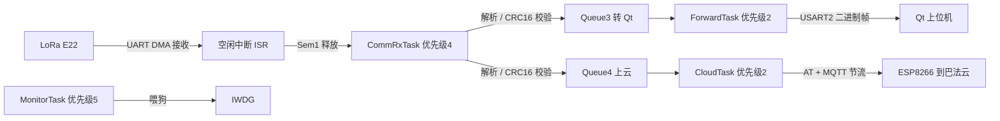

# 数据传输端（边缘网关）设计文档

> 板卡 : 普中-天马 F407 开发板 · STM32F407ZGT6
> 工程 : S_N_sys/Project_2_数据通信端/Project（Keil MDK5 · ST 标准外设库 47+ 模块）
> 状态 : 骨架（协议已定案，其余待完善）
> 更新 : 2026-09-28（协议定案版）
> 依据 : 《项目架构思路设计参考/核心软件和FreeRTOS架构.md》

---

## 1. 设计定位

汇聚采集节点（板1）经 LoRa 上报的环境数据，解析校验后分两路：
① 通过串口转发至电脑端 Qt 上位机（实时监测 + 曲线）；
② 通过 ESP8266（AT 指令 + MQTT）上报巴法云。

- 职责一 : LoRa 数据接收、帧同步、校验、解析
- 职责二 : 双路转发（Qt 串口 / 云端 MQTT）
- 职责三 : 看门狗与心跳监控，保障长期稳定运行

## 2. 硬件构成

| 类别 | 模块 | 型号 | 接口 | 用途 | 状态 |
|---|---|---|---|---|---|
| 主控 | 开发板 | 普中-天马 F407 / STM32F407ZGT6 | - | 主控 | 已有 |
| 无线接收 | LoRa 模块 | 亿佰特 E22-400T22S | UART | 接收板1 数据 | 待采购 |
| 联网 | WiFi 模块 | ESP8266 ESP-01S | UART（AT） | MQTT 上云 | 待采购 |
| 上位机链路 | USB 转 TTL | CH340 一类 | UART | 串口到 PC | 板载 CH340C 可用 |

> 天马板注意 : 串口与外设之间的跳线帽（P5 到 485 / P10 到 WIFI 等）以
> 《普中-天马 F407开发板原理图.pdf》与工程 README 为准；
> 分配定稿前必须按原理图逐项核对跳线后“哪个串口接到哪个接口”。

## 3. 串口分配（待按实际接线填写）

| 串口 | 波特率 | 连接对象 | 备注 |
|---|---|---|---|
| USART1 | 115200 | 调试日志（板载 CH340C 到 PC） | 只打日志；业务数据不从这里发（避免与转发内容混杂） |
| USART2 | 115200 | Qt 上位机（USB 转 TTL） | 转发完整二进制帧；需确认 P5 跳线不在 485 侧 |
| USART3 | 115200 | ESP8266（AT 指令） | P10 跳线到 WIFI 侧 |
| USART? | 9600 | LoRa E22 模块 | 出厂默认 9600；按板上引出排针选空闲串口（避开 1/2/3） |

## 4. 软件架构（FreeRTOS）

### 4.1 中断与同步

| 机制 | 说明 |
|---|---|
| UART DMA + 空闲中断 | 接收不定长帧（库函数 SYS_USART_RecvDMA） |
| ISR 只做一件事 | 释放信号量 Sem1，其余交给任务处理 |
| Sem1 | 二值信号量 : 空闲中断 ISR → CommRxTask |

### 4.2 任务表

| 任务 | 优先级 | 周期 / 触发 | 职责 |
|---|---|---|---|
| CommRxTask（接收解析） | 高（4） | Sem1 触发 | 读 DMA 缓冲 → 状态机找帧头 → 验长度 / CRC16 → 提取数据 → 发 Queue3（Qt）与 Queue4（云端） |
| ForwardTask（转发 Qt） | 中低（2） | Queue3 触发 | 把解析后的完整帧经 USART2 发 Qt 上位机 |
| CloudTask（云端上报） | 中低（2） | Queue4 触发 + 节流（≥30 s 上报一次） | ESP8266 AT 状态机（非阻塞、带超时）→ MQTT 发巴法云；失败重试 / 断线重连 |
| MonitorTask（监控） | 最高（5） | 1 s | 喂狗（IWDG）、任务心跳检查（sys_wdg） |

> 为什么要独立 CloudTask : ESP8266 的 AT 交互是一问一答的阻塞过程
> （AT+CIPSEND 等 '>'、发数据等 'SEND OK'）；塞进 ForwardTask 会拖住 Qt 转发，
> 独立任务 + 非阻塞状态机（超时可控）是稳妥做法。

### 4.3 队列与同步

| 对象 | 类型 | 生产者 → 消费者 | 说明 |
|---|---|---|---|
| Sem1 | 二值信号量 | 空闲中断 ISR → CommRxTask | 一帧到达通知 |
| Queue3 | 消息队列 | CommRxTask → ForwardTask | 解析后的数据包（转 Qt） |
| Queue4 | 消息队列 | CommRxTask → CloudTask | 解析后的数据包（上云；节流时丢弃多余帧） |
| （预留）Mutex | 互斥锁 | - | 各串口由固定任务独占，暂不需要；后续共用资源时再引入 |

### 4.4 数据流

## 5. 通信协议

### 5.1 上行（LoRa 接收 · 与板1 同帧 · 已定案）

> 板1 → 板2 使用统一二进制帧，整帧 20 字节：
> [0xAA 0x55][命令 1B][长度 1B][数据 12B][CRC16 2B][0x55 0xAA]
> 字段与数据段编码见《检测数据端设计.md》第 5 节（两文档必须一致）。

| 项目 | 说明 |
|---|---|
| 帧同步 | 状态机逐字节找 0xAA 0x55 → 读长度 → 收满 → CRC16-MODBUS 校验 |
| 校验范围 | 命令 + 长度 + 数据段（不含帧头 / 帧尾） |
| 出错处理 | 帧头错 / 校验错 → 丢弃并继续找下一个帧头（不阻塞） |

### 5.2 下行（串口 → Qt 上位机 · 已定案：二进制透传）

| 项目 | 说明 |
|---|---|
| 格式 | 直接转发板1 的**完整二进制帧**（不转文本、不改动内容） |
| 理由 | 文本行易被数据干扰导致解析错乱；透传让 Qt 与板1 用同一套帧格式 |
| 实现 | ForwardTask 把 CommRxTask 送来的完整帧原样写 USART2 |

### 5.3 MQTT（巴法云）

| 项 | 值 | 状态 |
|---|---|---|
| 平台 | 巴法云（bemfa.com） | - |
| 主题 topic | 注册后填写（如 xxxSHT30） | 待定 |
| 报文格式 | 待定（如 #温度#湿度#气压#光照） | 待定 |
| 上报周期 | 30 s（与 CloudTask 节流保持一致） | 待定 |

## 6. 待办清单

- [ ] 采购 LoRa E22 / ESP8266 模块
- [ ] 按实际接线补全第 3 节串口分配，核对跳线帽位置
- [x] 板1 / Qt 协议已定案（第 5 节 · 二进制帧 · 2026-09-28）；巴法云 MQTT 报文格式注册后补定
- [ ] 实现 FreeRTOS 各任务（第 4 节，含 CloudTask 非阻塞 AT 状态机）与 DMA + 空闲中断收帧
- [ ] ESP8266 AT + MQTT 联调（先用 USB 转 TTL 单独调通）
- [ ] 看门狗 + 心跳（sys_wdg）接入 MonitorTask
- [ ] 与 Qt 上位机联调 → 与板1 全链路联调
