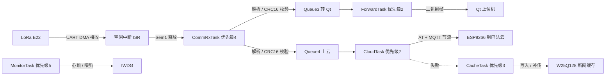

# 数据传输端（边缘网关）设计文档

> 板卡 : 普中-天马 F407 开发板 · STM32F407ZGT6（1 MB Flash / 192 KB RAM）
> 工程 : S_N_sys/Project_2_数据通信端/Project（Keil MDK5 · ST 标准外设库 47+ 模块 + FreeRTOS）
> 状态 : 设计定稿（协议、任务、串口分配已定；驱动与任务待实现）
> 更新 : 2026-10-09（设计评审版）
> 依据 : 《项目架构思路设计参考/核心软件和FreeRTOS架构.md》《检测数据端设计.md》第 5 节

---

## 0. 文档修订记录（2026-10-09）

| # | 项 | 原 → 新 | 说明 |
|---|---|---|---|
| 1 | 串口数量缺口 | 原文写"USART? 9600 LoRa（避开 1/2/3）"，但工程 `sys_usart.h` 只封装了 3 路串口 | 网关实际需要 4 路（调试 / Qt / ESP8266 / LoRa）。见第 3 节：把 USART2 从 RS485/RS232 跳线改为接 LoRa，Qt 走 P10 跳线的 RS232 端子，四者各占一路 |
| 2 | 参考架构文档的任务划分 | 参考文档是一个 ForwardTask 同时喂 UART2 和 UART3 → 本文档拆成 ForwardTask + CloudTask | 参考文档缺 Queue4/CloudTask，照它实现会把 ESP8266 的阻塞式 AT 交互塞进 Qt 转发路径。以本文档为准 |
| 3 | 离线缓存 | 无 → 补第 6 节 W25Q128 断网缓存（工程内 `w25qxx.c` + `w25qxx_log.c` 现成） | 用现成驱动做断网不丢数据，无需额外硬件，支撑长期稳定运行与数据可追溯 |
| 4 | 硬件注意 | 无 → 补第 2.2 节（ESP8266 电源去耦、E22 天线、跳线帽） | 这三项会导致硬件损坏或通信失败，必须写进文档 |
| 5 | MQTT 报文 | 三项全"待定" → 补第 5.3 节具体方案（topic / 报文格式 / QoS / 周期） | 定稿文档不留"待定"项 |
| 6 | 心跳机制 | "任务心跳检查（sys_wdg）"（没说怎么实现） → 补心跳位图 | 与板1 同一套机制，两板可复用 |
| 7 | 断帧与缓冲 | 只说"UART DMA + 空闲中断" → 补收帧缓冲与背压分析 | 20 字节 / 1 s 的流量很小，但要说明为什么不用更复杂的方案 |
| 8 | 以太网支线 | 无 → 已核实：本板无以太网 PHY，此路不通，已从可选升级中删除 | 板2 `sys_eth.c` 是从参考工程保留下来的通用模板，本板不可用（见第 8 节说明） |
| 9 | 实测指标 | 无 → 第 9 节空表，联调时回填 | 指标要留实测列 |

> 采购清单见 `S_N_sys/项目架构思路设计参考/外设采购清单.md`。

---

## 1. 设计定位

汇聚采集节点（板1）经 LoRa 上报的环境数据，解析校验后分两路：
1) 通过串口转发至电脑端 Qt 上位机（实时监测 + 曲线）；
2) 通过 ESP8266（AT 指令 + MQTT）上报巴法云。

- 职责一 : LoRa 数据接收、帧同步、校验、解析
- 职责二 : 双路转发（Qt 串口 / 云端 MQTT）
- 职责三 : 断网数据缓存（掉线期间的帧落 SPI Flash，恢复后补传）
- 职责四 : 看门狗与心跳监控，保障长期稳定运行

## 2. 硬件构成

### 2.1 模块与接口

| 类别 | 模块 | 型号 | 接口 | 用途 | 状态 |
|---|---|---|---|---|---|
| 主控 | 开发板 | 普中-天马 F407 / STM32F407ZGT6 | - | 主控 | 已有 |
| 无线接收 | LoRa 模块 | 亿佰特 E22-400T22S | UART | 接收板1 数据 | 待采购 |
| 联网 | WiFi 模块 | ESP8266 ESP-01S | UART（AT） | MQTT 上云 | 待采购 |
| 上位机链路 | USB 转 TTL | CH340 一类 | UART | 串口到 PC | 板载 CH340C 可用 |
| 本地缓存 | SPI Flash | W25Q128 | SPI | 断网缓存 | 板载已有 |
| 调试辅助 | 独立 USB 转 TTL | CH340G | UART | 单独调 ESP8266 | 待采购（1 个） |

### 2.2 硬件注意

| 模块 | 问题 | 正确做法 |
|---|---|---|
| ESP8266 ESP-01S | 发射瞬时电流 300~500 mA 尖峰，电源跌落会导致反复重启、AT 无响应 | 模块电源脚就近加 470 µF 电解 + 100 nF 瓷片；供电用能出 2 A 的电源（面包板电源模块或 USB 独立供电），不要用板载小电流 LDO |
| E22-400T22S | 不接天线就发射会损伤功放 | 先接好天线再上电；M0/M1 用 GPIO 明确驱动，不悬空 |
| 跳线帽 | 板2 的 P6（RS485/RS232 二选一）、P10（WIFI/上位机）跳线位置决定哪个串口通到哪个端子 | 见第 3.1 节逐项核对后再上电，跳错表现为发得出去收不回来 |
| 板载 CH340C | USART1 走它到 PC，是下载口 | 只用于烧录与调试日志，不用来发业务数据（会和烧录抢口） |
| 共地 | 板与模块不共地会出现随机通信错误 | 所有模块 GND 与主控 GND 必须连通 |

## 3. 串口分配（设计定稿）

### 3.1 需求与现状：缺一路串口

| | 数量 |
|---|---|
| 网关需要 | 4 路：调试日志 / Qt 上位机 / ESP8266 上云 / LoRa 接收 |
| 工程 `sys_usart` 封装 | 3 路：USART1(PA9/PA10) / USART2(PA2/PA3) / USART3(PB10/PB11) |
| 板卡可用 | ≥ 4 路（F407ZGT6 有 USART1/2/3/6 + UART4/5，板2 还有 UART4 在 P10 引出） |
| 缺口 | 1 路，必须提前决定怎么补 |

> `sys_usart.c/h` 只实现了 3 路，第 4 路要么扩库（自己照抄加一路），要么共用（牺牲接口干净度）。
> 两种方案都要在动手前定下来，否则写任务时会卡住。

### 3.2 两个方案（已定案取 A，B 只作过渡参考）

方案 A：扩 `sys_usart` 到 4 路，用 USART6 接 LoRa

| 串口 | 引脚 | 波特率 | 连接对象 | 跳线 / 接法 |
|---|---|---|---|---|
| USART1 | PA9 / PA10 | 115200 | 调试日志（板载 CH340C） | Ⅰ 组：`PA9T`↔`URXD`、`PA10R`↔`UTXD` |
| USART2 | PA2 / PA3 | 115200 | Qt 上位机 | P6 跳 232 侧（SP3232 → DB9），或用杜邦线直接引 PA2/PA3 接 USB 转 TTL |
| USART3 | PB10 / PB11 | 115200 | ESP8266（AT 指令） | P10 跳线到 WIFI 侧（`TXD3/RXD3`） |
| USART6 | PC6 / PC7 | 9600 | LoRa E22 | 从板2 的 P1 双排排针引出 PC6/PC7，接模块 RXD/TXD |

- 优点：四路各司其职，接口清晰；底层驱动库扩展本身也是工作量可量化的一项
- 代价：`sys_usart.h`（枚举 + 端口宏）与 `sys_usart.c`（init / ISR / DMA / 时钟使能）各加一路，约 60 行，可照抄 USART3 的写法
- 上表 PC6/PC7 已用 `S_N_sys/项目架构思路设计参考/双版资源/ZGT6.pdf` 渲染图与 P1 排针实际丝印核对通过（PC6/PC7 确实在 P1 引出，详见 3.3 节末的核实说明）

方案 B：不扩库，Qt 与调试日志共用 USART1

| 串口 | 引脚 | 波特率 | 连接对象 |
|---|---|---|---|
| USART1 | PA9 / PA10 | 115200 | 调试日志 + Qt 上位机（混合输出） |
| USART2 | PA2 / PA3 | 9600 | LoRa E22（拔掉 P6 跳线帽，杜邦线接模块） |
| USART3 | PB10 / PB11 | 115200 | ESP8266（AT 指令） |

- 优点：零代码改动，最快跑通
- 缺点：Qt 收到的是日志与二进制帧的混合流，解析器要靠帧头同步硬扛；日志一多时流里噪声比例高
- 结论：只适合先跑通链路的过渡期，不是最终形态

> 不成立的方案：让 USART3 同时接 ESP8266 和 Qt。同一个 USART 不能既发 AT 指令又发业务帧。

### 3.3 若采用方案 A：USART6 补充参数

| 项 | 值 |
|---|---|
| 引脚 | PC6 = USART6_TX、PC7 = USART6_RX（F407 默认复用） |
| 时钟总线 | APB2（USART1 也在 APB2；USART2/3 在 APB1，不要照抄时钟使能） |
| DMA 映射 | USART6_RX = DMA2_Stream1(通道5)、USART6_TX = DMA2_Stream6(通道5)，须查 DMA 请求映射表核对后使用 |
| 需要改动的文件 | `FWLIB/inc/sys_usart.h`（枚举 + TX/RX 端口宏 + 通道数）、`FWLIB/src/sys_usart.c`（时钟 / GPIO / USART / DMA / NVIC / ISR 各加一路） |
| 可选复用引脚 | USART6 在 F407 上的引脚组：PC6/PC7（TX/RX）与 PG14/PG9（TX/RX）。PC6/PC7 取不到时用 PG 组。本板已确认为 PC6/PC7（PG14/PG9 未出现在 P1 丝印中） |
| 备选 | UART4（PC10/PC11）或 UART5（PC12/PD2），同样需要扩库。UART4 的 PC10/PC11 也在 P1 丝印中出现，同样可用 |

> 引脚可用性已核实：已把 `S_N_sys/项目架构思路设计参考/双版资源/ZGT6.pdf` 渲染成 6400×4523 位图并逐格读取 P1 双排排针的丝印，
> PC6、PC7 确实在 P1 引出：P1 的丝印序列里包含
> `… PC4  PC5  PC6  PC7  PC8  PC9  PC10  PC11  PC12  PD0  PD1  PD2  PD3 …`。
> 因此从 P1 用杜邦线引 PC6/PC7 接 LoRa 模块，在硬件上可行。
> 丝印只能证明引脚被引出来，不能证明它没被板上其它外设复用；
> 上电后用 `SYS_USART` 初始化并试收一帧即可最终确认，这是本方案剩余的风险点。

## 4. 软件架构（FreeRTOS）

### 4.1 中断与同步

| 机制 | 说明 |
|---|---|
| UART DMA + 空闲中断 | 接收不定长帧（库函数 `SYS_USART_DmaRxDone` / `SYS_USART_DmaRxLen`） |
| ISR 只做一件事 | 释放信号量 Sem1，其余交给任务处理 |
| Sem1 | 二值信号量 : 空闲中断 ISR → CommRxTask |
| 中断优先级 | `configLIBRARY_MAX_SYSCALL_INTERRUPT_PRIORITY = 5`，ISR 抢占优先级必须 ≥ 5 才能调用 `xSemaphoreGiveFromISR` |

### 4.2 任务表

| 任务 | 优先级 | 周期 / 触发 | 职责 |
|---|---|---|---|
| CommRxTask（接收解析） | 高（4） | Sem1 触发 | 读 DMA 缓冲 → 状态机找帧头 → 验长度 / CRC16 → 提取数据 → 发 Queue3（Qt）与 Queue4（云端） |
| ForwardTask（转发 Qt） | 中低（2） | Queue3 触发 | 把完整帧经串口发 Qt 上位机 |
| CloudTask（云端上报） | 中低（2） | Queue4 触发 + 节流（≥30 s 上报一次） | ESP8266 AT 状态机（非阻塞、带超时）→ MQTT 发巴法云；失败重试 / 断线重连 |
| CacheTask（离线缓存） | 中（3） | Queue4 触发（云端失败时） | 把未上报成功的帧写入 W25Q128；网络恢复后按序补传 |
| MonitorTask（监控） | 最高（5） | 1 s | 喂狗（IWDG）、心跳位图检查、ESP8266 在线状态巡查 |

> 实际代码里的任务名与上表不完全一致（表是设计意图，代码是落地结果）：
> `vTaskLoraRx`(3) / `vTaskProcess`(3) / `vTaskComm`(4) / `vTaskForward`(4) / `vTaskCmdRx`(3，2026-10-10 新增) / `vTaskMonitor`(5)，
> 见 `Project/main.c`；`APP_TASK_COUNT` 已随 CmdRx 由 2 改成 3。

> CloudTask 必须独立：ESP8266 的 AT 交互是一问一答的阻塞过程
> （`AT+CIPSEND` 等 `>`、发数据等 `SEND OK`，每步都有超时）。塞进 ForwardTask 会拖住 Qt 转发，
> 独立任务 + 非阻塞状态机（超时可控）能避免这个问题。

### 4.3 队列与同步

| 对象 | 类型 | 生产者 → 消费者 | 说明 |
|---|---|---|---|
| Sem1 | 二值信号量 | 空闲中断 ISR → CommRxTask | 一帧到达通知 |
| Queue3 | 消息队列 | CommRxTask → ForwardTask | 解析后的数据包（转 Qt） |
| Queue4 | 消息队列 | CommRxTask → CloudTask | 解析后的数据包（上云；节流时丢弃多余帧） |
| Mutex | 互斥量 | CloudTask / CacheTask 共用 SPI Flash | W25Qxx 总线保护 |
| 心跳位图 | 标志位 | 各任务 → MonitorTask | 见 4.4 节 |
| `s_qt_tx_mtx` | 互斥量 | ForwardTask / CmdRxTask 共用 USART2 发送 | 2026-10-10 新增：两个任务都会往 Qt 口发帧，不加锁会两帧拼在一起（帧头对、CRC 必错，偶发且难查） |

> `s_qt_tx_mtx` 的必要性：`SYS_FRAME_Send()` 是阻塞逐字节发完整帧，
> 而 `vTaskForward()`（转发 20 字节环境帧）与 `vTaskCmdRx()`（回命令应答帧）是两个任务，
> 抢占只会在字节之间发生：单字节不会错，整帧会交错。

### 4.4 心跳位图定义

```c
#define HB_RX      (1U << 0)   /* CommRxTask  */
#define HB_FWD     (1U << 1)   /* ForwardTask */
#define HB_CLOUD   (1U << 2)   /* CloudTask   */
#define HB_CACHE   (1U << 3)   /* CacheTask   */
#define HB_ALL     (HB_RX | HB_FWD | HB_CLOUD | HB_CACHE)

/* 任务内 */          SYS_WDG_Heartbeat(HB_RX);
/* MonitorTask 内 */  if (SYS_WDG_CheckAll(HB_ALL)) SYS_WDG_Feed();
```

> 转发/上云任务是事件驱动的（有帧才动），心跳不能只靠任务循环跑到，
> 应由任务在被唤醒并处理完一次后置位；再配一个"至少每 N 秒必须被唤醒一次"的软定时器兜底。

### 4.5 数据流



### 4.6 收帧缓冲与背压分析

| 项 | 计算 | 结论 |
|---|---|---|
| LoRa 侧接收速率 | 20 字节 / 1 s，9600 bps 下一帧空口约 21 ms | 负载约 2%，不需要大缓冲 |
| 空闲中断缓冲 | 建议 ≥ 128 字节（能兜住突发 6 帧） | 够用 |
| Qt 侧转发速率 | 20 字节 / 1 s，115200 bps 约 2 ms | 无压力 |
| 云端节流 | 30 s 一次，Queue4 满时丢最旧帧 | 丢帧策略要明确并写日志，不静默丢弃 |

## 5. 通信协议

### 5.1 上行（LoRa 接收 · 与板1 同帧 · 已定案）

> 板1 → 板2 使用统一二进制帧，整帧 20 字节：
> `[0xAA 0x55][命令 1B][长度 1B][数据 12B][CRC16 2B][0x55 0xAA]`
> 字段与数据段编码以《检测数据端设计.md》第 5 节为准（两文档必须一致）。
> 温度/湿度为 ×100、气压为 ×10（气压使用 short 所以不能用 ×100，原因见板1 文档 5.2）。

| 项目 | 说明 |
|---|---|
| 帧同步 | 状态机逐字节找 `0xAA 0x55` → 读长度 → 收满 → CRC16-MODBUS 校验 |
| 校验范围 | 命令 + 长度 + 数据段（不含帧头 / 帧尾） |
| 出错处理 | 帧头错 / 校验错 → 丢弃并继续找下一个帧头（不阻塞） |
| 统计 | 累计接收帧数 / CRC 错误数 / 丢帧数，供第 9 节实测回填 |

### 5.2 下行（串口 → Qt 上位机 · 已定案：二进制透传）

| 项目 | 说明 |
|---|---|
| 格式 | 直接转发板1 的完整二进制帧（不转文本、不改动内容） |
| 理由 | 文本行易被数据干扰导致解析错乱；透传让 Qt 与板1 用同一套帧格式 |
| 实现 | ForwardTask 把 CommRxTask 送来的完整帧原样写出 |

### 5.3 MQTT（巴法云 · 2026-10-09 定稿）

| 项 | 值 |
|---|---|
| 平台 | 巴法云（bemfa.com） |
| 接入方式 | ESP8266 AT 指令：`AT+CWMODE=1` → `AT+CWJAP` → `AT+CIPSTART="TCP","bemfa.com",9501` → `AT+CIPSEND` |
| 鉴权 | 连接后先发 `cmd=1&uid=<私钥>&topic=<主题>\r\n` |
| 主题 topic | `<uid>` 相关的自定义名，如 `lab001`（注册后填写；建议带实验室编号，为多节点预留） |
| 报文格式 | 文本 `#` 分隔，便于巴法云直接转发到微信/小程序：<br>`#<温度>#<湿度>#<气压>#<光照>#<TVOC>#<MQ135>#<节点ID>`<br>示例：`#25.30#48.55#1013.2#500#50#1234#01` |
| 上报周期 | 30 s（与 CloudTask 节流一致；异常告警时立即插播一帧，不等周期） |
| QoS | MQTT QoS 0（巴法云默认；断网由网关侧缓存补传保证不丢） |
| 时间戳 | 不上报（20 字节帧里没有时间字段）；Qt 侧按接收时刻打时间戳 |
| 失败处理 | 重试 3 次 → 仍失败则交给 CacheTask 落盘，进入补传队列 |

> 用 `#` 文本而不是 JSON：巴法云的消息可直接推送到微信服务号/小程序，
> 文本格式在手机上可直接阅读；JSON 需要额外一层解析。

### 5.4 下行控制（Qt 上位机 → 板2 · 2026-10-10 定稿并实现）

> 5.2 节是板2 → Qt（转发环境帧）。这一节是反方向：上位机发命令、板2 执行并回应答。
> 有了它，转发开关/缓存开关/清缓存/复位都不用重新烧固件。

帧格式不变（同一套 `AA 55 CMD LEN DATA… CRC16 55 AA`），只把 CMD 分区：
`0x00~0x7F` = 板2 上报（环境帧 `0x01`），`0x80~0xFF` = 应答（`CMD = 请求 | 0x80`）。

| 请求 | CMD | 载荷 | 应答 CMD | 应答载荷 |
|---|---|---|---|---|
| `SET_FWD` 转发开关 | `0x10` | 1 字节 `0/1` | `0x90` | `[0]`状态 `[1]`新值 |
| `SET_CACHE` 缓存开关 | `0x11` | 1 字节 `0/1` | `0x91` | `[0]`状态 `[1]`新值 |
| `QUERY` 查状态 | `0x12` | 无 | `0x92` | 16 字节（见下） |
| `CLR_CACHE` 清 Flash | `0x13` | 无 | `0x93` | `[0]`状态 `[1:3]`清后条数 |
| `REBOOT` 软复位 | `0x14` | 无 | `0x94` | `[0]`状态 |

`QUERY` 应答 16 字节（多字节大端，与环境帧同一约定、与帧内 CRC 的小端相反）：
`[0]`状态 `[1]`转发开关 `[2]`缓存开关 `[3]`保留 `[4:6]`收好帧 `[6:8]`收坏帧 `[8:10]`缓存条数 `[10:12]`丢帧 `[12:16]`运行秒数

状态码：`0=OK` `1=参数错` `2=不支持` `3=忙`（应答数据段第 1 字节恒为状态码）。

实现要点（都在 `Project/main.c` 的 `vTaskCmdRx()` 与 `FWLIB/inc/sys_frame.h`）：

| 要点 | 说明 |
|---|---|
| 必须开 RX 中断 | `main()` 里 `SYS_USART_Init(USART_QT,…)` → `SYS_USART_InitRxIT(USART_QT,…)`；`USART2_IRQHandler` 在 `sys_usart.c` 是 `__weak`，工程 `stm32f4xx_it.c` 无同名强定义，直接生效 |
| 轮询节奏 | 20 ms 一次 `SYS_FRAME_Poll()`；每路只保留最新一帧（新帧覆盖未取的旧帧），所以不能慢 |
| 应答无事务号 | 上位机侧因此只允许一条在途命令（`devctl.cpp`：600 ms 超时、最多重发 3 次），否则分不清回的是哪条 |
| `REBOOT` 的顺序 | 先回应答 → `SYS_USART_FlushTx()`（等 TC，不是 TXE）→ 100 ms → `NVIC_SystemReset()` |
| 未知命令 | 应答 `cmd|0x80`、状态 `2`（不支持），不静默丢弃（静默丢弃在联调时最难查） |
| 发送互斥 | 所有往 USART2 发的出口都过 `s_qt_tx_mtx`（见 4.3 节） |
| 编译验证 | `E:\k5_v5\UV4\UV4.exe -r -j0 -o 日志 <工程>` → 0 Error / 0 Warning，`Code=37420 RO=2340 RW=384 ZI=36344` |

## 6. W25Q128 断网缓存

工程内已有现成驱动：`FWLIB/src/w25qxx.c`（10.7 KB）+ `FWLIB/src/w25qxx_log.c`（12.8 KB，带日志模块封装）。底层不用自己写。

### 6.1 设计

| 项 | 方案 |
|---|---|
| 存储区域 | 划出专用 64 KB 区域（如 Sector 起始 `0x000000`~`0x00FFFF`），与其它用途隔离 |
| 数据结构 | 环形队列：每条记录 = `12 字节数据段 + 4 字节序号 + 2 字节 CRC16` = 18 字节，按 32 字节对齐便于页写 |
| 写指针 | 保存在 Flash 固定位置（或备份寄存器），掉电不丢 |
| 容量 | 64 KB / 32 B ≈ 2000 条；30 s 一条 → 可缓存约 16 小时 |
| 覆盖策略 | 写满后覆盖最旧记录，并累计溢出计数（可上报有数据被覆盖） |
| 补传 | 网络恢复后按序号升序补传，弱化节流（例如 1 s 一条）直到追平 |
| 带 CRC | 每条自带 CRC16，读回时校验，防止 Flash 位翻转 |
| 磨损 | 环形覆盖 + 16 小时容量，日常几乎不擦写；W25Q128 擦写寿命 10 万次，够用 |

### 6.2 采用理由

- 零采购成本、零硬件改动（板载 Flash，驱动现成）
- 覆盖掉网与掉电场景下的数据完整性，这是网关类应用的常见考点
- 支撑文档里"长期稳定运行"和"数据可追溯"两句话，有具体实现对应

## 7. 待办清单

- [ ] 采购 LoRa E22 / ESP8266（对照 `S_N_sys/项目架构思路设计参考/外设采购清单.md`）
- [x] 方案已定案并落地（2026-10-10）：采用**方案 A**，LoRa 走 USART6（PC6/PC7），USART2 留给 Qt 上位机（P6 跳线选 SP3485 或 SP3232）
- [x] `sys_usart` 已从 3 路扩到 6 路：`FWLIB\inc\sys_usart.h:119-120`（`SYS_USART_6 = 5`、`SYS_USART_COUNT = 6`）、`lora_e22.h:98`（`#define SYS_LORA_UART SYS_USART_6`）；`main.c:92-93` 有编译期断言 `SYS_LORA_UART != ESP8266_USART`
- [x] FreeRTOS 各任务已实现（第 4 节）：`vTaskLoraRx` / `vTaskForward` / `vTaskCmdRx` / `vTaskReplay` + `vTaskMonitor`
- [x] DMA + 空闲中断收帧 + 状态机解帧 + CRC16 已实现
- [x] 板1 / Qt 协议已定案（第 5 节 · 二进制帧）；巴法云报文格式已定稿（5.3 节）
- [x] Qt → 板2 下行控制通道（5.4 节 · 2026-10-10）：命令 0x10~0x14 + 应答 0x80 位 + `vTaskCmdRx` 任务 + USART2 收中断 + 发送互斥；`E:\k5_v5\UV4\UV4.exe` 复编 0 Error / 0 Warning；上位机侧 `--cmdselftest` 16/16
- [x] 断网缓存的补传（第 6 节）已实现：`W25QXX_LogWrite` 在 `vTaskForward` 里逐帧落盘，`vTaskReplay`（50 ms 一条，从最老记录开始）按 `0x15` 历史帧上行，上位机用 `0x16` 启停、板2 用 `0x96` 上报进度。方案与实现取舍见 `S_N_sys\项目架构思路设计参考\断网缓存补传设计.md`
- [ ] ESP8266 AT + MQTT 联调（先用独立 USB 转 TTL 单独调通，再接到板上）
- [ ] 看门狗已按 4 s 超时启用、由监控任务轮询时刷新；但逐任务心跳汇总未启用（`SYS_WDG_HEARTBEAT_COUNT` 仍为 0，各任务的 `SYS_WDG_Heartbeat()` 只作模拟报到），上板时再决定是否打开
- [ ] 与 Qt 上位机联调 → 与板1 全链路联调
- [ ] 记录实测指标（第 9 节）

## 8. 可选升级

> 先看排除结论：本板没有以太网 PHY，用以太网接 Qt 这条路走不通。
> 依据：`FWLIB/inc/sys_eth.h` 开头已逐字核对过《普中-天马 F407开发板原理图》并写明：
> 1) 全图搜不到 `LAN8720 / PHY / RJ45 / TP_OUT / TP_IN / REF_CLK` 任何以太网网络名；
> 2) 原理图上那个标题写"以太网模块接口"的块，实际引的是 `NRF_CS/NRF_CE/NRF_IRQ/SPI1_*`，
> 它是 NRF24L01 无线模块座，标题是原理图作者的遗留误标。
> 工程里的 `ETH/src/stm32f4x7_eth.c` 与 `sys_eth.c` 只是从参考工程保留下来的通用模板，
> 默认 `SYS_ETH_ENABLE 0` 不参与编译（详见 `sys_eth.h` 的"重要·本板不适用"段）。
> 真要走网口：买一块 SPI 接口的 W5500/ENC28J60 模块接到 CN1（与 NRF24L01 共用）或 P1 排针，
> 自己封一层 SPI 网卡驱动；这是一条独立支线，不是打开开关就能用。

| # | 升级 | 成本 | 实施收益 | 建议 |
|---|---|---|---|---|
| 1 | W25Q128 断网缓存 | 零成本（见第 6 节） | 高 | 建议优先做（原先排第 2，现提到第 1） |
| 2 | ESP8266 断线重连 + 状态机可视化 | 纯软件 | 中高 | 建议（日志打印 `AT` 状态迁移，便于定位） |
| 3 | 多节点组网：协议预留节点 ID，网关维护节点表 | 需再买 1 个 LoRa 模块做第二个节点 | 高，多实验室组网时才体现 | 预算允许可做 |
| 4 | 网关本地 OLED 显示（在线状态 / 已收帧数） | 需 OLED 模块（驱动 `sys_oled` 板1 已有，板2 也有 `oled.c/h`） | 中 | 可选，工作量低 |
| 5 | 以太网替代 USB 转 TTL 接 Qt | — | — | 本板无 PHY，不成立（见上方排除结论） |

## 9. 实测指标（联调时回填）

| 指标 | 目标 | 实测值 | 测量方法 |
|---|---|---|---|
| 帧解析正确率 | 100% | 待填 | 板1 发 N 帧，板2 正确解析数 / N |
| CRC 错误率 | < 0.1% | 待填 | 板2 统计校验失败次数 |
| 转发到 Qt 的丢帧率 | 0 | 待填 | 板2 转发数 vs Qt 收到数 |
| MQTT 上报成功率 | > 99% | 待填 | 成功数 / 尝试数 |
| ESP8266 断线重连时间 | < 30 s | 待填 | 拔路由器电源后计时 |
| 断网缓存容量 | ≥ 1000 帧 | 待填 | 离线写入计数，读回核对 |
| 补传完整性 | 无丢失、无重复 | 待填 | 对比缓存序号与实际补传序号 |
| 连续运行时长 | ≥ 72 h 无复位 | 待填 | 上电跑，记录 IWDG 复位次数 |
| 网关处理延迟 | < 50 ms | 待填 | 收到帧 → 转发到 Qt 的时间差 |
